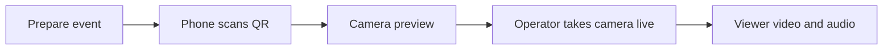

# Breadcast

**Updated:** 2026-10-09

Breadcast turns phone cameras into one live program. S01 delivers a manual
one-camera test candidate: event setup, QR joining, source audio, operator access,
and continuous playback. Physical phone acceptance on the production host is
pending. Real VAST, Cosmos, YOLO, semantic search, W&B reasoning, and generated
speech remain unavailable until their sprint is verified.

Phone playback stays independent of model calls. Only the program controller
changes what viewers see. Preparing an event does not put a camera on air.



## Build and start S01

Use Docker Engine with Docker Compose v2 on a host reachable by the phone and
viewer. The host needs trusted HTTPS and reachable WebRTC TCP and UDP ports.
A successful page load does not prove media reachability. The production host,
HTTPS route, and phone network must be checked there.

Production deploys `main`. Each runnable slice is merged and pushed to `main`;
the release tag records its exact revision.

Run these commands from the checked-out release root. Record the release tag and
SHA supplied with the sprint handoff. Keep local changes separate from that test.

```sh
git rev-parse HEAD
git status --short
cp .env.example .env
mkdir -p .runtime/tls
chmod 700 .runtime
chmod 755 .runtime/tls
python3 - <<'PY'
import os
import secrets
from pathlib import Path
path = Path('.runtime/operator-token')
with path.open('x') as output:
    output.write(secrets.token_urlsafe(32) + '\n')
os.chmod(path, 0o444)
PY
git rev-parse HEAD > .runtime/s01-revision.txt
```

The token command refuses to replace an existing token. On a later checkout,
keep the existing `.env`, token, and TLS files. Compose mounts the token read-only
at `/run/secrets/operator_token`. The private `.runtime` directory limits host
access. The file must be readable by container user 10001. Do not copy the token,
private key, or camera lease tokens into reports or Git.

Edit `.env`. Choose one verified HTTPS route:

| Setting | HTTPS reverse proxy on the Docker host | Direct HTTPS in Breadcast |
|---|---|---|
| `BREADCAST_PUBLIC_URL` | Your browser HTTPS origin | Your browser HTTPS origin, including its public port |
| `BREADCAST_HTTP_BIND` | `127.0.0.1` | The reachable host interface, usually `0.0.0.0` |
| `BREADCAST_TLS_CERT` | Empty | `/run/breadcast/tls/cert.pem` |
| `BREADCAST_TLS_KEY` | Empty | `/run/breadcast/tls/key.pem` |
| `BREADCAST_PUBLIC_PATH_PREFIX` | Empty or `/app` | Empty or `/app` |

The origin must contain no path, credentials, or query. Put `/app` only in
`BREADCAST_PUBLIC_PATH_PREFIX`. A reverse proxy must preserve the configured
prefix on forwarded paths and carry the media HTTP requests. It must expose the
app through trusted HTTPS; HTTP on a remote phone does not allow camera access.
No particular proxy or hosting provider has been verified for this release.

For direct HTTPS, put the trusted certificate chain and matching private key in
`.runtime/tls/cert.pem` and `.runtime/tls/key.pem`. Make both files readable by
container user 10001. The Compose mount is read-only. A self-signed certificate
with a browser warning does not pass physical-phone acceptance.

Set `BREADCAST_ICE_HOSTS` to reachable DNS names or IP addresses if the public
origin's host does not lead to the media host. It contains no URLs or port
numbers. Open the configured `BREADCAST_WEBRTC_PORT` on TCP and UDP; its default
is `8189`. HTTPS proxying alone does not forward these ports. A network that
requires TURN needs a verified TURN service before its media test can pass.
Leave `BREADCAST_FOUNDATION_CONFIG` empty for this manual slice.

```sh
docker compose config --quiet
docker compose build studio
docker compose up -d studio
docker compose ps
docker compose exec -T studio python /opt/breadcast/container-healthcheck.py
docker compose logs --tail=100 studio
```

The runtime check exits successfully only when the gateway is running, the
program has no reported error, and output frames advance. It does not replace
the phone and viewer checks below. If it fails, inspect the logs before putting
a camera on air.

For the required isolated media smoke, run `./scripts/studio one-camera-check`.
It starts one labeled synthetic camera and decodes actual program video/audio.
Its date-free report is under `.runtime/one-camera-checks/`. This command uses a
separate temporary runtime and does not verify a physical phone or start the
production broadcast. Run it after the token/TLS setup above supplies Compose's
required input files. It does not run the full historical test suite.

The named `studio-runtime` volume holds recordings, graphics, and runtime
records at `/var/lib/breadcast-studio`. Recordings use the existing bounded
retention limits. Container output logs rotate at 10 MB across three files.
Compose does not restart a stopped broadcast automatically.

## Open the app

Use your configured HTTPS origin and prefix:

| Page | Root hosting | `/app` hosting |
|---|---|---|
| Studio | `/operator` | `/app/operator` |
| Viewer | `/broadcast` | `/app/broadcast` |
| Join | Current QR link from Studio | Current QR link from Studio |

Enter the operator token in Studio. Keep it in your local operator session.
The public viewer and Join page do not need that token. Join uses the event's
current QR link, including its join code. Copy that actual link. Opening `/join` without a code resolves the current
event code from the public viewer endpoint before the phone can reserve a lease.

In **Event details → Prepare event**, supply the event title and profile.
Use **Community** and `en` for the first rehearsal. Supply only known participant
names; leave unknown identity and official values blank. Select **Prepare graphics**
and confirm the current context has a ready graphics package.
The program must still show holding at this point.

Scan the QR on one physical phone. Allow camera and microphone access, check its
local preview, then share the camera. Keep the phone page open. When the camera
is ready, select **Take camera 1 live** in Studio. This is the human Start action.
Select its source in **Audio → Use microphone**. Open the Viewer page on a
separate device and enable its local playback audio. A muted browser does not
prove a missing program microphone.

## Required production check for S01

Use the exact pushed revision. Record results in a date-free report such as
`.runtime/s01-production.md`. Include its full SHA, browser/device versions,
public origin and prefix, elapsed run time, measured delay, faults, and sample
recording locations. Report each check as passed, pending, or failed.

1. Open Studio without its token. It must require operator access. Confirm an
   anonymous client cannot prepare the event, switch cameras, change official
   facts, stop the event, or release a different phone's lease.
2. Prepare the event and join one physical phone. Confirm setup and joining
   leave the program in holding until the human Start action.
3. Watch five minutes of continuous phone video and source audio on a separate
   viewer. Record a recognizable motion and spoken cue. Measure the delay
   between source action and viewer output. Record any black output, stalled
   video, audio loss, or encoder restart; none can be left unexplained.
4. Check that unavailable AI services are shown accurately. Manual playback
   must continue while those services are unavailable.
5. Select **Hold screen** to take the camera off air. End the test with **End
   broadcast**, or use the stop command below. Start the service again. Confirm
   holding, a new join link, and no old camera authority. Join again and confirm
   another human Start is required.
6. Repeat the required URL, access, camera, and viewer checks at root and `/app`
   on the selected host. Stop before changing `.env`, update the proxy route
   if used, and recreate the service. Keep results for both configurations.

Run only the automated tests required for changed behavior and critical
failures. The sprint handoff lists the checks actually run. No full-suite run is
required merely because the code is being pushed. Production acceptance is
pending until the checks above pass on the pushed SHA.

## Logs, stop, restart, and rollback

```sh
docker compose logs -f --tail=100 studio
docker compose stop studio
docker compose up -d studio
```

After a configuration change, use `docker compose up -d --force-recreate studio`.
After stopping, `docker compose down` removes the container and network while
keeping the named runtime volume. Do not add `--volumes` when retaining evidence.
Each restart begins a new run in holding and requires a human Start.

To test a supplied prior working tag, stop the service first. Preserve local
changes, fetch the release refs, check out that exact tag, build, and start using
the commands above. Record the resulting SHA and repeat the affected production
checks. No accepted prior release is assumed until a handoff identifies one.

```sh
git fetch origin main --tags
```

## Implementation plan

The [seven-sprint plan](docs/26-sprint-delivery-plan.md) defines the release order
and user checks. The [live stack PRD](docs/22-live-stack-integration-prd.md) defines
the required VAST, NVIDIA Cosmos, YOLO, semantic search, and W&B/CoreWeave work.
The [contracts](docs/05-context-and-contracts.md) define IDs, clocks, evidence,
and state ownership. Provider access and performance remain unverified until
the [verification record](docs/24-provider-verification.md) contains real proof.
Cursor is the development environment; it is not a runtime service.
