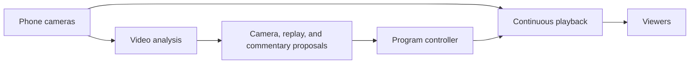

# Breadcast

Breadcast is an idea for an autonomous live broadcast studio. People scan an event QR code and share live video from their phones. The studio turns those views into one broadcast with camera selection, event graphics, spoken commentary, and replays.

## The experience

- Join with up to five live phone cameras. The server enforces the limit.
- Prepare graphics at event setup, then fill them with known names and facts.
- Select useful camera views and describe observed action. Keep uncertain events separate from confirmed scores and results.
- Prepare replays of key moments, then return to live video.
- Find earlier moments through natural-language search.
- Let an operator take control when needed.

Live playback continues while models analyze video. Agents propose changes; one program controller decides what goes on air.

## Supplied stack

The planned stack uses VAST for media storage and data orchestration, NVIDIA Cosmos for video reasoning, YOLO for detection and tracking, semantic search for earlier moments, and W&B-hosted application language models on CoreWeave. Provider access must be verified before integration.

## Hackathon scope

This submission starts on October 9, 2026, with idea notes only. Earlier implementation belongs to a separate repository and is excluded from this submission. New implementation must be written during the hackathon and committed with its actual date and time.

First, prove continuous playback from one live phone camera. Then validate five-camera admission and playback, followed by graphics, spoken commentary, search, and replay playback that returns to live. Record measured playback delay and failures.
