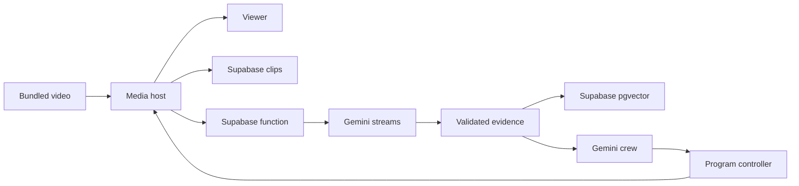

# Breadcast

**Updated:** 2026-10-10

Breadcast turns video inputs into one program. Gemini supplies video reasoning,
object detection, crew decisions, embeddings and speech. Supabase stores private
clips and the vector database. The active demo uses live hackathon cameras;
the football reference is disabled. Five-phone validation remains manual. The Supabase backend is deployed. The laptop
media host is running with a temporary public HTTPS address. The public URL
played holding frames in local Chrome. Inference and playback on another
network remain pending.

## Stream the hackathon

Use the event QR to join up to five cameras. Tap **Join camera** and allow camera
access. Sharing and recording start automatically. The preview fills the phone
screen. In automatic mode, the first ready camera goes live without another tap.
Use the camera tiles to change views. **Hold broadcast** returns to holding and
stays there until you select **Go live**. Later joins do not change the view. See the
[Forever 22 setup and demo steps](docs/30-forever22-demo.md).

## Reference video (disabled)

For development only, set `BREADCAST_SERVER_VIDEOS_CONFIG_SOURCE=./config/server-videos.reference.json`
and restart. Open Studio and enter the operator credential. Click the red **Start video**
button directly below the program video. It loads the bundled clip, starts its
media stream, and selects it through the program controller. **Stop video** stops
that source and returns its program to holding. The clip loops until stopped.
No camera permission is required.

The clip is `_sample-videos/15449351-hd_1920_1080_60fps.mp4`, imported from the
teammate's `lukas-wip` branch. Its actual metadata is 1280×720, about 20 seconds,
with H.264 video and AAC audio. Its filename does not define its dimensions.

[config/server-videos.json](config/server-videos.json) is empty for live cameras.
The reference configuration selects the bundled clip. A developer can change `uri` to another `file:`
path or `s3://bucket/key`. Relative file paths resolve from the JSON file's folder.
If changing the input, update or remove `expected_sha256`; a mismatch rejects it.
Zero, one or two entries are supported. Zero disables sample playback.

Compose mounts that config read-only. `BREADCAST_SERVER_VIDEOS_CONFIG_SOURCE`
selects its host path. `BREADCAST_S3_ENDPOINT_URL` or the VM's `S3_ENDPOINT` selects
an S3 endpoint; no endpoint is hardcoded. The supplied `ACCESS_KEY`/`SECRET_KEY`
pair or the normal AWS credential chain supplies server credentials. Keep these
out of Git. Compose passes the documented key variables; an IAM role must be
reachable from the container if using instance credentials. Plain local playback
makes no S3 call. S3 staging also reads the mounted assigned config.
`BREADCAST_S3_VERIFY=true` is the default. The VM problem branch uses `false`
for its assigned self-signed S3 endpoint; set that only if needed there. S3 read
timeout is 60 seconds, with one request attempt.

The app validates media, preserves immutable bytes and SHA-256, and records
`server_video` provenance. It does not call this a physical camera or fixture
analysis. Provider work remains independent from program playback.

## Use Gemini and Supabase

The default is `BREADCAST_PROVIDER_STACK=gemini-supabase`. Your local
`AI_STUDIO_KEY` is accepted as a Gemini API key. Hosted mode keeps this key in
Supabase function secrets. The media host uses a private function credential and
a Supabase server key. Keep all keys out of Git and the browser.

These model-card choices are available in the authenticated account catalog:

| Task | Default model | Selection |
|---|---|---|
| Video and crew | `gemini-3.8-flash` | Multimodal input and structured decisions; low thinking for short live decisions and bounded replay edits |
| Object boxes | `gemini-robotics-er-2-preview` | Spatial reasoning on sampled frames |
| Spoken commentary | `gemini-3.8-flash-lite-tts` | Short, single-speaker speech with low latency as the design goal |
| Search embeddings | `gemini-embedding-2` | 768-dimension caption vectors in Supabase pgvector |

Model IDs remain configurable. Runtime checks them against the returned catalog.
Catalog access does not prove inference, quotas or measured latency. See the
[model choices and source cards](docs/28-gemini-supabase-migration.md#model-selection).

Playback remains independent of model calls. Recorded chunks are saved privately.
Gemini responses use SSE, a streamed HTTP response for the existing clip flow.
Only complete, validated responses enter the evidence ledger. The object adapter
binds boxes to exact inspected images and source timestamps. It does not supply
calibrated confidence, cross-frame tracks or synchronized program crop overlays.

Supabase pgvector searches current, retained scenes within this event and run.
Choose **Prepare replay** on a result. Gemini sees timestamped frames and proposes
an edit. FFmpeg renders the validated plan on the media host. Its private Supabase
clip receipt is required before the replay becomes ready. Preview and Play keep
the existing program controller contract.

Prepare event graphics, then use **Start video**. It releases the crew in
Automatic mode. **Take control** pauses the crew. Gemini commentary and graphics
run automatically. Gemini prepares replays, but **Play replay** requires the
operator. Automatic camera cuts are disabled. **Return live** interrupts a replay. Missing access
shows a provider failure while manual video playback remains available.

With `BREADCAST_SPEECH=on`, Gemini turns grounded commentary into speech. The
runtime converts it to 48 kHz mono WAV and mixes it with source audio. Partial
speech does not go on air. Caption-only output is not a speech pass.

The laptop is configured for the [Forever 22 demo](docs/30-forever22-demo.md),
with a custom New York cabbie voice and event talk between camera updates.
Gemini also hears the selected microphone through recorded clips. It can leave
a speaker audible, show a short **Heard:** quote, or comment over background
chatter. The voice uses impatient, mock-angry delivery. See the
[audio behavior and limits](docs/31-source-audio.md).
The server permits at most five camera slots. Actual phone playback still needs
the venue check in that guide.

Supabase hosts the backend function, private storage and vector database. A
separate persistent media host runs FFmpeg, MediaMTX, Studio and Viewer. The user
selected the laptop for this host. It uses an isolated Colima profile, a
Cloudflare Quick Tunnel for pages and HLS program video. HLS sends short video
segments over HTTPS. Set `BREADCAST_VIEWER_TRANSPORT=hls` for this route; it adds
playback buffering. Camera publishing still uses WebRTC and needs a verified
media route. Playback on another network still needs a viewer check. Supabase
Edge Functions cannot run this persistent media runtime.



Follow the [laptop start and status steps](docs/29-laptop-media-host.md) and
[manual production checks](docs/28-gemini-supabase-migration.md#production-acceptance-for-this-candidate).
The model catalog request succeeded through the deployed Supabase function.
Private storage and the database migration are deployed. The ARM container
built, its Docker health is healthy, and public HTTP requests returned 200.
Inference and media acceptance remain pending. Checks
were skipped under the user's standing instruction.

The old workshop transports remain available only with the explicit
`BREADCAST_PROVIDER_STACK=workshop`. They are not a fallback after Gemini failure.
`BREADCAST_STACK_ENABLED=0` disables AI. An explicit foundation JSON can still
select local fixtures; fixture output never counts as provider output.

## Build and start the studio

Use Docker Engine with Docker Compose v2 on the VM. The host needs trusted HTTPS and reachable WebRTC TCP and UDP ports.
A successful page load does not prove media reachability. The production host,
HTTPS route, and phone network must be checked there.

Production deploys `main`. Each runnable slice is merged and pushed to `main`;
the release tag records its exact revision.

Run these commands from the checked-out release root. Record the release tag and
SHA supplied with the sprint handoff. Keep local changes separate from that test.

```sh
git rev-parse HEAD
git status --short
cp .env.example .env
mkdir -p .runtime/tls
chmod 700 .runtime
chmod 755 .runtime/tls
python3 - <<'PY'
import os
import secrets
from pathlib import Path
path = Path('.runtime/operator-token')
with path.open('x') as output:
    output.write(secrets.token_urlsafe(32) + '\n')
os.chmod(path, 0o444)
PY
git rev-parse HEAD > .runtime/tested-revision.txt
```

The token command refuses to replace an existing token. On a later checkout,
keep the existing `.env`, token, and TLS files. Compose mounts the token read-only
at `/run/secrets/operator_token`. The private `.runtime` directory limits host
access. The file must be readable by container user 10001. Do not copy the token,
private key, or camera lease tokens into reports or Git.

Edit `.env`. Choose one verified HTTPS route:

| Setting | HTTPS reverse proxy on the Docker host | Direct HTTPS in Breadcast |
|---|---|---|
| `BREADCAST_PUBLIC_URL` | Your browser HTTPS origin | Your browser HTTPS origin, including its public port |
| `BREADCAST_HTTP_BIND` | `127.0.0.1` | The reachable host interface, usually `0.0.0.0` |
| `BREADCAST_TLS_CERT` | Empty | `/run/breadcast/tls/cert.pem` |
| `BREADCAST_TLS_KEY` | Empty | `/run/breadcast/tls/key.pem` |
| `BREADCAST_PUBLIC_PATH_PREFIX` | Empty or `/app` | Empty or `/app` |

The origin must contain no path, credentials, or query. Put `/app` only in
`BREADCAST_PUBLIC_PATH_PREFIX`. A reverse proxy must preserve the configured
prefix on forwarded paths and carry the media HTTP requests. It must expose the
app through trusted HTTPS; HTTP on a remote phone does not allow camera access.
The laptop's Cloudflare tunnel served pages and HLS holding video in Chrome.
Physical-phone acceptance remains pending.

For direct HTTPS, put the trusted certificate chain and matching private key in
`.runtime/tls/cert.pem` and `.runtime/tls/key.pem`. Make both files readable by
container user 10001. The Compose mount is read-only. A self-signed certificate
with a browser warning does not pass physical-phone acceptance.

For WebRTC, set `BREADCAST_ICE_HOSTS` to reachable DNS names or IP addresses if the public
origin's host does not lead to the media host. It contains no URLs or port
numbers. Open the configured `BREADCAST_WEBRTC_PORT` on TCP and UDP; its default
is `8189`. HTTPS proxying alone does not forward these ports. A network that
requires TURN needs a verified TURN service before its media test can pass.
For Viewer and Studio playback through an HTTPS-only tunnel, set
`BREADCAST_VIEWER_TRANSPORT=hls`. Camera publishing still needs WebRTC reachability.
Leave `BREADCAST_FOUNDATION_CONFIG` empty for this manual slice.

```sh
docker compose config --quiet
docker compose build studio
docker compose up -d studio
docker compose ps
docker compose exec -T studio python /opt/breadcast/container-healthcheck.py
docker compose logs --tail=100 studio
```

The runtime check exits successfully only when the gateway is running, the
program has no reported error, and output frames advance. It does not replace
the phone and viewer checks below. If it fails, inspect the logs before putting
a camera on air.

For the required isolated media smoke, run `./scripts/studio one-camera-check`.
It starts one labeled synthetic camera and decodes actual program video/audio.
Its date-free report is under `.runtime/one-camera-checks/`. This command uses a
separate temporary runtime and does not verify a physical phone or start the
production broadcast. Run it after the token/TLS setup above supplies Compose's
required input files. It does not run the full historical test suite.

The named `studio-runtime` volume holds recordings, graphics, and runtime
records at `/var/lib/breadcast-studio`. Recordings use the existing bounded
retention limits. Container output logs rotate at 10 MB across three files.
Compose does not restart a stopped broadcast automatically.

## Basic VM check for this video slice

After deployment from `main`, open Studio. Start the video. Confirm the picture
and source audio advance, then Stop and confirm holding. Start again. While it
loads, press Stop and confirm no late playback starts. Missing or invalid input
must show a clear failure without changing the current program.

Small checks cover configuration, file/S3 staging, access, and cancellation. No
full test suite or physical-camera rehearsal blocks this input slice.

For Gemini and Supabase, follow the current migration's production checks.
Confirm advancing playback, actual model output, private clip receipts, vector
search, audible speech and controller-owned replay playback. Record failures and
measured response times. Do not count skipped checks as passed.

## Open the app

Use your configured HTTPS origin and prefix:

| Page | Root hosting | `/app` hosting |
|---|---|---|
| Studio | `/operator` | `/app/operator` |
| Viewer | `/broadcast` | `/app/broadcast` |
| Join | Current QR link from Studio | Current QR link from Studio |

Enter the operator token in Studio. Keep it in your local operator session.
The public viewer and Join page do not need that token. Join uses the event's
current QR link, including its join code. Copy that actual link. Opening `/join` without a code resolves the current
event code from the public viewer endpoint before the phone can reserve a lease.

In **Event details → Prepare event**, supply the event title and profile.
Use **Community** and `en` for the first rehearsal. Supply only known participant
names; leave unknown identity and official values blank. Select **Prepare graphics**
and confirm the current context has a ready graphics package.
The program must still show holding at this point.

Scan the QR on one physical phone. Allow camera and microphone access, check its
local preview, then share the camera. Keep the phone page open. When the camera
is ready, select **Take camera 1 live** in Studio. This is the human Start action.
Select its source in **Audio → Use microphone**. Open the Viewer page on a
separate device and enable its local playback audio. A muted browser does not
prove a missing program microphone.

## Deferred phone check for S01

Use the exact pushed revision. Record results in a date-free report such as
`.runtime/s01-production.md`. Include its full SHA, browser/device versions,
public origin and prefix, elapsed run time, measured delay, faults, and sample
recording locations. Report each check as passed, pending, or failed.

1. Open Studio without its token. It must require operator access. Confirm an
   anonymous client cannot prepare the event, switch cameras, change official
   facts, stop the event, or release a different phone's lease.
2. Prepare the event and join one physical phone. Confirm setup and joining
   leave the program in holding until the human Start action.
3. Watch five minutes of continuous phone video and source audio on a separate
   viewer. Record a recognizable motion and spoken cue. Measure the delay
   between source action and viewer output. Record any black output, stalled
   video, audio loss, or encoder restart; none can be left unexplained.
4. Check that unavailable AI services are shown accurately. Manual playback
   must continue while those services are unavailable.
5. Select **Hold screen** to take the camera off air. End the test with **End
   broadcast**, or use the stop command below. Start the service again. Confirm
   holding, a new join link, and no old camera authority. Join again and confirm
   another human Start is required.
6. Repeat the required URL, access, camera, and viewer checks at root and `/app`
   on the selected host. Stop before changing `.env`, update the proxy route
   if used, and recreate the service. Keep results for both configurations.

Run only the automated tests required for changed behavior and critical
failures. The sprint handoff lists the checks actually run. No full-suite run is
required merely because the code is being pushed. Production acceptance is
pending until the checks above pass on the pushed SHA.

## Deferred phone check for S02

Test the deployed `main` SHA. S01's phone check remains required; continue with:

1. Prepare neutral event graphics before Start. Join five physical phones. Studio
   must show occupied capacity and Reserved, Buffering, Live, Reconnecting, or
   Removing states. Setup and joining remain off air until human Start.
2. Try a sixth phone and simultaneous last-slot contenders. Exactly five leases
   can be occupied; one contender wins the last slot. Direct unauthorized
   publishing must also fail. Reserved and reconnecting phones count as occupied.
3. Select one microphone. Cut to each ready camera and confirm that the selected
   microphone stays selected. Use prepared graphics; unknown names and scores
   must remain hidden. Clear graphics without stopping the program.
4. Keep five phones and three separate viewer devices active for 15 minutes.
   Every viewer must advance. Check local mute and reconnect. Record unexplained
   stalls over one second, source-audio loss, black output, and encoder restarts.
   Inspect diagnostics for bounded memory, disk, and queues.
5. Disconnect/rejoin one phone, then remove a camera and reuse its slot. Studio
   must clear the old preview and show the new source. The old phone token cannot
   publish through the removed path. Expired leases cannot return to Live merely
   because a delayed media update arrives. Removing capacity stays occupied until
   the gateway confirms removal.
6. Rotate the QR. The old join code cannot reserve a new lease. End/restart and
   confirm holding, fresh camera authority, and a new human Start requirement.

For a bounded local media check, run `./scripts/studio five-camera-check` after
Compose configuration is ready. It checks five labeled synthetic cameras and
three independent RTSP software readers. Reports are under
`.runtime/five-camera-checks/`. This does not prove phone capture, browser WebRTC,
viewer mute, or the full 15-minute production session. These remain manual checks.

## Logs, stop, restart, and rollback

`./scripts/studio restart` rebuilds and recreates Studio after code, `.env`, or
Compose changes. It retains the runtime volume. The helper supports the VM
Docker permission setup and preserves exported provider variable names when
using password-free sudo. `.env` remains the location for values absent from
the assigned file. See the [VM problems record](docs/27-vm-integration-problems.md)
for the reported cause chain and current fixes.

Equivalent Compose steps and day-to-day logs/stop:

```sh
docker compose logs -f --tail=100 studio
docker compose stop studio
docker compose up -d --build --force-recreate studio
```

After stopping, `docker compose down` removes the container and network while
keeping the named runtime volume. Do not add `--volumes` when retaining evidence.
Each restart begins a new run in holding and requires a human Start.

To test a supplied prior working tag, stop the service first. Preserve local
changes, fetch the release refs, check out that exact tag, build, and start using
the commands above. Record the resulting SHA and repeat the affected production
checks. No accepted prior release is assumed until a handoff identifies one.

```sh
git fetch origin main --tags
```

## Implementation plan

The [seven-sprint plan](docs/26-sprint-delivery-plan.md) defines the release order
and user checks. The [live stack PRD](docs/22-live-stack-integration-prd.md) defines
the current Gemini and Supabase work. Earlier workshop records retain their historical scope.
The [contracts](docs/05-context-and-contracts.md) define IDs, clocks, evidence,
and state ownership. Provider access and performance remain unverified until
the [verification record](docs/24-provider-verification.md) contains real proof.
Cursor is the development environment; it is not a runtime service.
