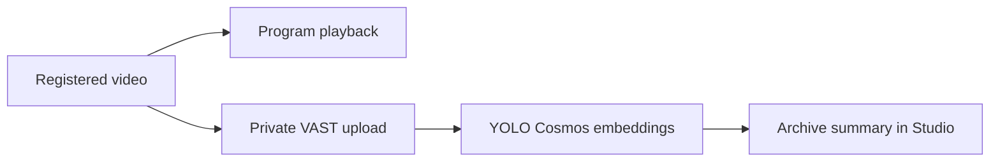
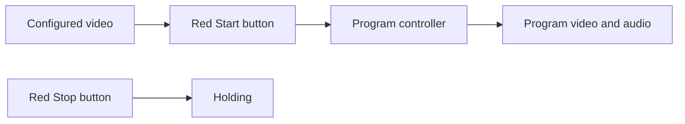

# Breadcast

**Updated:** 2026-10-09

Breadcast turns video inputs into one program. The current priority is the
teammate's uploaded video, followed by the VAST, Cosmos, YOLO, search, and W&B
integration. Phone-camera validation is deferred on this VM.

## Play the uploaded video

Open Studio and enter the operator credential. Click the red **Start video**
button directly below the program video. It loads the bundled clip, starts its
media stream, and selects it through the program controller. **Stop video** stops
that source and returns its program to holding. The clip plays once; Start can
play it again. No camera permission is required.

The clip is `_sample-videos/15449351-hd_1920_1080_60fps.mp4`, imported from the
teammate's `lukas-wip` branch. Its actual metadata is 1280×720, about 20 seconds,
with H.264 video and AAC audio. Its filename does not define its dimensions.

[config/server-videos.json](config/server-videos.json) selects the input. The
bundled clip works by default. Your teammate can change `uri` to another `file:`
path or `s3://bucket/key`. Relative file paths resolve from the JSON file's folder.
If changing the input, update or remove `expected_sha256`; a mismatch rejects it.
One or two entries are supported; use this one video until the second is available.

Compose mounts that config read-only. `BREADCAST_SERVER_VIDEOS_CONFIG_SOURCE`
selects its host path. `BREADCAST_S3_ENDPOINT_URL` or the VM's `S3_ENDPOINT` selects
an S3 endpoint; no endpoint is hardcoded. The supplied `ACCESS_KEY`/`SECRET_KEY`
pair or the normal AWS credential chain supplies server credentials. Keep these
out of Git. Compose passes the documented key variables; an IAM role must be
reachable from the container if using instance credentials. Plain local playback
makes no S3 call. S3 staging also reads the mounted assigned config.
`BREADCAST_S3_VERIFY=true` is the default. The VM problem branch uses `false`
for its assigned self-signed S3 endpoint; set that only if needed there. S3 read
timeout is 60 seconds, with one request attempt.

The app validates media, preserves immutable bytes and SHA-256, and records
`server_video` provenance. It does not call this a physical camera or fixture
analysis. Provider work remains independent from program playback.

## Process this video with VAST

Put the assigned VM values for `INGRESS_URL`, `USERNAME`, `PASSWORD`,
`S3_CHUNKS_BUCKET`, `S3_ENDPOINT`, `ACCESS_KEY`, and `SECRET_KEY` in the ignored
`.env`. Use the team's actual values. Compose forwards them to the app. For a
container launch, Compose mounts the VM config folder read-only at
`/run/breadcast/team-config`. `BREADCAST_TEAM_CONFIG_SOURCE` selects the host
folder and defaults to `/config`. The app reads its single `*.config` file
without executing it. Nonempty environment values override that file. A
non-container launch reads `/config` by default; `BREADCAST_TEAM_CONFIG_DIR`
changes that folder. On hosts without an assigned file, select an empty host
folder and supply values through `.env`.

Start the video with the same red button. Once playback starts, background work
checks the VAST tenant, uploads the clip privately with the API's default analysis
prompt, and verifies the stored original against its local SHA-256. The supplied
DataEngine pipeline runs segmentation, YOLO, Cosmos reasoning, and embedding.
Studio shows processing state, then the archive summary and available YOLO counts.
Stop video stops playback; archive processing can finish afterward.

Each input hash and tenant have one saved submission. Starting again uses that
receipt. Completed results are reused after the tenant configuration and original
bytes are checked. An upload with an unknown outcome is not sent again automatically.
It needs reconciliation with the team's archive. Indexing gets five minutes; a
later Start resumes inspection of the existing submission.

The archive summary has no authority to change the program. Its clocks and tracker
state do not yet provide live direction or synchronized commentary. Missing YOLO
sidecars are shown explicitly. Provider access, model identities, and output
quality still need the real VM run. No local fixture is reported as provider output.

Set the assigned `COSMOS3_REASON_URL`, `YOLO_URL`, `COSMOS_EMBED1_URL`, and any
required `GPU_BEARER_TOKEN` in `.env` for current-window perception. Model IDs can
be left empty when the endpoint serves one model; multiple models require an
explicit returned ID. The app discovers the model and uses actual recorded
windows for Cosmos and YOLO. Results enter the existing evidence ledger as
provider observations. Recording-to-decoder matching supplies live timing when
it can be measured. Unknown timing retains archive behavior. Detector box clocks
and tracking are still unverified, so no detector crop is authorized yet.

`BREADCAST_STACK_ENABLED=auto` enables these connections when workshop GPU or
LLM configuration is present. `0` disables them. An explicit foundation JSON
still takes precedence. Model versions that are not returned remain `unknown`;
that label is not a version-verification pass.



## Search and model-edited replay

After the clip has produced retained scene evidence and VSS has indexed its
private upload, open Replays and search for a visible action. VSS semantic search
finds registered parent videos. Embed1 ranks the retained scene captions from
those videos. Results use locally recorded source intervals; an upload timestamp
is never used as replay time. Only this event/run's bound footage is returned.

Submit the same words again after processing finishes to search the latest
archive. Each submission is new; reloading the page restores the last result.
Previously computed caption vectors are reused within this app process. VSS
retrieval still runs for every new search. The existing five-second query budget
also applies to async provider calls.

Set `WANDB_API_KEY` and the returned model IDs in `BREADCAST_SEGMENTOR_MODEL`,
`BREADCAST_DIRECTOR_MODEL`, and `BREADCAST_COMMENTATOR_MODEL`. Use a segmentor
model with image input and tool output. `WANDB_TEAM` and `WANDB_PROJECT` supply
optional usage attribution. The configurable base defaults to the documented
`https://api.inference.wandb.ai/v1` service on CoreWeave. Do not use a text-only
model for visual replay planning.

Choose **Prepare replay** on a search result. The W&B segmentor sees the retained
evidence and actual timestamped frames. It proposes a typed edit plan. The existing
worker renders that plan, then Studio offers Preview and Play. Play still requires
the program controller. Late window analysis runs as archive work with its original
live deadline unchanged. This makes retained evidence available for later search;
it cannot authorize a late camera cut.

The director and commentator use the same W&B role transport and existing crew
controls. Each needs eligible current evidence. A successful archive summary alone
does not enable live crew decisions. These connections have not been run against
the team's models.

## Let the crew direct and speak

Prepare the event graphics in Event details. Set the supplied event facts and
leave unknown names and scores blank. **Start video** enables automatic mode by
default. No separate Release control step is required. This allows fresh W&B
director and commentator proposals.
**Take control** pauses them. **Release control** allows fresh proposals again.
Set `BREADCAST_CREW_MODE=human` only when a run must start with the crew paused.
The director uses current mapped evidence and the
existing typed controller actions. A single input can produce commentary and
replays; it cannot demonstrate switching between two distinct views.

Speech now uses **ElevenLabs** when `ELEVENLABS_API_KEY` is present. Keep the key
in the VM environment or ignored `.env`; Compose passes it to the server.
`BREADCAST_TTS_PROTOCOL=auto` selects ElevenLabs from that key. If the existing
`.env` explicitly selects `nvidia-nim`, change it to `auto` or `elevenlabs`, then
recreate the container. No ElevenLabs URL or key goes to the browser.

`ELEVENLABS_MODEL_ID` and `ELEVENLABS_VOICE_ID` are optional. Runtime model listing
selects Flash v2.5 when available, then Multilingual v2, then another returned TTS
model. Runtime voice listing selects an available voice, preferring a premade
voice. Set an explicit voice ID or select it in Event details to override this.
Diagnostics show the actual selected model and voice. An empty event voice
delegates selection to the configured speech adapter.

The adapter uses the [ElevenLabs speech API](https://elevenlabs.io/docs/api-reference/text-to-speech/convert).
It requests standard MP3 and converts it to 48 kHz mono WAV locally. This avoids
requiring access to a paid WAV output format. The existing cue path then mixes
speech into the program. No audio request was run from this development session.

The NVIDIA route remains configurable. Set `BREADCAST_TTS_URL` to its base before
`/v1`, select `BREADCAST_TTS_PROTOCOL=nvidia-nim`, and set
`BREADCAST_TTS_API_KEY` if it needs authentication. The app reads readiness,
model metadata, and `/v1/audio/list_voices`, then sends a multipart request to
`/v1/audio/synthesize`. Select a returned voice in `BREADCAST_TTS_VOICE` or Event
details. `BREADCAST_TTS_LANGUAGE` can select a returned locale explicitly; a short
event language such as `en` is resolved only when the returned locale is unique.
The app requests 48 kHz WAV audio. A single returned model needs no model setting.

The [NVIDIA speech API](https://docs.nvidia.com/nim/speech/26.07.0/reference/api-references/tts/http-tts.html)
supports this connection. The supplied VM configuration does not establish a
running Magpie service. No shared GPU service is deployed or changed by Breadcast.
The app does not assume that Canary speech-to-text can synthesize.

For an existing OpenAI-compatible speech service, select
`BREADCAST_TTS_PROTOCOL=openai` instead. That route uses `/v1/models` and
`POST /v1/audio/speech` with `model`, `input`, `voice`, and `response_format=wav`.
Only configure a service that implements the chosen API.

The W&B commentator supplies grounded text. The speech adapter produces WAV,
decodes it, and sends it through the existing prepared-cue path. The program mixer
combines it with the selected source audio. Generated speech must fit eight seconds
and its current evidence interval. The Viewer receives the mixed program audio.
Missing speech service leaves eligible captions or silence. It does not count as
working spoken commentary. Endpoint access, language, pronunciation and audible
content still require the VM run.

## Run the connected stack through automatic replay

After deployment, keep the VM's existing `.env`, operator token and TLS files.
Supply the workshop variables and `ELEVENLABS_API_KEY`, then recreate the service:

```sh
docker compose up -d --build --force-recreate studio
```

1. Open Studio, prepare event graphics, and start the repository video.
2. Confirm **Automatic mode** in Crew status. Start video releases the crew by
   default. The status shows director, commentator, selected speech service, and
   automatic replay state. Take control still pauses crew actions.
3. Current Cosmos observations can nominate replay candidates. The W&B segmentor
   plans the edit. The existing worker renders and publishes a ready replay.
4. The W&B director sees ready assets and current opportunity evidence. It can
   propose replay playback through the program controller. Ready assets never
   start playback on their own. The program returns to eligible live output after
   replay, or holding when the video has ended. Return live interrupts a replay.
5. After the clip ends, its VAST upload and archive analysis can still finish.
   Search those retained moments and prepare a manual replay. Start the clip again
   for another current-input session. Stop cancels the video source.

The clip is about 20 seconds. Slow model calls can miss that live session and
produce only archive evidence. A model can also abstain when no useful action is
supported. The second video and detector tracking remain unverified. None of
these conditions is a passed autonomous demo. The user requested skipped checks;
the VM must establish actual playback, provider access, speech and replay behavior.

At startup, a shared analysis worker reads configured provider metadata. It
discovers W&B models, ElevenLabs models and voices, Cosmos readiness, Embed1
models, and YOLO readiness before the short clip needs them. Each connection
gets five seconds. Metadata discovery does not start playback, synthesize speech,
or prove successful inference. Advanced diagnostics show each connection state.

Studio reports provider failures by connection: Cosmos, YOLO, search, W&B roles,
speech, or VAST jobs/storage. Authentication, access, rate limit, deadline and
unsupported output have separate reason codes. Advanced diagnostics include
HTTP status and a returned request ID when available. Provider error bodies,
keys and tokens are excluded. If a W&B role needs model selection, its available
returned IDs appear under `providers.llm.available_model_ids`. Speech shown as
**Caption only** has not supplied program speech audio.



## Build and start the studio

Use Docker Engine with Docker Compose v2 on the VM. The host needs trusted HTTPS and reachable WebRTC TCP and UDP ports.
A successful page load does not prove media reachability. The production host,
HTTPS route, and phone network must be checked there.

Production deploys `main`. Each runnable slice is merged and pushed to `main`;
the release tag records its exact revision.

Run these commands from the checked-out release root. Record the release tag and
SHA supplied with the sprint handoff. Keep local changes separate from that test.

```sh
git rev-parse HEAD
git status --short
cp .env.example .env
mkdir -p .runtime/tls
chmod 700 .runtime
chmod 755 .runtime/tls
python3 - <<'PY'
import os
import secrets
from pathlib import Path
path = Path('.runtime/operator-token')
with path.open('x') as output:
    output.write(secrets.token_urlsafe(32) + '\n')
os.chmod(path, 0o444)
PY
git rev-parse HEAD > .runtime/tested-revision.txt
```

The token command refuses to replace an existing token. On a later checkout,
keep the existing `.env`, token, and TLS files. Compose mounts the token read-only
at `/run/secrets/operator_token`. The private `.runtime` directory limits host
access. The file must be readable by container user 10001. Do not copy the token,
private key, or camera lease tokens into reports or Git.

Edit `.env`. Choose one verified HTTPS route:

| Setting | HTTPS reverse proxy on the Docker host | Direct HTTPS in Breadcast |
|---|---|---|
| `BREADCAST_PUBLIC_URL` | Your browser HTTPS origin | Your browser HTTPS origin, including its public port |
| `BREADCAST_HTTP_BIND` | `127.0.0.1` | The reachable host interface, usually `0.0.0.0` |
| `BREADCAST_TLS_CERT` | Empty | `/run/breadcast/tls/cert.pem` |
| `BREADCAST_TLS_KEY` | Empty | `/run/breadcast/tls/key.pem` |
| `BREADCAST_PUBLIC_PATH_PREFIX` | Empty or `/app` | Empty or `/app` |

The origin must contain no path, credentials, or query. Put `/app` only in
`BREADCAST_PUBLIC_PATH_PREFIX`. A reverse proxy must preserve the configured
prefix on forwarded paths and carry the media HTTP requests. It must expose the
app through trusted HTTPS; HTTP on a remote phone does not allow camera access.
No particular proxy or hosting provider has been verified for this release.

For direct HTTPS, put the trusted certificate chain and matching private key in
`.runtime/tls/cert.pem` and `.runtime/tls/key.pem`. Make both files readable by
container user 10001. The Compose mount is read-only. A self-signed certificate
with a browser warning does not pass physical-phone acceptance.

Set `BREADCAST_ICE_HOSTS` to reachable DNS names or IP addresses if the public
origin's host does not lead to the media host. It contains no URLs or port
numbers. Open the configured `BREADCAST_WEBRTC_PORT` on TCP and UDP; its default
is `8189`. HTTPS proxying alone does not forward these ports. A network that
requires TURN needs a verified TURN service before its media test can pass.
Leave `BREADCAST_FOUNDATION_CONFIG` empty for this manual slice.

```sh
docker compose config --quiet
docker compose build studio
docker compose up -d studio
docker compose ps
docker compose exec -T studio python /opt/breadcast/container-healthcheck.py
docker compose logs --tail=100 studio
```

The runtime check exits successfully only when the gateway is running, the
program has no reported error, and output frames advance. It does not replace
the phone and viewer checks below. If it fails, inspect the logs before putting
a camera on air.

For the required isolated media smoke, run `./scripts/studio one-camera-check`.
It starts one labeled synthetic camera and decodes actual program video/audio.
Its date-free report is under `.runtime/one-camera-checks/`. This command uses a
separate temporary runtime and does not verify a physical phone or start the
production broadcast. Run it after the token/TLS setup above supplies Compose's
required input files. It does not run the full historical test suite.

The named `studio-runtime` volume holds recordings, graphics, and runtime
records at `/var/lib/breadcast-studio`. Recordings use the existing bounded
retention limits. Container output logs rotate at 10 MB across three files.
Compose does not restart a stopped broadcast automatically.

## Basic VM check for this video slice

After deployment from `main`, open Studio. Start the video. Confirm the picture
and source audio advance, then Stop and confirm holding. Start again. While it
loads, press Stop and confirm no late playback starts. Missing or invalid input
must show a clear failure without changing the current program.

Small checks cover configuration, file/S3 staging, access, and cancellation. No
full test suite or physical-camera rehearsal blocks this input slice.

For VAST, supply the workshop variables and recreate the container. Start video.
Confirm Studio reaches **VAST archive ready** and compare its summary with the
clip. Available YOLO sidecars appear below it. Repeat Start and confirm it uses
the saved result. Missing credentials must show unavailable analysis while video
playback still works. Automated checks for this archive slice were skipped at
the user's request; its full flow will be tested on the VM.

## Open the app

Use your configured HTTPS origin and prefix:

| Page | Root hosting | `/app` hosting |
|---|---|---|
| Studio | `/operator` | `/app/operator` |
| Viewer | `/broadcast` | `/app/broadcast` |
| Join | Current QR link from Studio | Current QR link from Studio |

Enter the operator token in Studio. Keep it in your local operator session.
The public viewer and Join page do not need that token. Join uses the event's
current QR link, including its join code. Copy that actual link. Opening `/join` without a code resolves the current
event code from the public viewer endpoint before the phone can reserve a lease.

In **Event details → Prepare event**, supply the event title and profile.
Use **Community** and `en` for the first rehearsal. Supply only known participant
names; leave unknown identity and official values blank. Select **Prepare graphics**
and confirm the current context has a ready graphics package.
The program must still show holding at this point.

Scan the QR on one physical phone. Allow camera and microphone access, check its
local preview, then share the camera. Keep the phone page open. When the camera
is ready, select **Take camera 1 live** in Studio. This is the human Start action.
Select its source in **Audio → Use microphone**. Open the Viewer page on a
separate device and enable its local playback audio. A muted browser does not
prove a missing program microphone.

## Deferred phone check for S01

Use the exact pushed revision. Record results in a date-free report such as
`.runtime/s01-production.md`. Include its full SHA, browser/device versions,
public origin and prefix, elapsed run time, measured delay, faults, and sample
recording locations. Report each check as passed, pending, or failed.

1. Open Studio without its token. It must require operator access. Confirm an
   anonymous client cannot prepare the event, switch cameras, change official
   facts, stop the event, or release a different phone's lease.
2. Prepare the event and join one physical phone. Confirm setup and joining
   leave the program in holding until the human Start action.
3. Watch five minutes of continuous phone video and source audio on a separate
   viewer. Record a recognizable motion and spoken cue. Measure the delay
   between source action and viewer output. Record any black output, stalled
   video, audio loss, or encoder restart; none can be left unexplained.
4. Check that unavailable AI services are shown accurately. Manual playback
   must continue while those services are unavailable.
5. Select **Hold screen** to take the camera off air. End the test with **End
   broadcast**, or use the stop command below. Start the service again. Confirm
   holding, a new join link, and no old camera authority. Join again and confirm
   another human Start is required.
6. Repeat the required URL, access, camera, and viewer checks at root and `/app`
   on the selected host. Stop before changing `.env`, update the proxy route
   if used, and recreate the service. Keep results for both configurations.

Run only the automated tests required for changed behavior and critical
failures. The sprint handoff lists the checks actually run. No full-suite run is
required merely because the code is being pushed. Production acceptance is
pending until the checks above pass on the pushed SHA.

## Deferred phone check for S02

Test the deployed `main` SHA. S01's phone check remains required; continue with:

1. Prepare neutral event graphics before Start. Join five physical phones. Studio
   must show occupied capacity and Reserved, Buffering, Live, Reconnecting, or
   Removing states. Setup and joining remain off air until human Start.
2. Try a sixth phone and simultaneous last-slot contenders. Exactly five leases
   can be occupied; one contender wins the last slot. Direct unauthorized
   publishing must also fail. Reserved and reconnecting phones count as occupied.
3. Select one microphone. Cut to each ready camera and confirm that the selected
   microphone stays selected. Use prepared graphics; unknown names and scores
   must remain hidden. Clear graphics without stopping the program.
4. Keep five phones and three separate viewer devices active for 15 minutes.
   Every viewer must advance. Check local mute and reconnect. Record unexplained
   stalls over one second, source-audio loss, black output, and encoder restarts.
   Inspect diagnostics for bounded memory, disk, and queues.
5. Disconnect/rejoin one phone, then remove a camera and reuse its slot. Studio
   must clear the old preview and show the new source. The old phone token cannot
   publish through the removed path. Expired leases cannot return to Live merely
   because a delayed media update arrives. Removing capacity stays occupied until
   the gateway confirms removal.
6. Rotate the QR. The old join code cannot reserve a new lease. End/restart and
   confirm holding, fresh camera authority, and a new human Start requirement.

For a bounded local media check, run `./scripts/studio five-camera-check` after
Compose configuration is ready. It checks five labeled synthetic cameras and
three independent RTSP software readers. Reports are under
`.runtime/five-camera-checks/`. This does not prove phone capture, browser WebRTC,
viewer mute, or the full 15-minute production session. These remain manual checks.

## Logs, stop, restart, and rollback

`./scripts/studio restart` rebuilds and recreates Studio after code, `.env`, or
Compose changes. It retains the runtime volume. The helper supports the VM
Docker permission setup and preserves exported workshop variable names when
using password-free sudo. `.env` remains the location for values absent from
the assigned file. See the [VM problems record](docs/27-vm-integration-problems.md)
for the reported cause chain and current fixes.

```sh
docker compose logs -f --tail=100 studio
docker compose stop studio
docker compose up -d studio
```

After a configuration change, use `docker compose up -d --force-recreate studio`.
After stopping, `docker compose down` removes the container and network while
keeping the named runtime volume. Do not add `--volumes` when retaining evidence.
Each restart begins a new run in holding and requires a human Start.

To test a supplied prior working tag, stop the service first. Preserve local
changes, fetch the release refs, check out that exact tag, build, and start using
the commands above. Record the resulting SHA and repeat the affected production
checks. No accepted prior release is assumed until a handoff identifies one.

```sh
git fetch origin main --tags
```

## Implementation plan

The [seven-sprint plan](docs/26-sprint-delivery-plan.md) defines the release order
and user checks. The [live stack PRD](docs/22-live-stack-integration-prd.md) defines
the required VAST, NVIDIA Cosmos, YOLO, semantic search, and W&B/CoreWeave work.
The [contracts](docs/05-context-and-contracts.md) define IDs, clocks, evidence,
and state ownership. Provider access and performance remain unverified until
the [verification record](docs/24-provider-verification.md) contains real proof.
Cursor is the development environment; it is not a runtime service.
