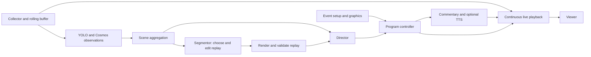

# Review of espn.svg

**Updated:** 2026-10-09

This is the initial sketch review. Its optional-speech wording is superseded by the [current build plan](07-build-and-demo.md): witty spoken commentary is required, and captions are a failure fallback.

The sketch shows how to collect video, tag moments, combine observations into scenes, direct the show, and add commentary. It still needs a media system that keeps playing while models make decisions.

The review included visual inspection of the SVG and extraction of all text labels. There was no application code to compare with the sketch. Replay editing and startup graphics are confirmed requirements. The sketch does not name these roles. The segmentor is the agent that chooses replay boundaries and edits.

## Every element and connection

| Sketch element | Keep | Problem to resolve |
|---|---|---|
| Three phones → Stream Collector | Multiple viewpoints | Support QR joining and up to five cameras. Define admission, source identity, audio source, reconnects, and clock alignment. |
| Stream Collector → tag video segments | Produce searchable observations | The paired arrows are unlabeled. Distinguish media references from metadata; define chunk readiness and source time. |
| tag video segments → director agent | Fast evidence for decisions | Tags are not renderable clips. A director needs healthy playable sources, readiness, and a program deadline. |
| tag video segments → event postprocessing agent | Combine short observations into an event | Define overlapping analysis windows. Merge duplicates, retain uncertainty and revisions, and reject late results. |
| event postprocessing → director, “new aggregated scene” | A scene/event is a good editorial unit | Define whether this is an observation or a finished media asset. Use separate `SceneEvent` and `ReplayAsset` contracts. |
| director → commentator, “final stream + meta information” | Tell commentary what viewers will see | Send an accepted program cue, which describes a scheduled program action. Keep video playing while commentary is prepared. |
| commentator → live output | Add narration | Add text-to-speech (TTS), scheduling, audio mixing, encoding, and delivery if speech is enabled. Model text alone cannot provide audio. |
| some person → live output, “watch the live stream” | A viewer endpoint | As a media-flow arrow it should point output → viewer. Player latency and the actual delivery protocol are undefined. |

## Highest-impact gaps

| Priority | Gap | Consequence | Proposed fix |
|---|---|---|---|
| P0 | No independent media path | A slow model freezes the show | Persistent compositor/encoder with live and holding sources |
| P0 | No recording buffer | The interesting moment is gone before a replay request arrives | Continuous local buffer plus finalized chunks in VAST |
| P0 | No shared timeline | Replays, comments, and camera cuts refer to different moments | Preserve source presentation timestamps (PTS), map them to event time, and schedule on program time |
| P0 | No single on-air authority | Several agents interrupt each other | One program controller with revisions, deadlines, and operator override |
| P0 | No startup context or graphics | Wrong names/scores and slow asset generation during play | Validate event context and preload a versioned graphics package |
| P0 | “Autonomous” has no failure policy | Lost cameras or failed models produce black/silent output | Hold healthy live feed; holding slate when no source remains |
| P0 | No distinction between action and official result | A shot is announced as a goal | Evidence-backed descriptions; authoritative score input |
| P1 | No replay scheduling policy | A replay hides a new important moment | Short, interruptible replays during quiet windows; monitor live throughout |
| P1 | Semantic search has no index contract | Search returns text with no playable source | Store timed source references and an index watermark, which records how far indexing has reached |
| P1 | Multi-camera sync assumed | Alternate angles show different instants | Calibrate offsets and uncertainty; disable unmatched angle cuts |
| P1 | No success measures | A polished demo hides incorrect behavior | Measure continuity, evidence quality, replay readiness, and search retrieval |

## Where the new responsibilities fit

The collector keeps media available. Agents prepare decisions and replay assets. The program controller applies accepted decisions to playback.

## Decisions that matter for the hackathon

Support up to five live phones through an event QR code. Use one designated wide feed as the default. Demonstrate a clear action, a replay, a natural-language search, and return to live. Prove playback with one phone before testing five. Automatic player recognition and referee decisions are outside the required demo.

Provider endpoints, VAST tenant capabilities, venue connectivity, speech service access, and demo duration still need confirmation. [The build plan](07-build-and-demo.md) gives working defaults and the checks needed to resolve them.
