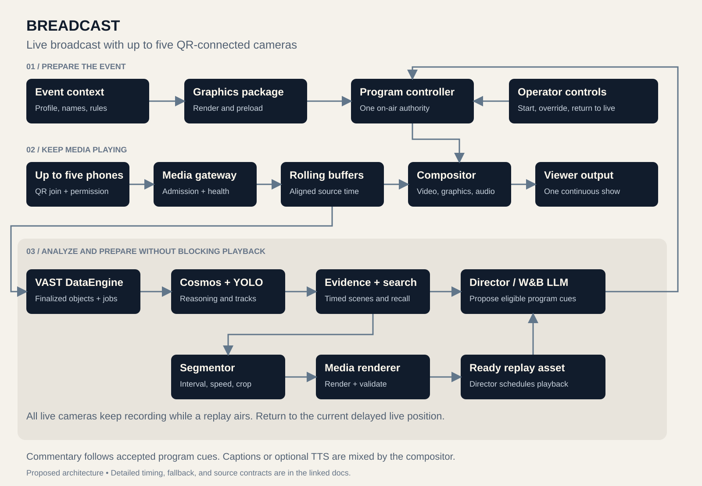
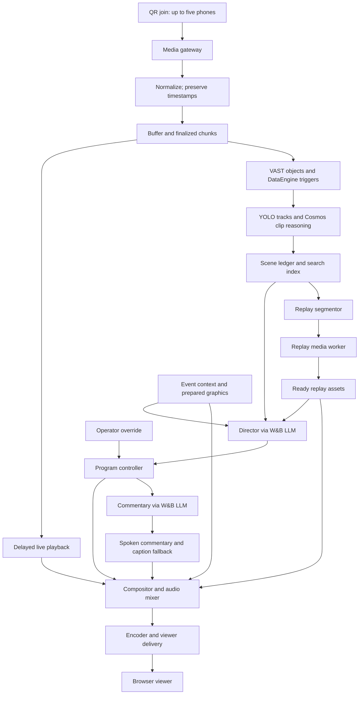
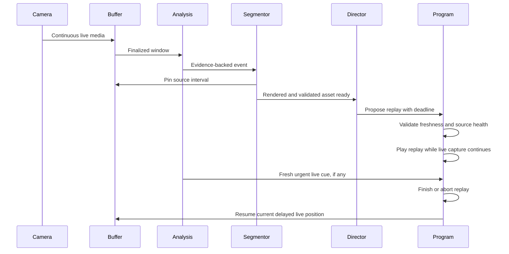
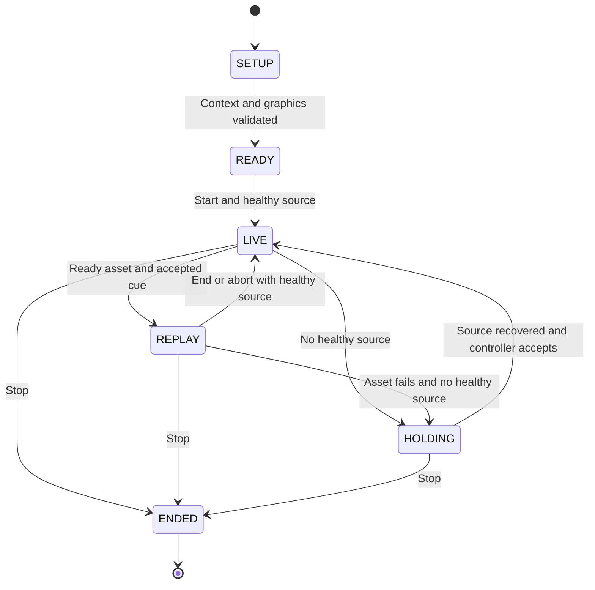

# Proposed architecture

**Updated:** 2026-10-09

Build one application coordinator, one media process that stays running, and background jobs with time and queue limits. Run agent roles in the coordinator. VAST coordinates work on stored video. The media process keeps playback running while that work proceeds.

The overview shows the media path and the decision path. The program controller is the only component that can change on-air state.

## Live media and asynchronous decisions

Live media reaches the viewer without waiting for model results. Models analyze stored video and propose later program changes.

## Suggested deployment

| Component | Hackathon placement | Responsibility |
|---|---|---|
| Phone browsers, maximum five | Venue | QR join, preview, publish landscape video; mute nearby viewer audio |
| MediaMTX gateway | Reachable machine close to capture | WebRTC ingest and routable media paths |
| Media worker | Same machine initially | Normalize, buffer, clip, compose, mix, and encode |
| Python coordinator + small operator interface | Same machine initially | Context, model adapters, scene records, controller, search interface |
| VAST | Organizer-provided environment | Durable chunks, manifests, assets, and DataEngine jobs |
| Cosmos / YOLO / W&B LLMs | Organizer endpoints on CoreWeave | Model inference; no local GPU assumed |
| Semantic search | Organizer service first | Timed retrieval; VAST vector implementation only if needed and supported |

MediaMTX documents browser publishing and recording. It is a proposed supporting tool. Test the actual browser codecs and network connection before selecting it. A codec defines how media is encoded and decoded. [Publishing](https://mediamtx.org/docs/features/publish), [WebRTC compatibility](https://mediamtx.org/docs/features/webrtc-specific-features).

The local Studio has selected the persistent FFmpeg path with application composition. A compositor combines video sources and graphics into the program. Preserve this implementation during provider integration; do not reopen compositor selection. Source switches do not restart the encoder. Replay rendering uses separate FFmpeg jobs.

## Timing: three clocks, one explicit mapping

| Clock | Meaning | Used for |
|---|---|---|
| Source presentation timestamp (PTS) | When a frame belongs in its source stream | Exact decoding and edit boundaries |
| Event time | Milliseconds since the event's media origin | Cross-camera observations and retrieval |
| Program time | Monotonic time in the outgoing show | Cuts, speech, overlays, and replay playback |

Keep arrival time to measure latency. Use source timestamps to locate the action. Each reconnect gets a new source epoch, which identifies a continuous source timeline. The primary camera's first valid PTS defines event time zero.

For each other camera, measure the time offset, clock drift, and mapping uncertainty. Wall-clock timestamps alone do not prove synchronization. Sources without a valid mapping can appear in previews or explicitly separate replays. Block seamless cuts between views of the same moment until alignment passes. [Context and contracts](05-context-and-contracts.md) defines the mapping. [Camera joining](09-camera-joining.md) defines calibration.

Proposed starting settings are 720p30 output, about 2 seconds per finalized chunk, and 6-second analysis windows with 2-second overlap. Start with a 120-second local buffer and an intentional 8-second program delay. These settings are targets. No measured result supports them yet.

Preserve the capture frame rate in recordings where possible. At 60 frames per second (fps), slow motion has more captured frames than at 30 fps.

For a cue to describe the action while it is visible:

`program delay >= chunk closure + upload/queue + analysis + planning + speech generation + scheduling margin`.

Measure the full path at p95, the latency at or below which 95% of measured results fall. If it exceeds the program delay, expire the cue or describe the action during its replay. Set any increase in program delay during setup. Never describe an old event as if it is happening now.

## Replay consumes airtime

Capture and analysis continue during a replay. On return, playback joins the current delayed live position.

The live playback position continues to advance during a replay. Resuming the old paused frame would add delay. Joining the current delayed position skips the live interval covered by the replay. Keep that interval recorded. Show a REPLAY label and allow an immediate return-to-live command.

A single full-screen program cannot show both moments at once. Picture-in-picture is a later option. The design does not guarantee that viewers see every live moment.

## Program states and failure behavior

The controller moves between setup, live, replay, holding, and ended states. Holding provides prepared output when no healthy source remains.

| Failure | Required response |
|---|---|
| Model timeout or invalid output | Keep current program; expire proposal; retry within the configured limit and only before the deadline |
| Camera disconnect | Continue through available buffer, then use prepared holding slate; reconnect under new epoch |
| VAST upload failure | Keep local live playback and buffer running; limit retry disk use; show that analysis is degraded |
| Replay render late or invalid | Keep live; archive candidate or skip it |
| TTS late or unavailable | Keep ambient audio; use timely captions if available |
| Duplicate event/result | Reuse durable result; never replay the same command twice |
| Coordinator/server restart | Start a new run in holding; invalidate old airtime work and camera leases; do not auto-resume the prior event |
| Media process crash | Detect and report interruption; explicit restart begins in holding; seamless failover and automatic restart are outside this phase |

Under load, reduce analysis sampling and expire old candidate jobs. Preserve media capture and playback. Live playback and the operator's return-to-live command have priority over indexing and highlight exports.
