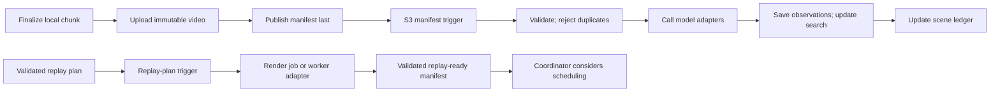

# Stack integration and VAST

**Updated:** 2026-10-09

Current user override: Gemini and Supabase replace the workshop stack below.
Use [migration 28](28-gemini-supabase-migration.md) for current provider choices,
streamed clip responses, private storage, pgvector and media hosting. The older
VAST design remains historical. Its timing and ownership rules still apply.

Current workshop work uses [PRD 22](22-live-stack-integration-prd.md). Its existing
VSS pipeline replaces the custom-trigger/function deployment proposal below.
Keep the evidence, timing, and ownership safeguards. Verify external access in
[record 24](24-provider-verification.md) before depending on an API.

Use VAST to store media and coordinate background work. The application selects edits, renders media, and schedules playback. This design uses public documentation recorded in [the source record](08-sources.md). Access to the actual hackathon tenant remains unverified.

Spoken commentary is now required. Verify a separate TTS service alongside the supplied stack; Riva is a candidate, not confirmed hackathon access. Prepare its application adapter and real-audio fixture checks locally. Missing speech access is a live integration blocker, even when caption fallback keeps the broadcast usable.

## Required stack mapping

| Supplied capability | Breadcast use | Boundary |
|---|---|---|
| NVIDIA Cosmos | Analyze video windows with fixed time limits; suggest action intervals | Use the supplied reasoning model. Official results need confirmation from the configured authority. |
| YOLO | Detect objects, track motion, estimate usable crop regions | Track IDs are local to a source epoch; they are not roster identities. |
| Semantic search | Find earlier moments by meaning | Results must include source intervals and index freshness. |
| W&B-hosted large language models (LLMs) | Director, replay planning, short commentary | Validate outputs in application code; keep models off the continuous playback path. |
| VAST AI OS / DataEngine | Store video and trigger analysis/render jobs | The application supplies the camera gateway and media editing. |
| CoreWeave | Supplied GPU model-serving infrastructure | Endpoint access does not imply permission to deploy arbitrary render containers there. |
| Cursor | Build and iterate on the application | No viewer/runtime dependency. |

## What VAST documentation actually establishes

The public guides support the capabilities below. Check the tenant version and enabled features before using them.

| Verified capability | Design implication |
|---|---|
| Functions, triggers, pipelines, API/command-line/visual controls, monitoring | Use DataEngine for background jobs with explicit limits. [Overview](https://kb.vastdata.com/documentation/docs/overview-of-vast-dataengine-1) |
| Element triggers on S3 objects with prefix/suffix filters | Trigger on completed manifests in a dedicated prefix. The referenced 5.4 guide does not establish arbitrary filesystem-write triggers. [Triggers](https://kb.vastdata.com/documentation/docs/creating-a-trigger) |
| Functions are packaged container images; Python entrypoints | Package provider adapters and, if supported, a media worker with its OS dependencies. [Functions](https://kb.vastdata.com/documentation/docs/creating-a-dataengine-function) |
| Function timeouts, retries, ordering, CPU/memory limits, optional temporary disk; no pipeline loops | Limit jobs and allocate temporary render storage. Keep the program controller outside the pipeline. [Pipeline deployment](https://kb.vastdata.com/documentation/docs/building-and-deploying-a-pipeline-on-vast-dataengine) |
| 5.4 vector operations and filtering; that version documents brute-force search | Use supplied semantic search first. Do not assume an approximate-nearest-neighbor index is available in this tenant. [Vector search](https://kb.vastdata.com/documentation/docs/vector-search) |

The supplied overview belongs to the 5.4 guide. The source review also found newer documentation. Record the actual tenant and runtime versions before selecting a software development kit (SDK).

## Proposed DataEngine flows

Publish a manifest only after its media is ready. A manifest records an artifact's files and metadata. Use separate triggers for analysis and replay rendering.



Proposed object layout:

```text
events/{event_id}/
  context/{revision}.json
  media/{source_id}/{epoch}/{sequence}.mp4
  manifests/{source_id}/{epoch}/{sequence}.json
  observations/{job_key}.json
  replay-plans/{plan_id}.json
  replays/{plan_id}/video.mp4
  replay-ready/{plan_id}.json
  graphics/{package_id}/...
```

Use exact prefix and suffix filters. Derived outputs must not trigger source analysis again. Store the bytes first. Check size, hash, and readability. Write the manifest last. A hash identifies file contents and helps detect changes. Declare a multi-file artifact ready only when all required files pass validation.

The trigger payload is a provider event. The adapter resolves its object reference into a Breadcast manifest. The payload does not necessarily contain a `SceneEvent`. Application event names in these docs are not VAST API names.

## Minimal integration sequence

1. Obtain the tenant endpoint and version, bucket/view, credentials, DataEngine permissions, container registry access, and allowed execution cluster. Confirm that the source view supports triggers. [Source-view provisioning](https://kb.vastdata.com/documentation/docs/provisioning-source-views-for-trigger-events).
2. Upload and retrieve one small finalized camera chunk and manifest. Verify access from the actual execution environment.
3. Configure a manifest trigger and a Python validation function. Record its job key, which identifies one logical operation. Deliver the trigger again and confirm that it creates no duplicate result.
4. Add model adapters using organizer-provided endpoints. Persist one real observation with its model/config revision and media interval.
5. Add replay-plan handling. Run the media worker in DataEngine only if rendering fits its timeout and temporary storage limits. Otherwise, submit the job to a reachable worker that stays running. Record completion when the job finishes.
6. Add index updates and the ready-asset notification. Exercise timeout, duplicate, and out-of-order cases before using results on air.

Check the installed command-line help and tenant SDK before creating deployment configuration. This design does not establish undocumented API routes or a ready-to-run deployment script.

## Model adapter requirements

| Adapter | Verify with one actual request | Application safeguard |
|---|---|---|
| Cosmos | Exact model/version; clip format; URL access; sampling and response format | Range-check timestamps, preserve uncertainty, and keep analysis proxies separate from originals |
| YOLO | Model classes; video versus frame endpoint; tracker state/session support | If only detections are served, host tracker state per source locally; reset on reconnect |
| LLM | Hosted model ID; JSON/tool support; rate/latency limits | Validate against the schema; allow one repair attempt within the deadline; then use the programmed fallback |
| Search | Query/index APIs; embedding model; metadata filters; ingestion delay | Filter by event and eligible time before retrieval; return source-linked hits |
| TTS, required for commentary | Verified speech service, expressive delivery, pronunciation, format, latency, and measured audio duration | Riva is a candidate; actual access is unverified. Missing speech leaves the commentary gate open; captions only preserve degraded playback |

NVIDIA's Reason1 NIM example supports video input. It describes analysis clips with visible timestamps to help locate actions in time. Follow the preprocessing rules for the supplied version. Sampled timestamps do not guarantee exact frame boundaries for edits. [NVIDIA API example](https://docs.nvidia.com/nim/vision-language-models/1.4.0/examples/cosmos-reason1/api.html).

Ultralytics tracking needs state across consecutive frames. Keep separate tracker state for unrelated streams. Detector calls that process each chunk independently do not preserve tracks automatically. [Tracking documentation](https://docs.ultralytics.com/modes/track).

Test ball visibility, camera shake, motion blur, and blocked views on actual footage. Generic detection does not prove reliable soccer-event recognition. Start with visible people, motion, and Cosmos descriptions. Keep a wide crop when tracking cannot follow the ball. Stage-event search over spoken words also needs a separate speech transcription service.

At the recorded source review, W&B inference documentation redirected to CoreWeave's serverless docs. The docs listed `https://api.inference.wandb.ai/v1` as the base URL and described model listing. Use the organizers' credentials and endpoint contract. Verify access to each selected model. [Serverless API](https://docs.coreweave.com/products/inference/serverless/api-reference).

## Semantic search workflow

Index each finalized scene or analysis window with its event, source epoch, start/end, evidence IDs, caption, and playable media references. If the supplied service accepts video, use its documented ingestion method.

Otherwise, use the supplied embedding model to convert evidence-backed captions into numeric vectors. Store and query those vectors in an available VAST database. Caption search can retrieve only details present in the captions. State that limit in the demo.

Use the same embedding model/version, vector dimensions, normalization, and distance convention for indexing and queries. Filter by event and time. Retrieve a limited candidate set, merge overlapping hits, and inspect and rank the media before making a replay. A high similarity score indicates relevance. It does not confirm a fact.

Store an index watermark per source. This records how far indexing has reached. Show it so users can see why a new moment is not searchable yet. Index the archive in the background. Corrections and retractions must invalidate old searchable claims.

## Questions for the organizers

| Needed answer | Why it blocks implementation |
|---|---|
| VAST version, enabled services, source view, registry, runtime SDK | Determines triggers and function packaging |
| Cosmos/YOLO model IDs and payload examples | Determines preprocessing and tracking ownership |
| Search API and indexing workflow | Distinguishes supplied search from an index we must build |
| Request limits and GPU quotas | Determines five-camera sampling and queue limits |
| May custom render containers run on supplied compute? | Determines render-worker placement |
| How do hosted models read private VAST objects? | Need reachable signed URLs, upload API, or supported byte transport |

Keep credentials outside event context and model prompts. The demo diagnostic view needs trace IDs, source intervals, model versions, durations, and fallback reasons. A trace ID links records from the same operation.
