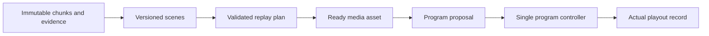
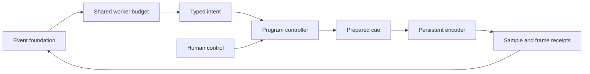
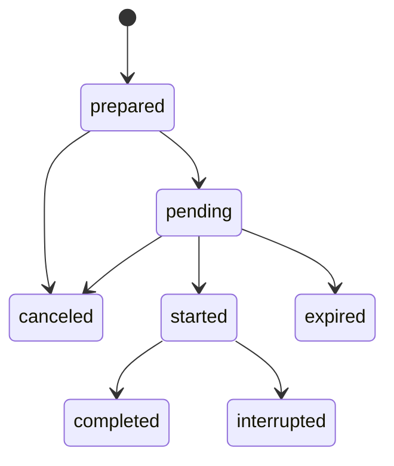

# Context and contracts

**Updated:** 2026-10-09

For current workshop integration, also apply the
[workshop contract addendum](#workshop-integration-contract-addendum). Earlier
implementation and evidence statements retain their original historical scope;
they do not close the live gates in [PRD 22](22-live-stack-integration-prd.md).

Use this document as the authority for IDs, clocks, evidence, versions, and state ownership. The JSON files in [examples](examples/) are fictional test fixtures. They illustrate the contracts. They do not define a complete schema or deployed API. Implement runtime schemas and validation in the coordinator.

## Four kinds of context

Each record has one owner and an update rule. The evidence ledger stores source records and their history. The program controller owns the record of what aired.

| Record | Contents | Owner / update rule |
|---|---|---|
| `EventContext` | Event identity, profile, names, branding, policies, output settings | Setup producer proposes; application validates immutable numbered revisions |
| `EventState` | Official score/clock or current session; references to active cameras and program | Coordinator owns official fields from configured authoritative input; camera leases and program remain owned by their existing components |
| Evidence ledger | Source chunks, observations, scenes, search hits, corrections | Ingest and analysis adapters; retain provenance and revisions |
| Program history | Accepted/rejected cues and what actually aired | Program controller and media acknowledgements |

Give each prompt only the needed event-context fields, evidence intervals, current program state, and recent output history. Retrieve archive records when needed. Keep credentials in separate runtime secrets.

## Event profiles

| Field | Soccer example | Hackathon / stage example |
|---|---|---|
| Participants | Teams, optional supplied roster | Speakers and project teams |
| Authoritative state | Operator/official score and match clock | Operator-selected session and run-of-show timing |
| Candidate moments | Shot, save, transition, celebration | Demo action, slide/topic transition, presentation ending |
| Confirmation needed | Goal awarded, card, named scorer | Winner, judge score, named speaker if not supplied |
| Replay opportunity | Confirmed stoppage or quiet interval | Between talks or explicit recap segment |
| Overlay | Scorebug with unknown fields hidden | Speaker/project lower third and session label |
| Audio priority | Ambient sound plus brief commentary | Preserve speaker audio; commentary mainly between sessions |

[event-context.example.json](examples/event-context.example.json) is a fictional soccer setup. The `profile` selects behavior and context fields. Each profile uses the same services.

## Common message envelope

| Field | Meaning |
|---|---|
| `schema_version` | Contract version; reject unsupported major changes |
| `message_id`, `type`, `event_id` | Unique delivery ID, logical application event type, owning event |
| `context_revision` | Exact setup revision used |
| `created_at` | UTC processing timestamp for diagnostics |
| `causation_id` | Message/job that caused this result, nullable at ingestion |
| `idempotency_key` | Stable logical operation key across redelivery/retry |
| `payload` | Typed record below; object references instead of video bytes |

Build processing keys from a canonical serialization hash of `(event_id, source_id, epoch, interval, operation, configuration_revision)`. Canonical serialization gives the same bytes for the same values. Re-rendering a changed plan gets a different key. A delivery ID identifies a message delivery. A logical work ID identifies the operation across retries.

## Records that cross boundaries

| Record | Required information | Reject when |
|---|---|---|
| `ChunkManifest` | Source/epoch/sequence; immutable URI/hash; native time base and PTS range; mapped event range; actual format; sync uncertainty; ready flag | Object unreadable, checksum mismatch, invalid range, unfinalized bytes |
| `Observation` | Evidence ID; chunk IDs; observed interval; detector/model version; visible facts; inferred labels and uncertainty | Bounds exceed evidence or source cannot be resolved |
| `SceneEvent` | Scene ID/revision; kind; interval; evidence IDs; status `candidate/confirmed/retracted`; optional official fact reference | Confirmation lacks required authority for that fact |
| `SearchHit` | Event/source/epoch; interval; evidence IDs; score; indexing watermark; model/index revision | Wrong event, missing media, future interval for historical query |
| `ReplayPlan` | Plan ID; scene/evidence revisions; ordered shots; source intervals; speed; crop; audio policy; output profile | Gaps in required media, illegal crop/speed, excessive output duration |
| `ReplayAsset` | Plan ID/hash; object URI/hash; measured duration/format; source map; validation report | Decode/timing validation failed or plan no longer eligible |
| `ProgramProposal` | Proposal/command ID; action; expected program revision; context revision; target; program schedule/expiry; short reason | Stale revision, missed deadline, unavailable source, manual override |
| `CommentaryCue` | Accepted cue ID; text; evidence IDs; program start/end; validated audio URI and measured duration for speech; explicit caption-only fallback when audio is unavailable | Parent cue canceled, duration exceeds slot, evidence retracted |
| `GraphicsPackage` | Package/context revision; asset IDs/hashes; dimensions; required binding names; readiness | Missing fonts/assets, sample fields unbound, output format mismatch |

Source presentation timestamps (PTS) use integer ticks with a rational time base: a fraction that gives seconds per tick. Event time and program time use integer milliseconds. [The architecture](02-architecture.md#timing-three-clocks-one-explicit-mapping) defines these three clocks.

All intervals are half-open `[start, end)`: include the start and exclude the end. Cut variable-frame-rate media by timestamps. Frame-count arithmetic cannot locate those cuts reliably. Orient and normalize each source before interpreting normalized crop coordinates. Retain the transform from the original media.

Keep a versioned mapping per source epoch. An epoch identifies a continuous source timeline.

`event_ms = offset_ms + (PTS - origin_pts) * time_base * 1000 * rate_correction`

Store the mapping's uncertainty and calibration interval. Pin its revision when a replay plan resolves event times to source cuts. Later drift corrections must not silently move an existing edit.

Follow the fixture sequence: [observation](examples/observation.example.json) → [scene](examples/scene.example.json) → [replay plan](examples/replay-plan.example.json). The [program proposal](examples/program-proposal.example.json) shows scheduling after rendering. Its cameras, chunks, and ready assets are fictional. These fixtures cannot be aired.

## Facts and corrections

An official fact includes `value`, `authority`, `effective_event_ms`, and `revision`. Use facts effective at the source event time currently on screen. During replay, use the historical fact snapshot or hide score and clock fields. If an overlay shows the current score over an earlier moment, label it as current.

`SceneEvent.status = confirmed` means the declared claim has enough evidence under the event profile. It does not confirm related inferences. For example, a confirmed visible shot does not prove a goal. Preserve conflicting evidence. Do not average it into certainty.

A retraction invalidates pending commentary and replays. The program log retains what already aired.

## Ordering and state ownership

Evidence can produce scenes and replay assets. These records cannot change on-air state directly. Every program change passes through the single program controller.

Implement one writer for program state. For the hackathon, use an embedded transactional store such as SQLite for short-lived control state, camera leases, job keys, and an outbox. A transaction commits related changes together. An outbox stores notifications that still need delivery.

VAST holds media and durable analysis artifacts. Export the program log to VAST. This does not provide controller failover across machines.

Store each result and its outgoing notification in one local transaction. Deliver notifications from the outbox with retries. Consumers must detect duplicate notifications. Workers use deterministic artifact paths and check completed job records. Do not assume that the provider delivers each event exactly once.

Pin source chunks during rendering so the buffer cannot delete them. Unpin them when rendering succeeds or fails. Before deleting a chunk, ensure a durable copy exists or mark the media unavailable. Search must not advertise deleted video as playable.

Track analysis progress per source. A missing camera must not block every other camera's analysis watermark, which records how far analysis has reached.

## Bounded context passed to each role

| Role | Context slice |
|---|---|
| Setup | Supplied brief, profile fields, graphics templates |
| Perception | One source window, source mapping, event vocabulary |
| Aggregation | Overlapping recent observations and matching scene IDs |
| Director | Current program revision and source interval, source eligibility, audio evidence/policy, developing observations, fresh scenes, ready assets, recent cues |
| Segmentor | Target scene, relevant retrieval results, source availability and edit limits |
| Commentator | Accepted cue and source interval, eligible recent/developing scenes, historical facts and names/pronunciations, actual aired text, pending commentary |

Start with fixed window and record-count limits in the coordinator. Tune them from measured latency. Retrieve archive records on demand. Agents must use the stored event state as the authority. A growing conversation cannot replace it.

### Audience-aligned context (planned integration)

These rules refine the production context contract. They are requirements for the next integration phase, not claims about implemented provider behavior.

The director and commentator read the same versioned event and evidence records. Their context slices differ. The director may use fresh capture-side evidence to plan upcoming airtime. Commentary must use evidence and official facts eligible for the source event time being presented at its scheduled program time. Do not announce a later outcome merely because analysis has already seen it.

Keep the event's commentary style, language, supplied pronunciations, and chosen voice configuration in the versioned setup context. The default style is defined once in the [commentator instructions](04-agent-instructions.md#commentary-personality-and-delivery). Reuse actual aired commentary and evidence history for callbacks and joke repetition checks; do not add a separate joke-memory service. Proposed style changes cannot rewrite facts or grant control authority.

Resolve commentary against the accepted cue, program revision, source lease/epoch, and source-to-program mapping. During replay, use the asset's output-to-source map, including speed changes and repeated angles. If timing is unknown, abstain from a time-specific claim; do not assume wall-clock arrival equals the moment viewers see. Browser delivery delay is measured separately from program time.

Include unresolved developing actions and relevant earlier events within bounded context. Do not wait for an action to finish or a replay to become ready before its observations inform a live decision. Each observation still has a finite evidence interval; later evidence extends understanding through new scene revisions. Summaries must retain evidence references, uncertainty, and revisions; they cannot become a new authority for facts.

Use actual playout history to identify what was said. Track pending cues through the existing cue lifecycle so overlapping windows cannot schedule the same narration repeatedly. Proposed, canceled, and expired text is not aired text. Source changes, human takeover, return to live, and evidence corrections require revalidation or cancellation of affected pending captions and speech. Cancel active replay narration when replay playback is interrupted. Already aired claims remain in history; a supported correction is a new cue.

The director may propose microphone/mute changes using explicit audio evidence or configured policy. Silent video does not establish speech, applause, identity, or sound quality. Speech recognition and synthesis require separately verified capabilities. When they are unavailable, preserve the configured audio policy and use timely captions or abstain.

Live decisions, commentary, and replay preparation have separate deadlines. Incomplete replay preparation cannot block live decisions. Expired work cannot air through a retry. Keep useful late evidence for history and search. Live framing requires a validated controller operation before any model may request it; the local replay crop contract does not authorize live zoom.

### Decision snapshots (planned integration)

Capture the program, run, control/policy, context, source ownership, and relevant evidence/mapping revisions used to construct a model request. The trusted adapter carries that snapshot with the result. Resolve the selected target from the reviewed source records; do not replace their revisions with a fresh `Coordinator.expected(args)` after inference. Check validity again before commit. A change during a slow model call must not become an apparently fresh decision by attaching new revisions.

Use a new decision with current context after rejection. Retrying transport uses the same logical action ID and contents; it cannot extend the deadline. Official facts and origin remain application-owned. Real model evidence needs a trusted ingestion path with provider/model provenance. The current local replay evidence interface accepts only operator/fixture origins; never disguise provider output as either to bypass that boundary.

Program history must resolve applied output intervals to immutable source identity, native/proxy timestamp mappings, and replay output-to-source maps as appropriate. The current live receipt identifies a frame sequence; it is not yet the complete event/program mapping. Unknown mapping stays unknown. Record caption/speech application through the media path, separately from generated text and controller acceptance. Official overlays must follow effective event time or stay hidden when that mapping is unavailable; the existing local display clock is not a synchronized match clock.

### Program audio and caption policy (planned integration)

Keep one designated live microphone. Camera cuts do not silently select another microphone. Source loss produces silence until an eligible replacement is explicitly selected by a human or accepted director proposal; slot reuse cannot inherit selection. Local browser listening controls only that browser. The source audio/video time mapping and uncertainty must be checked when using separate cameras for sound and picture; arrival time alone does not prove lip sync.

Preserve current replay behavior: mute live ambient sound and replay source audio, then restore the designated live source and mute setting on return. Full-screen graphics suppress camera audio through entry and exit. Narration may play during replay only for its accepted replay cue. Full-screen graphics suppress commentary unless a separately supported cue explicitly permits it; the first implementation may keep all full-screen output silent.

Timed captions belong in the encoded program, have a bounded duration, and use actual cue timing. The PRD must define one deterministic layer priority with the prepared graphics. Manual/full-screen cues take priority; captions must not obscure required graphics or accumulate a backlog while hidden. Restore only still-eligible cues after suppression. Keep the REPLAY label visible.

Spoken commentary is required. Permit one utterance at a time, validate decoded duration before scheduling, and apply a bounded gain/mixing policy that preserves intended ambient sound without clipping. Cancel obsolete speech and restore audio levels on completion or interruption. Late or unavailable speech must not hold video or delay subsequent cues. Captions or ambient-only output preserve playback during speech failure; they do not complete the spoken-commentary acceptance gate. A new multichannel mixer and automatic transcription are outside the required scope.

### Retained archive playback (planned integration)

Task 1 owns immutable stored media identity, availability, evidence revisions, and retention. Task 3 uses those records to resolve historical intervals after local buffer eviction or camera disconnect. Archived media is tied to its original source/epoch and event, never the current slot occupant.

The local replay path currently requires a matching active source and unexpired local evidence. Preserve that protection. Archive integration must resolve retained bytes and timing through an explicit validated archive path; removing the live-source check globally is not a valid implementation. Reuse `ReplayPlan`/`ReplayAsset` and their validation, extending the authoritative schema only for distinctions the implementation needs.

A new archive request has a new finite decision/plan deadline and current evidence validation. Expiry of an earlier live proposal does not erase the underlying observation. It also does not authorize revival of an old plan. Retractions, invalid mappings, missing bytes, changed content hashes, or ended/wrong events block playback. Pin required media through rendering and playback, bound retention, and mark deleted intervals unavailable in search. Archive retention does not promise uninterrupted restart recovery, unlimited history, or continued use of old-run airtime commands.

## Local graphics boundary

The [Docker graphics package](13-graphics-package.md) uses bounded local commands. It does not yet implement the production schemas above. The program controller owns active cues, manually confirmed scores, and an operator-controlled display clock. Unknown scores and names remain unknown. A preview cannot commit facts.

Graphics commands require the current program revision. Text binding runs before acceptance and outside the media lock. Timed cue expiry also advances the revision. Applied graphics are recorded after complete frame submission, separately from accepted input and viewer delivery. Current score overlays hide during historical replay. The display clock has no capture-time or official match-clock mapping. Event-context revisions, official-fact evidence, and autonomous proposals remain required for production integration.

## Local ReplayPlan 1.1

The local implementation in [app/replay.py](../app/replay.py) extends the existing ordered-shot contract. [The example](examples/replay-plan.example.json) contains continuous cuts and an explicit alternate-angle repeat. It is a fixture. Register actual calibration/evidence and replace its expiry before use.

- One server run owns `event_id = local-studio` and `context_revision = 1`. `camera-1` through `camera-5` identify slots in this local adapter. The mapping also pins the unique lease `source_path`. Slot reuse cannot inherit a previous lease's mapping, even when its epoch number is equal. Production source IDs must remain unique across leases.
- Each calibrated plan pins `source_mapping_revisions`, `evidence_revisions`, scene revision, and `expires_at` (UTC Unix seconds). Each shot references its source/epoch, half-open event interval, evidence IDs, speed, crop, short `reason`, and `edit`. Unsupported fields and operations are rejected.
- `edit = continuous` establishes the first shot. Later continuous shots meet at exactly the previous event end. `edit = repeat` must replay an interval already shown by a different camera. Its encoded shot shows ALTERNATE ANGLE throughout. It does not claim continuous action.
- Resolution derives source timestamps, immutable retained-frame references and hash, output intervals, and total duration. Output duration uses **source** duration divided by speed, including mapping rate correction. A stored total must match. Output frame boundaries round upward. Frame selection uses the continuous output clock and mapped source timestamps. Each output timestamp belongs to one half-open shot interval.
- Calibration has immutable revisions. At least three retained PTS markers identify shared visible event times: two endpoints and at least one interior check. The endpoint fit gives offset/rate. The interior residual adds to the supplied marker uncertainty. Calibration applies only within its tested interval. A new epoch needs new calibration. No receipt-time alignment is accepted.
- The combined alignment bound is the two mapping uncertainty bounds plus one normalized frame interval per source. Every selected angle pair must pass the configured tolerance. This conservative bound is separate from measured encoded clock-marker error. A live independent-view acknowledgement has no effect on replay validation.
- Local visual evidence records state `claim_kind = observation` and `origin = operator` or `fixture`. They carry action interval, subject visibility, quality, view contribution, source/epoch, mapping revision, scene revision, status, and expiry. They cannot confirm an identity or official result. Each shot's evidence must cover its complete interval. A revision change, expiry, or retraction invalidates pending plans and blocks ready-asset playback.
- Existing single-camera requests translate into this same contract with `timing_mode = source_only`. They have one source, source intervals, null event times, and no claimed action evidence or capture mapping. This compatibility path cannot accept multiple cameras. Public plan submission requires calibrated event intervals and evidence.

The local source buffer stores finalized immutable JPEG packets with **normalized proxy PTS**, their rational time base, epoch, and source path. Original camera recordings remain separate. The local replay worker does not read partially written recording chunks. Missing normalized packets across a join reject coverage. These records are not original `ChunkManifest` records. Provider adapters must preserve original native PTS and the full ingest transform before production use.

The worker pins all frame references before starting. Buffer eviction cannot delete the referenced bytes. Completion, failure, and cancellation release references. One worker and bounded shot/duration/record counts limit resource use. The worker records the plan hash, exact crop transform in normalized oriented coordinates, output configuration/hash, output-to-source/evidence map, full decode, continuous PTS, duration, blank-image checks, and decoded cut-image comparison. Only validated output becomes ready. The controller rechecks evidence and expiry before accepting playback. Program revision and return-to-live rules remain unchanged. Narration is not implemented.

Local mapping snapshots and evidence revisions are saved under the run's runtime directory. They do not establish VAST durability or restart recovery. A restart begins a new local event context and clears readiness. [The local guide](15-multi-camera-replays.md) documents the API and evidence.

## Local studio actions and authority

[app/control.py](../app/control.py) implements the local `ProgramProposal` adapter. It adds authority checks around the existing controller. It does not replace `ReplayPlan` or graphics validation. The server has one coordinator and one program controller. Providers remain disconnected.

- Each server start creates a unique `run_id`, enables crew proposals (`crew_paused = false`), and starts holding. The local `event_id` remains `local-studio`; context revision remains `1`. Prior JSONL history keeps its prior run ID. No queued action or ready asset is restored on restart.
- An action is `{id, op, args, expected, expires_at?}`. Public action requests require `expected`; trusted human helpers can capture it internally. `id` is a stable string of 1–96 letters, digits, underscores, or hyphens. A retry returns that action's current result. Chat IDs also pin the original command text. Chat results retain that text as `input_text`, so the conversation can restore the exact command from server records. The server rejects a changed request or actor with the same ID. The full run keeps these results; the status response returns current work, up to 32 failures, and 24 recent completed actions.
- `expected` is `{run_id, context_revision, control_revision, program_revision, sources}`. Revision fields are integers. Each source entry is `{slot, source_path, epoch}`. The unique lease path and epoch both identify the source. The source list pins the explicit target, or the primary source when no slot is supplied, plus each replay source. Slot numbers alone do not identify media.
- Live video and designated audio retain their selected lease paths. Reuse of a camera slot cannot inherit either selection. A replacement needs explicit video and audio selection. A reconnect within the same lease can recover playback; proposals still pin their reviewed epoch. Default audio binds once to the first source in its designated slot.
- `audio` arguments are `{slot, muted?}`. `muted` must be a boolean and defaults to `false`. The controller retains the selected lease while muted. `Program.audio_muted` silences program audio without changing input recording. Unmuting a different source replaces the designated microphone; at most one source supplies program audio. Replay and full-screen graphics still suppress audio and do not change this selection or mute setting.
- `control_revision` changes on takeover, control release, policy changes, and rehearsal replacement. Program revision changes still belong to `Program`. An authority change can invalidate a proposal without changing the current picture. A crew proposal must carry the current complete `expected` record and a finite future UTC Unix `expires_at`.
- Trusted application paths assign `Human`, `Local rehearsal`, or `Provider crew`. Public HTTP input always enters the human path. Payload fields cannot set origin or approval. The local API remains open; this is not a production authentication boundary.
- Human airtime actions set `crew_paused = true` and cancel pending crew airtime before target validation. Validation failure preserves the previous picture and reports takeover. Run validation occurs first: a missing or prior run cannot take control. All public action requests pin their run. Old control, preparation, or chat retries cannot resume work after a restart. Direct airtime commands also recheck context, program, and source freshness. They can override prior crew authority. Unknown chat text has no takeover or airtime effect.
- There are no Auto, Assisted, or Manual modes, or per-action approval. A fresh run accepts eligible crew proposals within policy. `takeover` pauses crew work. `resume` releases control and invalidates old work; only fresh proposals can run. Release rechecks the expected control revision. Takeover can override an old control revision within the current run. A delayed or retried release cannot reverse a later takeover. The current picture does not change on pause or release.
- Crew proposals cannot pause or release control, set policies, official facts, camera leases, join codes, or event lifetime. Official score confirmation remains an explicit human form. A crew `graphics` score operation is rejected even if it supplies `confirmed: true`.
- The coordinator serializes authority and commit. Graphics text binding runs outside that lock and outside the media lock. Commit checks authority again. Source ownership and the controller command share the controller/source lock boundary. Rendering runs in the existing separate worker. Completion produces a ready asset; it never starts playback.
- Up to 32 crew actions can wait at once. Replay limits remain one worker and 20 jobs per run. Human urgent controls remain available when crew work reaches its limit. Completed action IDs remain available for retry throughout the run.
- Replay playback rechecks file readiness, source lease/epoch, and calibrated evidence through the existing replay context. Source-only preparation captures the selected source object before rendering; slot reuse cannot substitute a new source. Source-only files also pin their recorded lease/epoch. A cancel action must specify `job_id`; a completed or old job cannot cancel another job. Crew cancellation is limited to its own preparation. Disabling crew replays also blocks new crew preparation. Explicit human preparation remains available.
- `Scheduled` means the server has a `not_before` monotonic time, derived from the five-second minimum shot or thirty-second replay cooldown. Timing starts at actual encoder application. Controller-owned replay return starts a new shot interval. A failed live source permits immediate crew recovery. Replay enablement and the twelve-second editorial maximum are enforced for crew. Human intervention overrides editorial timing, but keeps media limits.
- `Applying` means the controller accepted a command. `Program.applied_commands` stores exact revision receipts after a complete frame is submitted to the encoder. The coordinator uses those receipts before recording `On air`. A graphic cue also needs a matching visible cue; suppression during replay or its first transparent animation frame cannot claim airtime. This receipt does not prove viewer delivery. The validation record measures viewer pixels separately. Replay completion, source-loss holding, and graphics duration expiry remain controller rules while crew work is paused.
- Replay airtime also carries its starting command revision. Playing the same asset again starts a new session; its prior action finishes. Audio selection and official-fact updates finish on application without claiming a new picture is on air.

Preparation uses Queued, Preparing, Ready, Failed, or Canceled. Airtime uses Scheduled, Applying, On air, Finished, Rejected, Expired, or Canceled. Results contain stable ID, run, actor, target arguments, creation/update times, reason, and any job or program revision. Accepted transitions and applied receipts are written to the existing `program-history.jsonl` under the run's runtime directory.

The provider integration boundary is `Coordinator.propose(request, actor="Provider crew")`. An application adapter must translate validated `ProgramProposal` intent into one supported operation and preserve the request's reviewed snapshot and expiry under the [decision snapshot rules](#decision-snapshots-planned-integration). Do not refresh `Coordinator.expected(args)` merely to admit an old model result. The model cannot choose the actor argument. Do not expose this trusted entry as a public route. Segmentor output continues through `ReplayContext.accept_segmentor_response`, then `prepare`; the director submits a separate eligible `replay` proposal.

[The studio guide](12-studio.md#crew-controls-and-local-rehearsal) defines the HTTP operations and command grammar. [Phase evidence](evidence/autonomous-studio.json) records tested behavior and remaining limits.

## Event foundation runtime 1.0

PRD 1 uses strict Pydantic records in `app/foundation_records.py`. Generate JSON
Schema from those models. Unknown fields, unsupported versions, non-finite
numbers, and empty intervals fail. This is an additive boundary. Existing
ReplayPlan 1.1 and controller HTTP shapes stay compatible. Control snapshots now
use the active event context revision instead of the constant `1`.

The SQLite foundation ledger owns context revisions, official fact history,
source epochs, immutable chunk manifests, analysis jobs, observations, scene
revisions, pins, index entries, and an outbox. The existing controller owns its
run ID and program state. Ledger transactions never run in the encoder loop.

A source ID is the immutable camera lease path. An epoch includes the run ID.
Slots are display labels only. Chunk and window intervals use integer native PTS
and a positive rational time base. Media references use a SHA-256 content key.
A ready manifest follows full decoding and hash verification. Unknown event
mapping stays null. Verified frame receipt time establishes a live deadline, never
capture time. Recorder notifications establish only an archive processing deadline. A deadline is stored on first admission and cannot be renewed.

Observations retain the issued snapshot, configuration revision, supporting
chunk IDs, source interval, model version, uncertainty, and trusted adapter
origin. A stable association key must identify the same labeled action before
windows merge into a scene. Overlap alone does not establish that association.
Corrections append revisions and invalidation notifications. Original records
remain readable. Late results can enter archive history but cannot enter live
context. Old-run records cannot enter current live context.

Official values are committed only through the application's human confirmation
path. An unknown effective event time remains null and excludes the value from
historical synchronized context. Graphics reads the committed score values.
A confirmed score changes the context revision and invalidates pending proposals.

Archive resolution takes event/run/source/epoch, native interval, and optional
mapping revision. It rechecks hashes and complete coverage. A bounded pin owner
and deadline protect bytes under the same ledger lock used by cleanup. Deletion
first commits unavailability and index invalidation. Released camera slots never
substitute archive identity. This boundary does not grant archive airtime.

Role context preserves the reviewed decision snapshot. Commentary requires an
explicit eligible interval and valid event mapping for event-time facts. It
excludes later observations and later facts. Only actual program-history
acknowledgements count as aired text. Pending and canceled cues remain separate.
Context limits report omitted references or an unavailable slice.

Retrieved archive scenes must pass the same reviewed evidence revision check as
observations. Every supporting observation must still be active and have an
evidence ordinal at or below the reviewed snapshot. A scene that adds later
evidence is omitted; it cannot introduce a later claim into an earlier request.
Retraction and retained-media availability checks still apply.

`DecisionSnapshot.runtime` captures `RuntimeState` from the existing camera leases,
decoder status, program status, and controller policy. It includes sample UTC,
per-source health, requested and actual program state, the encoder's actual target,
microphone selection/mute, applied revision, human takeover, and controller policy.
Each source retains its immutable lease path and epoch; a reused slot cannot
supply another source's decoded health. Unavailable decoded health stays null.
Program acknowledgement means encoder submission, not viewer delivery. Context
uses this sampled runtime from the reviewed snapshot and does not refresh it.
The sample time marks the start of sampling. Adding elapsed time to frame ages
therefore gives a conservative freshness check when source reads take time.

This field is additive. Old snapshots read with `runtime=None`; null runtime is
omitted on serialization to preserve old operation signatures and worker retry
identity. Director context without a sampled runtime reports `unavailable`.
Sampling does not acquire the controller lock from a ledger transaction. If the
control revision changes during sampling, runtime stays unavailable.

The fixture registry labels every result as fixture. Unverified live boundaries
return an explicit capability failure. They never switch to fixture adapters.
Remote workers return result artifacts; only coordinator ingestion writes the
active ledger. No worker artifact can change program state.

### Recorder and decoder clock constraint

MediaMTX 1.20.1 closed fMP4 files reset video PTS to zero per segment. A manifest
therefore stores both `file_native` and the epoch `native` interval, plus
`timeline_offset_pts`. The offset sums decoded video PTS durations of preceding segments in native
ticks. Retain `MTX_SEGMENT_DURATION` separately for closure diagnostics. Its
audio/mux duration can exceed the video interval by one tick. All
preceding closure records must exist. A missing closure prevents a continuity
claim. No wall clock supplies a source-time offset. This reconstructs the
recorder timeline; it does not establish phone capture time or an event mapping.

The RTSP reader can also apply clock corrections without changing the publisher
lease. `native_provenance.timeline_revision` identifies each continuous decoded
native clock. Every backward change starts a new native revision and invalidates
calibration. Proxy PTS and continuous playback remain separate. Every backward change, native time-base change, or geometry change now renews
the source epoch. This prevents repeated native intervals within one source
identity. The earlier one-second threshold is retired. A missing trace after a
clock change renews ownership and leaves timing unknown. Old trace entries cannot
move the revision backward. Playback can continue, but synchronized crew output
stops until a valid mapping returns. Connected discontinuity recovery still needs
the Task 2 acceptance run. This is not a sensor-clock guarantee.

Replay calibration now pins `native_mapping_revision`. Old serialized mappings
without the field read as revision 1. A change rejects synchronized cuts and
requires new visible markers. Source-only replay still uses its continuous proxy
interval and immutable lease. File timeline offsets do not connect the recorder
clock to the RTSP reader clock; that connection needs calibrated evidence.

Recording hooks supply notification UTC, not a verified last-frame receipt.
`ChunkManifest.last_receipt_utc` stays null when that receipt is unknown;
`notification_utc` retains the hook time. `receipt_basis` identifies the clock.
The original archive processing deadline starts at the first notification and
includes closure, storage, queueing, and retries. It is not a live freshness
guarantee. `AnalysisWindow.deadline_basis` carries that distinction to workers.
Live eligibility and director evidence require `frame-receipt`; notification
clocks remain useful for bounded archive work and historical context. Missing
basis fields default to `unknown` and cannot acquire live freshness. Actual
recorder-to-decoder receipt mapping must be verified before live provider use.
Native/proxy proofs use decoded markers and a declared one-frame tolerance.
Physical camera clocks and rotated-phone metadata remain live gates.

Decoder submission provenance includes numeric `Geometry` fields. The scaled
width and height come from FFmpeg's actual intermediate frames. Native dimensions
refer to its decoded, oriented input. Rotation from that input is zero; unknown
phone sensor rotation is not inferred. The original recording remains the
authority for encoded media. Program submission time remains distinct from
RTSP reader corrections and viewer delivery.

The coordinator enforces the configured minimum window step. A shorter finalized
increment waits for more coverage. Longer recorder closure can reduce the
analysis rate. Diagnostics expose each source's contiguous completed watermark
and skipped, failed, or expired intervals. A watermark stops at uncovered media.
Publication and retention share one lock, including content reused by another
source. Shutdown releases this runtime's pins; deadline expiry recovers pins
after a crash.

The final decoded frame's recorded duration defines `file_native.end`. A prior
frame's spacing does not establish that duration for variable-rate video. An
unknown final duration fails readiness. This keeps native interval coverage and
recorder offsets tied to recorded metadata. Initial context storage also retains
the supplied revision number; it does not substitute revision 1 for an imported
brief.

## Live direction runtime 1.0

The application now has typed director and commentator entry points in
[direction.py](../app/direction.py). Full local acceptance is still open. The
[implementation evidence](evidence/live-direction.json) states which
checks ran. Fixture results do not prove live providers or editorial quality.

The diagram shows the ownership boundary. Prepared media reaches the existing
encoder. Only the controller can admit it. Receipts enter the existing foundation.

`FoundationSettings.direction` controls enablement, role timeout, at most two
attempts, speech duration/storage, action capacity, gains, ramps, and crop limit.
Provider selection remains in `providers`. Normal Studio startup leaves direction
disabled. The direction templates enable it without changing any endpoint.
Preparing an event and enabling workers cannot start or publish the program.
The operator must select live output and release control for crew work.

The controller's `program_started` flag records a successful human live or replay
command in this run. It starts false and is never restored from the previous run.
After that command, holding can schedule the director for recovery. Holding does
not schedule the commentator. Provider live/replay application cannot start a run
whose flag is false. Setup, graphics, and release do not set this flag.

`DecisionSnapshot.mapping_revisions` pins calibrated event mappings.
`decoder_revisions` separately pins native decoder and geometry revisions.
The new field defaults to an empty map and is omitted when empty. Old snapshots
remain readable. They cannot authorize live framing without a reviewed decoder
revision. Source epoch, clock revision, and event mapping revision are distinct.
The adapter keeps the original snapshot and deadline. It cannot replace them with
current controller expectations after inference. New unrelated evidence does not
invalidate a cue. A referenced retraction always does, including when its
notification was missed.

`live_timing.match_recording` compares three decoded recording images with retained
proxy images. It requires a distinct match and tests the interior timestamp
residual. The declared image threshold is mean absolute luminance error at most 8.
The timestamp residual must be at most one normalized frame. Weak, static,
ambiguous, discontinuous, or unavailable matches stay notification-only. No join
hook time becomes a frame receipt. The measured offset connects recording-native
PTS to decoder-native PTS. It does not create an event-time or phone-capture map.

A measured manifest retains actual `last_receipt_utc` and
`receipt_uncertainty_ms`. The latter defaults to zero for old records. Its original
live deadline is receipt UTC plus the existing live budget minus uncertainty.
Retries retain the first immutable manifest and deadline. Logs retain the matched
frame sequences, timestamps, image errors, residual, and uncertainty. Program
frame receipts retain selected source/epoch, native/proxy PTS, and frame receipt
UTC. Commentary excludes the uncertainty margin at the visible interval's end.
Unknown mapping suppresses synchronized claims and prepared-event score bindings.

Camera ingestion captures receipt time before it waits up to 100 ms for the
matching FFmpeg metadata from the other pipe. The wait occurs outside the source
lock and the program frame loop. It does not fabricate or extrapolate timing.
Metadata that remains missing leaves the frame's mapping unknown.

The controller admits only the typed role operations. Model output cannot choose
actor, action ID, run, revision, origin, or expiry. Provider director operations
are camera, microphone/mute, prepared graphic, holding, return, static crop, and
reset. Abstention and an unchanged picture/audio choice do not change the program
revision. Human setup, official facts, admission changes, policy, takeover/release,
and shutdown remain outside the role schema. The existing local rehearsal keeps
its authority boundary and cannot compete with provider scheduling.

A crop uses normalized oriented source coordinates before fit padding. Its
rectangle must match the output aspect and stay within the 2× initial limit.
Controller actions also pin the reviewed geometry revision. Crop pixels precede
all overlays. Source switch/loss, clock or geometry change, replay, and return
restore full frame. Reset remains available when the source is lost. Provider
framing needs subject detection confidence of at least 0.6; weak evidence keeps
the full view. This is an initial application gate, not a model-quality claim.

`SpeechResult.transcript` binds returned bytes to the exact requested words.
`configuration_revision` binds preparation settings. Fixture voices explicitly
carry their prerecorded transcript. Arbitrary fixture requests fail the speech
binding and can use eligible captions. The current mixer accepts completely
decoded WAV audio, converts it to mono 48 kHz signed 16-bit PCM, and checks decoded
frame count and duration. It does not accelerate or trim a sentence to fit.
Prepared files, PCM, and caption buffers count toward the asset and total limits.

Commentary reserves its exact text in the shared `ProgramText` ledger before
entering the speech queue. The new `intent` channel uses `pending` while waiting
or preparing. An atomic reservation checks all current pending and delivered
text in the run, including results from an older reviewed context. Replaced,
failed, expired, and shutdown work cancels its reservation. When preparation
creates the separate speech/caption records, it cancels the intent reservation.
An intent record never establishes actual audio or caption delivery. Existing
legacy, speech, and caption records keep their prior meanings.

Controller admission selects a start frame that is still ahead of playback. It
checks complete decoded audio against both the original end frame and expiry.
Waiting cannot extend either deadline. An utterance that no longer fits is
rejected. The audio writer checks contiguous PCM offsets starting at zero.
Only complete sample coverage can produce a `completed` speech receipt.
One narrator and at most one pending cue are allowed. New eligible work replaces
pending work. Analysis and all three role queues share the existing worker budget.

The initial ambient and narrator gains are each 0.7. Ambient duck gain is 0.25.
The entry/exit ramp is 40 ms. Narrator gain also respects 0.95 instantaneous
headroom while ambient gain ramps. Saturation remains a final safeguard.
Camera cuts retain microphone lease and epoch. Slot reuse cannot inherit them.
Replay suppresses source audio. Full-screen/stinger frames suppress all audio
and commentary through entry and exit. Browser monitor mute stays local.

`ProgramText` keeps its existing identity fields and adds channel, session,
first/last program times, first/last audio samples, and reason. Old records use
`channel = legacy`. Delivery transitions are:

The legacy pending-to-aired transition remains supported. Terminal text and cue
identity stay immutable. Speech and caption channels have separate cue IDs.
A started receipt follows actual complete pipe submission. Completion records the
last submitted sample/frame. In-flight cancellation waits for its receipt so
partial delivery cannot become a false canceled-before-air result. Interrupted
text is the planned sentence with partial sample/frame evidence. Its spoken words
are unknown; it cannot establish that the entire sentence was heard. Encoder
submission still does not prove viewer delivery. Shutdown drains queued audio and
closes encoder inputs before its bounded exit wait.

Replay assets add `native_frames` to each existing output-to-source shot map.
Each entry pins the selected native provenance and source sequence for that output
frame. It preserves half-speed frames and alternate-angle repeats. Older assets
still play. Missing native provenance cannot support synchronized narration.
Every playback command creates a distinct session. Return or interruption cancels
that session's narration; playing the same asset again cannot resume it.

`POST /api/setup` accepts the existing full context, expected revision, and
operation key. Graphics preparation runs before context commit and outside media
locks. A complete package activates under the controller/media boundary.
Retries preserve the context operation. A failed replacement cannot restore old
facts. The package contains neutral templates bound to supplied title/profile;
optional artwork uses the neutral fallback. Credentials do not enter setup.
Delay is saved from the current server configuration. Changing it requires a
controlled stop and new `--delay`. Prepared-event official score overlays require
an explicit human effective time and a valid event mapping. Legacy manual Studio
behavior remains readable and separate from a synchronized claim.

## Replay runtime 1.2

The strict canonical contract is `ReplayPlan12` in
[foundation_records.py](../app/foundation_records.py). Generate its JSON Schema
from `model_json_schema()`; the validation command saves that generated schema.
`SegmentorResult.payload` is a strict wait/abstain/plan union. It is bounded at
64 KiB. Director/commentator `LLMResult.text` remains bounded at 2,048 characters.
No model output supplies actor, operation ID, path, URL, shell, or authority.

A canonical plan pins real event/run/context/configuration, the reviewed
`DecisionSnapshot`, finite expiry, one input kind, the action and required
lead-in/aftermath interval, and ordered `ShotIntent` records. Every shot retains
its immutable `SourceEpoch`, native half-open interval, exact source-scene
revisions and observation IDs. An optional event interval requires a pinned
`TimeMapping` revision. Source-local edits use one source and no repeats.
Continuous cuts meet at the same native or calibrated event boundary. A repeat
must fit inside a previous interval on another camera. Duration uses native
source time divided by speed; event mapping rate does not replace native time.

`Observation.view` is optional. Unknown view quality cannot support an automatic
shot. An assessed view has an inspected native interval, subject visibility,
quality, and a short contribution. `replay_opportunity` and `urgent_live` are
trusted perception evidence. They are not an authority flag in a public action.
A director must cite that evidence and retain its reviewed deadline, source
health, mappings, and actual program state.

`ReplayContext` keeps strict 1.1 parsing. One-camera controls still compile
source-only 1.1 plans into the same `Resolved`/`render_plan` worker. Legacy crop
coordinates remain normalized program coordinates. Canonical crops use the
oriented source before padding and at most 2× magnification. Their explicit
transform enters the shared compiler; the old numbers are not reinterpreted.
Legacy live-buffer assets continue to require their original active lease.

For archive input, `replay_inputs` resolves and pins original files through the
foundation. It decodes with PyAV and preserves file PTS, rational time base,
chunk ID, epoch-native PTS, timeline offset, recorded geometry, and replay
normalization. Frame durations establish variable-rate coverage and the final
sample's end. Unknown timing and gaps fail. Missing live sequence/receipt remain
null. Each `native_frames` entry identifies the sample chosen for that output
frame, including slow motion and repeated angles. Historical calibration can
live in a separate versioned foundation record. It does not mutate a ready
manifest or require the current camera occupant.
Application snapshots select current sources from actual lease/epoch health.
Registering a retained historical source cannot replace a live source merely
because its ledger record was written later.
The chunk-end receipt cannot prove an edit's last-frame receipt when its
required interval ends inside that chunk. Keep that receipt null. Explicit
recall remains eligible; automatic preparation skips the unknown receipt.

Preparation and airtime have separate lifetimes. A normal live cut can occur
while a valid edit renders. Readiness cannot submit a replay command. A fresh
director context includes at most two eligible assets. The director chooses
one asset and cites positive opportunity evidence. Only the controller applies
it. An automatic logical action is consumed at the first encoder receipt;
human repeats create new playback sessions.
Explicit action association across source scenes shares one automatic candidate
key. A camera angle cannot create a second automatic airing of that action.
Unknown association keeps source scenes separate; descriptions do not merge them.

Playback resolution, hashing and preload occur outside control/media locks.
An accepted archive ticket pins sources for its bounded session and carries
published scene/evidence/chunk/mapping dependencies. The controller and media
loop check this small view without SQL, decoding or network calls. Cleanup and
correction revoke dependencies before deletion. Ready assets hold no indefinite
source pin. Cancel, failure, expiry, return, completion and shutdown release only
their owner's pins. Old source disconnect does not revoke valid archive media.

Archive commentary uses the accepted ticket/session and actual per-frame source
map. It does not require an old source in current `DecisionSnapshot.sources`.
Run/context/control, evidence and session checks still apply. A repeat or view
change cannot carry commentary from a later source interval backward. Archive
source checks compare the complete `SourceEpoch`, including epoch and time
base. An alternate angle must use another source path. Current scores and slot
identity are excluded. The existing narrator, captions, mixer
and `ProgramText` retain actual delivery ownership and partial receipts.

Public recall uses `PublicSearchRequest`, `PublicSearchHit` and
`PublicSearchResult`. Queries pin current run and server index/embedding versions.
Safe hits contain original source and scene/revision, native interval/time base,
nullable calibrated event interval, bounded description, ranking, availability,
and per-source freshness. They contain no filesystem paths, manifests,
credentials or raw provider payload. Selection revalidates the stored hit;
search/preparation/preview have no airtime authority. The
[Task 3 handoff](21-timely-replays.md) gives routes, limits and entry points.

## Workshop integration contract addendum

Added 2026-10-09 for [PRD 22](22-live-stack-integration-prd.md). This section specifies
the next implementation. It does not claim the provider adapters are implemented.
It replaces the custom-trigger deployment assumption for this workshop: the
existing VSS DataEngine pipeline owns remote processing. Breadcast owns local
evidence validation, control, and rendering. An application `chunk.ready` event is
not a VAST API event.

### Contract ownership and versioning

The integration coordinator owns `foundation_records.py`, `foundation.py`,
`foundation_providers.py`, and the new `provider_contracts.py`. Adapter owners
implement the ports below in separate modules. No adapter opens SQLite, writes
program state, changes an official fact, or accepts a public caller's origin flag.

Keep the current `Registry.analyze`, `Registry.llm`, `Registry.speech`, and
`Registry.query` entry points as facades during migration. The coordinator changes
their implementations and callers together. `Registry.query` needs the richer
search return path below; an adapter cannot fabricate a `scene_id` to fit its
current list of `(scene_id, score)` pairs.

Generate schemas from strict Pydantic models, with unknown fields rejected and
non-finite numbers disallowed. Publish contract version `workshop-1` and its schema
hash before parallel adapter work begins. This is an internal contract version,
not a VAST API version. Fixture adapters retain explicit fixture origin and run
the same validation. New fields default only where old persisted records remain
semantically correct. Origin, identity, and clock proof never default to verified.

If a verified provider constraint requires a contract change, the coordinator
updates this section, models, migration, fixtures, consumers, and tests together.
Dependent branches pin the new schema hash before resuming. Do not let agents
independently change a shared signature.

### Shared runtime context

Each provider call receives a trusted `CallContext` with `operation_key`,
`trace_id`, `configuration_revision`, `deadline_utc`, and an in-process cancellation
signal. These values come from the coordinator. Deadlines use existing UTC fields
at process boundaries; local waits use a monotonic remaining budget. The context
does not grant a role or program authority.

One configured VSS client owns login and synchronized token refresh. It reads
secret references from runtime configuration. Adapters receive this client rather
than passwords. One bounded HTTP helper supplies TLS verification, response-size
limits, timeouts, cancellation, safe errors, and retry accounting. Media downloads
use their byte budget rather than the JSON response limit. Limit redirects to
verified media hosts and never forward credentials to another host. Private
request data is not returned by status endpoints.

The coordinator exports one validated configuration object to adapters. Extend
`FoundationSettings` with one strict `integration` object with these fields:

| Field | Contract |
|---|---|
| `contract_version` | Literal `workshop-1` |
| `analysis_path` | `vss_pipeline` or `direct_models`; set only after verification |
| `vss_endpoint_env` | Name of variable holding the team backend URL; default `INGRESS_URL` |
| `vss_username_env`, `vss_password_env` | Names only; defaults `USERNAME`, `PASSWORD` |
| `verification_record` | Local read-only path to validated non-secret capability evidence |
| `upload_visibility` | Literal `private` in this scope |
| `upload_scenario`, `upload_custom_prompt` | Nullable; exactly the chosen verified prompt mode, not both |
| `archive_deadline_s` | Positive seconds; default 300 |
| `poll_interval_s` | At least 2 seconds; default 2; may be stricter for quota |
| `health_interval_s`, `health_max_age_s` | Defaults 60 and 900; max age must exceed interval |
| `json_response_bytes` | Positive bounded integer; default 2,097,152 |
| `upload_concurrency` | Literal 1 for this release |
| `tracking` | `provider` or `local_ultralytics`; nullable until G09 is verified |

Continue to use existing `ProviderConfig` for each boundary's endpoint, model,
version, protocol, formats, capabilities, secret environment name and storage
location. `llm.model_id` is the common default. If verified role needs differ,
add one `role_models` map keyed only by director/commentator/segmentor, with values
of that same provider model configuration; do not duplicate credentials in it.
Voice ID remains in `EventContext`. `speech` uses its existing provider entry.
UI base path and operator access belong to studio/deployment configuration, not
model context. Add `BREADCAST_PUBLIC_PATH_PREFIX`, default empty, accepting only
empty or `/app` for this release. Keep `BREADCAST_PUBLIC_URL` as the trusted origin
without a path. Build browser URLs from that origin plus the explicit prefix.
Add `BREADCAST_OPERATOR_AUTH` with values `local`, `proxy`, or `token`; default
`local` is allowed only for loopback/private trusted operation and cannot pass a
public deployment gate. `proxy` requires G08 proof that direct backend access is
closed and every operator route is protected. It never trusts an arbitrary
client-supplied identity header. `token` requires
`BREADCAST_OPERATOR_TOKEN_FILE`, an absolute path to a bounded secret file. Use a
private host directory and a read-only container secret mount readable by the
service user. Missing or unreadable token configuration fails closed for
operator actions. No token value enters public configuration.

In token mode, Studio accepts the operator credential through a password input
over HTTPS and keeps it in page memory only. It sends it as a bearer header on
operator requests, never in URLs, local storage, or model context. Page reload
requires re-entry. Phone lease tokens remain distinct credentials. The server
maps each route to public viewer, event-code join, own-lease, operator, or internal
access. An unknown mutation route defaults to denial. Public viewer status must
not reveal lease tokens, join secrets outside the intended QR flow, or operator
diagnostics. Preview/replay access follows the event's private demo scope.

S01 enforces own-lease release at `POST /api/lease/{lease_id}/release`; it always
requires that lease's bearer token, including requests arriving through a local
proxy. Operator removal uses the separate protected
`POST /api/cameras/{lease_id}/remove`. This distinction prevents public phone
routes from inheriting a proxy's operator privilege. Internal routes also require
loopback access. Compose selects token mode. Proxy mode cannot close G08 without
proof of the external operator guard and a closed direct backend.

In S01, remote CLI startup requires an HTTPS public origin and token access or
the explicitly configured proxy boundary. A missing token secret rejects startup
before media resources start. Local smoke checks use a loopback-only origin.

### Remote records

Store new record kinds in the existing `records` and `operations` tables. Do not
add a second database or parallel store of scenes/facts. Provider URIs and raw
payload references are internal and may contain team information. They are never
model-supplied fetch instructions or public search fields.

| Record | Required fields and meaning |
|---|---|
| `RemoteSubmission` | `chunk_id`, `configuration_revision`, immutable `operation_key`, `provider_contract_id`, `submitted_utc`, disposition `accepted` or `submission_unknown`, nullable returned `object_key`, nullable verified `parent_uri`, nullable provider request ID. It records what was submitted, not that the video is indexed. |
| `RemoteMediaReceipt` | `chunk_id`, `submission_key`, verified `parent_uri`, actual original SHA-256 and byte count, `verified_utc`, provider contract identity. Match the existing manifest's hash/size; do not duplicate source identity already reachable through `chunk_id`. |
| `ProviderSegment` | `parent_uri`, `segment_uri`, provider segment revision or verified content/config fingerprint, finite nonnegative `parent_start_s`/`parent_end_s` with end greater than start, bounded description, nullable raw detection reference, model identities and revisions, index/embedding identity, redacted raw-result artifact hash. Its times are normalized parent-relative seconds under a verified transform. |
| `ProviderBinding` | Stable binding ID; `chunk_id`; provider parent/segment identity and revision; mapped native half-open interval; time/geometry transform fingerprint; resulting observation IDs and scene revisions. The coordinator creates it only after identity, bytes, coverage and timing validation. |
| `ProviderSearchResult` | At most 100 `ProviderSegment` references paired with finite provider scores, verified score-domain descriptor, index/embedding identity and nullable provider request ID. The coordinator filters and imports before creating up to ten public hits. |

Each provider boundary has a versioned verification record. Preserve both Cosmos
and YOLO model/configuration identity; the existing `Observation.model_id` alone
describes the reasoning model. Add an optional `provider_binding_id` to Observation
and the internal index record. The referenced binding retains detector/tracker and
remote index lineage. Old fixtures omit it. Live import requires it; a live claim
cannot inherit fixture lineage.

If the remote backend has no revision field, use a fingerprint of verified model,
preprocessing, prompt, index configuration, and immutable response content as
applicable. Label the basis `application_fingerprint`. Never fill a provider
version with an invented server release. Keep previous evidence immutable;
changed reasoning creates a new binding/evidence revision and explicit invalidation.

Remote submission state belongs to the existing operation record. Allowed states
are `queued`, `submitting`, `submitted`, `verifying`, `indexed`,
`submission_unknown`, and `failed`. Commit `submitting` before sending bytes.
A response with an object identity moves to `submitted`; byte/result checks move
through `verifying` to `indexed`. A timeout with uncertain remote effect moves to
`submission_unknown`, including recovery after a crash in `submitting`.
Reconciliation can move that state to `submitted` only with exact identity proof.
Unambiguous permanent errors move to `failed`. Indexed/failed operation payloads
are terminal; new analysis configuration needs a new operation key. Reconciliation
after the 300-second wait may discover an indexed artifact but carries an
archive-only disposition and never refreshes a live deadline.

Keep the original chunk pinned while its bytes are read or upload is active.
Renew bounded local pins only while the owning task is alive, within the original
archive task deadline; each individual pin remains at most 60 seconds. Release
the pin after verified remote readability or task termination. A lost pin or
retention deletion before upload finishes fails the operation; a pending queue
entry does not imply durable remote availability. Cancellation during a POST may
still leave a remote object and must enter the same uncertain-submit recovery.

### Internal adapter ports

The following are application APIs to implement. They are not claimed provider
SDK methods. Use existing record classes where named. All methods are async and
receive `CallContext` unless explicitly marked pure. Constructors receive frozen
configuration and the shared client; they do not receive `App` or a ledger writer.

| Port | Input | Output and side effects |
|---|---|---|
| `VssIngest.submit` | `ChunkManifest`, validated local media path, call context | `RemoteSubmission`; sends at most one logical submission; cannot claim indexed state |
| `VssIngest.reconcile` | Submission, manifest, call context | Nullable `RemoteMediaReceipt` plus zero or more normalized `ProviderSegment` values; safe repeated reads |
| `Perception.normalize` | Issued `AnalysisWindow`, verified manifests/receipts, provider segments and detection payloads | Bounded observations plus binding drafts; pure conversion, no writes and no guessed timestamps |
| `Perception.analyze_direct` | Issued window, resolved original media, call context | Same normalized bundle as the pipeline path, with actual sampled-frame mapping and provider provenance |
| `VssSearch.query` | Existing `SearchQuery`, call context | `ProviderSearchResult`; foreign hits are still untrusted until coordinator validation |
| `WandbRoles.decide` | Role, bounded context, original `DecisionSnapshot`, call context | Existing `LLMResult` or `SegmentorResult`; trusted wrapper fields attached by adapter |
| `Speech.synthesize` | Text, reviewed `EventContext`, call context | Validated decoded audio artifact data plus text/config binding; registry stores it through existing `FileStorage` and returns `SpeechResult` |
| `ProviderRuntime.probe` | Selected boundary, call context | Sanitized operational status and capability proof reference; health calls do not upload or run model inference |

Use strict `AnalysisBundle` with `observations` (maximum 256), `binding_drafts`,
and trusted call diagnostics as the perception output. Coordinator ingestion
assigns/validates binding IDs and commits them with observations in one transaction.
Bundle failures commit no partial active evidence. A zero-observation result is
valid only when it represents a verified empty analysis, not a failed request.

Use a temporary, application-created path for synthesized audio. It must remain
under the task's scratch root. The speech adapter decodes and checks duration,
samples, channels, size and text binding before returning. It never returns an
arbitrary provider URL to the mixer. Failed/canceled synthesis removes its own
temporary files; the registry owns published audio lifetime.

### Source and time conversion

A complete source identity is `SourceEpoch`, including event, run, unique source
path, epoch, slot and time base. A slot is only a display label. An upload must map
to its exact `chunk_id`; a provider camera label must never overwrite this map.

For a provider interval measured in seconds from the first frame of an uploaded
parent, derive native ticks from the verified parent origin, `file_native`, and
`timeline_offset_pts`. Round start downward and end upward to preserve inspected
coverage, then validate against actual decoded sample intervals. Store the
rounding uncertainty. Reject material out-of-bounds values; do not silently clamp
an invalid interval. A provider time measured from another origin needs an
explicit verified transform before normalization.

Do not use upload time, index time, returned UTC, file name, or recorder notification
as capture time. `deadline_basis='frame-receipt'` remains necessary for live
direction. Unknown sensor/event time blocks synchronized commentary and alternate
angles as required by the existing contracts, while source-local archive recall
can remain available. Late results retain their original window and expiry.

### Search import and archive results

Only coordinator code resolves provider references through submissions/receipts
and bindings. It verifies that original media, observations, and scene revisions
belong to the query event/run. A provider hit with no proven local binding is
excluded, not assigned a new phone slot or synthetic event identity. For a newly
indexed bound segment, the coordinator issues a durable archive analysis request
before importing it. This request has an archive disposition and cannot enter the
live queue. Its original provider facts and timing stay unchanged.

The registry cannot silently mix fixture rank scores and provider scores. The
public request/result shape stays unchanged; shared changes to internal search
return values must land with all callers. Revalidate selection, preparation,
preload, and controller admission independently. Public results contain no remote
credentials, signed URLs, raw SQL, local paths, or full manifests.

### Errors and replay safety

Define a shared `ProviderFailure` with bounded `code`, `boundary`, `retryable`,
nullable provider request ID, and optional bounded retry delay. Codes are
`configuration_missing`, `capability_unverified`, `auth_failed`, `forbidden`,
`rate_limited`, `deadline_missed`, `canceled`, `transport_failed`,
`submission_unknown`, `invalid_response`, `identity_mismatch`, `timing_unknown`,
`media_unavailable`, `version_mismatch`, and `capacity_reached`. Public text maps
from these codes; do not expose exception strings that may contain secrets.

Only safe reads and verified idempotent operations retry automatically. A logical
operation key cannot acquire new payload, deadline, source, or configuration on
retry. Persist terminal identities for the run. A restart reconciles interrupted
submissions, but it never resumes an old on-air action in a new run.

### S02 admission and preview refinements

Commit a camera capacity claim before requesting its gateway path. If the gateway
request fails or its response is lost, preserve that claim as `REVOKING`. Keep it
occupied and reject publishing until gateway removal succeeds or confirms the
path is absent. An expired reservation or reconnect cannot be promoted by a late
media poll; mark it `REVOKING` under the lease lock and preserve its epoch.

Camera previews can provide `expected_source_path` and `expected_epoch` on
`GET /api/preview/{slot}`. A source mismatch returns 409 instead of replacement
phone media. Browser requests also bind their response to the current source and
operator session. Slot numbers alone do not identify a continuous camera source.
Transient Join status-request failures do not revoke the local stream. Confirmed
invalid/expired ownership stops sharing; the gateway still enforces expiry.

### Configurable server video input

Current input mode uses one registered repo/local/S3 video. `config/server-videos.json`
selects one or two trusted server URIs. The browser cannot submit a file path.
Original bytes are retained with SHA-256 and measured file metadata. Server video
chunks use `provenance=server_video`; they are neither physical capture nor labeled
fixture evidence. Recording ownership preserves the input video ID and original
hash. Unknown sensor time stays unknown.

Protected POST `/api/examples/start` and `/api/examples/stop` accept an empty
object. They return asynchronous playback status. Start stages the configured
bytes, obtains ordinary capacity-limited leases, starts FFmpeg, and asks the
program controller to select the first source. Stop cancels pending startup,
terminates publishers, and fences their leases. A human control change during
loading prevents late startup from taking airtime. Playback runs once and drains
the existing delayed frames before returning to holding. Opening Studio, changing
config, or probing providers never starts playback.

### Registered-video archive processing

Starting registered-video playback queues VSS archive processing independently.
The logical binding key uses tenant endpoint, username, chunks bucket, and original
SHA-256. `video_analysis` records in the existing coordinator ledger retain the
upload receipt, original-byte check, configuration fingerprint, returned version,
indexed parent, summary, detection sidecars, and request durations. Credentials
and tokens are not retained. Archive results are bound to the registered file;
they are not camera-window observations or fresh live evidence.

Persist `submitting` before the non-idempotent upload. An interrupted/ambiguous
submission stays blocked from duplicate upload. Known receipts resume reads on
later Start. Explore is the supplied fully-indexed parent surface; re-ingest job
counters are not required on its cards. Polling is bounded to five minutes and
at most 1,000 parents per lookup. Unknown clocks, model versions, and tracker
state stay unknown. Provider failure does not change the program.

Studio receives only summary/status/counts. The ledger retains bounded segment
metadata and detection payloads with their hashes. A sidecar's presence does not
prove tracking or live timing. Saved ready output is reused only after tenant
configuration and original bytes are checked. Stop video leaves archive work
running; app shutdown cancels it. No archive result can invoke the controller.

### Workshop runtime adapters

The default runtime can derive live connection settings from the assigned VM
variables. Explicit foundation JSON remains authoritative when supplied.
`workshop-v1` selects documented transports; it does not claim verified access.
Runtime discovery checks the selected model ID before model requests. Missing
returned model versions use the explicit `unknown` value. Provider gates remain
open until actual version and behavior evidence exists.

Finalized recordings now issue current-window work for configured live adapters.
The existing recording/decoder match supplies native frame receipt mapping.
Analysis proxies concatenate only the issued source interval, without audio,
at 320×180 and five frames per second. Cosmos describes proxy-relative seconds;
the adapter converts these to issued native ticks and preserves the snapshot.
YOLO receives the same bytes. Its raw counts are not normalized boxes or tracks.
Only actual model output receives `origin=provider`. No archive result acquires a
new live deadline from this transport connection.

Live work that expires or is superseded can enter `archive_queued`, then
`archive_running` and `archive_completed`. This uses the original issued window,
source, snapshot, and live deadline. A separate 45-second archive execution budget
does not refresh that deadline. Only one shared analysis worker runs archive
analysis at a time. Archive-completed evidence is excluded from live direction.

Workshop search first uses private VSS semantic retrieval to select registered
parent uploads. Recorded input hashes resolve those parents to the current run's
retained scenes. Embed1 ranks their captions with 256-dimensional vectors. Search
does not convert VSS upload or segment timestamps into local camera time. Its
playable intervals come from already-normalized local scene evidence. This is
caption ranking within VSS-selected parents, not verified video-vector reranking.

W&B roles use the pinned PydanticAI Chat Completions transport. Runtime model
listing validates each configured role ID. The segmentor receives actual image
content with its source clock labels, not image bytes inside ordinary prompt text.
Adapters bind snapshot, origin and model metadata; models return only typed intents.
The existing director/controller, commentary preparation and replay compiler own
all validation and airtime. Hosted model versions remain unknown unless returned.
