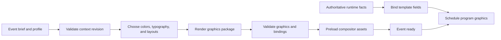
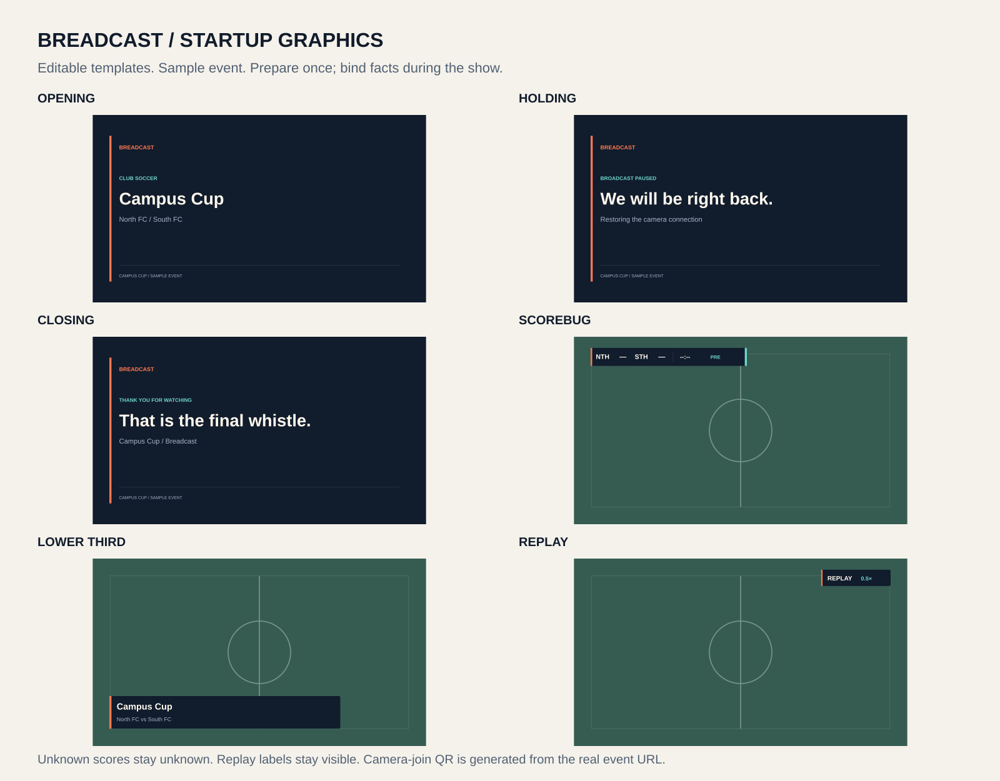

# Graphics preparation and replay production

**Updated:** 2026-10-09

Render reusable graphics **before the event starts**. During the event, bind current facts into the prepared templates. The segmentor chooses replay boundaries and edits. The media worker renders and validates playable files. The director proposes when to show them. Only the program controller changes on-air state.

## Implemented default package

The Docker studio now includes a neutral Breadcast package with 24 designs and Operator controls. It composites animations into the actual program stream. It includes screens, name bars, banners, corner marks, two scoreboards, and four stingers. Event-specific context and branding remain future setup work.

The [package guide](13-graphics-package.md) defines the controls, layers, clock policy, preparation, and local API. The [evidence record](evidence/studio-graphics.json) records checks on real encoded output. The older SVG examples below remain fictional fixtures.

## Startup graphics workflow

Setup validates and preloads the graphics package. Runtime updates fill template fields with authoritative facts.

| Asset | Prepared at startup | Bound at runtime |
|---|---|---|
| [Opening slate](../assets/graphics/opening.svg) | Event title, colors, team/session names | Start cue; optional scheduled countdown |
| [Scorebug](../assets/graphics/scorebug.svg) | Layout, team labels, color accents | Confirmed score, match clock, period; hide unknown fields |
| [Lower third](../assets/graphics/lower-third.svg) | Name/subtitle layout | Verified participant or project name |
| [Replay badge](../assets/graphics/replay.svg) | Persistent REPLAY marker and speed field | Actual playback speed |
| [Holding slate](../assets/graphics/holding.svg) | Neutral message and identity | Controller selects when no source is available |
| [Closing slate](../assets/graphics/closing.svg) | End-of-event layout | Confirmed result or neutral thanks |

The supplied SVGs are 1920×1080 starter templates with fictional sample text. Overlays have transparent backgrounds. Named element IDs and the [template manifest](../assets/graphics/manifest.json) identify fields to bind. The templates still need a graphics engine.

At setup, replace sample text through XML/DOM text nodes. These are the text elements in the parsed SVG. Check text fit. Convert to bitmap images if the compositor needs them. Create the event-specific package. Do not use unrestricted string replacement: it can break the SVG structure.

The older starter SVGs use dark navy, warm off-white, and orange. The implemented Breadcast defaults use cream, olive, charcoal, and toast orange. Use readable type and 5% safe margins. Reserve the lower center for captions. The sketch filename does not authorize ESPN branding. For stage events, replace the scorebug, a compact score overlay, with event and session information.

Use exact SVG/HTML text and shapes for factual overlays. Optional generated artwork can serve as a setup background. Layer factual text separately. The hackathon does not require artwork generation. Playback must not wait for it.

## Graphics acceptance

- Load required assets before READY. Use the neutral package if optional artwork fails.
- Check at output size and a phone-sized preview; test long names, missing logos, unknown scores, and non-ASCII text.
- Bundle the chosen font or resolve it consistently. The sample SVGs use system sans-serif. Select a fixed render font before deployment.
- Check transparency over light and dark footage. Avoid covering the ball, speaker face, or captions.
- Preload each new package, then switch the whole revision together. A text correction need not regenerate artwork.

## What the segmentor does

The segmentor produces a replay plan from timed evidence. The media worker validates the output before the director can propose airtime.

```mermaid
flowchart LR
  event["Scene or search request"] --> find["Resolve timed evidence"]
  find --> bounds["Choose replay boundaries"]
  bounds --> edit["Choose replay edits"]
  edit --> validate["Validate replay plan and pin media"]
  validate --> render["Deterministic media render"]
  render --> qc["Decode and validate output"]
  qc --> ready["Replay asset ready"]
  ready --> director["Director proposes or skips"]
```

A replay can span many transport chunks. The segmentor chooses the action interval independently of chunk boundaries. Wait until the required aftermath is finalized. Otherwise, shorten the plan explicitly. Do not fabricate missing frames.

| Edit | Intended use | Rule |
|---|---|---|
| Normal speed, 1× | Establish the action clearly | Default fallback |
| Slow motion, 0.5× | Show a short decisive movement | Output time doubles; fewer captured frames may look choppy |
| Fast motion, 2× | Compress a long setup or recap | Avoid speeding up the decisive action |
| Static crop/zoom | Bring a visible subject closer | Maintain aspect ratio; stay inside bounds; cap magnification |
| Tracked crop (deferred) | Follow a well-tracked subject | Not accepted by the local worker |
| Alternate angle | Add information about the same moment | Require evidence of time alignment and usable source coverage |

For each shot, `output_duration = (source_end - source_start) / speed`. The local worker accepts hard cuts only. Sum shot durations to get total replay time. Continuous shots meet at exactly the same event timestamp. A repeated interval must be contained in a prior shot from another camera and carry an ALTERNATE ANGLE cue.

The multi-camera example uses 2 seconds at 1×, 1 second at 0.5×, 1 second at 1×, and an explicit 2-second alternate-angle repeat at 0.5×. Total: **9 seconds** on air. See [replay-plan.example.json](examples/replay-plan.example.json).

Normalized crop `[x, y, width, height]` uses fractions of the oriented source image. Width and height must be positive. The crop must stay inside the frame. Account for source dimensions when checking the output aspect ratio, the ratio of width to height.

A full frame is `[0, 0, 1, 1]`. The example's two-thirds-width crop gives approximately 1.5× zoom. Convert to even pixel dimensions where the encoder requires them.

Slow motion and zoom use captured pixels. They cannot recover unseen details. Do not synthesize intermediate frames in the first build. Never invent ball trajectories, missing angles, or frames.

## Rendering and audio

Use a plan compiler that accepts only approved edit operations. Never execute model-generated shell commands. The worker resolves approved media URIs and decodes the specified source intervals. It trims them, resets timestamps, adjusts speed, applies crop and scale, and encodes one consistent output format. FFmpeg provides `trim`, `setpts`, `crop`, `scale`, `atempo`, and overlay filters. [FFmpeg filter reference](https://ffmpeg.org/ffmpeg-filters.html).

For a constant speed `s`, scale video timestamps with `(PTS-STARTPTS)/s`. If retaining source audio, trim it, reset its timestamps, and apply the matching tempo factor.

The target build mutes replay source audio and supports required spoken replay commentary. Narration is still absent from the current local implementation. It must also mute live ambient sound during replay. This prevents a current cheer from sounding like part of the earlier action. On return, restore the designated live audio source. Do not mix all five phone microphones.

Keep one program output format across sources and replays. Preload the replay and switch on a valid media boundary. Outgoing timestamps must keep advancing. If viewers use HTTP Live Streaming (HLS), configure and test segment and keyframe behavior. A keyframe is a frame that can be decoded independently. [FFmpeg formats](https://ffmpeg.org/ffmpeg-formats.html).

## Ready means verified

| Check | Required result |
|---|---|
| Provenance | Every shot resolves to retained media and the planned source epoch |
| Coverage | Requested interval exists, including chunk joins; no silent gap filling |
| Decoding | Entire output decodes; first/last frames are valid |
| Duration | Measured duration within one output frame plus known encoder rounding of the plan |
| Crop | Subject visible in spot checks; no out-of-bounds coordinates or unstable jumps |
| Audio | Declared policy applied, duration matches, no unintended live/replay overlap |
| Graphics | REPLAY label available throughout; score/clock policy matches historical context |
| Availability | Output and manifest readable; compositor can preload before cue expiry |

If any required check fails, the asset is ineligible for airtime. Retry only while the result is still useful. Otherwise, keep live playback and record the failure.

## Local multi-camera implementation

[The local guide](15-multi-camera-replays.md) defines the implemented API and limits. `ReplayPlan` 1.1 uses the same ordered shots as the design contract. The deterministic worker pins immutable normalized frames, selects them by timestamps, applies a static crop, and encodes one continuous timeline. It does not execute generated filters. Per-shot REPLAY/speed labels and repeat cues are part of the checked file.

Calibration requires three or more inspected shared markers. It preserves PTS, time base, epoch, source lease path, revision, calibration interval, residual, and operator-supplied uncertainty. The combined bound includes a conservative frame interval for each source. The default 150 ms is a target. The local buffer has normalized proxy PTS; original phone capture PTS and original camera geometry are unavailable here. This is not proof of physical-phone alignment.

Model access is blocked. Bounded timestamped visual windows, manually supplied observations, and clearly labeled fixture selection are implemented. Actual YOLO/Cosmos reasoning, semantic search, VAST durability, and hosted segmentor calls remain required. [Measured validation](evidence/multi-camera-replay.json) separates synthetic timing checks from these blockers.
