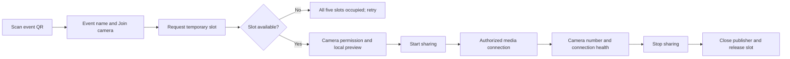
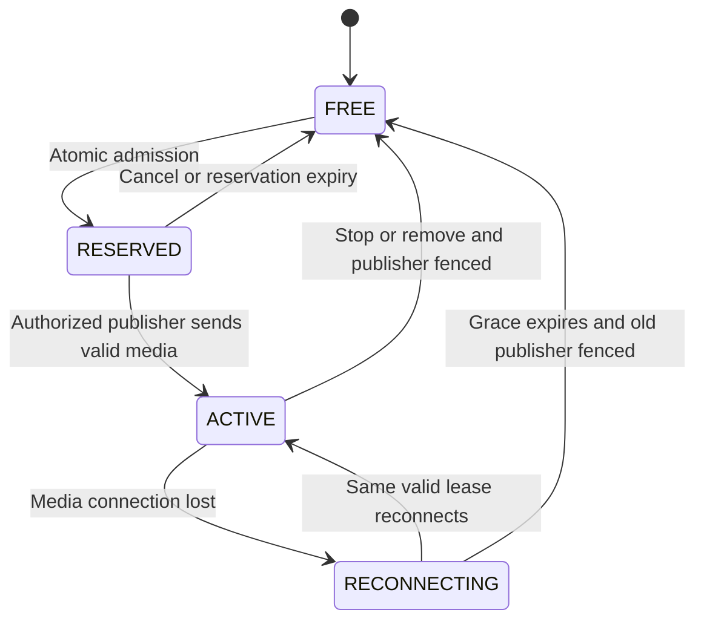

# QR joining and the five-camera limit

**Updated:** 2026-10-09

One event QR opens an HTTPS join page. Each person previews their camera and selects “Start sharing.” The server allows at most five occupied camera slots. Active publishers and temporary reservations both count. Five is a confirmed maximum. The event can run with fewer cameras.

## Phone and operator experience

The phone requests a temporary slot before camera permission. Media sharing starts only after the person selects “Start sharing.”

Use short phone labels such as “Join cameras for [event]” and “Use rear camera.” Add “Rotate for landscape”, “Start sharing”, “Connected as Camera 3”, and “Stop sharing.” State clearly that the feed may appear in the event broadcast.

Joining does not put the source on air. Show an on-air indicator only from actual program state.

Browser camera access requires a secure context, normally HTTPS, and user permission. A person may leave the permission prompt unanswered. Set an admission timeout so the reservation can expire. Scanning the QR cannot silently start a camera. [MDN getUserMedia](https://developer.mozilla.org/en-US/docs/Web/API/MediaDevices/getUserMedia).

The operator sees up to five camera tiles. Each tile shows the camera label, live/connecting/offline state, last-media age, resolution, measured delay, synchronization eligibility, and a remove control. Select one wide camera as the default and one audio source.

Replacing the QR join code and stopping the event revoke future joining. Historical recordings stay available under the retention policy.

## Slot ownership is a server transaction

Use fixed slot numbers 1–5 per event in the coordinator's transactional store. A lease grants temporary ownership of a slot. Each slot holds a `lease_id`, `source_id`, lease generation, reservation expiry, publisher identity, media heartbeat, and optional reconnect deadline.

Allocate each lease in a transaction with a uniqueness constraint. Checking `if count < 5` before an unprotected insert allows two requests to take the same last slot.

The state diagram shows slot ownership. RESERVED, ACTIVE, and RECONNECTING all occupy capacity. Revoke the old publisher before returning its slot to FREE.

Proposed defaults are a 60-second reservation and a 20-second reconnect grace period. Report occupied slots and streaming cameras separately. A publisher is healthy only when the gateway observes fresh media. A browser heartbeat alone does not prove media health.

Fence the old publisher before slot reuse: revoke its credential and close its session before assigning the slot to someone else. Each new publishing generation invalidates older generations. Late heartbeats or media from an old owner must not restore a released lease.

Reconnecting within the grace period keeps the lease. It starts a new source epoch if timestamps or tracks reset. An epoch identifies a continuous source timeline. Every endpoint verifies event, lease, generation, expiry, and active event state.

## QR and publishing credentials

The QR contains the event join URL and an expiring join code that can be revoked. The code permits an admission request. It does not grant operator control, model API access, or unrestricted media publishing.

Exchange the join code for a short-lived session limited to one source path. The media gateway must validate the lease before allowing publication. A limit enforced only by the join page can be bypassed.

Key join requests to the phone's session and request. Retrying the same request must return the same result without consuming another slot. This is idempotent admission.

Up to five participants can reuse the shared QR. Multiple simultaneous publishers cannot reuse one admission request. Remove join and publish secrets from logs. Closing the event revokes leases and rejects further media.

Generate the QR from the actual reachable event URL during setup. Test it on a phone before use.

## Live transport

Use the browser camera through a WebRTC publisher adapter, such as a MediaMTX-compatible publish flow. MediaMTX documents browser publishing. [Browser publishing](https://mediamtx.org/docs/publish/web-browsers).

At the venue, test both HTTPS signaling and the media connection from the phone. An HTTP tunnel alone does not prove that WebRTC media can pass the firewall. Configure reachable addresses. Use a TURN relay, which relays media when a direct connection fails, where needed.

Browser codecs differ. Normalize accepted media into the recording and output formats. [MediaMTX WebRTC](https://mediamtx.org/docs/features/webrtc-specific-features).

Start with the rear camera and 720p30. Allow fallback settings if the phone cannot support them. Keep the join page visible. Test phone lock, browser backgrounding, rotation, permission denial, and camera switching on actual phones. Request microphone permission only for the designated audio source or an explicit synchronization workflow.

## Synchronization and five-feed capacity

At setup, capture a common visible flash or clap across participating views. Estimate each source's event-time offset. Refine the mapping with reliable transport timestamps when available. Record uncertainty and recheck clock drift during longer runs.

Join-page timestamps and packet arrival times do not give precise capture times. If feeds lack a common reference and a reliable mapping, do not label them synchronized.

Keep a short delayed playback buffer for each source. Cut among frames mapped to the same event time. Exclude a feed if its uncertainty exceeds the configured threshold or its requested time is unavailable. Use the primary source when alternate angles are ineligible. Check a source's mapping again after reconnection. [Context and contracts](05-context-and-contracts.md) defines the mapping and revision rules.

Example calculation: five feeds at **2.5 Mbit/s video each** total **12.5 Mbit/s** before audio and network overhead. A 120-second compressed buffer needs about **187.5 MB** in total. One hour needs about **5.6 GB**. These values are estimates, not a benchmark.

Allow extra capacity for decoded frames, temporary render files, output recording, and copies made for analysis. Retaining all five cameras for hours requires sufficient VAST upload throughput and an explicit retention budget.

Decode only where needed. Use low-resolution previews and limit YOLO sampling per source. Schedule Cosmos windows from measured capacity. Analyze the primary feed first, then promising alternate angles and periodic coverage.

Show analysis freshness for every source. If sampling is reduced, do not imply that all five feeds receive continuous analysis. Under load, reduce background analysis before reducing capture or output continuity.

The acceptance scenarios in [the build plan](07-build-and-demo.md) include last-slot races, direct unauthorized publishing, expired reservations, disconnected owners, and sustained five-feed operation.
