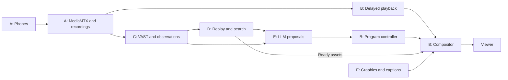

# Stack review and work split

**Updated:** 2026-10-09

This is the historical preparation plan. Use [parallel plan 23](23-parallel-implementation-plan.md)
for current assignments and [PRD 22](22-live-stack-integration-prd.md) for the
workshop integration. The current compositor is persistent FFmpeg.

Reviewed on **2026-10-06**. Keep the supplied stack. Use MediaMTX for camera transport and recording, Python for one coordinator, OBS as the first compositor candidate, and FFmpeg for replay rendering. Build and test the media path before the hackathon. Leave venue checks and actual provider integration for the supplied environment where access is required.

This is a proposed work split, not a record of completed implementation. [Context and contracts](05-context-and-contracts.md) remains the authority for shared records. [The build plan](07-build-and-demo.md) remains the authority for acceptance tests. Packages below are work boundaries, not separate services or autonomous agents.

The subsequent [browser media experiment](12-studio.md) uses the documented persistent FFmpeg alternative. The user clarified that the product must be hostable and use browser controls. The experiment therefore selects a headless media process. [Validation](11-media-experiment-validation.md) records the measured results and remaining gates.

## Experiment findings

The original review used `scripts/run-mediamtx.sh`, which is not part of this
checkout. The current launcher is [scripts/studio](../scripts/studio). The
[sample MP4](../tests/fixtures/demo.mp4) and [Nix development shell](../shell.nix)
remain available. The findings below retain their original experiment scope.

| Finding | Required next step |
|---|---|
| `MTX_WEBRTCADDITIONALHOSTS=192.168.x.x` is a placeholder | Supply the gateway address that phones can reach. Verify signaling and actual media on a phone. |
| The image is `bluenviron/mediamtx:1` | Pin the exact tested version or image digest. Use its configuration reference. |
| No configuration file, recording setting, or volume mount is supplied | Enable recording with persistent local storage. Verify finalized segments before upload. |
| No admission or publisher authorization is configured | Add the coordinator's atomic leases and gateway authorization. Reject direct unauthorized publishing. |
| No phone HTTPS setup is supplied | Provide a trusted HTTPS join and publish flow. A remote HTTP page does not establish phone camera access. |
| Several transport ports are mapped | Keep only the protocols used in the selected path. WebRTC signaling and media use separate connections. |
| The Nix shell declares only FFmpeg and imports the local `nixpkgs` channel | Record tested dependencies and pin the development environment before rehearsal. Document Docker and OBS setup. |

The review confirmed the sample's MP4 file header. It did not decode the sample. Docker, MediaMTX, and FFmpeg commands were unavailable in the review shell; the Nix shell was not activated. No camera run, output recording, latency result, or provider request was produced. Prior manual experiment results are unknown.

## Stack choices

| Part | Proposed choice | Work saved and remaining boundary |
|---|---|---|
| Camera input and stream delivery | MediaMTX | Reuse browser publishing, protocol routing, and recording. Application code still owns admission, source epochs, timing, and program selection. |
| Program video and audio | OBS, behind one controller adapter | Reuse scenes, overlays, and media sources. Prove delayed source playback, replay preload, and return-to-live before committing to it. |
| Replay rendering and media checks | FFmpeg and ffprobe | Compile validated plans into fixed edit operations. Keep replay jobs separate from continuous program playback. |
| Application and control state | One Python coordinator with SQLite | Keep leases, controller state, job keys, and outgoing notifications in transactions. Separate slow work from control requests. |
| Phone, operator, and viewer pages | Small browser pages served by the application | Reuse the MediaMTX publisher helper. Add the event QR, permissions, previews, and controls. A large UI framework is not required by the current scope. |
| Durable media and background triggers | Supplied VAST | Upload bytes first and publish the manifest last. Verify the actual tenant and runtime before deployment. |
| Video observations | Supplied YOLO and Cosmos | Keep adapters small. Preserve per-source tracker state and evidence times. Use organizer-returned model IDs. |
| Director, segmentor, and commentary | Supplied W&B-hosted LLMs on CoreWeave | Run these roles as bounded tasks in the coordinator. Validate typed proposals. Only the controller changes program state. |
| Semantic recall | Supplied search first | Preserve event, source, interval, evidence, and index revision. Build the documented VAST vector fallback only if the supplied search requires it. |
| Graphics | Existing SVG templates and deterministic field binding | Prepare assets at setup. Bind confirmed facts at runtime. Use captions first; speech remains optional. |

Do not add a separate message broker, vector database, agent framework, or model-serving cluster without a demonstrated need. VAST already supplies background orchestration. SQLite covers the proposed single-machine control state. This arrangement does not provide controller failover across machines.

## Reuse limits that affect the build

MediaMTX provides a browser publish page and a standalone JavaScript publisher helper. Reuse those after checking the tested release. The custom page still needs Breadcast's lease and event flow. [Browser publishing](https://mediamtx.org/docs/publish/web-browsers).

MediaMTX documents external HTTP authorization. Use the coordinator to check the current lease, source path, generation, and expiry at publication. Closing an existing publisher remains a separate operation that must complete before slot reuse. [Authentication](https://mediamtx.org/docs/features/authentication), [camera ownership](09-camera-joining.md).

MediaMTX recording defaults are unsuitable for prompt analysis: recording is off, and the documented default segment minimum is one hour. Set a short segment target and measure the actual closure times. A recording part is not the finalized segment. Use completed segments for immutable manifests. [Configuration reference](https://mediamtx.org/docs/references/configuration-file), [recording](https://mediamtx.org/docs/features/record).

Use the completed-segment hook as a notification, with a recovery scan for missed notifications. The application must resolve source times, hash bytes, and publish a valid `ChunkManifest`. Configure cleanup so it cannot remove media pinned for a replay or waiting for durable upload. [Hooks](https://mediamtx.org/docs/features/hooks), [retention contract](05-context-and-contracts.md).

MediaMTX routes encoded streams. Format changes need FFmpeg or GStreamer. Test the actual phone codec through recording, OBS input, and model preprocessing. Avoid unconditional re-encoding of all five sources. [Re-encoding](https://mediamtx.org/docs/features/remuxing-reencoding-compression).

OBS can read MediaMTX through an RTSP media source and supports external scene/source control through its built-in WebSocket interface. These features make it the first candidate. They do not prove Breadcast's timing contract. [OBS input](https://mediamtx.org/docs/read/obs-studio), [OBS control](https://obsproject.com/kb/remote-control-guide).

**Delayed playback is the main unresolved media risk.** Prove that the controller can select a retained source interval, play a replay, and return to the current delayed live position while capture continues. Adding delay only after composition does not give the director access to earlier source frames. If OBS cannot satisfy this with a small adapter, choose a persistent GStreamer media process at the first playback milestone. Do not maintain both compositors during the hackathon.

Provider docs support the proposed roles: VAST offers Python functions and object triggers, YOLO tracking needs stream state, Cosmos has video reasoning models, and CoreWeave documents hosted inference. Public docs do not establish the provided endpoints, quotas, or permission to deploy custom render workers. [VAST overview](https://kb.vastdata.com/documentation/docs/overview-of-vast-dataengine-1), [VAST triggers](https://kb.vastdata.com/documentation/docs/creating-a-trigger), [YOLO tracking](https://docs.ultralytics.com/modes/track), [Cosmos](https://docs.nvidia.com/cosmos/latest/reason2/index.html), [CoreWeave API](https://docs.coreweave.com/products/inference/serverless/api-reference).

## GitHub projects for camera and streaming reuse

**Recommendation:** keep MediaMTX plus OBS as the first media base. Evaluate VDO.Ninja's phone capture interface before building a custom capture UI. This combination can supply much of the generic media work. No reviewed project establishes all Breadcast requirements without application code. This is a fit assessment from docs and selected source files; none of the candidates was run here.

| Project | What it supplies | Fit for Breadcast |
|---|---|---|
| [VDO.Ninja](https://github.com/steveseguin/vdo.ninja) | Phone browser capture, remote feeds, director room, and OBS integration; AGPL-3.0 | Best capture UI candidate. Its documented WHIP support can publish to MediaMTX. Verify the selected release and lease-token flow. |
| [OBS Studio](https://github.com/obsproject/obs-studio) | Scenes, video/audio composition, overlays, recording, and streaming; GPL-2.0-or-later | Best studio candidate with MediaMTX. Keep remote control behind the program controller. Delayed source playback still needs proof. |
| [Muxshed](https://github.com/muxshed/shed) | Browser studio, guest links, WHIP input, scenes, overlays, recording, watch page, and control API; AGPL-3.0 | Closest single-application candidate. Source inspection found compositor restarts during scene activation. It needs a continuity test before adoption. |
| [LiveKit](https://github.com/livekit/livekit) and [Egress](https://github.com/livekit/egress) | Browser media rooms, individual-track export, composed output, HLS/RTMP, and S3-compatible upload; Apache-2.0 | Strong server-first alternative. Self-hosted export adds an Egress service and Redis. Admission and broadcast UI still need application work. |
| [StreamKit](https://github.com/streamer45/streamkit) | Persistent media pipelines, composition, overlays, and control API; MPL-2.0 | Possible future compositor. Its README calls it early-stage and Linux x86_64 only. Avoid making it a hackathon dependency now. |
| [Owncast](https://github.com/owncast/owncast) | Self-hosted stream viewing and chat; MIT | Viewer delivery option. It does not replace the phone capture and program composition packages. MediaMTX already covers the proposed viewer transport. |

VDO.Ninja's repository supplies the frontend; a fully independent room deployment also needs signaling and optional relay services. Hosting the frontend alone retains public connection services by default. Its WHIP path is a separate reuse option. Do not assume ordinary director-room controls also enforce MediaMTX admission. [Repository hosting notes](https://github.com/steveseguin/vdo.ninja#hosting-and-local-development), [WHIP tooling](https://docs.vdo.ninja/steves-helper-apps/whip-and-whep-tooling).

VDO.Ninja also has a browser Mixer with scene layouts, assets, and remote control. The docs distinguish production, beta, and alpha versions. Treat it as a browser-only compositor candidate after checking the selected version's output and control path. [Mixer docs](https://docs.vdo.ninja/steves-helper-apps/mixer-app).

Muxshed source was inspected at commit `4a8a80c89eb49050407479df2b9db37dd4a6a3b6`. Scene activation stops running compositors and starts an FFmpeg compositor. This is a specific continuity risk, not a measured playback failure. It conflicts with the planned persistent compositor approach until a prototype proves continuity or the adapter changes. [Scene activation source](https://github.com/muxshed/shed/blob/4a8a80c89eb49050407479df2b9db37dd4a6a3b6/crates/api/src/routes/scenes.rs#L230), [compositor source](https://github.com/muxshed/shed/blob/4a8a80c89eb49050407479df2b9db37dd4a6a3b6/crates/api/src/scene_compositor.rs#L89).

LiveKit Egress can upload to an S3-compatible endpoint. That makes VAST storage a candidate, not a verified integration. Its self-hosted configuration also requires the LiveKit server address and Redis. The supplied meeting example is a conferencing UI, not a complete broadcast director. [Egress repository](https://github.com/livekit/egress), [meeting example](https://github.com/livekit-examples/meet).

The code Breadcast still owns is atomic five-camera admission, source epochs and time mapping, retained delayed playback, evidence manifests, validated replay plans, and the single program controller. Reuse does not remove these contracts.

Before choosing an additional project, test one phone through its candidate capture flow into MediaMTX, record finalized media, and play it in OBS. Then test an authorized reconnect and an unauthorized publisher. Compare that setup with MediaMTX's own publisher helper. Keep the option with fewer working dependencies. Run the full replay/return-to-live check before selecting the compositor.

## Five work packages

These are the original preparation packages. Use the [three remaining integration tasks](07-build-and-demo.md#three-remaining-integration-tasks) for the next PRDs and implementation. That plan separates local readiness from live provider verification.

The earlier captions-first and deferred-voice recommendations below are historical. The user now requires witty spoken commentary; the current build plan and commentator instructions govern that scope.

Assign one accountable owner to each package. One person can own several packages. Keep shared records in the existing contract document; do not create a second set of message definitions.

| Package | Build before the hackathon | Shared inputs and outputs | Completion gate |
|---|---|---|---|
| A. Camera capture | Pinned MediaMTX setup; trusted HTTPS; QR join; atomic five-slot admission; publisher authorization; reconnect handling; recordings | Camera leases, source epochs, `ChunkManifest`, source health | One phone plays for five minutes. Then five phones work, a concurrent sixth is rejected, and a released slot is reused safely. |
| B. Program playback | Controller and compositor adapter; delayed live path; designated audio; holding fallback; replay preload; actual playback records | `ProgramProposal`, ready assets, controller revision, media acknowledgements | Live → replay → current delayed live works without an unexpected black frame. Return-to-live and source loss pass the build-plan checks. |
| C. Evidence and providers | Runtime schemas; upload/result adapters; bounded jobs; duplicate handling; labeled fixture mode; access diagnostic commands | `ChunkManifest` → `Observation` → `SceneEvent` | One real stored camera chunk triggers source-linked YOLO/Cosmos results. Redelivery creates no duplicate side effect. |
| D. Replay and recall | Plan validation; source pinning; FFmpeg edits; decode/duration checks; search adapter boundary and fixture cases | `ReplayPlan` → `ReplayAsset`; query → `SearchHit` | A real action spanning chunks produces a valid replay. A query returns retained playable media with its evidence. |
| E. Show setup and decisions | Event editor; graphics binding and preload; operator status/control page; bounded LLM roles; captions | `EventContext`, `GraphicsPackage`, `ProgramProposal`, `CommentaryCue` | Validated graphics contain no sample facts. A real LLM proposal airs once through the controller. Late or invalid output leaves playback running. |

Fixture runs prepare contracts and failure handling. They do not complete the real-provider gates. Before access is verified, prepare adapter boundaries rather than code tied to guessed provider APIs.

The media path keeps running while provider work produces proposals. Only the controller sends program changes to the compositor.

## Preparation order

1. **Freeze the shared records.** Implement runtime schemas from the contract document. Keep endpoints, model IDs, formats, and limits configurable. Give each package a small valid fixture and a failure case.
2. **Prove A and B first.** One real phone must reach a viewer through the intended program path. Resolve codec, HTTPS, buffer, and compositor questions here. Then complete five-camera admission and playback.
3. **Prepare the remaining packages.** C can use stored finalized media, D can render a validated fixture plan, and E can prepare graphics and validate fixture proposals. Use labeled fixtures where provider access is missing.
4. **Verify available provider access early.** Record actual requests, returned model IDs, versions, trace IDs, limits, and latency. Connect C, D, and E using those contracts. If access arrives only at the hackathon, this is the remaining integration work.
5. **Rehearse the combined flow.** Complete the acceptance scenarios and sustained five-feed run in the build plan. Keep measured results and failures in one evidence record.

At the hackathon, the intended remaining work is venue network calibration, supplied credentials and provider checks, event facts, sampling limits based on measurements, and the final rehearsal. Core playback, admission, contracts, graphics, and replay rendering should already be prepared. Hackathon rules for advance work still need to be checked; this review does not establish them.

Use one angle per replay, fixed speed presets, static crop, captions, and operator-entered official facts for the first build. Defer voice, moving crops, advanced multi-angle editing, custom model deployment, and elaborate graphics. Five-camera joining, playback validation, the supplied providers, and semantic recall remain in scope.
