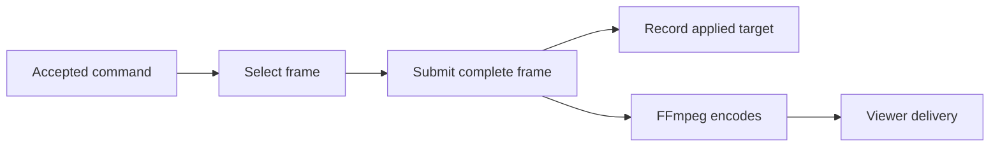

# Media experiment validation

**Updated:** 2026-10-09

The [browser studio experiment](12-studio.md) now runs in one Docker container. Starting the image starts the studio. Stopping the container stops its media processes and sample publishers. Nix is no longer required for this experiment.

## Shared workspace and crew authority

Historical update. Broadcast, Studio, and Join now share navigation and video geometry. Crew proposals are enabled by default. Human controls pause them; reviewed release requires fresh proposals. The [workspace cleanup evidence](evidence/workspace-cleanup.json) records unit, browser, five-camera, decoded-audio, and five-minute media checks. It also identifies the final authority refinements and their checks. Provider and physical-phone gates remain open.

## Modal and audience-page polish

Historical update. Feature dialogs replace the drawers. Broadcast and Join have audience styling, shared icon navigation, and reduced-motion support. The [modal and audience-page evidence](evidence/modal-polish.json) records focus, errors, drafts, camera sharing, all graphics, and real playback checks. The media/controller code remains unchanged; this refinement uses a two-minute media regression.

## Repository layout

The studio now lives in `app/`, with checks in `tests/`, launchers in `scripts/`, and container helpers in `docker/`. Build and run it from the root Dockerfile and Compose file. Local recordings and reports live in the ignored `.runtime/` folder. [The layout guide](14-repository-layout.md) maps earlier paths; dated evidence keeps its original paths and hashes. [The layout validation record](evidence/studio-layout.json) covers the new build and checks.

## Default graphics package

Historical addition. The studio now prepares 24 Breadcast designs at startup and composites animated layers into the encoded program. Operator controls select designs, edit text, clear layers, and update confirmed score values. Unknown scores stay unknown. Current scores hide during replay; full-screen cards mute camera audio.

The [graphics guide](13-graphics-package.md) is the authority for this package and its local controls. The [graphics evidence record](evidence/studio-graphics.json) contains contract, browser, audio, frame-timing, and media regression results. Its scope remains local sample media and Chrome playback. It does not establish physical-phone or remote-host performance.

## Breadcast identity

Historical update. The interface now uses a toast mascot wearing a broadcast headset, a matching wordmark/favicon, cream/olive/toast colors, and self-hosted Outfit and DM Sans fonts. The Broadcast, Operator, camera Join, and waiting screen use the same identity. Prototype labels and repeated provider disclaimers have been removed from product pages. The product button is now **End broadcast**; the replay button is **Prepare replay**.

[The brand evidence record](evidence/studio-brand.json) records logo/font checks, no experiment text on visible pages, QR decoding, desktop/mobile inspection, and browser camera/replay results. Detailed implementation limits remain in these project records.

## Broadcast and operator pages

Historical update. Broadcast at `/` shows program video and the camera QR. Operator at `/operator` contains operations without a QR. Top tabs switch the pages. Both open directly without viewer/operator keys or login. Camera admission and publisher credentials still enforce the five-camera limit.

[The open-page evidence record](evidence/studio-open-pages.json) covers the current image, direct access, QR decoding/rotation/retry, mobile layout, and browser playback. The [earlier UI record](evidence/studio-ui.json) records the superseded version that used temporary page keys. Those keys and login forms were removed at the user's request.

Error responses still close the HTTP connection, so rejected media request bodies cannot corrupt the next request. Earlier Docker and Nix records below retain their original image IDs and checked source hashes.

## Docker validation

The historical test completed using Linux ARM64 Docker Engine in a separate Colima VM on the Apple ARM Mac. The [Docker evidence record](evidence/docker-experiment.json) contains the image ID, exact versions, checked source hashes, media/browser reports, and lifecycle measurements.

- Built the image from fixed base-image digests, a dated Debian snapshot, and hashed Python wheels. The image runs as user 10001 without privileged mode.
- Ran seven admission tests and the real media check. One sample camera passed first, then five sources stayed active for a 60-second sustained phase. Admission enforcement, replay presets, audio, return-to-live, source-loss holding, and recorded-output decoding passed.
- Ran the browser check against the container's published ports. One fake camera reached the WebRTC viewer, then five streamed and decoded. A sixth was rejected. Replay/return and source release passed with no page errors.
- Ran the default image without a command override. Program frames advanced and health checks passed. `docker stop` with five active sample publishers exited with code 0, closed the HTTP endpoint, and left no container process running.
- Restart cleared leases, rotated operator access, and returned to holding. The old operator key was rejected. **End experiment** exited the container with code 0. `docker compose stop` also passed with five active `exec` publishers.

The first Linux run found a startup deadlock: FFmpeg probed raw audio while the producer blocked on a full video pipe. Both input formats are known. The encoder now limits probing explicitly. The health check also requires advancing frames, so a stalled process is not reported as healthy. The initial media and browser checks failed at startup; the corrected image passed both complete checks.

These Docker checks use samples and fake cameras. Physical phones, Linux AMD64 execution, remote HTTPS hosting, and provider integrations remain untested. Measured controller acknowledgement is frame submission to the encoder; it is not viewer latency. Run commands are in the [experiment README](12-studio.md).

## Original Nix validation

The earlier implementation was previously checked on the Apple ARM Mac. The [original evidence record](evidence/media-experiment.json) retains its versions, measurements, output paths, and source hashes. The Docker implementation replaces the experiment's Nix packaging; these older results are historical.

These results use the supplied MP4, generated test video/audio, and Chrome's fake camera devices. They prove software media flows. They do not prove physical-phone behavior or provider integration.

## Completed checks

| Check | Result |
|---|---|
| Nix command on `aarch64-darwin` | Built and ran the packaged command, including its self-check |
| Linux package and NixOS hosting module | Evaluated for `x86_64-linux`; enabled and disabled module cases passed; no remote deployment |
| Seven admission tests | Last-slot race, concurrent retries, expired reservation, reconnect epoch, safe reuse, failed fencing, and connected publisher without media passed |
| One sample camera first | Decoded media reached buffered program output before the five-source test |
| Five sample sources | All five captured and decoded; program stayed live during the final 60-second sustained phase |
| Publisher enforcement | Sixth join and direct unauthorized publishing rejected; old source path fenced before slot reuse |
| Controller validation | Fractional revisions, stale revisions, and unacknowledged cuts among uncalibrated sources rejected |
| Replay production | Normal, slow, and fast presets fully decoded with the expected frame count and duration; center crop rendered |
| Program playback | Replay, immediate return, automatic return, independent view changes, and source-loss holding worked without restarting the encoder |
| Audio | Designated live test tone reached output; replay output was silent |
| Recorded program | Saved output fully decoded; video timestamps advanced with no gap larger than one 15-fps frame plus millisecond rounding |
| Original source recording | A finalized camera MP4 segment fully decoded |
| Browser flow | Five fake camera publishers joined and decoded; a sixth was rejected; viewer video played; replay/return worked; Stop sharing released all slots; no page errors |

The final program recording contains 1,200 video frames over about 80 seconds. Return-to-live took **0.211 seconds from the control request to a completed frame submission to the encoder** in this run. This is one local result. It is not player latency or a p95 result. The evidence record contains the full measurements and three replay render timings.

The experiment records applied state after submitting a complete frame. Viewer delivery needs a separate check.

## Failures found and corrected

- **Wrong RTSP timeout option:** the initial decoder exited before producing frames. The worker now uses the option supported by the tested FFmpeg RTSP demuxer.
- **Arrival bursts:** treating receipt times as evenly spaced source frames caused false replay gaps. The buffer now retains normalized media timestamps. Video and audio share that media timeline. Capture synchronization remains unknown.
- **Unequal sample-track lengths:** the supplied MP4's audio lasts longer than its video. Direct looping introduced gaps. The fixture command now prepares fixed-rate video and adds an explicit test tone.
- **Buffer length versus playback readiness:** a decoded backlog can arrive before its playback position is eligible. The application now reports readiness separately and disables source selection until that position exists.
- **Accepted versus applied state:** program acknowledgement now follows a complete frame write to the encoder. It records the applied revision and actual target. Phone on-air state uses the actual source path, so slot reuse cannot show the old owner's state.
- **Media health:** a connection with zero received media stays reserved. Browser heartbeats do not keep a camera active.

## Remaining acceptance gates

1. Run one physical phone for five minutes and measure camera-to-player latency with a visible clock or clap.
2. Run five physical phones for at least 15 minutes on the venue network. Test permission denial, ignored permission, phone lock, rotation, backgrounding, reconnect, and heating.
3. Calibrate capture-time mappings and uncertainty before permitting synchronized multi-camera cuts. The experiment permits only explicitly independent view changes.
4. Verify private-object access, endpoints, versions, limits, real results, and latency for VAST, Cosmos, YOLO, semantic search, and W&B/CoreWeave.
5. Connect production message schemas, chunk manifests, evidence, official facts, graphics setup, model proposals, and actual playout acknowledgements. The experiment's replay reports and local clocks are not complete production contracts.
6. Test Linux AMD64 and trusted HTTPS/media connectivity on an actual remote host. Linux ARM64 container execution has passed the Docker checks above. SaaS accounts, tenant isolation, and persistent event management remain outside this experiment.

The [build plan](07-build-and-demo.md) retains the complete acceptance scenarios and performance targets. No target was promoted to a provider or real-world performance guarantee.
