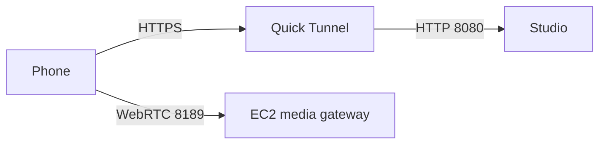
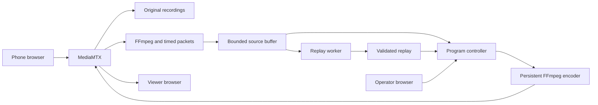

# Run the Breadcast studio

**Updated:** 2026-10-09

The studio runs a headless media server. Phones, the operator, and viewers use browser pages. One Docker image contains MediaMTX, FFmpeg, Python, PyAV, Pillow, and QR generation. Nix and a desktop compositor are not required.

The scope is one event with up to five cameras. The operator selects views and replays. VAST, Cosmos, YOLO, semantic search, and hosted LLMs remain unconnected. The studio prepares their media boundary; it does not replace them.

## Run locally

Run these commands from the repository root with Docker Engine, Docker Compose, and Buildx installed. Docker Desktop includes these tools. The current Mac uses the separate `breadcast-experiment` Colima profile; if its engine is stopped, run `colima start --profile breadcast-experiment` first.

Copy `.env.example` to `.env` if you do not have an event configuration yet.
Set `BREADCAST_PUBLIC_URL=http://localhost:8080` in that file, then run:

```sh
docker compose up --build
```

The container starts the studio automatically. Open <http://localhost:8080/> for Broadcast or <http://localhost:8080/operator> for Studio. The top tabs switch between them. No viewer key, operator key, or login is required.

- **Broadcast** shows the program video and camera QR. `/broadcast` and `/watch` open the same page.
- **Studio** keeps the program, camera strip, urgent controls, and crew panel in one workspace. Replays, Graphics, Audio, Event details, and command help open in modals. Join opens the current camera join page; Broadcast shows its QR.

The program starts with a holding slate and waits for cameras. Camera joining still uses its expiring QR join code and per-camera publishing credentials. The server enforces the five-camera limit. This is the open local hackathon studio; a hosted SaaS account system remains outside its scope.

In a second terminal, publish the supplied video inside the same container:

```sh
docker compose exec studio breadcast-studio sample --file /opt/breadcast/demo.mp4
```

The sample is labeled **SAMPLE CAMERA — TEST TONE**. It prepares fixed-rate video and adds a test tone. It does not use the MP4's original audio. To publish five generated camera fixtures in an empty event:

```sh
docker compose exec studio breadcast-studio sample --count 5
```

Active publishers and reservations both count toward the five-camera limit. Ctrl-C in the sample terminal stops the fixtures and releases their slots. Real browser cameras can join without running `sample`.

Stop the whole studio, including sample publishers started with `exec`:

```sh
docker compose stop
```

Ctrl-C in the attached `compose up` terminal also stops it. **End broadcast** in Event details opens a confirmation. Confirmation disconnects all cameras and viewers, then exits the server and container. There is no automatic restart. Compose allows 60 seconds for graceful cleanup. Stopping the container ends every process within it. [Docker stop behavior](https://docs.docker.com/reference/cli/docker/container/stop/).

Runtime files are private files in `/var/lib/breadcast-studio` inside the container. `docker compose stop` keeps those files; `docker compose down` removes the container and its files. Each server start creates a new camera join code, clears camera leases, and starts in holding with crew proposals enabled. It does not resume the previous event. The foundation owns recording retention. Its default is thirty minutes/4 GiB, with bounded pins and a disk reserve. To keep reports before removing the container:

```sh
mkdir -p -m 700 .runtime
docker cp breadcast-studio:/var/lib/breadcast-studio ./.runtime/docker-export
```

You can also build and run the image directly:

```sh
docker build -t breadcast-studio:latest -f Dockerfile .
docker run --name breadcast-studio --stop-timeout 60 \
  -p 127.0.0.1:8080:8080 -p 8189:8189/tcp -p 8189:8189/udp \
  -e BREADCAST_PUBLIC_URL=http://localhost:8080 \
  breadcast-studio:latest
# In another terminal:
docker stop breadcast-studio
```

Use either Compose or direct `docker run` for the named container. The [launcher](../scripts/studio) also wraps Compose: `scripts/studio serve`, `scripts/studio sample --file /opt/breadcast/demo.mp4`, `scripts/studio check`, and `scripts/studio stop`.

The browser controls provide:

- A camera QR on the Broadcast page and a revocable join code that expires after four hours.
- Camera permission, local preview, Start sharing, Stop sharing, and connection state.
- Five previews, occupied/streaming counts, removal, and one designated microphone.
- Buffered live playback and a holding slate when its source is unavailable.
- A replay of 2, 4, or 6 retained seconds at 0.5×, 1×, or 2×, with full frame or a center 1.5× crop.
- Validated replay playback, automatic return, and an immediate return-to-live control.

Wait until the source buffer is ready, then select **Use independent view**. Camera synchronization is unknown. This explicit view change does not claim that two cameras show the same instant. A seamless cut request without that acknowledgement is rejected. Select **Use microphone** on the camera whose live audio you want. The program mutes both live audio and source audio during replay.

## Breadcast identity

The interface uses a toast mascot with a broadcast headset, a cream/olive/toast palette, and bundled Outfit and DM Sans fonts. The vector [logo](../app/web/brand/breadcast-mark.svg) also serves as the favicon. A prepared [waiting screen](../app/web/brand/holding.svg) is rendered into [holding.png](../app/web/brand/holding.png) before startup. The program loads that image once.

The Broadcast page contains the player and camera invitation. The Studio page contains program controls, camera views, crew cards, and feature modals. The Join page uses the same identity. Product labels describe those jobs; validation scope stays in these project records.

Font licenses and fixed source hashes are in [web/fonts](../app/web/fonts/sources.json). [The design validation record](evidence/studio-brand.json) contains the checked assets, page screenshots, and browser results.

## Broadcasting graphics

The Operator page includes a prepared package of **24 animated designs**. It provides full-screen cards, name bars, banners, corner marks, scoreboards, and short transition treatments. Edit text, show or clear layers, and update confirmed scores. Blank values stay unknown. The [graphics guide](13-graphics-package.md) lists designs, audio/replay rules, clock behavior, API commands, and checks.

## Reproduce the checks

After building the image, check default startup, stopping with five active sample publishers, fresh camera admission on restart, and **End broadcast**:

```sh
python3 tests/media/docker-check.py
```

This host-side check creates an isolated container with a temporary HTTP port. It removes that container on completion. Its report goes to `.runtime/docker-lifecycle.json`.

The media check starts an isolated server, publishes labeled samples, exercises admission and replay controls, and decodes real output. It also runs seven admission tests. It stops its own processes when it finishes.

```sh
docker compose run --build --rm --no-deps studio check --file /opt/breadcast/demo.mp4
```

It prints the path to a JSON report. The same folder contains program/source recordings, replay reports, and logs. To export evidence, keep the check container until you copy it:

```sh
docker compose run --build --name breadcast-check --no-deps studio check \
  --file /opt/breadcast/demo.mp4 --one-camera-seconds 300 --sustained-seconds 900
mkdir -p -m 700 .runtime
docker cp breadcast-check:/var/lib/breadcast-studio/evidence ./.runtime/docker-evidence
docker rm breadcast-check
```

This remains a sample rehearsal. It does not test phone heating, lock, orientation, or venue Wi-Fi. [The validation record](11-media-experiment-validation.md) separates completed checks from remaining phone and provider tests.

The optional browser checks run on the host with Node.js and Chrome/Chromium. The UI check validates direct page access without keys, tab navigation, decoded QR payloads, QR rotation/retry, and desktop/mobile layouts. The media browser check then publishes fake camera devices and exercises replays. Start a fresh studio with no publishers, then run:

```sh
mkdir -p .runtime/docker-browser
docker cp breadcast-studio:/var/lib/breadcast-studio/access.json .runtime/docker-browser/access.json
chmod 600 .runtime/docker-browser/access.json
npm ci --prefix tests/browser
node tests/browser/ui-check.cjs .runtime/docker-browser
node tests/browser/browser-check.cjs .runtime/docker-browser
```

On macOS it uses `/Applications/Google Chrome.app/Contents/MacOS/Google Chrome`. On Linux it uses `/usr/bin/chromium`; set `CHROME_PATH` if needed. Playwright is fixed in `tests/browser/package-lock.json`. The check uses fake camera devices. It joins five browser cameras, rejects a sixth, plays a replay, checks viewer frames, and releases every lease. Reports and screenshots go into the copied-access folder. The access file contains the camera join code; keep it private.

## Join from a phone

`localhost` points to the phone itself when scanned there. Use a reachable HTTPS URL and a certificate the phone trusts. Signaling uses HTTPS; WebRTC media uses port 8189 over UDP or TCP. An HTTP tunnel alone does not establish media reachability.

## Host with Docker

Set one public browser origin. All QR codes and page links use it. Compose
requires this value and never supplies a hosted `localhost` default. Copy
[.env.example](../.env.example) to `.env` and fill `BREADCAST_PUBLIC_URL`, or set it
in the shell. HTTP origins are supported for a direct EC2 demo.

```sh
BREADCAST_PUBLIC_URL=http://YOUR_EC2_PUBLIC_IP:8080 docker compose up --build -d
```

The HTTP page and viewer can run over HTTP. Phone browsers require a secure
context to open their cameras. Use the tunnel recipe below for the phone demo.
[Browser camera requirement](https://developer.mozilla.org/en-US/docs/Web/API/MediaDevices/getUserMedia).

`BREADCAST_ICE_HOSTS` is the reachable media host. Leave it empty to use the host
from the public URL. When that URL is an HTTP tunnel, set this value to the EC2
public IP instead. ICE is the address negotiation used by WebRTC. It does not
send media through an HTTP tunnel. Open TCP and UDP on the configured WebRTC port
in the EC2 security group and host firewall. The host and container media port
must match. [MediaMTX connectivity](https://mediamtx.org/docs/features/webrtc-specific-features).

| Variable | Purpose | Default |
|---|---|---|
| `BREADCAST_PUBLIC_URL` | Browser origin and QR address | Required in Compose |
| `BREADCAST_ICE_HOSTS` | Comma-separated media IPs or DNS names | Host from public URL |
| `BREADCAST_HTTP_BIND` | Host interface for the HTTP port | `0.0.0.0` for direct access |
| `BREADCAST_HTTP_PORT` | Host HTTP port | `8080` |
| `BREADCAST_BIND` / `BREADCAST_PORT` | Container HTTP listener | `0.0.0.0` / `8080` |
| `BREADCAST_WEBRTC_PORT` | Matching host/container TCP and UDP media port | `8189` |
| `BREADCAST_DELAY` | Program delay in seconds | `3` |
| `BREADCAST_RESERVATION_SECONDS` / `BREADCAST_RECONNECT_SECONDS` | Camera admission time limits | `60` / `20` |
| `BREADCAST_FOUNDATION_CONFIG` | Mounted provider configuration file | Disabled |
| `BREADCAST_ICE_SERVERS` | Mounted STUN/TURN JSON file | Disabled |
| `BREADCAST_TLS_CERT` / `BREADCAST_TLS_KEY` | Mounted certificate/key for direct TLS | Disabled |

File paths refer to files inside the container; mount them read-only. The image
sets its runtime directory and font paths. Local CLI flags take priority over
matching environment values. Internal RTSP, media HTTP, control, and auth
addresses stay on container loopback. They are not public browser addresses.

For an existing host reverse proxy, set `BREADCAST_HTTP_BIND=127.0.0.1` and forward
all application paths, including `/media/`. Set the public origin to the proxy's
HTTPS address. Proxy headers cannot override the configured QR origin.

## EC2 phone demo without a server certificate

Install `cloudflared` on EC2 using the
[official download instructions](https://developers.cloudflare.com/tunnel/downloads/).
Start a Quick Tunnel in one terminal:

```sh
cloudflared tunnel --url http://localhost:8080
```

It prints a temporary HTTPS address. A Cloudflare account and a domain are not
required. Keep that process running.
[Quick Tunnel instructions](https://developers.cloudflare.com/tunnel/get-started/quick-tunnels/).

In `.env`, save that address and the EC2 public IP. These are the two required
values for the tunnel demo:

```sh
BREADCAST_PUBLIC_URL=https://YOUR-TUNNEL.trycloudflare.com
BREADCAST_ICE_HOSTS=YOUR_EC2_PUBLIC_IP
```

In another terminal, run `docker compose up --build -d`.
Open the HTTPS address, then scan its QR with one phone. Allow camera and
microphone access and select Start sharing. Confirm picture and audio before
adding the other phones. Allow TCP and UDP `8189` in the EC2 security group and
host firewall, or use the same configured WebRTC port at both ends. The tunnel
handles pages and camera setup; media connects directly to EC2.



No TLS certificate is needed on EC2 for this path. Restarting the tunnel changes
its URL; update `BREADCAST_PUBLIC_URL` and recreate the studio before the demo.
This guide is a deployment recipe. Physical-phone and venue verification remain
open until tested on the actual EC2 instance.

For direct TLS with a certificate and key you already control, mount them read-only and pass server arguments:

```sh
docker run --name breadcast-studio --stop-timeout 60 \
  -p 8443:8080 -p 8189:8189/tcp -p 8189:8189/udp \
  -v /absolute/path/to/certs:/certs:ro \
  breadcast-studio:latest serve \
  --public-url https://studio.example.com:8443 --ice-host studio.example.com \
  --tls-cert /certs/cert.pem --tls-key /certs/key.pem
```

The container runs as user 10001. Mounted private files must be readable by that user. The image does not change any trust store. If direct media cannot pass the network, mount a private STUN/TURN JSON file and supply `--ice-servers /path/in/container/ice.json`. Use actual relay settings in MediaMTX's `webrtcICEServers2` format; keep credentials out of Git. Test the phone connection before rehearsal.

The studio has event-scoped camera leases and open local control pages. SaaS accounts, tenant separation, persistent event management, and viewer access policy remain outside this single-event scope.

## Media and ownership

One controller selects program frames and audio. One FFmpeg encoder stays running through those selections. Model latency cannot block this path because there are no model calls in the media process.



- Output is 640×360 at 15 fps. The requested normalized-media delay is 3 seconds by default. Decode startup, network transport, and player buffering add latency. No end-to-end latency guarantee is established.
- Source video and PCM audio share normalized media timestamps. Each source maps these timestamps to the first decoded frame's local monotonic time. This preserves local playback order; it does not calibrate capture time or align cameras.
- JPEG buffers retain at most 120 seconds and 16 MiB per source, whichever limit comes first. Audio retention is 120 seconds per source. The interface shows actual available video duration.
- Replays pin immutable normalized frames for each ordered shot. Calibrated multi-camera cuts require evidence and valid source-to-event mappings. The worker checks coverage, speeds, crops, complete decoding, continuous timestamps, encoded cut images, duration, and format. The reports use the local `ReplayPlan` 1.1 contract; VAST `ReplayAsset` and original `ChunkManifest` integration remain unimplemented.
- Original camera and program recordings are local fragmented MP4 segments. They target a two-second minimum. Actual closure follows codec/keyframe behavior. Files older than five minutes are removed, including old camera paths. Replay jobs use their pinned normalized frames, not those files.
- There is one render job at a time and at most 20 replay jobs per server run. Restart starts in holding and invalidates old leases. It does not resume previous program state.
- Admission uses a SQLite transaction. Gateway authorization checks the lease and source path. Removing a camera removes its exact gateway path before freeing the slot. Failure to fence the publisher keeps the slot occupied.

The browser helpers are unchanged MediaMTX v1.20.1 files. Their MIT license and SHA-256 source record are in [web/vendor](../app/web/vendor/sources.json). The root [Dockerfile](../Dockerfile) fixes both base images by multi-platform digest and uses a dated Debian package snapshot. [requirements.lock](../requirements.lock) fixes Python versions and wheel hashes. The build context excludes runtime files and access keys. The image supports Linux ARM64 and AMD64 inputs; validation identifies the architecture actually tested. [Project contracts](05-context-and-contracts.md) remain authoritative for the future application.

## Multi-camera replay controls

Open **Replays**, then **Advanced · Multi-camera replay** in Studio. Load timestamped visual windows and submit shared-marker calibration and visual evidence records. Paste a plan, select **Review shots**, then select **Prepare reviewed replay**. Review the encoded preview before **Play replay**. Preparation does not start playback. Editing a plan requires a new review. Rejected cuts show a reason.

[The multi-camera guide](15-multi-camera-replays.md) gives exact records, limits, test commands, and current blockers. Existing one-camera controls still work without capture calibration. Their source-only plan has unknown event time and cannot permit a cross-camera cut.


## Crew controls and local rehearsal

The Crew panel uses compact message bubbles and action cards. Finished activity is folded under **Recent activity**. Replay attachments open on demand. The composer groups command shortcuts with Send; Enter sends, and Shift+Enter adds a line. [Crew UX evidence](evidence/crew-ux.json) records desktop, phone, keyboard, and playback checks.

Camera previews fill their tiles. The controls sit above each preview: green Send takes that camera live, the microphone button selects or mutes its audio, and red Trash removes the camera. Unmuting another microphone mutes the previous one in the program. The small Info button shows camera status and timing details on hover, focus, or tap. Escape closes the tooltip. Input recordings continue while program microphones are muted. [Camera control evidence](evidence/camera-controls.json) records the layout, tooltip, removal, and decoded audio checks.

The pages share compact navigation and icon controls. Broadcast has a large video on the left and a styled join QR card on the right. Its background has gentle orbit and glow motion. Join uses a compact sharing card with Preview, Share, and Live steps. It reveals a local preview only after camera permission succeeds. Reduced-motion preferences stop decorative animation. Studio keeps the conversation beside its player. The header contains no mode selector, connection banner, camera count, or duplicate camera invitation. The conversation has no title or empty introduction. Event controls live under the small **Event details** icon beside the composer.

The coordinator accepts validated crew proposals by default. There are no separate Auto, Assisted, or Manual modes. **Take control** pauses crew work and cancels pending airtime. Its label then becomes **Release control**. A direct camera, audio, replay, holding, or graphics action also takes control. A bad target keeps crew work paused and preserves the previous picture. Release requires a current control revision and fresh proposals; old work never revives. Preparation can finish after takeover without airing itself. Replay completion, graphic expiry, and source-loss holding remain controller rules.

[Workspace cleanup evidence](evidence/workspace-cleanup.json) records the current page, authority, and real-media checks.

[Modal and audience-page evidence](evidence/modal-polish.json) records the feature dialogs, camera flow, graphics, and playback checks.

The provider adapter is not implemented yet. The product has no connection toggle or banner. The local test remains explicit: open **Event details → Local rehearsal**, release control if needed, select an available camera in Replays, then select **Start local rehearsal**. The script selects a live camera, shows a neutral corner label, prepares four retained seconds at half speed, clears graphics, plays the validated file, and waits for return to live. Its cards retain the **Local rehearsal** source label. It does not recognize events. Opening a page or joining never starts this test.

The program frame follows the video aspect ratio and has no padded status row. Compact icon groups overlay its bottom edge. **Take control**, **Return live**, and **Clear graphics** remain visible there. Hover or focus an icon for its label and explanation. Unavailable controls explain the reason in their tooltip. Feature modals open from the middle group. The speaker icon enables listening in this browser only; it starts muted and does not change broadcast audio. The fullscreen icon expands the monitor. The feed shows live, replay, and holding state; screen readers also receive that state. The Audio modal selects the one designated microphone. [Program overlay evidence](evidence/program-overlay.json) records the layout and playback checks.

The crew composer accepts this exact local grammar. It does not understand arbitrary natural language:

| Command | Result |
|---|---|
| `/camera 2` or `/stay 2` | Take control, select Camera 2 as an independent view, and keep crew work paused |
| `/audio 2` | Take control and designate an available microphone |
| `/prepare 2 6 0.5` | Prepare only: Camera 2, last six retained seconds, half speed |
| `/play ASSET_ID` | Take control and play that specific ready, eligible file |
| `/graphic lower-classic Supplied name` | Take control and bind supplied text into an existing preset |
| `/clear`, `/live`, `/hold`, `/takeover` | Use the same server action as the corresponding control |

A name requires supplied text. Goal identification is unavailable. Official scores use **Event details → Keep score**, with explicit human confirmation. Preview never confirms facts or changes airtime. Event details also contains crew shot duration, replay cooldown, replay enablement, advanced diagnostics, holding, and End broadcast. Defaults are five seconds, thirty seconds, and enabled. The crew replay maximum is twelve seconds. These are policy settings, not measured performance.

Replays retains the normal duration, speed, and crop controls. Advanced contains the existing multi-camera plan, calibration, and evidence controls. Modal switching keeps drafts and the program connection. The header uses icon tabs and one close control. Escape or a backdrop click closes the modal and returns focus. Quick program controls remain inside each modal. Action errors appear in the active modal, including the separate End broadcast confirmation. Ready cards recheck availability. Cancellation targets one job ID. Crew cards and modals refer to the same server action, job, and asset records.

The shared local API is:

- `GET /api/status`: actual program, sources, assets, and coordinator state.
- `POST /api/actions`: `{id, op, args, expected}`. Every request requires the full current `expected` record described in [contracts](05-context-and-contracts.md#local-studio-actions-and-authority).
- Operations: `live`, `audio`, `replay`, `holding`, `graphics`, `prepare`, `cancel`, `takeover`, `resume`, `policy`, `rehearsal`.
- `GET /api/actions/ID`: one current server result.
- `POST /api/chat`: `{id, text, run_id}` with the exact grammar above.
- `takeover` and `resume` take empty arguments. `cancel` arguments: `{job_id}`.
- Legacy `/api/program`, `/api/replays`, and `/api/replay-cancel` use this coordinator and require the same full `expected` record. `/api/program` still requires the current integer `revision` and only accepts media operations. Cancel requires `job_id`.
- Ending the event requires `POST /api/event/end` with `{confirm: "End broadcast", run_id}`.

Keep the same action ID and request after a lost response. A retry returns the server result. Changed content with the same ID fails. Browser reload restores current control authority and work. Browser storage retains an unacknowledged request for an exact retry. Server restart begins a new run in holding with crew proposals enabled; old work is not restored. Pending browser requests from the prior run are rejected.

The next integrator must use `Coordinator.propose(request, actor="Provider crew")` from a trusted application adapter. Pin run, control, program, context, evidence, and source ownership when constructing the model request; preserve that reviewed snapshot when translating the result. Do not capture fresh `Coordinator.expected(args)` values after inference to admit stale intent. Follow the [decision snapshot rules](05-context-and-contracts.md#decision-snapshots-planned-integration). Validate provider intent against the existing `ProgramProposal`, `ReplayPlan`, and graphics contracts. Rendering and provider calls must stay outside playback. No new controller is needed.

## Reproduce crew validation

Run these checks in isolated instances. They change the program and use labeled test input:

```sh
docker build -t breadcast-studio:crew-validation .
docker run --rm --entrypoint python3 -v "$PWD:/work" -w /work \
  -e PYTHONPATH=/work/app breadcast-studio:crew-validation \
  -m unittest discover -s tests/unit

docker run --rm --name breadcast-crew-validation --entrypoint python3 \
  -p 127.0.0.1:22080:22080 -p 10189:10189/tcp -p 10189:10189/udp \
  -v "$PWD:/work" -w /work -e PYTHONPATH=/work/app:/work/tests/media \
  breadcast-studio:crew-validation tests/media/studio_check.py \
  --browser --output .runtime/autonomous-studio/final
# When BROWSER_READY appears, in another terminal:
node tests/browser/studio-check.cjs .runtime/autonomous-studio/final
```

The default media check records at least five minutes. The browser checks desktop/phone layout, drafts, player continuity, keyboard focus, two tabs, QR decoding, and separate controller/viewer return timing. Retain the original admission, graphics, replay, browser-camera, and lifecycle checks.

[The authoritative phase evidence](evidence/autonomous-studio.json) links reports, screenshots, actual media, action traces, failures, and remaining physical-phone/provider work. This local rehearsal does not establish provider-backed autonomous direction or venue readiness.

## Task 3 retained replay handoff

[Timely replays and moment search](21-timely-replays.md) now describes canonical
1.2 plans, native retained-file decoding, archive playback tickets, search,
automatic preparation, and fresh director scheduling. Run `./scripts/studio replay-check`.
Full local, live-provider, and physical-device acceptance remain separate open
gates in the [Task 3 evidence record](evidence/timely-replays.json).
