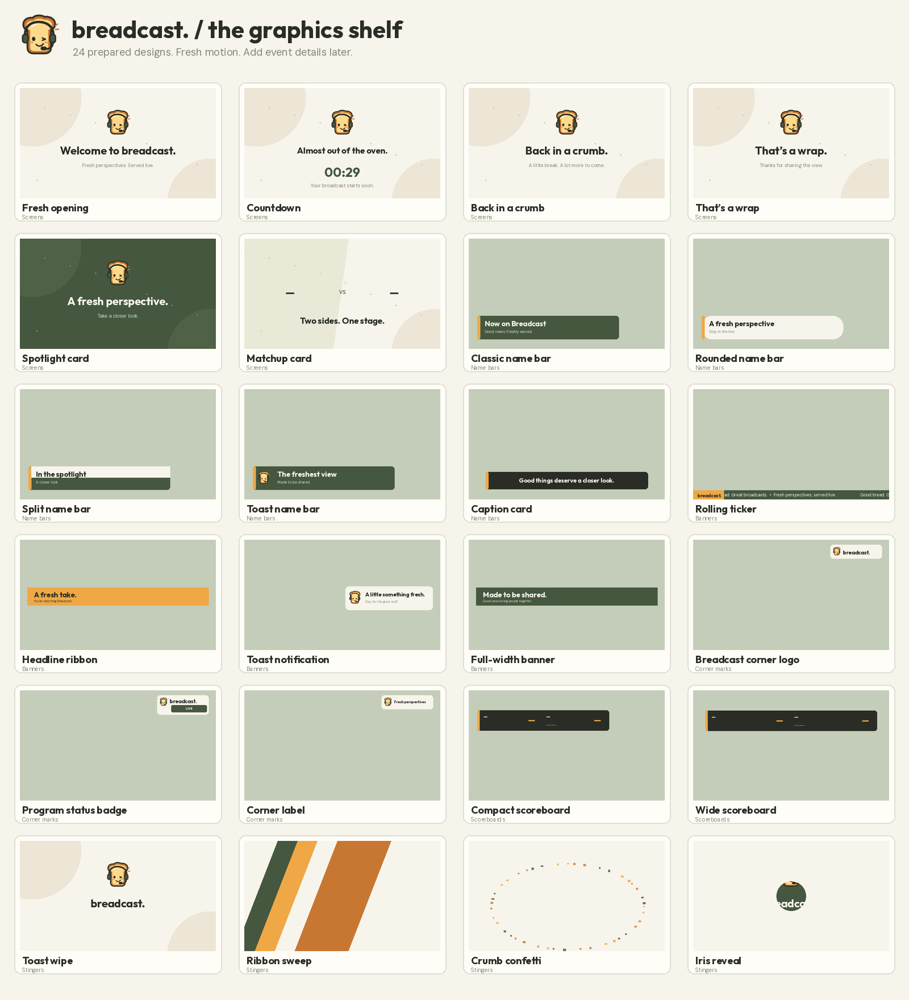
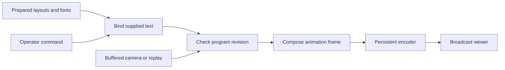

# Breadcast graphics package

**Updated:** 2026-10-09

The Docker studio includes **24 prepared designs**. They use the Breadcast mascot, cream, olive, charcoal, and toast orange. Event-specific branding can be added later.



| Category | Designs |
|---|---|
| Screens · 6 | Fresh opening, Countdown, Back in a crumb, That’s a wrap, Spotlight card, Matchup card |
| Name bars · 5 | Classic, Rounded, Split, Toast, Caption |
| Banners · 4 | Rolling ticker, Headline ribbon, Toast notification, Full-width banner |
| Corner marks · 3 | Breadcast logo, Program status badge, Corner label |
| Scoreboards · 2 | Compact, Wide |
| Stingers · 4 | Toast wipe, Ribbon sweep, Crumb confetti, Iris reveal |

A **stinger** is a short animated transition treatment. These stingers decorate the current picture for two seconds. They do not schedule a camera cut. Names, scores, and clocks are text bindings. They are not part of a generated image.

## Use the package

1. Open <http://localhost:8080/operator> and open **Graphics**.
2. Choose a category and a design. The preview shows its layout.
3. Edit the headline and second line. Set seconds on air; `0` stays until cleared. A countdown needs a positive duration. Stingers have a fixed two-second duration.
4. Select **Show graphic** or **Play transition**. The graphic appears in the encoded program, so every viewer gets it.
5. Use the named chip under **On the program** to clear one layer. **Clear graphics** clears all layers. It preserves saved score values.

One design can occupy each of seven layers: screen, score, name bar, ticker, banner, corner mark, and stinger. A cue replaces the design in its layer. Cards, banners, and corner marks enter with slides, fades, or split motion. Screens add moving particles and a floating mascot. The ticker scrolls. Score changes use a digit reveal and highlight. Clear commands fade graphics out.

Full-screen cards mute camera audio during entry, display, and exit. They hide other overlays except the corner mark and stinger. A countdown clears itself and reveals the current underlying program. Camera capture continues throughout. **Return to live** clears full-screen cards and stingers immediately. **Hold screen** also clears them and selects the waiting screen.

During a replay, the controller keeps its REPLAY marker visible. Current scores, name bars, tickers, and banners hide; the corner mark can stay. Live overlays return after the replay. Full-screen cards and stingers cannot be started during replay. Return to live or hold first.

## Keep score

Open **Event details → Keep score**. Enter team names, scores, and an optional period. Blank values stay unknown; a scoreboard displays `—` and an unknown clock displays `--:--`. Zero is used only when entered explicitly.

Select **I confirm these values are official**, then **Update score**. Preview values do not change the saved score or program. To display saved values, choose either scoreboard design and select **Show graphic**. Updates animate while that scoreboard is visible. Team-name changes also update an active matchup card.

The display clock counts upward from the supplied seconds while **Run display clock upward** is selected. Edit the clock fields and update to start, pause, or reset it. Score-only edits preserve a running clock. This is an operator-controlled display clock. It is not a calibrated match clock or a camera timestamp.

## Preparation and ownership

Startup loads local fonts and logo textures. It compiles neutral layouts and preview images before starting playback. The runtime `graphics-package.json` contains preset IDs, dimensions, binding names, resource hashes, and preview hashes. The package has no event-context revision yet. Its ready flag means the neutral package loaded; it does not declare a real event ready.

The controller binds text before accepting a cue. This work runs outside the media lock. Animation uses prepared textures and fonts. No model call, network fetch, browser renderer, or artwork generation occurs in the frame loop. The package supports the current 640×360, 15-fps program.

Only the program controller owns active cues, score values, and the display clock. Applied graphics are recorded after a complete frame is submitted to the persistent encoder. Score bindings describe the target values; the short digit animation can still contain the previous value. Viewer delivery is checked separately.



## Local API

The local API remains open, as requested for the hackathon. Camera publishing still needs its camera lease credentials. These commands are local prototype contracts; they do not implement the production `GraphicsPackage` or official-fact schemas.

- `GET /api/graphics/catalog`: prepared package manifest.
- `GET /api/graphics/thumbnail/{preset}`: prepared PNG preview.
- `POST /api/graphics/preview`: validate text bindings and return a PNG; no on-air change.
- `POST /api/program`: action `graphics`, current integer `revision`, the full current `expected` record, and a graphics operation.

Cue operation example for the `graphics` field:

```json
{"op":"cue","preset":"lower-classic","title":"A fresh perspective","subtitle":"Made to be shared","duration_s":8}
```

Read the current revision and `expected` fields from `/api/status` as specified in [studio action contracts](05-context-and-contracts.md#local-studio-actions-and-authority). Operations are `cue`, `clear` with a layer in `slot`, `clear-all`, and `score` with confirmed score fields. Omitting both clock fields from a score update preserves the clock. Supplying clock fields applies a new starting value and run state. Stale revisions and unknown fields are rejected. Countdown and stinger expiry advance the program revision. A render fault clears graphics and preserves the underlying video; it is recorded in status and logs.

## Reproduce validation

Build the image and run the contract checks:

```sh
docker compose build studio
docker run --rm --entrypoint python3 breadcast-studio:latest -m unittest discover -s tests/unit -v
```

For graphics media checks, use an isolated studio with five sample publishers. The checks change its program, team names, and scores. Do not run them during a show.

```sh
docker run -d --name breadcast-graphics-check \
  -p 127.0.0.1:8082:8082 -p 8289:8289/tcp -p 8289:8289/udp \
  -e BREADCAST_PORT=8082 -e BREADCAST_PUBLIC_URL=http://localhost:8082 \
  -e BREADCAST_ICE_HOSTS=127.0.0.1 \
  breadcast-studio:latest serve --port-offset 100
# Wait for /healthz to return advancing frames, then:
docker exec -d breadcast-graphics-check breadcast-studio sample --count 5 --seconds 600
docker exec breadcast-graphics-check python3 tests/media/graphics_check.py
mkdir -p .runtime/graphics-check
docker cp breadcast-graphics-check:/var/lib/breadcast-studio/access.json .runtime/graphics-check/access.json
chmod 600 .runtime/graphics-check/access.json
npm ci --prefix tests/browser
node tests/browser/graphics-check.cjs .runtime/graphics-check
# Save reports before cleanup:
docker cp breadcast-graphics-check:/var/lib/breadcast-studio/graphics-evidence .runtime/graphics-check/media
docker stop --timeout 60 breadcast-graphics-check
docker rm breadcast-graphics-check
```

The [evidence record](evidence/studio-graphics.json) stores measured results, source hashes, and limits. Physical phones, remote hosting, event-specific branding, and model-driven graphics cues remain separate acceptance work.
