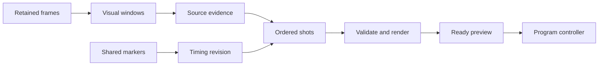

# Local multi-camera replays

**Updated:** 2026-10-09

The studio can prepare one replay with several camera views. It supports hard cuts, per-shot 0.5×/1×/2× speed, a full frame or static crop, and an explicit alternate-angle repeat. The Operator reviews the ordered shots and encoded preview before playback. Existing single-camera controls use the same worker.

This is a local implementation. AI provider access remains blocked. Fixture selection uses supplied observations about encoded synthetic views. It is not live AI reasoning. Physical-phone calibration remains unproved. The supplied VAST, Cosmos, YOLO, semantic-search, and W&B/CoreWeave stack remains the required integration path.

The worker prepares a checked file. Only the program controller starts playback.



## Prepare a replay

1. Keep at least one camera's live output running. Choose a lead-in, action, and aftermath interval from retained media. Source ranges are in `/api/status` under `retained_source_interval_ms`.
2. Open **Replays**, then **Advanced · Multi-camera replay** in Studio. The setup status counts buffered cameras, cameras with saved calibration for the current source, and active evidence records. Saved records alone do not prove valid replay coverage; **Review shots** checks each plan. Open **Calibration and evidence** and submit a **Visual window** record. The result contains up to 24 actual timestamped images over at most ten seconds. Inspect the action and shared visible markers. Use several bounded windows when needed; one thumbnail is insufficient.
3. Submit **Shared markers** for each source. Use at least three frames with the same visible clock or action markers across views. Supply event milliseconds and a measured marker uncertainty bound. The mapping is valid only between its endpoints. Arrival/decode times and equal frame counts are not calibration.
4. Submit **Visual evidence**. State only visible actions. Record subject visibility, view quality, and what that view adds. Weak or missing views cannot support a shot. Do not assign a name or official result from a visual match.
5. Paste a `ReplayPlan` 1.1 and select **Review shots**. Each shot shows camera, interval, speed, edit meaning, and reason. The server checks current evidence, mappings, coverage, and limits again when preparation starts.
6. Select **Prepare reviewed replay**. Inspect the encoded preview. Select **Play replay** only when you want playback. **Return to live** interrupts it. Normal completion returns automatically to the designated live camera and audio source.

Fixture selection is available only with `fixture: true`. It chooses from usable source-linked fixture observations, rejects weak views, and simplifies once to one camera if a second view adds no supported information or fails synchronization. It does not inspect video with a live model. Model adapters must consume the visual windows and return this same plan through `accept_segmentor_response`; timeout or malformed output causes abstention. This boundary never starts playback.

## Local API

All JSON requests use the existing Operator API. These routes do not add an access-control boundary to this open local studio.

| Route | Request / result |
|---|---|
| `GET /api/replay-context` | Current mapping revisions, evidence, limits, and provider blockers |
| `POST /api/replay-window` | `source_id`, `source_epoch`, `source_start_ms`, `source_end_ms`; returns actual frame images, PTS/time base, mapped event times, coverage, and evidence IDs |
| `POST /api/replay-calibrations` | `source_id`, `source_epoch`, `uncertainty_ms`, `markers: [{pts, event_ms, label}]`; returns an immutable mapping revision |
| `POST /api/replay-evidence` | Full versioned visual observation described below |
| `POST /api/replay-select` | Fixture-only scene request described below; returns a plan with selection/fallback reasons |
| `POST /api/replay-validate` | A `ReplayPlan`; returns resolved ordered shots, plan hash, and derived duration |
| `POST /api/replays` | `{plan: ReplayPlan, expected}` or `{slot, seconds, speed, zoom, expected}`; returns an asynchronous job ID |
| `POST /api/replay-cancel` | `{job_id, expected}`; cancels that running preparation and releases pins |
| `GET /api/replay-media/{id}` | Encoded ready MP4 for preview |
| `POST /api/program` | `{action: "replay", replay_id, revision, expected}`; only ready eligible assets can start playback |

Read the full current `expected` record from status as specified in [studio action contracts](05-context-and-contracts.md#local-studio-actions-and-authority). These mutations enter the shared coordinator. Preparation never grants permission to air an asset.

An evidence record has `evidence_id`, sequential `revision`, `event_id: "local-studio"`, `scene_id`, `scene_revision`, `source_id`, `source_epoch`, `mapping_revision`, `event_start_ms`, `event_end_ms`, `action`, `claim_kind: "observation"`, `subject_visible`, `quality`, `adds`, `origin`, `status`, and `expires_at`. Quality is `usable`, `obscured`, `blurred`, `motion`, or `missing`. Origin is `operator` or `fixture`. Status is `active` or `retracted`. Expiry is UTC Unix seconds, within the next hour. A new revision preserves source and scene ownership. Prior revisions remain as local artifacts.

Fixture selection accepts `{fixture: true, scene_id, scene_revision, event_start_ms, event_end_ms, repeat: false}`. Set `repeat: true` for an explicit second showing. See [the example plan](examples/replay-plan.example.json) and [the fixture helpers](../tests/media/replay_fixture.py) for complete records. Example IDs, markers, and expiry must be replaced by current records before use.

## Limits and timing

- One render job at a time; at most 20 jobs per run.
- `BREADCAST_REPLAY_MAX_SHOTS`: default 6, hard maximum 12.
- `BREADCAST_REPLAY_MAX_DURATION_MS`: default and hard maximum 12000.
- Each shot spans 0.2–6 event seconds. A normalized static crop must remain inside the oriented frame and preserve its aspect ratio. Minimum crop width/height is 0.2.
- `BREADCAST_REPLAY_TOLERANCE_MS`: default 150 ms. This is a target. It is not a measured phone accuracy claim. The bound includes both marker uncertainties/residuals and one frame interval per source.
- Calibration needs 3–16 retained markers over at least one second. Rate correction must be within 0.98–1.02. The worker does not extrapolate beyond the tested interval. There are at most 64 mapping revisions per source epoch, 256 evidence IDs, and 64 revisions per evidence ID.
- The normalized buffer stores finalized immutable packets. The original recorder can still have an open fragmented-MP4 chunk; that file is not eligible input to this worker. Missing packets or unfinished coverage reject the plan.
- Output frames use timestamps, not source frame numbers. Each cut occurs at the next output timestamp. The report records ideal and actual output boundaries. Decode and duration checks allow one output frame of rounding.

REPLAY and actual per-shot speed are encoded into the file. Repeated shots also show ALTERNATE ANGLE. The file has no audio track. The controller mutes live ambient audio during playback and restores the designated source on return. Current score/clock overlays remain hidden. Prepared replay narration uses the existing accepted-session speech path; live speech verification remains open.

## Validation and samples

[The authoritative machine-readable record](evidence/multi-camera-replay.json) contains measurements, sample paths, checks, and blockers. Actual encoded sources, replay files, source maps, and screenshots are in `.runtime/multi-camera-replay/`. These local artifacts are ignored by Git. The recorded paths locate the exact files from the validation run.

[The replay control visibility record](evidence/replay-controls.json) records the expanded controls, top-page link, setup counts, and a fresh encoded-media/browser regression. It also records the static-file update to the running studio. This update keeps the existing camera leases and encoder process. The controls still require manual JSON records and plans; a form-based shot editor and automatic provider-backed selection are not implemented.

Run focused unit checks and the encoded check in the studio image. Mount the repository so tests use current code. On macOS, the existing image provides the pinned FFmpeg and Python dependencies:

```sh
docker run --rm --entrypoint python3 -v "$PWD:/work" -w /work \
  -e PYTHONPATH=/work/app breadcast-studio:latest \
  -m unittest discover -s tests/unit

docker run --rm --entrypoint python3 -v "$PWD:/work" -w /work \
  -e PYTHONPATH=/work/app:/work/tests/media breadcast-studio:latest \
  tests/media/multi_camera_check.py
```

For the Operator browser check, add `--browser` to the encoded check and publish ports `127.0.0.1:21080:21080`, `9189:9189/udp`, and `9189:9189/tcp`. When it prints `BROWSER_READY`, run `node tests/browser/replay-check.cjs .runtime/multi-camera-replay` on the host. It uses the existing locked Playwright dependency. `CHROME_PATH` can select Chrome/Chromium. The test server closes after the browser signals completion or after 60 seconds. No broadcast is published.

The original media check remains required. It verifies actual gateway input, one/five-camera playback, sixth-camera rejection, audio, source loss, and existing replay presets. Physical-phone marker tests and real YOLO/Cosmos/LLM selection remain separate acceptance work. No provider requests were performed in this implementation. The evidence record gives the exact missing access for each service.

## Task 3 retained replay handoff

[Timely replays and moment search](21-timely-replays.md) now describes canonical
1.2 plans, native retained-file decoding, archive playback tickets, search,
automatic preparation, and fresh director scheduling. Run `./scripts/studio replay-check`.
Full local, live-provider, and physical-device acceptance remain separate open
gates in the [Task 3 evidence record](evidence/timely-replays.json).
