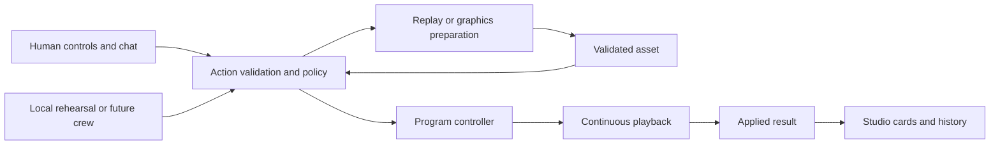

# Breadcast crew studio PRD

**Updated:** 2026-10-09

Build a video-first studio for autonomous broadcasting and optional human assistance. Keep the program visible while the human steers the crew, reviews a replay, or changes a graphic. Give humans and future AI roles the same validated media capabilities.

This phase implements the interface and local control system before AI infrastructure is connected. It must perform real media actions. It must not claim to understand video or natural language through a provider that is not connected.

Status: local implementation delivered. The 2026-10-06 UX revision removes modes and shared-page layout differences; see [phase evidence and handoff](evidence/autonomous-studio.json). [Workspace cleanup evidence](evidence/workspace-cleanup.json) records the current revision. [Modal and audience-page evidence](evidence/modal-polish.json) records the latest UI refinement. The requirements below remain the acceptance specification. Date: 2026-10-09. Audience: the AI or engineer implementing the next Breadcast phase. Measured results belong to the evidence record. Real provider-backed direction remains disconnected.

## Outcome and scope

The human can watch the program, leave the crew to run an explicitly enabled local rehearsal, or take control. Chat is optional. Buttons remain available for urgent actions. The server owns mode, policy, proposals, and execution results.

Complete these five outcomes:

1. Replace the long Operator page with a compact Studio workspace.
2. Expose existing media capabilities through one validated action interface.
3. Enable validated crew proposals by default, with reliable human takeover and release.
4. Add crew chat, action cards, and a short activity history tied to server results.
5. Prove this boundary with explicit local commands and a labeled scripted rehearsal using actual media.

Full autonomous editorial judgment remains a later provider integration. This phase must make that integration possible without rebuilding the studio or adding a second program controller.

## Read before implementation

Read [project instructions](../AGENTS.md), [README](../README.md), [architecture](02-architecture.md), [agent roles](04-agent-instructions.md), [context and contracts](05-context-and-contracts.md), and [build acceptance scenarios](07-build-and-demo.md). Then read the [studio guide](12-studio.md), [graphics guide](13-graphics-package.md), and [replay guide](15-multi-camera-replays.md).

Use the relevant project [stack integration](../skills/breadcast-stack-integration/SKILL.md), [replay production](../skills/breadcast-replay-production/SKILL.md), and [event setup](../skills/breadcast-event-setup/SKILL.md) workflows for the work they govern.

The contracts document remains authoritative for identity, clocks, evidence, versions, and ownership. Reuse its records. When implementation proves that a contract needs an addition, document that addition there and link to it. Do not create competing schemas in this PRD.

Inspect the working tree before editing. Existing replay and UI changes may be uncommitted. Preserve them.

## Current foundation

| Area | Existing implementation | Required change |
|---|---|---|
| Studio | [operator.html](../app/web/operator.html), [operator.js](../app/web/operator.js), [style.css](../app/web/style.css) | Replace the long page with the workspace below |
| Program | [media.py](../app/media.py), `Program.command` and playback loop | Preserve continuous encoding; add validated coordination around the controller |
| Server | [studio.py](../app/studio.py) | Route human and crew actions through shared validation and execution |
| Graphics | [graphics.py](../app/graphics.py), [graphics-ui.js](../app/web/graphics-ui.js) | Reuse prepared designs, previews, text binding, and layer controls |
| Replays | [replay.py](../app/replay.py) | Reuse plan validation, deterministic rendering, previews, and eligibility checks |
| Checks | [unit](../tests/unit/), [browser](../tests/browser/), [media](../tests/media/) | Extend checks for mode, takeover, actions, and the new layout |

Keep camera QR joining, the server-enforced five-camera limit, designated live audio, replay mute and return behavior, and current graphics restrictions. Retain the distinction between independent live view changes and calibrated replay cuts.

## Studio layout

Keep `/operator` working and label its navigation tab **Studio**. Preserve the Broadcast and Join routes. A new frontend framework or build service is not required.

The program is the main surface. The crew panel scrolls independently. Feature buttons open one modal shell. Its content scrolls while the player keeps playing underneath.

```text
┌─────────────────────────────────────────────────────────────────┐
│ Breadcast                Broadcast / Studio / Join              │
├────────────────────────────────────────────┬────────────────────┤
│                                            │ Conversation       │
│               PROGRAM VIDEO                │                    │
│                                            │ Preparing replay   │
│                                            │ [Preview card]     │
│ [Control · Live · Clear] [Assets] [Sound · ⛶] │                    │
├────────────────────────────────────────────┤ Next action        │
│ [Cam 1] [Cam 2 · AIR] [Cam 3] [Cam 4] [5]  │ Recent results     │
│                                            │                    │
│       Features open in a modal             │ Steer the crew…    │
└────────────────────────────────────────────┴────────────────────┘
```

### Main workspace

- Use one compact navigation header on Broadcast, Studio, and Join. Keep the Breadcast identity, fonts, and useful colors. Remove event labels, mode choices, connection banners, camera counts, and duplicate Add camera buttons. Broadcast keeps video on the left and the join QR on the right. Give Broadcast and Join polished audience styling with gentle background motion. Respect reduced-motion preferences. Join uses a compact sharing card and reveals a local preview only after camera permission succeeds; do not show a broadcast-sized video or holding slate on Join.
- Remove large slogans, introductory paragraphs, repeated helper text, and the decorative footer from Studio.
- At 1440 × 900 and 1280 × 800, show the complete program, camera strip, and urgent controls without page scrolling. Use a Crew panel about 400–560 pixels wide. Keep the program frame at the video aspect ratio. Remove extra frame padding and the separate visible status row. Fit the video without cropping its content.
- Show up to five compact camera previews. Mark the actual on-air source, designated microphone, and connection health with text as well as color. Put removal and timing details in camera details.
- Provide persistent **Take control**, **Return live**, and **Clear graphics** icon controls as a bottom overlay on the program. Group asset, local listening, and fullscreen icons on the same overlay. Tooltips explain each control and any reason it is unavailable.
- Use the feed to show live, replay, and holding state. Keep actual state available to screen readers. Show any action waiting to apply as a compact overlay. Active graphics already appear in the program.
- Keep program audio muted by default in Studio to avoid local feedback. Make local listening an explicit choice through the speaker icon. Its tooltip must explain that it changes playback in this browser only.
- Keep **Join** in the shared navigation. Resolve its current event code. Broadcast shows the QR and device join link in its side column. Put code rotation and expiry under Event details.
- Put policy, official score entry, local rehearsal, advanced diagnostics, and **End broadcast** under a small Event details icon in the composer. Ending the broadcast requires a distinct confirmation with its consequence stated.

### Feature modals

Open Replays, Graphics, Audio, Event details, and command help in a centered modal. Use a consistent icon header, feature switcher, close button, and quick program controls. Keep drafts and the original player mounted. The modal traps keyboard focus; Escape and backdrop clicks close it and return focus to its opener. Show action failures inside the active modal. Keep the final End broadcast confirmation separate.

**Replays:** show preview cards, source, duration, preparation state, and availability. Keep the current one-camera duration, speed, and crop presets. Provide Prepare, Cancel preparation, Preview, and Play. A ready file can later become ineligible; update its card and disable Play with the reason.

Keep multi-camera preparation accessible under Advanced. Preserve its plan, calibration, evidence, and validation behavior. A complete visual timeline editor is outside this phase. Normal one-camera replay use must not require JSON.

**Graphics:** show thumbnail categories, an editable preview, duration, Show, and active layers with Clear. Bind current facts into existing templates. Do not generate new graphic assets during live operation. Preserve score confirmation, unknown fields, replay suppression, and full-screen audio behavior.

**Audio:** select the designated source and show availability. Preserve existing supported behavior; do not add a new audio mixer or speech service.

### Small screens and accessibility

At 390 × 844, keep the player at the top and urgent controls easy to reach. Use horizontally scrollable camera previews and modal feature buttons. Keep Crew below the player. Do not shrink all desktop columns into the phone width. Do not introduce horizontal page overflow.

Support keyboard navigation, visible focus, labeled controls, readable text, and focus return when modals close. Do not make hover or color the only way to understand or operate a control. Announce action failures without continuously announcing every status refresh.

## Crew interaction

Use one conversation. Small role labels such as Director and Replay can identify the task. Do not require the human to manage separate agent chats or display internal agent reasoning.

The panel contains an optional message composer, current work, the next scheduled action, and a short history. Remove the Crew heading, ready status, and empty introductory text. Prefer previews and one-sentence results to large blocks of text. Collapse completed work. Keep useful failures visible until dismissed.

Every actionable card points to the same server record used elsewhere in Studio. Do not maintain separate chat and modal copies of action state. A message acknowledgment is not evidence that a command ran.

### Commands before provider access

Implement a small documented command grammar and matching suggestion chips. The grammar may use slash commands. It must execute through the shared action interface. State its supported syntax near the composer when needed.

Support these intentions locally:

| Intention | Required local behavior |
|---|---|
| Use camera 2 | Select an eligible source under the takeover rules |
| Prepare the last 6 seconds at half speed | Submit the existing source-only replay operation for the selected source |
| Play a ready replay | Resolve a specific asset and revalidate it before playback |
| Show a graphic | Select an existing preset, validate fields, then submit its cue |
| Clear graphics or return live | Use the same urgent action as the corresponding button |
| Stay on camera 2 until released | Take control, select the source, and keep crew work paused |
| Prepare only | Render the requested asset without granting permission to air it |

“Show the speaker's name” requires a supplied name. “Replay that goal” requires grounded moment identification that is unavailable in this phase. Ask for missing supported parameters or explain the unavailable capability. Do not silently reinterpret uncertain text as a different on-air action.

Broad guidance such as “use fewer replays” is a future natural-language policy input. This phase can provide explicit settings for minimum shot duration, replay cooldown, and replay enablement. Do not build a general language parser or imply that arbitrary guidance works.

Use the existing proposed editorial defaults: a five-second minimum shot, a twelve-second replay maximum, and a thirty-second replay cooldown. Enforce these for crew proposals and show policy rejections. Human intervention and source failure can override editorial timing. Keep media validation limits in force. These values are configuration defaults, not measured performance.

Typed chat cannot confirm official scores or identities on its own. Route a proposed official update to the existing explicit confirmation form. Model and fixture outputs cannot acquire human authority by setting a payload field.

### Action display

Distinguish asset preparation from airtime. A preparation can be Queued, Preparing, Ready, Failed, or Canceled. An airtime proposal can be Scheduled, Applying, On air, Finished, Rejected, Expired, or Canceled. These are user-facing labels; use the smallest internal state model that preserves their meaning.

Only show Scheduled when the server has a real playback condition or time. Show On air after the media controller reports the corresponding applied command. The current acknowledgment means a frame was submitted to the encoder; it does not prove viewer delivery. Measure viewer delivery separately in tests.

Show one concrete reason on failure, such as “Camera 2 is unavailable” or “This replay's evidence expired.” Keep trace details in diagnostics. A browser refresh must restore current work and control authority from the server.

## Human priority

Validated crew proposals can run by default. Human controls are always available. There are no bespoke Auto, Assisted, or Manual modes, or per-action approvals. Chat steers the same crew and controller. Keep the provider boundary honest: the local rehearsal is explicitly started and labeled; it does not perform video recognition. Do not start a rehearsal when a page opens or a camera joins. Do not use an AI connection toggle or connection banner in the product.

Apply these priority rules on the server:

1. **Take control** pauses crew work and invalidates pending airtime. It leaves the current picture playing. Preparation may finish without airing itself. The same button then offers **Release control**.
2. A recognized direct camera, audio, replay, holding, or graphics command takes control before validation. A bad target preserves the prior picture and keeps crew work paused. Unknown chat text has no takeover or airtime effect.
3. **Release control** permits fresh proposals. It checks the current run and control revision, so a delayed release cannot undo a later takeover. Old proposals never revive.
4. Return live and Clear graphics remain available during playback. They do not wait behind model calls or rendering.
5. Policy changes invalidate queued proposals. Regenerate decisions from current state.
6. Controller-owned replay completion, graphic expiry, and source-loss fallback continue while crew work is paused.

Two browser tabs must show the same control authority. The server enforces it. Legacy routes cannot bypass revision or takeover validation.

## Shared action interface

A typed action has a defined operation and validated fields. Use one local coordinator within the existing application. Do not add a broker, a separate controller service, or separate role processes for this phase.

Both inputs converge on one controller. Rendering remains outside continuous playback.



### Required capabilities

Expose the existing capability, not arbitrary execution or raw infrastructure access. Concrete route and function names are implementation choices.

| Capability | Required inputs or checks |
|---|---|
| Inspect program and sources | Current state, health, source identity, availability, and revisions |
| Inspect replay inputs | Existing bounded visual windows, retained ranges, timing, and evidence |
| Select live camera | Current source identity and eligibility; explicit independent-view semantics where required |
| Select audio source | Available source with usable audio |
| Prepare replay | Existing source-only parameters or a validated `ReplayPlan`; return a job reference |
| Cancel preparation | Specific current job; a stale card must not cancel a newer job |
| Preview or play replay | Ready asset reference; freshness, evidence, and current state rechecked for playback |
| Preview or show graphic | Existing preset and validated bindings; preview never changes airtime or confirms facts |
| Clear graphic layer or all layers | Explicit target and current program state |
| Hold or return live | Existing controller behavior and source eligibility |
| Inspect action results | Stable operation identity and current server result |

Mode changes, official fact confirmation, camera removal, join-code rotation, and ending the event remain explicit human operations. The crew can report missing inputs. It cannot grant itself these permissions.

### Contract and execution requirements

- Reuse `ProgramProposal`, `ReplayPlan`, and existing graphics validation. Extend the authoritative contracts only where the implemented distinction requires it.
- Give each logical action a stable ID across retries. Duplicate submission must return the existing result without another side effect. Reusing an ID with changed contents must fail.
- Resolve human, rehearsal, and future provider origins from the trusted application path. Do not trust a model-supplied `origin`, approval, or official-confirmation flag.
- Pin the event or run, source lease and epoch, required context/evidence revisions, expected program revision, and expiry where applicable. A reused camera slot must not inherit an earlier source's work.
- Mode and policy freshness must be checked even if the program picture has not changed. Record a control revision or equivalent authority in the contracts if the implementation needs that distinction.
- Apply freshness and authority checks at commit time. Avoid checking authority before a slow operation and committing after a takeover without another check.
- Model or rehearsal output proposes intent. Only the controller commits airtime. A render completion cannot start a replay without a separately eligible playback proposal.
- Keep rendering, text preparation, and future provider calls outside the media lock and playback loop. Bound pending work and preserve existing render limits.
- Store action results and control state on the server. Use existing local storage patterns where practical. Browser reloads must not create another logical action.
- Preserve current restart behavior: begin a new local run in holding with crew proposals enabled. Do not restore old scheduled airtime work. Retained history must remain associated with its prior run.
- Maintain short accepted, rejected, canceled, and applied records with IDs, actor, target, times, and reason. Treat chat as an input surface, not the authority for program state.

## Local rehearsal

Provide one explicit development rehearsal using labeled sample input or a camera selected by the human. It must require no model credentials or network provider.

The scripted sequence selects an eligible camera, shows a prepared neutral graphic, prepares a replay from retained media, clears any conflicting layer, plays the validated replay when policy permits, and returns to live. It does not claim to recognize a goal, person, or other event. Wait for actual readiness and applied results; do not advance through fake UI timers.

After Start rehearsal, this sequence completes without per-action approval. Human takeover cancels the sequence. Controller-owned return and duration expiry continue while crew work is paused.

Takeover cancels its pending airtime proposals. If the input disappears or an asset becomes ineligible, report that result and preserve playback through existing fallback behavior. Label all fixture evidence. Use valid current fixtures or source-only clips, not fictional IDs from documentation examples.

## Out of scope

- Connecting VAST, Cosmos, YOLO, semantic search, W&B inference, or new cloud services. Preserve those required integration boundaries for the next phase.
- Claiming live scene recognition, unrestricted natural-language steering, or automatic official fact confirmation.
- TTS, commentary audio, a new audio mixer, a complete visual replay editor, or new replay effects.
- New graphics generation during airtime, arbitrary shell tools for the crew, new deployment infrastructure, account systems, or multi-event hosting.
- Publishing or restarting an unrelated active broadcast to run tests.

## Implementation order

1. Inspect the current code and checks. Identify existing modifications and record the behavior that must remain.
2. Restructure Studio around the current APIs. Preserve working video, graphics, replay, QR, and audio behavior. Verify desktop and phone layouts.
3. Add shared action validation, server authority ownership, stable operation IDs, and result tracking. Route existing mutation entry points through it.
4. Add crew cards, explicit command grammar, takeover and release behavior. Use server state for every displayed result.
5. Add the labeled local rehearsal. Exercise default crew execution, takeover, and release through the same path.
6. Run contract, browser, and actual-media checks. Fix failures and update project records.

Do not stop after a static mockup, a disconnected chat box, or controls that only change browser state. Do not introduce a placeholder provider API to complete this phase.

## Acceptance criteria

These are required checks, not claims of completed validation. Run destructive or state-changing checks in an isolated local test instance.

| ID | Scenario | Pass condition |
|---|---|---|
| UX1 | Studio at 1440 × 900 and 1280 × 800 | Complete program, camera strip, and urgent controls are visible without page scrolling; modals and chat scroll independently |
| UX2 | Open assets, submit chat, switch tabs, collapse crew | Program player remains mounted and playback continues; no needless reconnect; draft input survives |
| UX3 | Studio at 390 × 844 and keyboard use | No horizontal page overflow; controls are labeled and reachable; modals return focus; state does not depend only on color |
| UX4 | Camera invitation | Join navigation works from Studio and Broadcast; Broadcast QR/link works; five admissions succeed; a sixth is rejected by the server |
| C1 | Direct human command during crew work | Takeover wins; command has one result; no pending crew action later reverses it |
| C2 | Two tabs and delayed proposal | Control authority appears in both tabs; a proposal arriving after takeover cannot commit |
| C3 | Default crew execution and pause | Fresh proposals execute without a mode choice or approval; paused crew work cannot air; explicit human preparation remains available |
| C4 | Retry after lost HTTP response | Same logical action executes at most once; changed contents with the same ID fail |
| C5 | Takeover and release | Old work is invalidated; explicit resume uses new current-state proposals |
| C6 | Reload and server restart | Reload restores current server state; restart begins holding with crew proposals enabled and cannot replay old work |
| C7 | Old cancel card | Cancel targets its own preparation; it cannot cancel a later job |
| C8 | Malformed or late crew response | Validation rejects it with a reason; program playback continues; legacy routes cannot bypass checks |
| R1 | Local rehearsal | Actual camera, graphic, encoded replay, and return-to-live sequence completes without per-action approval; rehearsal source remains labeled |
| R2 | Human control during render or replay | Preparation can finish without airing; current replay can complete automatically; Return live interrupts without waiting for rendering or models |
| R3 | Camera slot reuse or replay evidence change | Old source work and ineligible replay playback are rejected; synchronization rules remain enforced |
| G1 | Graphics and official facts | Preview has no airtime effect; unknown facts remain unknown; official updates require human confirmation; current score stays hidden during historical replay |
| G2 | Chat asks for an unknown speaker or detected goal | No invented identity, score, or action interval; show missing input or unavailable capability |
| M1 | Camera loss and crew failure | Existing holding/return behavior works; no model dependency enters continuous playback |
| M2 | Five-minute encoded rehearsal | No unexpected black frames or encoder restart during exercised transitions; record actual output and any failures |
| M3 | Return live timing | Measure controller application and viewer-visible return separately; use the existing local one-second controller target and report actual results |

Retain the relevant existing admission, graphics, replay, browser, and encoded-media checks. Add focused tests for concurrency, retry, authority, stale proposals, and action history. A screenshot or mocked response cannot prove media continuity.

## Deliverables and handoff

Deliver working code, focused tests, and updated run instructions. Update the studio guide to explain control release, local commands, rehearsal startup, takeover, and the location of advanced controls. Update the contracts document for implemented authority and state distinctions. Keep the README clear that real provider-backed autonomous direction is not yet connected.

Create one authoritative evidence record under `docs/evidence/` for this phase. Include check results, environment, screenshots, real media artifact paths, action traces, measured timings, failures, and remaining phone/provider gaps. Link to it from the studio guide. Do not duplicate detailed evidence across documents or report design targets as measurements.

The final implementation handoff must state what changed, how it was tested, and what remains blocked. It must give the next integrator the exact local action boundary that provider output will use. No additional product decision is required to start this phase; use the defaults in this PRD and keep changes within its scope.
