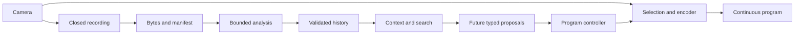

# Event foundation run guide and handoff

**Updated:** 2026-10-09

The event foundation stores one event's facts, source evidence, retained media,
and scene history. Provider fixtures use real media files and simulated labels.
They do not recognize camera footage. Live provider access is a separate gate.
Historical local-ready checks passed. The [evidence record](evidence/event-foundation.json) holds the results. The [PRD](17-event-understanding-and-provider-adapters-prd.md) defines acceptance.
The [contracts](05-context-and-contracts.md#event-foundation-runtime-10)
define record ownership and clocks. Runtime schemas come from
[foundation_records.py](../app/foundation_records.py).
The evidence record's `review_fix_validation` records the follow-up context fixes,
their unit checks, and the affected five-source media regression.

The media path continues while the foundation runs. Workers return evidence.
Only the existing program controller changes airtime.



## Run local checks

From the repository root, run:

```sh
./scripts/studio foundation-check
```

The command builds the pinned acceptance image. It runs on a temporary internal
Docker network with no external route. Chromium needs its private interface for
WebRTC. Docker and the repository are sufficient. The first build needs network
access. The command removes the container and network on exit. Results go to
`.runtime/foundation-checks/<run>/report.json`.
The command returns nonzero when any required check fails. It runs E01–E17,
a five-minute program recording, and media/browser regressions. Reports retain
artifact paths. Replace the `/evidence/` prefix with `.runtime/foundation-checks/`
to read those files on the host. Keep at least 3 GiB free before a run. Production
archive admission preserves 2 GiB free; the check does not lower that limit.

## Start fixture ingestion

Use a separate terminal for each long-running command:

```sh
docker compose run --build --rm --service-ports --name breadcast-foundation studio serve \
  --foundation-config /opt/breadcast/config/foundation.fixture.json
docker exec breadcast-foundation breadcast-studio sample --count 1 --file /opt/breadcast/demo.mp4
```

Open `http://localhost:8080/operator`. Stop the sample with Ctrl-C. Stop the server
with Ctrl-C in its terminal. Normal `./scripts/studio serve`, `sample`, and `check`
remain available. Without a foundation config, analysis stays inactive.

Inspect fixture capabilities in the built image:

```sh
./scripts/studio foundation-capabilities --config /opt/breadcast/config/foundation.fixture.json
./scripts/studio foundation-capabilities --config /opt/breadcast/config/foundation.live.json
```

The live template intentionally returns failure. It contains no invented URLs,
models, storage locations, or quotas. Read `foundation` in `/api/status` for capability
failures, job states, storage bytes, pins, per-source watermarks, gaps, stage times,
and limits. Logs redact provider exception text. Detailed timing uses trace IDs.
The decoder/program history is in the runtime directory. Log rotation bounds it.

Configuration uses the same keys in both templates. Set `event.event_id` once per
ledger, `configuration_revision`, `storage_directory`, and each provider's
`adapter`. Fixture mode also needs `fixture_file`. Live configuration must supply
verified `endpoint`, `version`, supported `protocol` and formats, model IDs from
the provider, and secret environment variable names. Storage/jobs also need the
actual storage location, trigger filter, and worker resource limits. Configuration
alone does not enable an unverified transport. Secrets stay outside event context.
Use `limits` to override the validated defaults; no limit is inferred from a
provider's marketing material.

The defaults are six-second windows with a minimum two-second step, two workers,
one active job and newest pending job per source, eight-second original live
deadlines, ten-second call timeouts bounded by that deadline, and at most two
transient retries. Recorder closure can make windows less frequent than the step.
No padding supplies unseen frames. Recorder notification clocks limit archive
processing; they do not prove last-frame receipt. Live freshness stays unavailable
until that receipt is verified. Retention is bounded by 30 minutes, 4 GiB,
256 pending chunks, 1 GiB pending bytes, and the disk reserve. Context is bounded
by 60 seconds, 32 records, 20 utterances, five search hits, and 64 KiB. Pins expire
within 60 seconds. Each ledger table has a 20,000-record admission bound. When
archive capacity is reached, diagnostics report degraded admission. Media and
manual controls continue.

## PRD 2: context, corrections, and speech

Use the `App.foundation` instance. Do not open a second writer or controller.

1. Read `event_context()`. Submit a full `EventContext` with the next revision,
   expected current revision, and an idempotent operation key through
   `App.update_event_context()`. The loopback-only `POST /internal/context` accepts
   `context`, `expected_revision`, and `operation_key`. A revision conflict fails.
   Existing human graphics confirmation commits official facts to this ledger.
   A fact with unknown effective event time stays outside synchronized history.
2. Call `reviewed_snapshot()` before selecting evidence. Pass that exact snapshot,
   immutable source, and half-open native `Interval` to
   `context('director'|'commentator'|'segmentor', source, interval, snapshot)`.
   Read `status`, `timing`, and `omitted`. Unknown event mapping means source-local
   evidence. Never replace the reviewed snapshot after a slow call.
   Director inputs include `snapshot.runtime`: sampled source health, actual
   program target, requested state, microphone state, takeover, and controller
   policy. Use its `sampled_utc` and frame ages to assess freshness. A missing
   runtime makes director context unavailable. Archive hits must contain only
   active evidence included in the reviewed evidence revision.
3. Read `notifications(after=sequence, limit=...)`. Store the consumer's cursor.
   Process `context.invalidated` and `evidence.invalidated` before using dependent
   proposals. `retract(evidence_id, operation_key, reason)` appends a correction.
   Old evidence remains inspectable; current context/search excludes the claim.
4. `program-history.jsonl` records actual frame submissions. For future spoken
   output, the controller calls `program_text(ProgramText, owner='controller')`
   when a cue is pending and when actual playback acknowledges it as aired or
   canceled. Scheduling does not establish that viewers heard a cue. This phase
   has no speech playback or automatic director.
5. Call `registry.llm(role, context, snapshot, deadline_utc)` and
   `registry.speech(text, storage, deadline_utc, event_context=reviewed_event)` through the existing bounded
   coordinator. `reviewed_event` is the validated `EventContext` from the context
   slice; it carries language, voice preferences, and pronunciations. Results
   are strict typed records. Fixture speech returns the
   checked-in prerecorded phrase, with decoded duration and fixture provenance.
   It does not synthesize arbitrary requested words or prove a live voice.

## PRD 3: retained media after disconnect

Use `search(SearchQuery)` with the event/run, eligible interval, and matching
index/embedding versions. Fixture ranking is explicitly `simulated`. Every hit
contains source identity and resolved media. Query results have no airtime right.

```python
from foundation_records import SearchQuery
hits = foundation.search(SearchQuery(
    event_id=foundation.settings.event.event_id,
    run_id=foundation.run_id, text='action'))
hit = hits[0]
source = hit['scene']['source']  # Revalidate as SourceEpoch before resolve.
```

For the selected hit, validate its `SourceEpoch` and `Interval`, then call
`resolve(source, interval, mapping_revision=..., owner=job_id,
deadline_utc=...)`. Use `mapping_revision=None` only for source-local work.
Resolve verifies content hashes, retained manifests, coverage, and geometry.
A reused camera slot cannot replace the old source. Decode the returned files
and subtract each `timeline_offset_pts` when selecting its `file_native` range.
Call `release(job_id)` in a `finally` block. Extend a pin only through another
bounded, explicit resolution. Missing/deleted coverage fails; do not select the
current slot as a fallback. Existing live replay eligibility remains separate.
This boundary prepares archive inputs; PRD 3 owns editing and airtime scheduling.

## Worker packaging and live connection

`foundation-worker` consumes a JSON object containing exactly `window` and
`manifests`. It validates those records and stored bytes, runs the same artifact
analysis function as local jobs, and atomically writes `window`, `results`, and
trusted adapter `origin`. It opens no SQLite ledger and has no controller access.

```sh
breadcast-studio foundation-worker --config /opt/breadcast/config/foundation.fixture.json \
  --request /work/request.json --storage /work/media --output /work/result.json
```

The original deadline travels with the request. The coordinator calls
`ingest(window, results, trusted_origin=...)` only against its exact stored issued
job. A duplicate is harmless; a conflicting result fails. A late valid result can
enter archive history but cannot become current live work. `recover()` replays
committed readiness after missed dispatch; prior-run jobs expire.

Follow the [live connection checklist](17-event-understanding-and-provider-adapters-prd.md#live-connection-checklist).
Verify tenant access before implementing VAST S3 signing/transfers and trigger
packaging, YOLO/Cosmos translation, search, W&B protocol, or speech transport.
Use the pinned boto3/HTTPX/Pydantic AI libraries. Disable nested retries and rerun
the adapter checks. Save actual trace IDs, returned model versions, private-media
read tests, failure results, and latency. Physical phones, orientation metadata,
venue clocks, real search quality, expressive speech, and archive replay playback
remain separate gates.

## Task 3 retained replay handoff

[Timely replays and moment search](21-timely-replays.md) now describes canonical
1.2 plans, native retained-file decoding, archive playback tickets, search,
automatic preparation, and fresh director scheduling. Run `./scripts/studio replay-check`.
Full local, live-provider, and physical-device acceptance remain separate open
gates in the [Task 3 evidence record](evidence/timely-replays.json).
