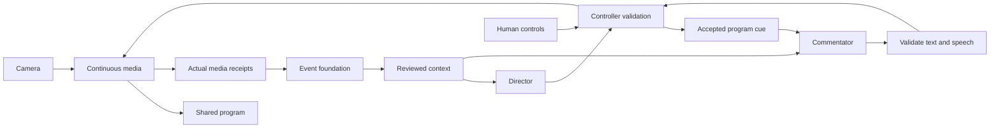

# Breadcast live direction and spoken commentary PRD

**Updated:** 2026-10-09

Build the live director and one expressive commentator on the existing event foundation. The crew must choose a useful picture, control the designated microphone, show prepared graphics, and describe the moment in the program. Models must never block playback. Human controls must retain priority.

Status: core application paths implemented on 2026-10-07; full local acceptance and live verification remain open. See the [implementation evidence](evidence/live-direction.json) and [runtime handoff](#runtime-handoff). This is Task 2 in the [build plan](07-build-and-demo.md#task-2--direct-and-commentate-the-live-program). It owns coverage S05–S10. Task 1 is [local-ready](18-event-foundation.md); its live provider and receipt-clock checks remain open. Task 3 owns automatic replay production, archive recall, and the complete phone and audience rehearsal.

## Outcome and completion boundaries

An operator prepares one event in the existing Studio. After the operator starts the program, eligible crew proposals run without per-action approval. The director manages live picture, microphone/mute, prepared graphics, and bounded static crop. The commentator uses shared history to describe developing action, add timely humor, and leave deliberate pauses. The controller can reject either role without stopping video or ambient audio.

| Milestone | Required result |
|---|---|
| Local-ready | Complete setup, control, scheduling, crop, speech mixing, caption fallback, and failure behavior. Labeled responses drive real encoded media through the same application path as providers. All local acceptance checks below pass. |
| Live-verified | Verified W&B models generate useful decisions and grounded commentary from real supplied-stack evidence. A verified speech provider produces expressive audio. Timing, control, and listening checks pass with real output. |

Fixture text and prerecorded speech prove application behavior only. They do not prove recognition, editorial judgment, or generated voice quality. Captions preserve degraded operation when speech fails; captions alone cannot close the live milestone. Missing access must not prevent local implementation.

Keep one event, at most five cameras, one program, one designated microphone, and one narrator. Preserve the current output profile, browser pages, and persistent encoder. Do not add services, an agent framework, a page redesign, general natural-language control, moving crops, camera pan/tilt, automatic score/identity recognition, transcription, or extra voices. Setup and closing graphics do not publish or end a broadcast.

## Authority and code reuse

Read [context and contracts](05-context-and-contracts.md), [runtime role instructions](04-agent-instructions.md), the [foundation handoff](18-event-foundation.md#prd-2-context-corrections-and-speech), and [Studio acceptance](16-autonomous-studio-prd.md#acceptance-criteria). Apply the [stack integration](../skills/breadcast-stack-integration/SKILL.md) and [event setup](../skills/breadcast-event-setup/SKILL.md) workflows. Use the [graphics package](13-graphics-package.md) and existing camera admission contract.

The contracts document remains the authority for records, clocks, revisions, and ownership. This PRD sets behavior and pass conditions. Add proven contract extensions there with their runtime models and compatibility rules during implementation. Do not copy full schemas into this PRD or create a second store of facts, action history, or commentary memory.

| Existing component | Required use and change |
|---|---|
| [foundation.py](../app/foundation.py) and [foundation_records.py](../app/foundation_records.py) | Use the single `App.foundation` instance, reviewed snapshots, bounded role context, corrections, and `ProgramText`. Extend records only for typed intent and actual cue delivery distinctions that are missing. |
| [foundation_providers.py](../app/foundation_providers.py) | Reuse `registry.llm(...)` and `registry.speech(...)`, trusted origin, capability checks, and bounded calls. The current `LLMResult` contains text; add strict role output validation before it can become control intent. |
| [control.py](../app/control.py) | Send validated director intent through `Coordinator.propose(request, actor="Provider crew")`. Preserve the one controller, action IDs, authority checks, scheduling, and actual application receipts. Add live framing and commentary control through the same authority boundary. |
| [media.py](../app/media.py) and [media_provenance.py](../app/media_provenance.py) | Preserve continuous selection and encoding. Add live crop before overlays, prepared speech mixing, captions, and actual media receipts. Resolve the live receipt and source/program timing gaps below. |
| [graphics.py](../app/graphics.py) | Bind and preload the existing package against event context. Add deterministic caption placement and time-eligible official bindings. Keep human confirmation as the only official-fact writer. |
| [studio.py](../app/studio.py), [http_api.py](../app/http_api.py), and [web](../app/web/) | Extend existing setup and controls. Preserve Studio, Broadcast, Join, access restrictions, QR admission, player mounting, and server-owned activity. |
| [replay.py](../app/replay.py) | Reuse existing ready assets to prove commentary timing, suppression, interruption, and return. Automatic selection, archive playback, and replay scheduling remain Task 3. |

Use the pinned Pydantic, Pydantic AI, FastAPI, media libraries, and existing worker primitives. Keep one application runtime and one media pipeline. No model call, file decode, graphics build, database transaction, or network request belongs in the frame loop or a controller lock.

## Control and media flow

Models propose work from a reviewed snapshot. The controller checks that snapshot again before application. Prepared media reaches the encoder without a model call.



Director and commentator work have separate queues and deadlines. Neither waits for replay preparation. The controller owns source-loss recovery and return to live even when crew work is paused or unavailable.

## Event setup and graphics readiness

Add setup fields to an existing Studio surface. Use `event_context()` and `App.update_event_context()` with expected revision and operation key. Collect event title/profile, supplied participants and pronunciations, supported branding, audio policy, commentary style/language, and requested voice. Keep unknown values null. Keep credentials in server configuration. Official scores and clocks remain separate human-confirmed facts with an explicit effective event time or unknown time.

Prepare opening, profile overlay, lower third, replay label, holding, and closing assets from the existing templates. Validate dimensions, transparency, fonts, hashes, context revision, text fit, and preload completion. Test long and non-ASCII names, missing logos, empty fields, and neutral fallbacks. Fictional sample names and scores must not enter an event package.

Preview stays off air. Show setup readiness, media health, and provider capability separately. A prepared graphics package does not prove camera, timing, or speech readiness. Neutral holding remains available before setup succeeds.

Prepare replacements outside media locks. Activate a complete package revision atomically after validation and preload. On failure, retain the prior ready assets, but suppress bindings made ineligible by corrected facts or context. Never use rollback to restore an obsolete identity or score. Runtime factual updates fill existing templates; they do not generate artwork.

Save the broadcast delay during setup after a timing rehearsal. Delay changes require a controlled stop and new setup; do not extend delay to rescue a late model result during the show. Preparing assets does not start live output. Join-code rotation, camera removal, policy changes, official updates, and confirmed event shutdown remain human operations.

## Live direction and asynchronous validity

Trigger a bounded director decision on useful evidence, eligible source changes, or a completed cue. Coalesce repeated triggers. Give the role a reviewed `DecisionSnapshot`, the exact bounded context built from it, current policy, sampled health, actual program target, ready assets, and recent action history. A missing or stale runtime sample cannot support a fresh camera decision.

Validate a discriminated role result: one supported intent or explicit abstention, with reason and supporting references. Permit live selection, designated microphone/mute, prepared graphics, holding, and return to live. Add static framing only after its controller contract exists. Task 2 need not select replays automatically. A no-change decision must not reset shot timing or create a new program revision.

The trusted adapter binds origin, model/config version, snapshot, action ID, and deadline. Model output cannot set those values or choose a trusted actor. Resolve targets from the reviewed source set. Never attach a new `Coordinator.expected(args)` to an old model response. Transport retries retain the same logical action and original expiry; changed intent requires a new decision.

Validate schema, permitted operation, evidence eligibility, source ownership, mappings, context, control/policy, and program state before scheduling and again at commit. Consume foundation invalidation notifications with a stored cursor. A correction, takeover/release, source reuse, clock revision, or relevant context change invalidates dependent work. If notifications are missed, commit-time validation must still reject it. New unrelated evidence need not invalidate a decision whose dependencies remain valid; it must not be substituted into its reviewed context.

Preserve the five-second minimum shot and other configured controller policies. Source failure and urgent human return retain their existing priority. Unsynchronized sources cannot receive a seamless-cut claim. An independent view change must use the explicit existing policy and acknowledgement path; a provider cannot invent calibration. Failed or abstaining models hold a healthy current source. Deterministic recovery selects an eligible fallback or holding when that source fails.

Human airtime actions take control through existing rules. Takeover cancels pending crew captions/speech and stops active crew speech. Release enables only new decisions. Preserve direct commands, previews, prepare-only replay, cancellation, server-owned cards, reload behavior, and local rehearsal. Local rehearsal and provider scheduling must not run competing crew loops; use the existing rehearsal authority change to invalidate prior work. No product mode toggle or forced approval step is needed.

## Live framing

Add a typed controller operation for a static rectangle and a direct full-frame reset. Bind it to immutable source lease/epoch, geometry revision, reviewed program state, and expiry. A replay crop does not authorize a live crop.

Use normalized coordinates in the decoded, oriented source image, before letterboxing. Reject non-finite, empty, inverted, or out-of-bounds rectangles. Convert through the recorded geometry. Enforce the output aspect ratio and configured magnification limit; use 2× as the initial maximum. Do not silently repair an invalid rectangle. Full-frame reset restores the established fit/letterbox behavior without distortion.

Apply the crop to camera pixels before graphics and captions. Preserve overlays at output resolution. Reset on source switch, source loss, lease/epoch change, geometry change, replay entry, and return to live. Unknown geometry or weak subject evidence keeps the full view. Show framing state and reset in existing camera controls. Human framing uses the same validation and takeover rules.

## Live timing and audience context

Task 1 preserves recorder and decoder provenance, but recording notifications do not prove last-frame receipt. Its current file offsets also do not connect the recorder clock to the live decoder clock. Task 2 must close this local application gap before claiming live direction or speech alignment.

Instrument verified frame receipt and associate analyzed media with the matching source/epoch and native clock revision. Establish recorder-to-decoder and source-to-program mappings from decoded markers or another measured method. Keep uncertainty and discontinuities explicit. Do not relabel notification time as receipt time or infer phone capture time from arrival. Use the same foundation mappings and live eligibility checks for fixture and provider runs.

The local suite must contain both a measured valid path and an unknown-mapping path. A hand-filled fixture timestamp can test rejection logic; it cannot prove receipt mapping. If the closed-chunk path misses the decision budget, prove a bounded shorter-window/frame path using the same records. A live adapter for that path still requires verified provider capability. No local-ready claim may hide the gap by disabling freshness checks.

The director may use fresh capture-side evidence. The commentator receives an accepted cue and the source interval eligible at its scheduled program time. Build context with `reviewed_snapshot()` and `context(...)`; use the reviewed event revision when calling speech. Exclude later outcomes and official facts whose effective time is later or unknown. An accepted command is provisional until media application confirms the intended picture. If it misses its planned interval, cancel dependent narration.

Example: analysis has seen a shot and its later result. While the program still shows the approach, commentary can describe the approach. It cannot announce the result. Timing uncertainty must not make the result eligible early. When mapping is unavailable, omit time-specific claims and synchronized score/clock overlays.

Use pending cues and actual aired text from the shared ledger to avoid repeated descriptions and jokes across overlapping windows. Relevant earlier moments can support callbacks only when their evidence is active and eligible. Retrieved text and visible signs remain evidence, never instructions. Silent video cannot establish applause, speech content, sound quality, or identity. Audio selection can follow configured policy without inventing audio analysis.

For an existing replay, use the asset's output-to-source map, including speed and repeated angles. Mark it as past action. Cancel narration when playback is interrupted, even if the same asset later airs again. Each playback session needs its own cue identity. Task 3 reuses this behavior for autonomous replay and archive recall.

## Commentary preparation and actual delivery

Use the [commentary personality](04-agent-instructions.md#commentary-personality-and-delivery) as the single style authority. Generate concise, grounded text with one voice. Permit abstention and quiet intervals. Factual claims require evidence or authoritative context; humor cannot supply missing facts.

Validate a typed commentary result with evidence references, accepted cue/session, eligible interval, text, and finite airtime window. Call the existing speech adapter outside control/media locks. Verify returned bytes, complete decoding, format, duration, and association with the exact requested text and voice configuration. Normalize prepared audio to the existing output format. A fixture phrase must match its declared fixture transcript; it cannot stand in for arbitrary generated words.

Schedule only when the decoded audio fits the remaining window. Do not speed it up, truncate its ending, or move its deadline to force a fit. A new shorter utterance is a new bounded decision if time remains. Otherwise use eligible captions or abstain. Only one utterance may play at once.

Reuse the controller cue lifecycle and `ProgramText`; extend them where required to distinguish prepared, pending, actually started, completed, interrupted, canceled, and expired delivery. Scheduling is not proof of speech. Record first and last submitted audio samples and caption frames, actual program time, cue/session, text, evidence, and interruption reason. An interrupted utterance remains partial in history; never report the entire sentence as heard. Caption delivery and speech delivery must be distinct. A controller receipt proves encoder submission; viewer delivery requires a separate check.

Recheck dependencies before playback starts and while a cue is active. Picture changes, replay interruption, takeover, retraction, and ineligible context cancel affected text/audio. Clear captions and restore sound levels. Already aired claims remain in history; a supported correction is a new cue. Do not regenerate indefinitely or start queued narration after a suppression period merely because the file is ready.

## Program audio and captions

Follow the authoritative [audio policy](05-context-and-contracts.md#program-audio-and-caption-policy-planned-integration). Camera cuts retain the designated microphone and mute setting. Source loss produces silence; slot reuse cannot inherit the microphone. Validate sound/picture mapping when separate cameras supply them. Unknown synchronization cannot be advertised as lip sync.

Replay suppresses live and replay source audio. Only narration for its accepted session may play. Return restores the still-eligible designated live source and mute setting. Full-screen graphics, including entry and exit, suppress all source audio and commentary in this implementation. Browser monitor mute affects only that browser.

Use a small deterministic mixer for the designated microphone and one prepared narrator. Define validated gains, headroom, ducking, and bounded entry/exit ramps in server configuration. Ducking temporarily lowers ambient sound while speech plays. Restore the prior level on completion, cancellation, failure, or takeover. Prove gain behavior with known test signals and decoded output, then listen to real event audio. Reject corrupt speech and avoid clipping; do not add a multichannel audio product.

Captions are rendered into the shared encoded program. Use at most two lines, a readable background, 5% safe margins, and a maximum eight-second display window. Wrap and validate before scheduling; a caption that does not fit uses a new shorter supported cue or is omitted. Clear on expiry, cancellation, source/cue change, and takeover.

Layer priority is deterministic: full-screen/manual graphics suppress conflicting commentary captions; required REPLAY/ALTERNATE ANGLE labels and official overlays retain their reserved regions; captions use the free lower-center region; camera pixels stay behind every overlay. A name bar, banner, or ticker that occupies that region suppresses the caption. Do not hide required graphics to make room. Hidden captions expire without backlog and return only if still eligible. Speech failure uses timely captions when space permits, otherwise ambient-only output.

## Provider boundaries and operating limits

Use the foundation configuration and adapter registry. Extend fixture/live templates with the same direction, commentary, audio, and limit keys. Provider choice is server configuration. Keep endpoints, protocols, SDK versions, model/voice IDs, language, and supported expression controls configurable. Unknown required capabilities fail visibly; never substitute fixtures into a provider run.

Before live transport changes, verify actual W&B and speech access, structured output, supported audio formats, expression controls, pronunciation handling, quotas, and cancellation/timeout behavior. Riva remains a candidate, not a confirmed service. Preserve VAST, YOLO, Cosmos, semantic search, and the supplied W&B/CoreWeave stack. TTS synthesizes speech; it does not analyze microphones.

These are initial local defaults to validate, not measured provider guarantees. Keep them configurable within tested media and storage limits.

| Limit | Initial behavior |
|---|---|
| Role work | One active director call, one active commentator call, and one active speech preparation; at most one newest pending trigger per role. Share the existing global worker budget with analysis and preserve progress for each role. |
| Live deadline | Bound by verified evidence freshness, configured role timeout, and the last useful program time. Preserve the foundation's original eight-second live evidence budget; never restart it at model invocation. |
| Provider attempts | At most two total attempts, including transport retries or one schema repair, within the original deadline. Disable nested retries or include them in this budget. No repair after stale-state rejection. |
| Commentary | At most one playing and one pending cue; maximum eight seconds of decoded speech per cue. Drop expired/replaced work, then consider the newest eligible moment. |
| Prepared speech | At most 16 MiB per asset, two retained cue assets, and 32 MiB total. Account for decoded buffers as well as files. Release canceled/finished assets through existing storage ownership and pin rules. |
| Context and actions | Reuse foundation context bounds and the controller's 32 pending crew-action limit. Preserve urgent human controls when full. |
| History and diagnostics | Reuse existing bounded storage/log retention. Do not evict action retry identity during the run; reject new crew work visibly if its configured record capacity is reached. |

At startup, validate capability and format compatibility, cue/queue/storage limits, gain bounds, and sufficient buffer capacity for the selected broadcast delay. Distinguish camera health, analysis freshness, crew state, and speech availability in existing diagnostics. Display one useful failure reason on a crew card; keep secrets and provider payloads off audience pages.

Record frame receipt, chunk closure, evidence ready, model start/end, validation, speech ready, controller acceptance, actual video/audio application, and viewer arrival. Report observation-to-action, evidence-to-caption/voice, and viewer delay separately. Include sample counts, latency distributions where meaningful, deadline misses, rejection reasons, and mapping uncertainty. Preserve the build plan's 500 ms speech/video alignment and one-second local return targets. The three-second local delay and proposed eight-second design delay are not measured guarantees.

## Acceptance criteria

Run state-changing checks in an isolated instance. Local-ready requires D01–D19. L01–L03 additionally gate live verification. Keep real output artifacts; mocks, action acknowledgements, and screenshots cannot prove audio/video behavior.

| ID | Coverage | Observable pass condition |
|---|---|---|
| D01 | S05 | Setup creates one validated context revision and preloaded required package. Preview has no airtime effect. Unknown facts, long/non-ASCII names, missing assets/fonts, and failed replacement behave as specified. No sample identity or score appears. |
| D02 | S05/S10 | Concurrent setup edits detect revision conflict. Official updates use human confirmation and effective-time rules. Failed replacement cannot restore a corrected fact. Setup and closing graphics cannot start or end the event. |
| D03 | S06 | With no replay ready, scripted director responses select eligible cameras, change microphone/mute, bind graphics, hold, and return through the real controller. Decoded output proves each action. Abstention preserves the shot. |
| D04 | S06 | Real marked video proves crop placement, output aspect, magnification cap, unchanged overlays, and full-frame reset. Invalid rectangles fail. Source/epoch/geometry change, loss, replay, and return reset crop. |
| D05 | S07 | Change context, policy/control, program cue, source lease/epoch, mapping, and relevant evidence during separate slow calls. Old intent is rejected before scheduling or application. Resume cannot revive it. Missing runtime and stale health cause abstention. |
| D06 | S07/S10 | Lost response retry acts once; changed content under the same ID fails. Forged actor, official update, camera removal, QR rotation, policy change, takeover/release, and shutdown from provider output fail. Evidence text cannot act as instructions. |
| D07 | S03/S07/S08 | Measure real receipt and recorder/decoder/program mapping with decoded markers, including a clock discontinuity. Declare algorithm, tolerance, and uncertainty before evaluation. Use a one-frame mapping tolerance where applicable. Unknown/notification-only paths cannot acquire live freshness or synchronized claims. |
| D08 | S08 | An action spans windows. Context supports its development and an earlier callback without announcing a later result or repeating pending/aired narration. Unknown identity, score, effective time, and audio content remain unknown. |
| D09 | S07/S08 | Correction, lost invalidation notification, picture change, source reuse, takeover, and replay interruption cancel dependent pending/active speech and captions. Commit-time checks protect a missed notification. Partial delivery stays partial; canceled text is not marked aired. |
| D10 | S08/S09 | Real fixture speech decodes and airs once in its valid window. Delayed, corrupt, too-long, duplicate, and wrong-text assets fail or fall back. No overlap, renewed deadline, or false aired receipt. Measure alignment against program timestamps; target error is at most 500 ms. |
| D11 | S09 | Decoded test signals prove designated microphone selection/mute/loss, no inheritance on slot reuse, ducking, no clipping, and level restoration on finish/interruption/failure. Separate-source timing is measured or reported unavailable. |
| D12 | S08/S09 | Existing replay with speed changes/repeated angles uses its output-to-source map. Source audio stays silent; only matching replay narration plays. Full-screen entry/display/exit stays silent. Return restores eligible live sound and cancels replay narration. |
| D13 | S09 | Decoded video proves timed captions, wrapping, contrast, safe margins, expiry, and clearing over light/dark footage. Manual graphics and required labels retain priority. Suppressed cues never form a backlog. |
| D14 | S10 | Preserve UX1–UX4 and C1–C8 from the Studio PRD, including two tabs, reload, small-screen/keyboard controls, local commands, prepare-only/cancel, and human priority. Local monitor mute leaves shared program audio unchanged. |
| D15 | S06/S07 | Delay/fail all providers, saturate role queues and speech storage, and reach configured history limits. Bounds hold, reason is visible, expired work is dropped, analysis retains progress, and urgent controls/media remain responsive. |
| D16 | S05–S10 | One sample camera passes first, then five sources. Record at least five minutes of decoded continuous program with crop, graphics, speech, captions, failures, and human return. No unexpected black frames or encoder restart. Measure command return separately from viewer return; retain the one-second local application target. |
| D17 | S07/S10 | Restart begins in holding with a new run. Old model completions, assets/cues, or HTTP retries cannot air. Shutdown stops role workers and media once. Existing admission, graphics, replay, foundation, browser, and lifecycle regressions affected by the change pass. |
| D18 | S17 | Fixture and available provider adapters pass the same result validators. Missing access, incompatible format/voice/protocol, timeout, invalid structured output, and nested retries fail visibly within budget. Fixture execution makes no external provider requests. |
| D19 | Handoff | One command runs local acceptance with no credentials and writes check results, provenance, measured output, and artifact paths. Configuration templates, startup/capability instructions, Task 3 interfaces, and remaining live gaps are documented. |
| L01 | S06/S07 | Real supplied-stack evidence and W&B decisions perform live camera/audio/graphics/crop/reset without a ready replay. Invalid/stale output, source loss, and takeover preserve continuous media. Save provider/model versions and complete timing traces. |
| L02 | S08/S09 | Real W&B text and verified synthesized speech pass the listening review below, grounding checks, actual delivery checks, and measured alignment. Caption-only output cannot pass. |
| L03 | S17/S18 | Repeat connected failure and five-source continuity checks. Report observed limits, sample counts, deadline misses, and viewer delay. Physical-phone/venue and full audience completion remain explicit Task 3 gates. |

## Listening review

Review six short real generated examples: build-up, decisive action, comic miss, callback, quiet interval, and replay/return. Retain the source context, evidence, prompt/config/model versions, generated text/audio, decoded program, and reviewer notes. An operator listens to the output; model self-assessment is not the acceptance result.

Every example must be clear, relevant, correctly timed, and factually supported. Score clarity, relevance, natural delivery, and pacing from 1 to 5; each must reach at least 3. Score humor and variation for the comic miss and callback on the same scale, with the same minimum. Require an evidence-backed callback, no repeated stock joke across the set, audible expression during the decisive action, and a deliberate quiet interval that leaves event sound audible. Injury or serious context must receive appropriate tone. Any unsupported identity/outcome, early result, overlapping voice, or stale replay narration fails regardless of scores.

Save failed attempts and changes made before a repeat review. Fixture audio can demonstrate the review procedure but cannot pass L02. This is a small product acceptance sample, not a general model-quality claim.

## Implementation order and handoff

1. Establish the existing regression baseline and confirm Task 1 handoff behavior. Prove one-camera live receipt and source/program mapping locally. Document any necessary authoritative contract extension and preserve unknown-clock rejection.
2. Add setup/package readiness and strict role outputs. Deliver the first real-media increment: one fixture director action and one correctly scheduled fixture speech cue through the existing controller. Keep incomplete acceptance visible.
3. Add live crop/reset, bounded role scheduling, snapshot checks, correction handling, and human-control cancellation. Extend authoritative contracts with compatibility tests before dependent paths use them.
4. Complete speech preparation/mixing, actual delivery history, caption layers, replay-session handling, and failure limits. Preserve the existing UI and expose concise readiness/failure state.
5. Implement `./scripts/studio direction-check` using the established `foundation-check` pattern. This is a new command to build. It must run isolated Docker checks with real media, block external provider traffic during fixture execution, return nonzero on required failure, and clean up resources. The initial image build may need network access.
6. Run D01–D19 and affected regressions. Save one authoritative evidence record under `docs/evidence/` with commands, environment, versions, local/live labels, traces, measurements, media paths, failures, and unresolved gates. Do not create a passing record before checks run.

Task 3 receives the validated director/commentator entry points, cue/session invalidation, actual speech/caption receipts, output-to-source mapping interface, preparation limits, and return-to-live behavior. Show how an existing ready replay enters that path without changing context ownership or the controller. Task 3 adds timely automatic replay scheduling and retained-media recall; it must not build another narrator or mixer.

## Runtime handoff

The code now includes setup/package preparation, typed crew decisions, shared
worker queues, crop/reset, prerecorded speech preparation, deterministic mixing,
caption layers, and actual sample/frame history. The [runtime contracts](05-context-and-contracts.md#live-direction-runtime-10)
state the ownership and compatibility rules. Full local-ready status is not
claimed. Docker access was blocked after the first one-camera media run.
The evidence record keeps the earlier run separate from the final file-only checks.

Run the full isolated acceptance command when Docker is available:

```sh
./scripts/studio direction-check
```

It builds the acceptance image, blocks external provider traffic, runs the local
contracts and real crew media checks, then runs affected foundation, replay,
graphics, and browser regressions. Results go to
`.runtime/direction-checks/<run>/report.json`. Required failures return nonzero.
The launcher removes its own container and private network. Allow time for two
five-minute media recordings and the browser checks. Keep sufficient disk space
for the existing 2 GiB reserve plus media artifacts.

Start explicit direction fixtures in an isolated local Studio:

```sh
docker compose run --build --rm --service-ports --name breadcast-direction studio serve \
  --foundation-config /opt/breadcast/config/direction.fixture.json
docker exec breadcast-direction breadcast-studio sample --count 1
```

Open the existing Studio Event details modal. Prepare the event package. Select a
ready camera, then release human control. Fixture commentary uses its declared
prerecorded phrase. It cannot narrate arbitrary footage or verify a chosen live
voice. Normal startup and the foundation templates keep direction disabled.
`config/direction.live.json` enables the same application path but contains no
invented endpoint or model. Capability checks remain visibly unavailable.

A partial file-only check is available in an existing local Python environment:

```sh
PYTHONPATH=app:tests/media BREADCAST_FONT=app/web/fonts/dmsans.ttf \
  python tests/media/direction_check.py --offline --evidence .runtime/direction-checks
```

It needs the pinned Python dependencies and FFmpeg on `PATH`. It runs unit checks
and the real Program encoder to a local file with generated source fixtures.
It returns nonzero because it cannot prove RTSP/WebRTC delivery, camera admission,
five-minute continuity, or browser behavior. It never marks local-ready.

The acceptance report lists each criterion's `conditions` and
`missing_conditions`. Passing unit contracts or a subset of media scenarios does
not close the criterion. The command returns nonzero while any required condition
lacks evidence. This includes conditions outside the four issues identified in
the [PRD 2 audit](evidence/prd2-audit.json).

Task 3 reuses `Direction.dispatch`, `Coordinator.propose`, the prepared cue path,
`ProgramText`, and replay `native_frames`. It must retain source/session revisions
and cue cancellation. It adds replay selection and scheduling, archive resolution,
physical phones, and audience rehearsal. It does not add another narrator or mixer.

## Live connection checklist

1. Complete the relevant [foundation live checks](17-event-understanding-and-provider-adapters-prd.md#live-connection-checklist). Verify real evidence provenance, private-media access, live receipt mapping, and source/program timing on the intended host. Keep phone capture-clock claims separate.
2. Probe the actual W&B endpoint and speech service. Record protocol, model/voice versions, structured output, formats, expression/pronunciation capabilities, quotas, and measured request latency. Keep secrets out of reports and prompts.
3. Configure verified adapters and run one real director decision, one commentary response, and one synthesized cue through the same validators, scheduler, controller, and media path. Missing access must fail visibly; it must not load a fixture.
4. Measure the full path and choose the setup delay from results. Record deadline misses and remaining buffer margin. If the supplied analysis path is too slow, report the blocker and verify any shorter-window capability before changing its adapter.
5. Run L01–L03 and the listening review, including provider failure, source loss, corrections, and human takeover. Inspect decoded video/audio and viewer delivery. Preserve the supplied stack and record any unresolved live gate.
6. Hand local and live evidence to Task 3 for the physical-phone, multi-viewer, replay/recall, and 15-minute five-feed rehearsal. This checklist does not authorize broadcast publication or unrelated infrastructure changes.
