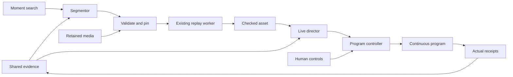

# Breadcast timely replays and broadcast validation PRD

**Updated:** 2026-10-09

Connect automatic replay preparation, useful replay airtime, and natural-language recall to the existing studio. Prove that retained footage can play after its camera disconnects. Keep live direction and capture running during every replay. Complete the real-phone and small-audience rehearsal with measured video and audio results.

Status: core application paths and `replay-check` implemented; full local/live/device acceptance remains open. See [handoff](21-timely-replays.md) and [evidence](evidence/timely-replays.json). Date: 2026-10-09. Implementation baseline: commit `87d0b82`. This is Task 3 in the [build plan](07-build-and-demo.md#task-3--deliver-timely-replays-and-prove-the-complete-broadcast). It owns S11–S16 and S18. It consumes Task 1 evidence and Task 2 direction/commentary. This PRD is the handoff for the coding agent. It does not report new media tests or authorize publication.

Use the existing libraries and application services. The default requires no new production dependency or service. Build only the missing broadcast rules and adapters. Do not replace the encoder, write another transport, or assemble another chain of media subprocesses.

## Outcomes and completion gates

The complete path is: supported action → validated edit → checked replay → fresh director decision → controller application → current delayed live. Search can select the same action later, including after rolling-buffer eviction and camera-slot reuse. Search and preparation never grant airtime.

| Gate | Required result |
|---|---|
| Task 3 local-ready | R01–R24 below pass through the production application path with labeled provider fixtures and real encoded media. The inherited foundation and direction acceptance conditions also pass. No provider credentials are needed. |
| Live-verified | L01–L05 pass with actual supplied services and generated speech. Semantic quality and editorial usefulness are reviewed against captured footage. Fixtures cannot close these checks. |
| Device and venue ready | P01–P06 pass on physical phones and at least three simultaneous viewer devices on the intended host/network. Device checks can proceed before provider access. Repeat them at the venue if the network changes. |
| Complete broadcast | All three gates above and the inherited Task 1/2 live gates pass. Save the complete recording, traces, failures, and measured limits. A missing gate remains explicitly open. |

Keep progress on independent work when a provider or device is unavailable. Do not call a partial check local-ready. Do not treat captions as completed spoken commentary. Do not require the user to decide architecture that this PRD already selects.

## Authority and required reading

Follow [AGENTS.md](../AGENTS.md), [README](../README.md), the [replay production workflow](../skills/breadcast-replay-production/SKILL.md), and the [stack integration workflow](../skills/breadcast-stack-integration/SKILL.md). Apply the [event setup workflow](../skills/breadcast-event-setup/SKILL.md) to device rehearsal setup.

[Context and contracts](05-context-and-contracts.md) remains the authority for IDs, clocks, evidence, versions, and state ownership. This PRD specifies required behavior and migration rules. During implementation, put the resulting runtime contract changes in that authority document and generate JSON Schema from strict Pydantic models. Do not maintain a second handwritten schema in a prompt, HTTP handler, or test fixture.

Read the [architecture](02-architecture.md), [integration design](03-stack-integration.md), [role instructions](04-agent-instructions.md), [graphics and replay design](06-graphics-and-replays.md), and [build acceptance](07-build-and-demo.md). Read the [foundation PRD](17-event-understanding-and-provider-adapters-prd.md), [foundation handoff](18-event-foundation.md), and [direction PRD](19-live-direction-and-commentary-prd.md) before extending their interfaces. Preserve the camera, Studio, graphics, and replay behavior in docs [09](09-camera-joining.md), [12](12-studio.md), [13](13-graphics-package.md), [15](15-multi-camera-replays.md), and [16](16-autonomous-studio-prd.md).

The review covered docs 01–19, the original multi-camera implementation prompt, examples, project workflows, checked-in evidence records, relevant application/tests/configuration, and Git history. A GitHub PR-list query returned no PRs for `rammelmueller/breadcast`; local commits and evidence establish the implementation baseline. Older design defaults are historical. In particular, OBS selection, optional speech, fixed context revision 1, and the claim that replay narration is absent do not describe the current required scope.

## What exists and what must change

| Area | Inspected baseline | Task 3 change |
|---|---|---|
| Shared records | `Foundation` owns SQLite evidence, scenes, chunks, corrections, search entries, pins, and context. Task 1 is local-ready. | Reuse these records. Add replay work/dependencies to this ledger where durable identity is needed. Do not create another event memory or official-fact store. |
| Retained files | `Foundation.resolve()` checks hashes, manifests, interval coverage, and optional mapping revision. It can resolve disconnected sources. Pins are bounded and released by owner. | Feed its result to replay preparation and playback validation. Keep deletion, pinning, and availability under this existing owner. |
| Replay plans | `ReplayContext.resolve()` accepts local `ReplayPlan` 1.1, hardcoded `local-studio`, context `1`, integer epochs, and `camera-N` slots. Evidence is local operator/fixture evidence. | Add the canonical event/source contract below. Preserve legacy callers through an explicit translation. Provider evidence comes from the foundation, never a forged operator record. |
| Replay rendering | `render_plan()` validates timestamp-selected frames, crops, speed, encoded cuts, full decoding, labels, and output duration. `App.render()` allows one render and 20 jobs per run. | Supply retained-file frames through a small PyAV adapter. Reuse the renderer and quality checks. Bound preparation memory and scratch files. |
| Replay eligibility | `Coordinator.replay_reason()` and `expected()` resolve all replay shots against current camera slots. | Preserve this rule for live-buffer replays. Add explicit archive eligibility based on immutable retained media. A global removal of source checks is forbidden. |
| Model boundary | `Registry.llm()` accepts role `segmentor`, but its fixture returns placeholder text. `LLMResult.text` is limited to 2,048 characters. | Add strict segmentor output through the same registry. A six-shot plan must fit the selected result schema; do not truncate it into the current text limit. |
| Worker scheduling | `Foundation.submit_role()` permits director, commentator, and speech only. Its two workers share analysis and role work. | Add bounded segmentor/search work to the same application scheduling boundary. Keep rendering in its existing worker. Protect live decisions from replay backlog. |
| Live director | `DirectorIntent` has no replay operation. `Direction._run()` schedules only the commentator while actual output is REPLAY. | Add ready-replay proposals and continue live director checks during replay. This is required for urgent live interruption. |
| Commentary | Task 2 has prepared cues, one narrator, captions, cancellation, actual receipts, and replay `native_frames`. Its context/check paths still select current sources. | Resolve archive narration from the accepted asset/session and retained source map. Reuse the same preparation, mixer, and `ProgramText` records. |
| Search | `Foundation.search()` uses simulated word matching. It returns full internal archive resolutions, including local paths. There is no Studio recall surface. | Add a provider query boundary and a small search area in Replays. Public results expose safe references, never filesystem paths or signed object URLs. |
| Deployment and UI | One FastAPI/Uvicorn runtime, MediaMTX, persistent FFmpeg output, and existing Studio/Broadcast/Join pages. Output is 640×360 at 15 fps. | Keep these choices. Extend the current APIs, cards, and modal. Add no frontend migration, media gateway, controller service, or public distribution service. |

Use [Task 1 evidence](evidence/event-foundation.json), [multi-camera evidence](evidence/multi-camera-replay.json), and [Studio evidence](evidence/autonomous-studio.json) for previous measurements. Paths in older evidence may refer to a different checkout; a path alone does not prove the artifact exists here.

Task 2 is **not fully local-ready**. Its [initial evidence](evidence/live-direction.json), [audit](evidence/prd2-audit.json), and later [fix evidence](evidence/prd2-fixes.json) must be read together. The later record has targeted media/browser passes and combined observations for D03, D12, D14, and D16. It still reports missing conditions and no green complete `direction-check`. Do not carry forward the earlier Docker blocker as the only remaining problem. Establish a fresh baseline and close or explicitly report each inherited condition.

## Library decisions and research

Public GitHub and maintainer documentation were checked on 2026-10-07. The following choices are fit decisions for this repository. They do not prove tenant access or performance. Preserve versions in [requirements.lock](../requirements.lock); do not upgrade the stack merely because current online docs describe a newer release.

| Need | Selected reuse | Integration rule |
|---|---|---|
| Retained-file decoding and timestamps | [PyAV](https://github.com/PyAV-Org/PyAV), already pinned at `17.0.1`. Its [pinned input source](https://github.com/PyAV-Org/PyAV/blob/v17.0.1/av/container/input.py) provides container decode/seek. | Decode the bounded closed chunks returned by the foundation. Use frame PTS and rational time bases. Seek, if used, is a decode starting point, not an exact edit boundary. No new decoder pipe or MP4 parser. |
| Crop, scale, labels, replay encoding | Existing `render_plan()`, Pillow `12.3.0`, and pinned FFmpeg/ffprobe. | Reuse the checked frame-selection and label path. Add one retained-input adapter. Keep the existing fixed encoder command and validation; do not add a second renderer. |
| Typed planning and provider requests | [Pydantic AI](https://github.com/pydantic/pydantic-ai), pinned `pydantic-ai-slim==2.54.0`; [structured output](https://pydantic.dev/docs/ai/core-concepts/output/), Pydantic `2.13.5`, and pydantic-settings `2.15.0`. | Use strict role output and the existing registry. Models return edit or airtime intent. Application code supplies provenance, snapshots, IDs, and deadlines. No general autonomous tool loop. |
| HTTP and failure fixtures | Existing FastAPI `0.142.2`, Uvicorn `0.54.0`, HTTPX `0.28.1`, and [HTTPX transports](https://www.python-httpx.org/advanced/transports/). | Add typed routes to `http_api.py`. Use `MockTransport` for transport faults and existing Pydantic AI fixture facilities for model results. No custom HTTP/retry framework. |
| Object transfer | Existing boto3/botocore `1.43.108`; [S3 SDK guide](https://docs.aws.amazon.com/boto3/latest/guide/s3.html). | Use SDK transfers/signing only after actual VAST compatibility is verified. Keep all access behind the foundation storage boundary. Do not write signing or multipart-upload code. |
| Semantic retrieval | Supplied search service first; verified VAST vector capability only if required. [VAST vector reference](https://kb.vastdata.com/documentation/docs/vector-search). | Keep indexing and query model/version/dimensions consistent. The cited 5.4 reference describes brute-force search; it does not establish tenant capabilities. Do not add a local vector service or embedding model as a silent replacement. |
| Browser capture and playback | Existing MediaMTX `1.20.1` and vendored helpers; [maintainer browser guide](https://mediamtx.org/docs/read/web-browsers). | Reuse the helper, publisher authorization, and one shared program. Current online docs contain features beyond the pinned version; test only the selected release. |
| Validation and load measurements | Existing unittest and Playwright `1.63.0`; [browser emulation](https://playwright.dev/docs/emulation), browser WebRTC statistics, and [Docker stats](https://docs.docker.com/reference/cli/docker/container/stats/). | Collect existing process/container and browser measurements. Browser emulation remains software evidence. Physical phones and separate viewer devices have their own gates. |

The selected PyAV use is narrow: obtain decoded frames with their native timing. Most edit behavior already exists. The library does not decide which action matters, establish camera synchronization, or grant airtime. Those remain the existing application contracts.

Keep changes in clear modules. `foundation_records.py` owns strict records; `foundation.py` and `foundation_storage.py` own persisted evidence, availability, and pins; `foundation_providers.py` owns external translation. Put retained-file adaptation in a small `replay_inputs.py` and candidate/preparation coordination in a small `replay_work.py`. Both use the existing services and worker limits. Keep editing/render checks in `replay.py`, airtime policy in `direction.py`/`control.py`, and HTTP validation in `http_api.py`. `studio.py` wires lifecycle and existing services together; it must not become another copy of planning, search, or archive validation. Do not introduce a generic workflow engine, repository abstraction, or plugin discovery layer for these two adapters.

| Alternative checked | Documented capability | Decision for this task |
|---|---|---|
| [MoviePy](https://github.com/Zulko/moviepy) | Python clip editing, concatenation, compositing, and FFmpeg-backed output. Its README describes heavier data import/export than direct FFmpeg. | Do not add it. Breadcast already has these bounded edits and requires exact source provenance. A second clip model would add translation and regression work without removing the domain checks. This is a fit decision, not a benchmark. |
| [ffmpeg-python](https://github.com/kkroening/ffmpeg-python) | Builds FFmpeg filter graphs and commands; does not install FFmpeg. | Do not add it for the existing fixed command. It would wrap the same worker and leave timing, cancellation, identity, and quality checks in the application. |
| [OpenTimelineIO](https://github.com/AcademySoftwareFoundation/OpenTimelineIO) | Editorial timeline interchange and media references. | Defer until import/export to an editor is required. This task has one existing bounded plan format and no timeline-editor requirement. |
| [PySceneDetect](https://github.com/Breakthrough/PySceneDetect) | Detects visual shot transitions; see its [detector API](https://www.scenedetect.com/docs/api/detectors.html). | Do not substitute it for the segmentor. Visual cuts do not identify the lead-in/action/aftermath of a continuous phone recording. YOLO/Cosmos and W&B remain required. |
| [psutil](https://github.com/giampaolo/psutil) | Process and system CPU, memory, disk, and network inspection. | Useful if process-level telemetry proves necessary. It is not required initially because the Docker rehearsal already exposes these measurements. Add only for a recorded measurement gap, with a compatible pin. |

No Redis, Celery, Temporal, LangChain/LangGraph, new vector database, or separate role service is required. Use existing SQLite transactions/outbox and bounded worker primitives. Avoid generic plugin frameworks. A small explicit adapter is preferable to another abstraction layer that duplicates an installed library.

## Scope and user flow

Keep one active event/run, up to five cameras, one program, one designated live microphone, and one narrator. Preserve current human controls, official confirmation, prepare-only, cancel, preview, takeover/release, and exact slash commands.

Automatic replay behavior starts only after the operator starts the program and releases control under existing rules. With replay policy enabled, the segmentor can prepare a supported action while the live director continues. The replay card shows preparation progress and one short reason. A fresh director decision can air a ready asset during a supported quiet interval. No per-replay approval is required for crew work. Human playback takes control through the existing path.

Add a **Find a moment** text input inside the existing Replays modal. Search submits only when the user submits the form. Show a bounded result list with description, original camera label, source time or calibrated event time, availability, and index freshness. Each result offers **Prepare replay**. The resulting existing card offers **Preview** and **Play**. Search, preparation, and preview keep the program player mounted and do not pause the crew. Play takes control. Cancel targets its own preparation ID.

Do not add arbitrary natural-language commands, automatic identity/score recognition, moving crops, dissolves, synthetic frames, split-screen, timeline editing, transcription, extra voices, multi-event history browsing, accounts, CDN/HLS scaling, simulcasting, or automatic broadcast failover.

## Ownership and execution flow

The foundation resolves evidence and bytes. The segmentor chooses the edit. The existing worker validates and renders it. The director makes a separate airtime decision. Only the controller changes the program.

Maintain two independent lifetimes. Preparation can finish while the program revision changes. An airtime proposal must match the program revision that the director actually reviewed. Do not reject a valid edit merely because a normal live camera cut occurred during rendering. Do not reuse that edit's old decision snapshot to authorize playback.

Use the existing preparation and action states. Add only a bounded candidate record for work that has not entered rendering. It references existing scene/evidence revisions and has an original deadline, current preparation ID, and terminal reason. Candidate updates are not a second scene ledger. Do not mirror action states in independent chat or UI stores.

## Evidence and segmentor requirements

### Candidate admission

1. Consume foundation scene changes through its existing notification/outbox boundary. Preserve the consumer cursor and reconcile missed notifications against current records. Do not depend on delivery exactly once.
2. Use a stable logical candidate key from event, run, source-linked scene identity, and request purpose. Repeated windows for the same action update that candidate. They do not start another render or grant another automatic replay.
3. Review bounded observations, scene revisions, coverage, and visual input from at most five source epochs. A source name or one thumbnail cannot establish the action. Use the current ten-second/24-frame visual-window limits; use multiple bounded windows only within the overall context/media budget.
4. The segmentor returns an explicit decision: wait for a stated required interval, abstain with reason, or propose an edit with complete boundaries. Missing media is not evidence that an action has ended. A wait retains the candidate's original deadline.
5. Separate action end, requested aftermath end, and file finalization. Do not equate a closed chunk or a `confirmed` scene with a completed action or an official result. The segmentor must identify the observations that support each boundary and the required aftermath.
6. Permit a source-local single-camera edit when its action and interval are supported but event synchronization is unknown. Do not invent event time. Cross-camera cuts require a valid common event mapping and evidence of the same action.

Capture one reviewed snapshot before assembling the segmentor request. The existing `Foundation.context()` takes one source interval; combine its validated source slices under that same snapshot and one total context budget. Do not allocate the full budget independently to all five cameras. Add archive context resolution to that boundary without requiring a current slot occupant. If a required source, view assessment, or reference is omitted by a limit, drop that angle or abstain; never imply that the model reviewed it.

`SceneEvent` currently identifies one source. Several scenes on different cameras must not be merged because their descriptions or timestamps resemble each other. A multi-camera candidate references the existing source scenes and the evidence establishing their association. Fixture association is explicitly labeled. If association or timing is uncertain, use one supported source or abstain.

The foundation observation schema lacks the legacy replay record's complete view-quality fields. Add a bounded optional view assessment to the authoritative observation model only where needed: supporting native interval, subject visibility, usable/obscured/blurred/motion/missing quality, and what the view adds. Unknown assessment stays unknown. The trusted perception adapter supplies it from inspected media. A segmentor may reference it but cannot fabricate provider evidence or promote an inference to an official fact. Legacy operator evidence remains a separate compatibility input; do not copy provider records into that store under `origin=operator` or `fixture`.

### Typed role output

Keep the existing `Registry` and W&B provider boundary. Use a strict Pydantic union for segmentor results, with `wait`, `abstain`, and `plan` alternatives. A plan result contains ordered shot intent and evidence references; it contains no shell/filter text, URLs, local paths, credentials, actor, approval, or arbitrary tool call. The application assigns the plan ID, event/run ownership, configuration version, reviewed dependencies, and deadline.

Use a role-specific structured payload in the result envelope. Preserve existing director/commentator result compatibility. Do not enlarge all commentary fields to fit a replay plan or serialize an unvalidated plan through the 2,048-character text field. Bound the serialized segmentor output at 64 KiB and the shot count below. The trusted adapter attaches model/version/origin and the unchanged reviewed snapshot after validating the provider response.

Planning chooses lead-in, decisive action, aftermath, angle, speed, crop, and a short reason for every shot. Use 0.5×, 1×, or 2×. Keep the decisive action visible. A weak crop uses full frame. A weak alternate view uses one camera. The model may request one simpler replacement within the same attempt/deadline budget. Validation must not silently move boundaries, substitute an angle, or repair missing coverage. Unknown action outcome remains unknown.

## Plan compatibility and source identity

Implement `ReplayPlan` 1.2 as an extension of the existing ordered-shot contract, with a single compiler and renderer. Record its exact schema in [contracts](05-context-and-contracts.md) when implemented. Keep strict 1.1 parsing for existing controls/examples. Unknown versions and unknown fields fail visibly.

The required distinctions are:

| Contract area | Required behavior |
|---|---|
| Event and run | Canonical plans use the real event ID, current run ID, and reviewed context revision. Remove hardcoded local identity only through versioned translation. Wrong-event, ended-event, and prior-run airtime fail. |
| Source identity | Each canonical shot pins the existing `SourceEpoch`: immutable lease path, run, epoch, slot label, and native time base. Slot is display metadata. Never parse `camera-N` to recover canonical ownership. |
| Input kind | Use an explicit discriminator for `live_buffer` versus `archive`. Application resolution selects the trusted input kind. A public flag cannot turn an unvalidated live plan into archive playback. Initially, all shots in one plan use the same input kind. |
| Time basis | Canonical shot boundaries use a native half-open `Interval`. Calibrated shots also pin the event interval and mapping revision; validate both against each other. A source-local plan has null event time, one immutable source epoch, and no alternate-camera repeat. |
| Evidence | Pin exact observation and source-scene revisions for each shot. All referenced evidence must have been included in the reviewed snapshot. Every selected interval needs complete supporting view coverage for evidence-backed plans. |
| Edit meaning | Reuse `continuous` and `repeat`. Continuous cuts meet at the same event time. A repeat lies within an earlier shot on a different camera and carries ALTERNATE ANGLE. First shot is continuous. |
| Crop space | Declare the coordinate space. New plans use the oriented image before padding. Validate against geometry and output aspect. Legacy 1.1 crops retain their normalized program-frame meaning; translate the transform explicitly, never reinterpret the same numbers. |
| Output | Keep 640×360, 15 fps, hard cuts, current codecs, source/live-audio mute, persistent REPLAY, and hidden score/clock. Preserve the exact current format validator. |
| Expiry | Preparation/airtime deadlines are finite and application-owned. The earlier live decision expiring does not delete archive evidence. A later recall creates a new plan request and new deadline; it cannot revive an expired plan. |

Keep legacy single-camera controls as source-only preparation. They do not claim action recognition or calibration. A legacy 1.1 request is resolved using its existing local calibration/evidence rules and pins the original lease before work starts. Its declared context `1` is a legacy format value, not proof of current event freshness; the existing action's reviewed context/run still apply. Unsupported translation fails rather than manufacturing native timing. Old assets without native provenance remain playable under their existing checks but cannot support synchronized narration.

For calibrated edits, derive output duration from **native source duration divided by speed**, with mapping rate correction preserved. Apply the existing one-frame output rounding rule. Never divide event duration by speed while ignoring the rate correction. The existing 150 ms combined cross-camera uncertainty target includes each mapping's uncertainty and frame quantization. It remains a target, not a phone-sync claim.

A plan hash identifies validated edit content, dependencies, and render configuration. Logical request identity separately preserves retries. Reuse current canonical hashing; do not create a new signing or identity scheme. A changed plan gets a new hash/work identity. Same operation ID with changed content fails.

## Archive resolution and media preparation

Use `Foundation.resolve(source, interval, mapping_revision=..., owner=..., deadline_utc=...)`, its storage object, and `release(owner)`. Revalidate the returned `ArchiveResolution`. It contains internal paths for workers; these must not appear in browser search results or model prompts.

The archive adapter must perform these steps outside controller and media locks:

1. Resolve all selected intervals and pin all required chunks. If any shot fails, release every pin acquired for this job. No partial plan can start rendering.
2. Recheck event/run/source identity, evidence revisions, content hashes, manifest readiness, and continuous coverage. Verify geometry and mapping revisions over the complete requested interval. A ready filename is insufficient.
3. Decode closed files with the installed PyAV. Start with sequential decode of each bounded chunk. If seek is used, seek to an earlier keyframe, decode forward, and select by decoded timestamps. Never cut by a calculated frame number or assume constant input frame rate. [PyAV seek semantics](https://pyav.basswood.io/docs/stable/api/container.html).
4. Resolve `epoch_native_pts = file_native_pts + timeline_offset_pts` using each manifest's time base. Preserve the file PTS and chunk ID in provenance. MediaMTX recordings reset PTS per segment. Equal file PTS across chunks are not the same source instant.
5. Apply the recorded orientation/scale/padding transform once. Feed bounded immutable frame references into the existing resolved-shot/render interface. Reuse its speed/crop/label logic and timestamp selection. Do not reopen an RTSP stream for old footage or put archive frames into an active camera's rolling buffer.
6. Validate variable-rate coverage using decoded frame timestamps and durations, including the final frame. A legitimate long frame is not a missing interval; a missing timestamp/duration or discontinuity cannot be patched with synthetic/frozen frames. Adapt the existing fixed-rate coverage check at this input boundary and prove it with variable-rate fixtures.
7. Reuse complete decode, duration, continuous PTS, format, cut-image, nonblank-image, audio-policy, and label checks. Store the output hash, plan hash, render configuration, actual source map, transforms, and report before marking ready.

The first working archive increment is one source, full frame, normal speed, spanning two finalized chunks. Then add existing speed/crop presets and calibrated multi-camera cuts. This is an implementation order, not permission to leave the later requirements unfinished.

### Archive mappings and narration provenance

The legacy replay mapping uses normalized proxy PTS; foundation chunks use recording-native PTS. They are not interchangeable. A live receipt match also does not establish event time. Use the existing native/proxy proof or decoded shared markers to establish each transform. Persist immutable `TimeMapping` revisions for the original source epoch in the foundation. Do not require an active camera to read an already validated historical mapping.

If calibration is created after a manifest, retain a separate versioned mapping record linked to the immutable source/chunk evidence. Do not mutate a hash-identified ready manifest. Extend the resolver to validate that pinned mapping against the manifest's native range while retaining support for mappings already embedded in manifests. Invalid or superseded calibration with a recorded correction blocks dependent work. A later camera epoch does not invalidate the old epoch's sound historical calibration by itself.

Extend the existing output-to-source map and `native_frames` to carry archive chunk identity, file/native PTS, time base, and geometry without requiring a live sequence number. Represent absent live-receipt/sequence fields as unknown. Each output frame must still resolve to its selected source sample. Speed changes and repeated angles retain their actual source intervals. Do not fabricate receipt times to satisfy Task 2 context code.

### Pins, availability, and concurrency

Source chunks remain pinned during preparation and during accepted playback. Ready assets do not hold source pins indefinitely while they wait on the shelf. Playback preparation reacquires source and asset pins, verifies bytes, and preloads the checked output before controller admission. If retention removed any required source, the asset becomes unavailable even if its rendered file still exists. This preserves the existing archive availability contract.

A pin expires at its bounded operation deadline. Default pin lifetime remains at most 60 seconds. Re-resolve only for a still-current operation within its original deadline. Cancellation, failure, expiry, shutdown, and completion release pins in `finally`/context-manager cleanup. A second consumer uses its own owner; releasing a render pin must not release a playback pin. Preview also holds a bounded output-file read pin and stops when its permitted read ends.

Protect validation-to-commit from races. Hashing, decoding, remote downloads, and SQLite reads occur outside control/media locks. The foundation publishes a small dependency/availability revision view, like the existing invalidation state. The controller checks the prepared ticket, pin lifetime, and published dependency versions at commit. Retention and correction publish invalidation before physical deletion. A missed notification must not admit revoked evidence. Do not perform archive resolution or network IO inside `Coordinator._commit_media()`.

While playback is active, a referenced retraction or explicit invalidation ends the replay and its narration through the controller. Return to eligible current delayed live or holding. Record any frames already submitted. Routine rolling-buffer eviction or live-source disconnect cannot invalidate a correctly pinned archive session.

## Timely scheduling and interruption

### Separate readiness from airtime

Add a ready-replay intent to the existing director union. It selects a specific reviewed asset, cites the opportunity evidence, and gives a short reason. It cannot provide a new asset URL, change the plan, or start a render. Extend `Direction.dispatch()` to translate the validated result into the existing `replay` action through `Coordinator.propose(..., actor="Provider crew")`.

Director context includes at most two eligible ready assets, their source scene references, duration, original replay deadline, and preparation/eligibility status. Review current live evidence, actual program state, human authority, minimum shot, replay cooldown, and eligible return source before proposing airtime. Segmentor and render completion only notify readiness. They cannot generate controller commands.

Use the existing five-second minimum shot, thirty-second replay cooldown, twelve-second replay cap, and replay-enabled policy. Cooldown is measured from actual encoder application. A normal camera cut during preparation does not extend the candidate deadline. If policy's earliest start is at or after proposal expiry, expire immediately with a reason instead of leaving a misleading Scheduled card.

Automatic replay opportunities require fresh positive evidence of a quiet interval/stoppage or an explicitly supplied recap interval. Lack of detections, a silent video, elapsed cooldown, or a ready file alone does not establish an opportunity. For a stage event, preserve the configured speaker-audio policy; video alone cannot establish the end of a sentence. When evidence is insufficient, keep live. The human can still choose explicit playback.

A quiet interval is not a guarantee about future action. Continue monitoring and interrupt when fresh evidence requires it. If the live return source becomes unavailable before start, skip the automatic replay. Explicit human archive playback can still occur and finish in holding if no live source is eligible.

### Deadlines and useful time

All waits, provider calls, retries, resolution, rendering, validation, and queueing consume the original applicable deadline. UTC deadlines travel in records; use a monotonic clock for local elapsed waits. No retry renews a deadline.

| Work | Initial policy |
|---|---|
| Automatic candidate | At admission, persist a deadline 30 seconds ahead. Once aftermath is resolved, also cap it at 30 seconds from that interval's verified last-frame receipt. Use the earlier deadline. New scene revisions and waits do not restart either clock. Unknown receipt permits archive preparation only. |
| Automatic preparation | At most 15 seconds from required-aftermath finalization, also bounded by the candidate deadline. This is a work deadline and the build plan's readiness target; measure success and misses separately. |
| Director opportunity | At most the existing eight-second role budget, further limited by referenced live-evidence deadlines, candidate expiry, and any supplied recap interval. |
| Human recall preparation | At most 45 seconds from admission; plan/play eligibility expires at 60 seconds from that admission. A later request requires new evidence review. |
| Playback | An asset must start before plan and proposal expiry. Once admitted, its checked duration/session governs completion. Evidence retraction, unavailable dependencies, human return, urgent live action, and shutdown can still interrupt it. |

If requested aftermath grows, a new edit can replace preparation before the existing candidate deadline. It cannot lengthen that candidate's age budget. An ongoing action that does not complete in time is skipped for automatic replay and remains searchable under retention. Do not shorten required aftermath without a supported segmentor decision.

Record readiness time and opportunity outcome separately. A replay can meet the 15-second preparation target and still miss the useful quiet interval. Retain its eligible source evidence for a later explicit recall; never relabel an expired automatic proposal as a fresh one. Automatically replay a logical action at most once per run, even if a newer scene revision arrives or a notification is repeated. Mark this at actual first-frame application, using existing action history. Failed-before-air attempts are not aired; any reconsideration must be fresh and within the original candidate deadline. Human-selected repeat playback is a new session.

### Monitor live during replay

Change `Direction._run()` so REPLAY does not disable the director. Use fresh capture-side context for the live decision and the accepted replay map for commentary. The two contexts must not be confused. Trigger on new useful live evidence or source-health changes, and check eligibility at least once per second while replay is active. Coalesce triggers into the newest bounded pending decision. This is a scheduling cadence, not a promise of one provider response per second.

Extend the typed return intent with a bounded urgent-live reason and supporting references, or an equivalent explicit discriminator. The controller may bypass minimum-shot/cooldown for a fresh urgent return while REPLAY is active. It must verify the reviewed live source, evidence, mapping, authority, and original expiry. Ordinary provider actions cannot bypass policy by supplying `urgent=true` without that validated path.

Time the return against the current delayed live position. Fresh capture evidence can refer to action that has not reached that position yet. Use its source/program mapping to schedule the earliest eligible return; do not guess from model-completion wall time. If timing is unknown, abstain from the automatic synchronized interruption and retain human Return live. Test an action approaching the delay boundary and one already within it.

Human Return live does not wait for any model or render. Normal replay completion also needs no model. Both select current `now - configured_delay`, not the old paused frame. Live capture, analysis, and archive recording continue while replay airs. Log the skipped live interval. If the designated return source is lost, select only an eligible fallback under existing cut rules or show holding; do not silently inherit a new occupant of its slot.

## Replay commentary, graphics, and audio

Reuse Task 2's commentator, speech preparation, caption renderer, mixer, receipts, and cancellation. Do not build a replay narrator. The accepted playback session supplies the asset, actual output frame, source map, historical evidence, and remaining program window.

Archive narration must not fail solely because `DecisionSnapshot.sources` no longer contains the old camera. Split dependency validation by the proven input kind: live decisions require current source health/lease; archive narration requires the accepted asset/session, pinned original source records, current evidence eligibility, and preserved historical mapping. Context, control, run, and session checks apply to both. Do not globally weaken `Direction.check()`.

Exclude claims from later source times. On a repeated angle, the source interval moves backward even though program time advances. Rebuild the eligible context from that map. Keep commentary clearly historical. Use shared aired/pending history to avoid repeating the same sentence or joke. Current slot labels, current scores, and facts with unknown effective time cannot supply historical identity or results.

Keep score and clock hidden throughout Task 3 replays. This uses the existing safe policy and avoids new historical graphics scope. Show REPLAY on every frame and ALTERNATE ANGLE throughout a repeat. Actual speed labels follow each shot. Captions cannot cover required labels; preserve Task 2 layer priority.

Live ambient and replay source audio stay muted during replay. Only narration for the accepted replay session may play. Speech must fit the remaining actual session window, start from sample zero, and stay within its original cue deadline. Replay start does not wait for TTS. Late/failed speech uses eligible captions or silence and leaves the live speech gate open. On return/interruption, cancel pending and active replay speech/captions, restore the eligible designated microphone and its mute setting, and obtain fresh live context. Playback of the same asset again starts a new session and cannot resume old narration.

## Natural-language recall and API boundary

Use `Foundation.search(SearchQuery)` as the application entry. Add verified provider retrieval behind the existing registry/storage/index interfaces. Local fixture ranking remains `simulated`. A keyword fixture does not demonstrate semantic retrieval quality.

Filter by the current event and run for this release. Retained prior-run data can remain inspectable internally, but the new Studio surface does not offer it for playback. Keep wrong-event, ended-event, old-run, retracted, unavailable, and incompatible-index hits ineligible. Verify provider filters and then revalidate returned candidates in the application. Search score is not proof of a fact.

Do not compare native PTS from different time bases as one timeline. Preserve per-source watermarks with their source/epoch/time base. An event-time filter requires a valid mapping. The public initial search form supplies text only; internal commentary retrieval still applies its own audience-time bound.

Expose these additions through existing FastAPI routing and coordinator services. These routes/operations are requirements to implement, not existing endpoints:

| Entry | Request and response behavior |
|---|---|
| `POST /api/search` | Strict body `{id, run_id, text, limit}`; text 1–1,024 characters, default limit 5, maximum 10. Server fixes current event and index/embedding configuration. Return query ID, safe hits, per-source freshness, ranking provenance, and truncation/unavailable reason. Same request ID/content returns its result within the run; changed content fails. No takeover. |
| Safe hit | Stable reference to scene/revision and original source, native interval/time base, nullable event interval, bounded description, score/ranking provenance, and availability. Omit internal `ArchiveResolution.path`, object credentials, provider raw payload, and signed URL. |
| `prepare` action extension | Accept either the existing arguments or `{search_id, scene_id, scene_revision}` from an existing result, never both. Server resolves the stored hit and its original source/evidence. Use the existing `{id, op, args, expected}` envelope and job card. No supplied path or arbitrary clip download. |
| Existing job and action inspection | Return the existing preparation/action ID, state, asset reference, and one current reason. Bound retained query/job results. Reload reads server state and does not resubmit work with a fresh ID. |
| Existing preview/play/cancel | Reuse replay media, `replay` with `replay_id`, and `cancel` with `job_id`. Preview does not change authority. Play revalidates, preloads outside locks, then applies through human or trusted crew paths. |

Preserve current error handling and compatibility responses. New validation errors use 422, wrong run/revision or conflicting idempotency content uses 409, missing references uses 404, known deleted/retracted/expired selections uses 410, bounded capacity exhaustion uses 429, and provider capability failure uses 503. Return a stable reason code plus a short message. A genuine zero-result query returns 200 with an empty list; unavailable search must not look like no matches. A job that was already admitted reports its terminal failure through its normal job/action record.

Hash/media validation can take time. Run it outside the HTTP event loop and control locks using the bounded work boundary. Superseding a browser query stops displaying the older response. It does not turn the old query into a control action. Revalidate a selected hit when preparation starts and when playback commits; a previously visible card can become unavailable with a precise reason.

Use these reason distinctions in cards and diagnostics: `media_unavailable`, `media_hash_changed`, `evidence_retracted`, `scene_changed`, `mapping_unknown`, `mapping_invalid`, `coverage_gap`, `deadline_missed`, `opportunity_closed`, `capacity_reached`, `provider_unavailable`, `human_takeover`, and `wrong_run`. Never silently choose the current occupant of an old camera slot as a fallback.

## Bounds and low-overhead operation

Extend `FoundationSettings` with one strict replay settings group. Keep fixture/live configuration keys identical. Normal startup keeps automatic replay production disabled until explicitly configured. Existing manual replay controls stay available. Enabling workers, joining a camera, setup, or release cannot start a broadcast.

These are selected initial application limits. They are not provider guarantees. Reject inconsistent settings at startup and include the resolved values in every validation report.

| Resource | Initial limit and exhaustion behavior |
|---|---|
| Model work | Reuse the existing total worker budget of 2. At most one active segmentor and one newest pending automatic candidate. Add no separate pool for each camera. |
| Work fairness | Render does not consume a model worker. Search/segmentor jobs cannot occupy both model slots simultaneously. Preserve analysis progress and fresh director work under saturation. Waiting live work precedes new archive work; bound all waits by original deadlines. |
| Search | One active query and at most one pending query globally; maximum 10 returned candidates and 64 KiB public response. A full queue returns capacity failure. Timeout is 5 seconds including queue wait and retries. Store at most 100 query records per run; reject new IDs at the cap, retaining retry identity. |
| Replay preparation | One active render; at most one pending automatic and one pending explicit human preparation. Human preparation takes the next free slot; it need not cancel an active job. Reuse the existing 20-job-per-run cap, now a validated setting with default/hard cap 20 for this phase. Keep terminal identity even after file eviction. |
| Planning attempts | At most two total model attempts, including transport retry or one schema/plan repair, within the original deadline. Disable/account for nested SDK retries. No repair for changed state, retraction, wrong ownership, or expired work. |
| Render attempts | At most one initial render plus one simpler supported render under the same logical preparation and deadline. Do not retry corrupt source bytes or unavailable coverage. A simplification is an explicit new validated edit revision. |
| Edit limits | Default 6 shots, hard maximum 12; each shot 0.2–6 seconds; output at most 12 seconds; speeds 0.5×/1×/2×. Keep legacy crop limits; new oriented crops have at most 2× magnification. |
| Archive reads | Existing maximum 16 chunks per interval. Bound the union for one plan to 32 distinct chunks and 256 MiB compressed input. Count all selected views; reject over-budget work before decode. |
| Memory and scratch | At most 256 MiB preparation working memory, including normalized frames and decoded output, plus 256 MiB replay scratch. Stream source decode; do not load hours of footage or every chunk into RAM. Enforce admission and runtime counters. |
| Ready assets | At most 2 ready assets and 64 MiB total retained replay files/frame cache. Evict the oldest unpinned inactive asset. Never evict an on-air/preloaded asset. Preserve a small unavailable record. A full pinned pool rejects new preparation. |
| Retention | Reuse foundation 30-minute/4 GiB archive limits and 2 GiB disk reserve. Replay/speech/scratch space participates in the actual free-space check. Do not treat each subsystem as owning the same free bytes. |
| Pins | Reuse 60-second maximum pin lifetime. Bound a playback pin to preload allowance plus the remaining replay duration and cleanup margin, within the original operation limit. No indefinite renewal. |
| Context and action records | Reuse 64 KiB context, 32 evidence/scene records, 5 archive context hits, 20 utterances, 32 pending crew actions, and configured record caps. Human urgent controls retain capacity. |

The existing renderer buffers raw decoded validation output. Account for that peak when enforcing memory limits; converting frames to JPEG does not erase the raw allocation. Use PyAV incremental decode or existing bounded validation output where needed. Do not add a second rawvideo pipe/parser to avoid a memory measurement.

For local cancellation, check a cancellation event between bounded decode/render steps and use the existing process-stop helper for the worker's FFmpeg process. A killed result cannot become ready. A background thread timing out alone does not cancel its subprocess or release its pins; test both.

Cap each existing FFmpeg/ffprobe/decode timeout by the remaining preparation budget. The baseline worker has separate 30/15/30-second subprocess limits; they must not accumulate beyond the new operation deadline. Cache only immutable verified artifacts within the same byte bounds. Cache hits still require current evidence and airtime validation.

Keep the current media loop free of provider calls, SQL, archive IO, and blocking job submission. Retain one Uvicorn worker and the existing application lifecycle. Shutdown stops each worker and media process once. Provider transport and DataEngine dispatch remain configurable. Keep rendering on the existing host by default; move it only after actual function runtime, CPU, scratch, timeout, and artifact-return limits are verified. Remote workers return artifacts, never program commands or direct writes to local SQLite.

## Failure behavior

| Trigger | Required result |
|---|---|
| Invalid/late segmentor result | Reject or use the single allowed supported simplification within budget. Preserve live and explain the skip. |
| Render finishes after automatic usefulness expires | No automatic airtime. Release pins. Keep only bounded eligible artifacts/history; later recall needs fresh review. |
| Takeover while preparation runs | Cancel pending crew airtime and commentary. Valid preparation may finish as prepare-only. Release cannot revive its old airtime proposal. |
| Evidence correction while queued or playing | Reject/cancel pending work; interrupt affected on-air replay/narration through the controller. Retain actual partial playout history. |
| Camera disconnect or slot reuse | Live-buffer eligibility fails as before. Valid archive work keeps original source identity and can complete. Return uses eligible current live or holding. |
| Search index stale or provider unavailable | Expose freshness/failure. Do not fabricate results or fall back from live mode to simulated ranking. |
| Disk/queue/memory pressure | Stop new archive/replay work before reserve is consumed. Record dropped/expired work. Preserve playback, capture where available, and urgent controls. |
| Encoder or gateway process fails | Detect and report interruption with timestamp. Do not claim continuous output during failure. Explicit restart creates a new run in holding; failover is deferred. |
| Restart or confirmed end | Invalidate old commands, queries for playback, cues, assets, and lease authority. Do not auto-air restored history. Confirmed end stops publishers/viewers/workers and rejects new work. |

## Local implementation and one-command validation

Implement `./scripts/studio replay-check` by extending the existing foundation/direction launcher pattern. This command does not exist at the baseline. It builds the existing acceptance image, uses an isolated internal Docker network, starts its own runtime, and writes `.runtime/replay-checks/<run>/report.json`. The initial build may need network access. Fixture execution blocks external provider traffic. No credentials, manual database seeding, extra server, or production broadcast is required.

The default command runs the complete local gate, including a one-camera five-minute continuity run, then a five-source fifteen-minute run with at least three browser viewers. Reuse or extend the existing media checks and coverage reporter; avoid three independent near-identical harnesses. Preserve the direction report's condition-level `missing_conditions`. A short development option may run a subset, but must be labeled partial and cannot produce `local_ready=true`.

Acceptance requires actual assertions for every condition. A named test, helper return, nonempty report, or attempted browser launch is not a pass. Any required failed, skipped, blocked, or missing condition returns nonzero. Save evidence before cleanup. Stop/remove only resources created by this invocation, including on failure or interrupt.

Add `config/replay.fixture.json` and `config/replay.live.json` with the same settings shape and no secrets. Fixtures use actual retained recordings, staged source markers, labeled scene/view evidence, scripted segmentor/director output, and exact prerecorded speech transcripts. Reuse existing fixture assets where they fit. Add a small replay fixture manifest with source hashes, labels, timing, and provenance. Never apply those labels to an arbitrary camera as if recognized by a provider.

Use this implementation order:

1. Establish clean baseline status, inherited acceptance gaps, and the locked runtime. Add the canonical plan/dependency contracts and legacy translation tests. Close any inherited behavior that blocks safe integration.
2. Prove one archived action spanning two files after source disconnect and buffer eviction. Decode with PyAV, render through the existing worker, preview, play through the controller, and return to current delayed live. Build this vertical path before generalizing candidate selection.
3. Add bounded segmentor output, evidence/view validation, native mapping persistence, crop/speed/multi-camera reuse, complete output validation, and pin/retention race checks.
4. Add ready-asset director intent, finite opportunity scheduling, action deduplication, live monitoring during replay, urgent return, and archive session commentary. Test through the real scheduler, not only direct calls to `dispatch()`.
5. Add the small Replays search surface and public DTOs, retained-hit preparation, unavailable reasons, retry behavior, and browser regressions.
6. Complete resource/failure checks and `replay-check`. Close inherited local conditions; save the authoritative report. Then execute available physical-device and verified-provider checks, retaining any remaining blockers.

## Local acceptance criteria

R01–R24 are conjunctive: every condition in each row must pass. The report must list subconditions and their artifact paths. All state-changing checks run in isolated instances.

| ID | Coverage | Observable pass condition |
|---|---|---|
| R01 | S11 | Existing source-only controls and calibrated 1.1 plans still prepare/play. Canonical 1.2 uses a non-default event/context and immutable sources. Wrong version/event/run/fields fail. Legacy crop output stays equivalent. A canonical plan cannot acquire archive authority through a flag alone. |
| R02 | S11 | Real action spans at least two finalized chunks. Planning preserves lead-in, decisive action, and required aftermath. Developing/incomplete input waits or abstains without inventing completion. Duplicate/out-of-order scene updates create one logical preparation. |
| R03 | S11 | Fixture segmentor and injected provider-shaped results pass the same typed/domain validators. Malformed, oversized, unsupported, instruction-like, wrong-origin, expired, and changed-snapshot results fail. Six-shot output fits without text truncation. |
| R04 | S11/S13 | After actual rolling-buffer eviction, disconnect, and reuse of the slot, the old retained interval renders and plays correctly through the public prepare/play path. Decode camera markers to prove original identity. Existing live-buffer playback still rejects the old lease. |
| R05 | S11/S13 | Marker footage proves recording-native/file-native/proxy/output transforms across segment PTS reset, variable frame rate, nonzero start PTS, rotation/padding, and epoch discontinuity. Decode output markers; error stays within the declared one-output-frame tolerance where applicable. Missing timing remains unknown. |
| R06 | S11 | At least two angles form a continuous cut with valid pinned mappings; an explicit repeat replays the same interval. Decode camera order and action markers. Combined uncertainty meets the configured 150 ms target. Unknown mapping, excessive drift, unsupported association, and out-of-range calibration reject. |
| R07 | S11 | Full frame and valid crops at all three speeds produce the derived duration, within one output frame plus existing rounding allowance. Weak views simplify once or skip. Invalid crop/aspect, missing coverage, overlong plan, and fabricated frame filling fail. |
| R08 | S11/S09 | Every ready replay fully decodes with continuous PTS, correct first/last and cut images, persistent REPLAY, per-shot speed, and ALTERNATE ANGLE when applicable. Historical score/clock stay hidden. Decoded output confirms muted source/live audio. |
| R09 | S13/S16 | Race cleanup against resolution, render, preload, preview, and playback. Active pins preserve bytes; all terminal paths release only their own pins. Changed hashes, deletion, expired pins, and missing manifests cannot become ready/on air. No hashing/download/SQL blocks media locks. |
| R10 | S12 | A normal live cut during render does not discard an otherwise valid edit. Render completion does not air it. A fresh director context selects the specific ready asset through the normal scheduler and controller. A stale pre-render program snapshot cannot authorize airtime. |
| R11 | S12 | Supported opportunity permits replay after minimum shot/cooldown. Absent opportunity, changed policy, takeover, deadline expiry, or earliest-start-after-expiry causes skip with reason. Measure readiness and useful airtime separately. Slow render never blocks live direction. |
| R12 | S12 | Duplicate notifications, scene revisions, lost responses, repeated render-ready delivery, and stale retries cannot air an action twice automatically. Changed payload under the same ID fails. Human repeat playback has a new session. Failed-before-air is distinguished from partial on-air playback. |
| R13 | S12 | During a real replay, the normal director scheduler consumes new live evidence. Urgent return bypasses editorial delay through the validated path. Test action before/at the current delayed-live boundary and unknown mapping. Current delayed-live frames advance during replay. |
| R14 | S12/S09 | Human return and normal completion resume current delayed live, never the pre-replay frame. Decoded markers and audio prove the return. Measure controller application and viewer pixels separately; local application target is at most one second. No model response is needed. |
| R15 | S11/S12 | Real fixture speech/captions use the accepted archive session and per-frame source map, including slow motion and repeats after camera disconnect. No future outcome, current score, substituted identity, or unsupported fact enters context. Actual delivery appears in shared history. |
| R16 | S12/S09 | Return, new session, correction, missed invalidation notification, human takeover, and lost source eligibility cancel the correct dependent cues. Late/corrupt/wrong-text speech falls back without delaying video. Complete/partial receipts reflect actual samples, and microphone level/mute restore correctly. |
| R17 | S13 | Public natural-language query → safe hit → prepare → preview → play works without JSON editing. Search/preview do not take control. Event/run/time/version filters, source-specific freshness, empty results, timeout, and provider-unavailable states are explicit. No internal path/token appears. |
| R18 | S13 | Old hit selected after retraction, deletion, scene revision, run change, or index-version change cannot silently play. The card shows its reason. Query/action retries are idempotent. Fixture ranking is labeled simulated and never counted as semantic quality. |
| R19 | S10/S14/S15 | Preserve Studio UX1–UX4/C1–C8, mobile/keyboard controls, two tabs, reload, current commands, prepare-only/cancel, QR, and mounted program player. Three software viewers decode advancing shared output; local mute/reload affects only that viewer. |
| R20 | S16 | Saturate both model slots, replay/query queues, ready-asset capacity, scratch/memory, disk reserve, and history caps. Bounds hold, analysis retains progress, stale work expires, and human return remains responsive. Cancel/timeout leaves no worker subprocess or pin leak. |
| R21 | S14/S16 | One sample camera passes five-minute decoded continuity first. Then five sources and at least three viewers run for fifteen minutes with replay/recall, commentary, retractions, late providers, and source loss. No unexpected black interval, unexplained timestamp gap, or encoder restart. Source-specific analysis lag is recorded. |
| R22 | S16 | Inject encoder and gateway failure separately. Health detects/reports interruption within five seconds in the local check. Explicit isolated restart starts in holding with a new run and rejects old work. Confirmed end rejects new joins/jobs and stops all owned processes. Expected fault intervals are excluded from continuity claims, not erased. |
| R23 | S17/S18 | Fixture execution makes no external provider calls. Config/capability failures, unreadable private media, incompatible model/index versions, total retry budget, and no live-to-fixture substitution pass. Inherited E01–E17 and D01–D19 conditions have fresh passing evidence or remain blocking gaps. |
| R24 | S18 | One complete command returns nonzero for any missing condition, writes the report and artifacts, and cleans up only its resources. Reports distinguish local-ready, live-verified, and device gates. README/run guides/configuration/handoff match implemented commands and schemas. |

The R21 clock durations are real elapsed time. A fast synthetic-time unit test cannot replace them. Failure-injection segments have declared expected failures. Preserve both the clean continuity recording and the separate fault evidence.

## Physical phones and audience acceptance

Use the existing [hosting and phone guide](12-studio.md#host-with-docker). Configure the reachable browser origin and media host separately when a tunnel is used. Verify HTTPS camera access and actual WebRTC media. Opening an HTTPS page alone does not prove media connectivity. Use an existing authorized test host/network; this PRD does not authorize unrelated firewall, cloud, or broadcast changes.

| ID | Coverage | Required procedure and pass condition |
|---|---|---|
| P01 | S14/S15 | Start with one physical phone and at least three separate simultaneous viewer devices. Record five uninterrupted minutes of advancing video and correct program audio. Use a visible clock/clap for camera-to-viewer delay. Save phone model/OS/browser, host architecture, network, codecs, output settings, and per-viewer results. |
| P02 | S14 | After P01, join five physical phones through the event QR. Exercise concurrent last-slot requests and a direct unauthorized sixth publisher. Occupied leases never exceed five; zero unauthorized publishers are accepted. Permission denial and ignored permission release capacity within the configured reservation expiry. |
| P03 | S14 | On supported phones, exercise lock, background, rotation, camera switch, network loss, reconnect within/after grace, stop sharing, operator removal, and slot reuse. Health and on-air indicators follow actual media/ownership. Old credentials cannot reclaim a replaced lease. Rotation/reset renews invalid mappings. Record unsupported browser behavior explicitly. |
| P04 | S14/S11 | Inspect at least three shared visible markers per angle, including an interior check. Record mapping interval, drift, residual, and uncertainty. Decode the resulting cut/repeat. Recalibrate after reconnect/clock change. Pass the configured cross-camera bound or report cuts unavailable; an independent-view acknowledgement cannot close this gate. |
| P05 | S15 | With one camera, then five, verify three viewer devices simultaneously receive the same program video/audio. Exercise replay, captions, real program sound, local mute, reload, and disconnect/reconnect. Other viewers continue. Measure each viewer's delay, stalls, reconnect time, and bytes received; measure host outgoing traffic and CPU/memory. |
| P06 | S16/S18 | Run five physical phones and three viewers for at least fifteen minutes. Exercise live → replay → current delayed live → archive recall, plus one source loss. Record heating symptoms, Wi-Fi changes, drift, queue/storage growth, and all failures. Repeat with generated live/replay commentary when providers are connected. Save demo artifacts before confirmed shutdown. |

For P01/P05/P06, a viewer stall is no advancing decoded frame for more than one second after startup, excluding a declared reconnect/fault interval. Report every stall and its duration; the clean run requires zero such unexplained stalls and no unexpected disconnect. A reconnect must recover advancing output or show a clear retry failure within ten seconds. These are selected rehearsal thresholds, not a general audience-capacity guarantee. Record startup/autoplay behavior and any tap needed to hear audio. Three tabs on one machine do not close the three-device gate.

Capture at least ten camera-to-viewer delay samples per viewer, distributed across the run. Use a shared visible reference or a recording that contains both the source marker and viewer screen. Uncalibrated wall clocks on separate devices cannot be subtracted as a latency measurement. Report synchronization uncertainty and separate configured delay from network/player delay. Do not set an invented venue latency SLA; report the measured distribution and whether commentary alignment passes.

## Live integration checklist and acceptance

Complete the existing Task 1 and Task 2 connection checklists first for shared providers. Record actual model IDs, API/SDK versions, formats, quotas, private-media access, and resource limits. Keep secrets out of prompts, fixtures, logs, and evidence exports. Provider configuration must fail visibly until its real capability probe succeeds.

| ID | Required proof |
|---|---|
| L01 | A real camera action spanning chunks reaches VAST through a verified trigger, produces YOLO/Cosmos evidence, and obtains a W&B segmentor edit through the same typed validator. The rendered source markers and observed action match its boundaries. Duplicate/reordered provider delivery produces one logical result. |
| L02 | Real W&B direction selects a ready replay at a useful opportunity, keeps monitoring live, interrupts for a staged urgent action, and returns to current delayed live. A human reviewer confirms that the chosen views explain the action and that the replay did not knowingly cover ongoing important action. Unsupported/late work is skipped. |
| L03 | Real generated live and replay speech passes Task 2's six-example listening review and measured delivery checks. Replay narration follows historical source time and cancels on interruption. Captions-only or prerecorded fixture speech cannot pass. |
| L04 | With a labeled corpus of at least ten captured moments and ten natural-language queries, the correct available moment is in the top three for at least eight queries. Fix labels/expected answers before running queries. Include paraphrases, cross-chunk actions, and retained disconnected-source footage. Decode/preview returned media. Add separate no-match, retraction, and deletion cases. Do not tune labels after seeing results. |
| L05 | Connected end-to-end rehearsal passes P01–P06 and the integrated failure checks with supplied providers. Save measured stage timings, preparation p95, missed opportunities, viewer delay, speech alignment, and the demo recording. Every required provider/live gate from Tasks 1/2 is closed; otherwise state which remains open. |

Keep at least one real request/result and trace per required service. Verify model access to private VAST objects from the actual consuming service. An SDK import or successful model-list request alone does not prove media analysis. If supplied search requires an embedding/index fallback, verify that contract and implement it inside the existing adapter using the supplied service. Do not introduce an unrelated search stack to claim completion.

## Measurements and evidence record

Write one authoritative Task 3 evidence record under `docs/evidence/` after checks run. Link detailed local/live/device reports from it. Preserve earlier task evidence unchanged; reference its criterion and exact run when reusing a result. Include source commit/dirty diff hashes so a pass from older code cannot silently certify later changes.

For each replay, retain these distinct stage times and their clock basis: action start/end, required aftermath end, last included frame receipt and uncertainty, required-media finalization, evidence available, candidate admission, model start/end, plan validated, media pinned, render start/end, output validation, asset ready, opportunity reviewed, proposal accepted, first/last encoder frame, return command/application, and viewer-visible replay/return. Include deadline and terminal reason for skipped work. Unknown timestamps stay null.

Keep source/event/program timestamps separate from processing UTC and local monotonic durations. Include native time bases and mapping revisions in trace records. Associate commentary with actual speech samples/caption frames and playback session. A controller receipt proves encoder submission, not viewer delivery.

Report these measures with sample count and environment:

| Measure | Required reporting and target |
|---|---|
| Replay preparation | Required-aftermath finalization → ready, including queue/planning/render/validation. Target p95 ≤15 seconds. Include all attempts and miss rate; do not report render time alone. |
| Editorial usefulness | Ready → first useful opportunity and action/aftermath → actual airtime when the clock mapping permits it. Count prepared-but-skipped, expired, interrupted, and successful candidates with reasons. |
| Return | Human/urgent return submission → controller frame application, and separately → viewer pixels. Local controller target ≤1 second. |
| Alignment | Decoded cut marker error and conservative cross-camera uncertainty. Target combined bound ≤150 ms. Speech/video alignment uses program timestamps with the existing ≤500 ms target. |
| Search | Ten fixed labeled queries, top-three result IDs and available source intervals, success count, latency, index freshness, and provenance. Target at least 8/10 correct available moments. |
| Load | Per-second queue counts, storage/pins, CPU, memory, outgoing bytes, source freshness, encoder/gateway identity, and viewer stats during sustained runs. Keep derived rates and raw samples. |

For readiness p95, collect at least 20 distinct preparation attempts in dedicated isolated runs. Respect the 20-job cap by using additional fresh runs where failure tests consume slots. Compute nearest-rank p95 (`sorted[ceil(0.95*n)-1]`) for successful attempts and report that population explicitly. Count failures/timeouts separately; require at least 95% of eligible attempts to become ready within 15 seconds to close the target. Exclude a scenario from this denominator only if it was declared fault injection before the run. Report those faults separately. Small samples are rehearsal evidence, not a production guarantee.

The evidence record includes commands, resolved configuration without secrets, dependency/runtime versions, input hashes, fixture/provider origin, per-condition results, decoded output paths/hashes, preview screenshots, raw measurements, reviewer notes, failures, corrections, and unresolved gates. Retain failed attempts. Do not create a passing record before execution or combine partial reports into an unqualified full-command pass.

## Required deliverables and final handoff

Deliver the implemented application path, strict runtime schemas and compatibility tests, replay/search configuration templates, labeled fixtures, `replay-check`, browser/media checks, and the authoritative evidence record. Update the contracts and the existing run/replay/foundation guides to match the actual archive, timing, search, and scheduling boundaries. Update README and the build plan with separate local/live/device status.

The handoff must identify the exact internal entry points for segmentor invocation, retained-source resolution, shared render submission, ready-asset publication, director playback proposal, archive commentary context, and public search/prepare. Include a runnable example using actual fixture records created by the check, not fictional documentation IDs or expired timestamps. List any provider capability still unavailable and the exact next verification command/procedure.

No additional product decision is required to begin. Use the limits and library choices above. If real provider capabilities conflict with a selected adapter detail, record the verified constraint and change the smallest adapter/contract surface that preserves these acceptance conditions. Keep the supplied stack and the single program controller.
