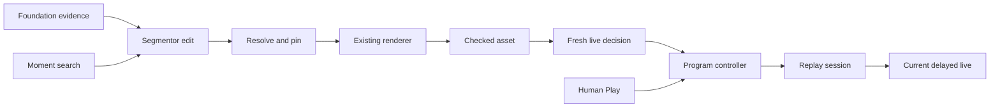

# Timely replays and retained moment search

**Updated:** 2026-10-09

Task 3 now has application paths for retained-file preparation, typed segmentor
output, ready-replay director intent, archive playback, and moment search.
Full local acceptance remains open. The [evidence record](evidence/timely-replays.json)
separates executed checks from missing conditions. Live providers and physical
phones remain unverified. Use [PRD 20](20-timely-replays-and-broadcast-validation-prd.md)
for the acceptance gates.

The foundation owns evidence, files, and pins. The segmentor selects an edit.
The director makes a fresh airtime decision. Only the program controller admits
playback. A ready file does not grant airtime.



## Use the Studio

Open **Replays**, enter a description in **Find a moment**, then select **Search**.
The result shows its original camera, native source interval, availability, and
index freshness. Fixture ranking is labeled **Simulated fixture ranking**.
Select **Prepare replay**. Preview the ready file, then select **Play replay**.
Search, preparation, and preview keep the program player mounted. Play takes
human control. Each pending preparation has its own Cancel button.

Source identity is the original lease path and epoch. A camera slot is a display
label. Slot reuse does not replace retained footage. Old hits can become invalid
when evidence, media, a scene revision, or index configuration changes. The
server checks the selected hit again. It does not substitute the new camera.

Automatic preparation requires `replay.enabled: true` in the foundation
configuration. An operator must start the program and release control. The
server must also have replay policy enabled. The director can propose a ready
asset only with reviewed positive quiet/stoppage/recap evidence and an eligible
live return source. Stage events require supplied recap policy. No detection,
a ready file, and elapsed cooldown do not establish a replay opportunity.

The director continues to read live context during replay. A typed urgent return
requires fresh evidence, a healthy reviewed source, and known timing at the
current delayed-live position. Human return and normal completion need no model.
Unknown timing blocks synchronized automatic interruption.

## Configuration and bounds

Use `config/replay.fixture.json` for labeled local fixtures and
`config/replay.live.json` as the unverified live template. They use the same keys.
Normal startup leaves automatic replay disabled. Keep endpoints and secrets in
provider configuration. A live adapter cannot fall back to fixture ranking.

`FoundationSettings.replay` validates the limits. Defaults include two shared
model workers, one active archive role, one pending search, one pending human
preparation and one pending automatic preparation. Human preparation takes the
next free render slot. One render runs at a time. There are at most 20 jobs and
100 query IDs per run. Retain terminal identity for retries.

Plans use at most six shots by default, at most twelve as a hard limit, 0.5×/1×/2×
speeds, and at most twelve seconds of output. Each shot is 0.2–6 native seconds.
Archive input is at most 32 distinct chunks and 256 MiB. Preparation memory and
scratch each have a 256 MiB limit. Two ready assets share 64 MiB for files and
frame cache. Active playback, preload, and preview protect an asset from eviction.

Source pins expire within the foundation's 60-second limit. Ready assets release
preparation pins. Playback reacquires them and checks all required source bytes
and the output hash before admission. Retention or correction invalidates
published dependencies before they can be used by the media loop. Source
retraction ends the accepted archive session and its narration. Buffer eviction
and live disconnect do not revoke correctly retained archive inputs.

Automatic candidates keep their original 30-second deadline. Their work deadline
also uses aftermath finalization plus fifteen seconds, and verified receipt plus
thirty seconds. Unknown receipt permits explicit recall only. Human recall has a
45-second preparation budget and 60-second plan eligibility from admission.
Queries have a five-second total budget. Local render waits use a monotonic clock.
An edit ending inside a chunk has no exact last-frame receipt from that chunk's
end receipt alone. That value stays unknown. Such an edit permits explicit
recall and skips automatic preparation until its required receipt is proved.

## Internal entry points

| Entry | Responsibility |
|---|---|
| `Registry.llm('segmentor', context, snapshot, deadline)` | Typed `SegmentorResult` with wait, abstain, or complete shot intent |
| `ReplayWork._prepare(candidate_id)` | One bounded snapshot, inspected images, result origin/reference checks, application-owned plan identity/deadline |
| `Foundation.resolve(source, interval, mapping_revision, owner, deadline_utc)` | Original media, hashes, manifests, complete coverage, bounded pins |
| `Foundation.register_mapping(TimeMapping)` | Separate immutable historical calibration; ready manifests remain unchanged |
| `replay_inputs.resolve_plan(app, plan, owner, deadline)` | Native/file transform, view evidence, geometry, mapping, edit and resource validation |
| `App.render(resolved=..., replay_id=...)` | The existing shared render worker; publishes readiness after validation |
| `ReplayWork.ready()` | At most two current automatic assets for director review |
| `Direction.dispatch(..., role='director')` | Reviewed replay intent translated to `Coordinator.propose(actor='Provider crew')` |
| `ReplayWork.preload(replay, owner, deadline)` | Hash/coverage checks and prepared playback ticket outside media locks |
| `Direction._context('commentator', original_source, snapshot)` | Accepted archive session and actual source frame; no current score or replacement identity |
| `ReplayWork.search(PublicSearchRequest)` | Run-scoped, bounded, idempotent public recall |
| `ReplayWork.prepare_hit(args, preparation_id)` | Existing stored hit → source/evidence review → normal preparation card |

`Foundation.search(SearchQuery)` delegates ranking to `Registry.query`. Its
fixture implementation is word matching. Tenant retrieval and semantic quality
remain live gates. Provider responses must pass application event/run/version
and evidence checks. Internal archive resolutions remain private to workers.

## HTTP operations

`POST /api/search` accepts exactly `{id, run_id, text, limit}`. Limit defaults to
five and cannot exceed ten. The server fixes event and index configuration.
`GET /api/search/{id}` reads an existing result for reload. Search has no takeover.

A selected hit enters the existing action envelope:

```text
{id, op: "prepare", args: {search_id, scene_id, scene_revision}, expected}
```

The three selection values must come from that stored query. Do not combine them
with a plan or one-camera controls. Job/action inspection, replay media, Play,
and Cancel use the existing routes. New search errors distinguish 422 invalid
fields, 409 identity/run conflicts, 404 missing references, 410 invalid selected
hits, 429 capacity, and 503 unavailable providers. An admitted job reports its
terminal result on the existing card.

## Repeat validation and inspect an actual request

```sh
./scripts/studio replay-check --diagnostic-seconds 12
./scripts/studio replay-check
```

The first command is partial and returns nonzero. It creates real closed,
labeled marker recordings through `Foundation.finalize`, issues analysis windows,
and ingests fixture results through the production coordinator. It runs the
browser form and calls the public search/prepare/preview/play APIs. It uses
current IDs and fresh deadlines. It needs no database seeding or manual JSON.

Read the generated `broadcast/archive/fixture.json` and
`broadcast/archive-recall.json` under the newest `.runtime/replay-checks/<run>`.
They contain the actual source hashes, manifests, scene IDs, query, safe hit,
preparation ID, output hash, and stage times. `broadcast/recall.png` records the
Studio result. `schemas.json` is generated from strict Pydantic runtime models.
The check closes its private server during cleanup. Do not reuse its expired
run IDs against another server. Rerun the command to issue a current request.

The complete command measures twenty distinct fixture preparations. It then
proves five minutes with one source and fifteen minutes with five sources and
three software viewers. Separate runtimes test encoder loss, gateway loss, and
confirmed shutdown. It also runs the inherited direction command, which includes
foundation and UI/media regressions. Every
missing condition stays in `report.json`; a partial pass cannot set
`local_ready: true`. Three software tabs do not close P01–P06.

Viewer continuity and encoded recording continuity have separate results. A
continuous file cannot erase a pause in the viewers. A failed viewer check still
saves its frame samples and recording decode result. The long failed rehearsal
remains in the evidence record. The Docker VM killed Chromium for memory
exhaustion in that run. The check runners now execute each unit suite and the
twenty-preparation measurement in short-lived processes. This releases their
media allocations before sustained work.
This change needs a fresh complete check; it does not erase the failed run.

Source discontinuity handling updates frame state under the source lock, then
performs lease and recorder work after releasing that lock. Shutdown stops the
recording scan between files before closing the evidence database. Cancellation
also applies during retained-frame decode and when a model response arrives.

Before live use, run `./scripts/studio foundation-capabilities --config
/opt/breadcast/config/replay.live.json`, complete the foundation and direction
connection checklists, then run L01–L05 and P01–P06 from PRD 20. Capability failure
is expected until actual tenant endpoints, media access, formats, models, index
versions, quotas, and speech are verified. No provider API is assumed by this
handoff.
