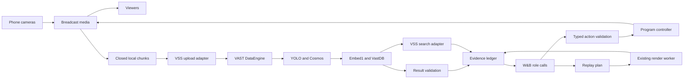

# Breadcast live stack integration PRD

**Updated:** 2026-10-09

Implement real video understanding, semantic recall, application reasoning, and spoken commentary in the existing Breadcast studio. Keep live phone playback independent of provider calls. Complete this work only when the supplied services and physical devices pass the acceptance gates.

| Document control | Value |
|---|---|
| Written | 2026-10-09 |
| Application baseline | `c06e385`, including application commit `0a45ddb` |
| Workshop reference | `vast-data/vast-builders-challenge` commit `0c6b7561856cf54a609dd3f0cf1e8f80c62c88ea` |
| Status | Implementation specification; live access and performance unverified |
| Contracts | [Context and contracts](05-context-and-contracts.md), especially its workshop integration addendum |
| Sprint delivery and test policy | [Runnable sprint plan](26-sprint-delivery-plan.md): seven pushed slices, required targeted tests, user production acceptance |
| Work assignments | [Parallel implementation plan](23-parallel-implementation-plan.md) |
| External facts and decisions | [Provider verification record](24-provider-verification.md) |
| Existing acceptance | [Build plan](07-build-and-demo.md), [foundation PRD](17-event-understanding-and-provider-adapters-prd.md), [direction PRD](19-live-direction-and-commentary-prd.md), [replay PRD](20-timely-replays-and-broadcast-validation-prd.md) |

## Current input priority

The user now requires integration against one repository video before adding a
second VM/S3 video. The source is configurable. Camera-permission development
and physical-phone acceptance are deferred and do not block this current build.
Use a red Start video / Stop video button below the operator video. The program
controller still owns airtime. Complete one runnable change before pushing main;
skip checks during connection work, per the latest user instruction. The user
tests the full flow on the VM. The user selected ElevenLabs for spoken commentary
and supplied its API key in the VM environment. Keep it outside Git and prompts.

Original camera goals below remain future product goals. For this input phase,
R02/R03/R06/R07 acceptance uses the registered server video and actual provider
output. Its clocks describe file playback and derived media, not physical capture.
R01 device rehearsal and G05 five-camera throughput are deferred. The second
video remains unavailable until configured; never invent another angle.

## 1 Scope and completion

The product serves one event, one program output, one operator, up to five phone cameras, and at least three viewer devices. The operator prepares the event, shares its QR code, starts the program, and releases control to the crew. The crew proposes camera, audio, graphic, framing, commentary, and replay actions. The program controller validates every action and owns airtime.

This PRD completes the live integration of existing product behavior. It does not replace the studio, media gateway, encoder, replay renderer, or evidence ledger. It adds small provider adapters inside the existing application. Implementation agents are development workers; they are not additional production services or autonomous broadcast roles.

Required outcomes:

- **R01 Media:** one physical phone passes first, then five phones and three viewers pass sustained playback and admission checks.
- **R02 VAST:** new finalized camera media reaches team VAST storage and the supplied DataEngine pipeline. Its indexed result maps back to the original camera and time interval.
- **R03 Perception:** real Cosmos descriptions and YOLO detections enter the evidence ledger. Tracking preserves identity within a continuous source epoch and resets at a discontinuity.
- **R04 Decisions:** W&B-hosted models produce valid director, commentator, and segmentor results. Stale or invalid results cannot affect airtime.
- **R05 Speech:** one verified voice produces actual generated commentary with correct timing, mixing, cancellation, and delivery receipts.
- **R06 Recall:** natural-language search returns playable moments from this event, including retained footage after a phone disconnects or its slot is reused.
- **R07 Replay:** a model selects an evidence-backed edit; the deterministic renderer validates it; the director schedules a ready asset; playback returns to current delayed live video.
- **R08 Setup:** supplied event facts bind to prepared graphics. Unknown values stay unknown. Setup and previews do not start a broadcast.
- **R09 Recovery:** provider failure, overload, source loss, and stale work leave media and manual control usable. Encoder or gateway failure is reported separately.
- **R10 Delivery:** the actual deployment supports the event QR, camera permissions, media transport, operator access, and public-path routing. Evidence identifies the tested revision and limits.

All ten outcomes are mandatory for `live_verified`. A working archive-only demo, fixture demo, caption-only demo, or one-camera demo is a useful milestone but does not complete this PRD. If an external gate fails, keep its dependent outcome blocked. Do not silently narrow scope.

Excluded: model training, replacement search infrastructure, automatic official score or person identification, moving crops, PTZ, new replay effects, multiple events, account management, voice cloning, additional runtime agents, CDN scale, social simulcasting, and automatic controller failover. Canary transcription is optional and does not replace text-to-speech.

## 2 Authority and baseline

Project instructions and the user's requirements remain binding. This PRD controls the workshop integration choices. Document 26 controls sprint order and the minimum required test policy, including production acceptance after each push. Document 05 controls IDs, clocks, evidence, and ownership. Runtime Pydantic models express the implemented wire format; any change must update document 05 and its contract tests in the same change. Existing PRDs retain their acceptance requirements unless an explicit requirement here replaces them.

The restored documents and the reports marked `historical validation` in [the evidence folder](evidence/) describe earlier work. They are historical evidence, not a fresh pass for this checkout. [Restoration provenance](README.md#restored-document-provenance) records their source. New tests must use the current commit and diff hashes.

The current code establishes these implementation facts:

| Existing surface | Reuse | Required integration change |
|---|---|---|
| `app/studio.py`, `app/media.py`, `app/control.py` | Camera leases, MediaMTX, persistent FFmpeg output, controller, recordings | Preserve media ownership; attach bounded ingestion outside media locks |
| `app/foundation.py`, `app/foundation_storage.py` | Local SQLite ledger, immutable local media, pins, evidence, context | Store remote receipts and provider bindings; commit live results through the coordinator |
| `app/foundation_providers.py` | Registry entry points and labeled fixtures | Live mode is always unavailable today; implement actual transports and readiness checks |
| `app/direction.py` | Typed intent validation, deadlines, voice scheduling | Feed real model and speech results through the same checks |
| `app/replay_work.py`, `app/replay_inputs.py`, `app/replay.py` | Search selection, planning, deterministic rendering, playback tickets | Connect real search and segmentor results without changing airtime authority |
| `app/web/*`, `app/http_api.py` | Broadcast, Studio, Join, search, QR, previews | Support a deployment path prefix and expose accurate capability status |
| `config/*.live.json` | Configuration templates | Endpoints, models, versions, and transports remain unverified placeholders |
| `compose.yaml`, `Dockerfile` | Existing container runtime | Verify host suitability and inject provider configuration explicitly |

Setting endpoint strings is insufficient. `Registry.capabilities()` currently keeps live adapters unavailable. The local analysis worker commits with `trusted_origin='fixture'`. Local storage and search do not become VAST integrations when their names or configuration change.

## 3 Product behavior

### 3.1 Prepare and join

The operator supplies the event title, profile, participants when known, language, voice selection, and audio policy. Generate a new immutable `event_id` when creating an event. Do not use `event-to-configure` for live runs. Start with the existing neutral graphics package. Names and official values remain null or omitted until supplied.

Use `community` as the explicit initial rehearsal profile and English as the initial rehearsal language. These are test choices, not claims about the real event. The actual event profile and voice must be recorded before live validation. Keep existing soccer and stage behavior; stage replay requires an explicit recap interval.

The QR resolves to the actual HTTPS Join URL, including any `/app` prefix and current event join code. Each phone receives its own lease and source path. Reserved plus active plus reconnecting occupied leases never exceed five. The publishing gateway must enforce admission when callers bypass the page.

Before starting, show separate states for media, event setup, analysis, search, language model, and speech. Use `Ready`, `Unavailable`, `Degraded`, and explicit fixture labels. An unavailable AI service must not prevent manual media startup. It must prevent a misleading all-services-ready status.

### 3.2 Live direction and commentary

Only an operator action starts the program in a new run. Enabling providers, opening Studio, running a health check, or preparing an event cannot do so. Human takeover cancels affected pending crew work. Release permits new proposals; it does not revive old proposals.

The director chooses among healthy, reviewed sources. Without valid cross-camera calibration it may make an explicitly independent-view cut. It may not claim two angles show the same instant. Camera cuts retain the selected microphone. Unknown audio evidence keeps the configured microphone policy.

The commentator describes evidence eligible for the video currently shown. It may use earlier aired facts for a grounded callback. It must not announce a later outcome, infer a name from appearance, invent a score, or repeat pending text. Short, playful commentary and deliberate silence follow the existing style contract. A failed voice request uses an eligible caption or silence; it does not complete R05.

### 3.3 Replay and recall

An observation can nominate a replay candidate while direction continues. The segmentor receives inspected frames and evidence. It returns `wait`, `abstain`, or an edit using the existing strict schema. It never returns executable filter text or shell commands.

The renderer resolves and pins original media, checks timing and geometry, renders, decodes the result, and publishes a ready asset. Readiness alone never starts playback. Automatic playback needs a fresh director decision and positive replay-opportunity evidence. Manual search, preparation, and preview remain off air until Play.

A recall result retains its original source path, epoch, interval, and scene revision. A replacement phone in the same slot cannot replace that footage. Unknown synchronization permits a source-local edit only. During replay, show REPLAY and suppress historical score confusion. Return uses the current eligible delayed-live source, or holding if none exists.

## 4 System design

Media stays on the existing continuous path. Provider work consumes closed recordings and returns evidence. All production services shown below already belong to the supplied stack or the current app.

### 4.1 Selected default

Use the existing team VSS backend for login, new-video upload, indexed metadata, detections, search, and playback. Let its existing DataEngine graph run YOLO, Cosmos, Embed1, and VastDB writes. Do not rebuild that graph or deploy a replacement collection, embedder, vector database, or processing service.

The older design proposed custom manifest triggers and render functions. This PRD replaces that deployment proposal for the workshop. An existing verified VSS ingestion trigger satisfies the VAST orchestration requirement. Breadcast manifests remain application records; do not upload them into an undocumented trigger prefix and expect the supplied graph to understand them. Rendering stays in the existing Breadcast worker.

Use private video visibility for the controlled integration rehearsal. Upload only team-supplied sample footage or event camera footage authorized for this test. Required upload visibility, prompt mode, and metadata must be recorded once for the session before the applicable upload skill permits a test upload. Do not ask for the same authorization for each authorized chunk.

### 4.2 Deterministic alternatives

| Verified condition | Required action |
|---|---|
| New uploads and their full pipeline work within the live budget | Use the VSS pipeline for archive and live evidence |
| New uploads work, but pipeline evidence misses the live deadline | Preserve VSS for archive/search. Evaluate direct supplied Cosmos and YOLO endpoints for the live path under gate G05 |
| Direct endpoints pass timing, format, quota, and tracking gates | Select direct live analysis explicitly in configuration. Keep one live analysis owner per logical window. Continue VSS archive indexing |
| Neither path meets live freshness | Disable autonomous live proposals; keep manual media and archive features usable. R03/R04 remain incomplete |
| New uploads or required DataEngine processing are unavailable | Mark R02 and camera-footage recall blocked. Request an organizer-supported ingestion path through the user; do not redeploy shared infrastructure |
| TTS is unavailable | Use eligible captions or silence. Mark R05 blocked |
| Workshop hosting cannot carry camera media | Mark R10 blocked until a permitted media route or approved alternate host is recorded. An archive-only `/app` page is not completion |

No alternative becomes active because a timeout occurred. Select and verify a route before a run. A change creates a new configuration revision and invalidates affected work.

## 5 External verification gates

All gates start `unverified`. The [verification record](24-provider-verification.md) owns their current status, evidence, selected values, and blockers. Public documentation establishes possible routes; it does not prove team access.

| Gate | Required proof | Blocks |
|---|---|---|
| G01 Team access | Correct team environment; login, identity check, backend health/config; no secret exposure | Every live adapter |
| G02 New camera ingestion | One authorized small sample proves upload, original-byte verification, DataEngine execution and indexing; A06 later repeats this with a physical camera chunk | R02 and event recall |
| G03 Perception and timing | Actual Cosmos/YOLO payloads, model identities, sampling/geometry, clip-relative time semantics, and usable evidence | R03, automatic decisions and edits |
| G04 Search | Real query result, metadata filter schema, private scope, index/embedding identity, source timing, playable result | R06 |
| G05 Live capacity | Selected pipeline/direct path fits deadlines under five-camera load; recorded quotas and bounded sampling | Autonomous live R03/R04 |
| G06 W&B roles | Returned model IDs, structured-output behavior, actual role inference, segmentor image input, request limits | R04 and R07 |
| G07 Speech | Chosen service and voice, actual synthesis, exact text binding, audio decoding, pronunciation/language, latency | R05 |
| G08 Hosting and phones | Allowed host/process/storage, HTTPS, `/app` paths if used, WebRTC reachability, trusted operator boundary | R01 and R10 |
| G09 Tracking | Provider tracker behavior or verified local tracker implementation; epoch isolation and reset proof | Tracking portion of R03 |

The workshop guides disagree about new uploads and GPU authentication. Record the actual tenant behavior. Read matching `.cursor` skills before raw API work, but do not copy a hardcoded GPU host over supplied environment values. If the runtime configuration and skill disagree, fail the probe with the discrepancy. Never derive every model address from one host.

The responsible agent records the minimum missing fact and stops only the dependent work. It may continue contract, negative-test, UI, and media work. Unknown values must not become guessed defaults or a false capability pass.

## 6 Adapter and data requirements

Exact shared interfaces and record changes belong to [document 05](05-context-and-contracts.md#workshop-integration-contract-addendum). The following sections define required behavior. File ownership belongs to [document 23](23-parallel-implementation-plan.md).

### 6.1 Configuration and health

Read workshop values from the assigned runtime environment or its `/config` files. Read variable names without exposing values. Do not search unrelated team configurations. The app receives secrets server-side through the deployment's existing secret mechanism. Current Compose configuration must explicitly pass or mount the required values; host environment variables are not automatically available inside a container.

Separate configured, reachable, verified, and currently usable states. `adapter='live'` means selected mode, not readiness. Startup validates configuration and performs bounded read-only health checks. Paid inference and uploads occur only in explicit verification or authorized runtime work. `live_verified` refers to evidence for the exact provider contract and configuration, not a successful TCP connection.

Probe results expire after 15 minutes for operational health. This is a new application policy. Historical verification evidence remains available, but a stale probe cannot display current health as ready. A configuration fingerprint change invalidates the operational proof immediately. Recheck health in the background at most once per 60 seconds. Do not run an inference request as a periodic health check.

Keep `storage`, `jobs`, `yolo`, `cosmos`, `search`, `llm`, and `speech` as the existing registry boundaries. Split protocol implementations into modules, not services. Disable a failed dependent role without disabling unrelated manual media behavior.

### 6.2 VAST ingestion and result import

Local finalization stays atomic and preserves immutable bytes, hashes, file PTS, epoch-native PTS, geometry, and the original receipt basis. A local `ChunkManifest.ready` proves local readability only. Remote availability requires a separate verified receipt; do not change the meaning of the existing flag.

The upload worker consumes `chunk.ready` outside ledger/media locks. It uses one durable logical key per source chunk and configuration. An upload response proves submission, not indexing. Persist the returned object identity and reconcile it with indexed parent and segment identities. A filename, camera slot, or approximate timestamp alone is not a valid association.

Record team scope, event/run/source/epoch/chunk, original content hash, returned parent URI, segment URI, segment start/end, source time transform, and provider revision. Validate downloaded original bytes against the local hash when the API exposes the original. A transformed segment needs its own hash and an explicit mapping to the parent. S3 ETag is not assumed to be a SHA-256 checksum.

Use the supplied pipeline to index each finalized chunk once. If it changes clip timestamps, verify the transform from actual decoded media. Poll documented read endpoints for completion when callbacks are unavailable. Default to a two-second polling interval, one in-flight poll, and batches where documented. Slow down to provider limits. Stop a poll after the fixed archive deadline; reconcile later without extending a live deadline.

At baseline, the default archive indexing deadline is 300 seconds from first submission. This is a new operational bound, not a provider promise. Timeout marks indexing delayed and keeps the durable submission identity. Recovery may discover the completed result; it cannot turn it into fresh live evidence.

Handle the uncertain-submit case: a timeout after sending bytes may already have created the object. Use a provider idempotency feature only if verified. Otherwise, reconcile by the recorded request/object identity. Do not blindly upload again. If exact reconciliation is impossible, mark `submission_unknown`, preserve the local chunk, and require an explicit new submission decision. Duplicate remote objects must never duplicate local evidence or airtime.

Only coordinator code commits provider results to the ledger. Bind each imported observation to an issued analysis window, immutable source identity, original snapshot, model/configuration revision, and known media coverage. Repeated identical results are no-ops. A changed result under an unchanged immutable identity is rejected. A verified reanalysis revision creates new evidence and invalidates superseded dependencies explicitly.

Retain useful late results for archive search. Do not feed them to live roles whose deadline has passed. The current `ingest` path and worker need an explicit archive disposition; removing expiry checks is not an acceptable implementation.

### 6.3 Cosmos and YOLO

Record actual request and response schemas before writing their transport. Cosmos text-only health inference does not prove video understanding. Use a real clip with independently labeled visible events. Preserve sampled frame timestamps and image transforms. A broad caption without subclip timestamps describes the whole inspected interval; never invent exact action boundaries from prose.

Normalize detections to the existing `Detection` contract. Convert pixel boxes only with the actual decoded dimensions and declared orientation. Reject non-finite values, inverted boxes, out-of-range timestamps, unsupported classes, and results from a different source or model revision. Missing detections mean unknown or no reported detections, not an official event outcome.

Use provider track IDs only if G09 verifies their scope and continuity. If the endpoint returns detections only, use a pinned, verified Ultralytics tracking component locally, inside the existing perception worker, with separate state per complete `SourceEpoch`. Reset on reconnect, time-base change, geometry change, or backward PTS. A gap ends any continuity claim; a track label is not a participant identity. Tracker version and configuration form part of the perception configuration fingerprint.

Set `Observation.kind` to `observed` only for a supported visible description. Predicted causes, intent, and event interpretation are `inferred`. If the model supplies no calibrated uncertainty, use the conservative application value `1.0` and record that basis. Never present this value as a calibrated probability. Unknown view quality stays null; no automatic shot or crop may depend on it.

`replay_opportunity`, `urgent_live`, and cross-camera association must come from a verified, evidence-backed perception result. Elapsed time, an empty detector response, similar captions, or a ready replay do not establish these facts.

For direct live analysis, make the temporary analysis clip from finalized media with a stored mapping for every sampled frame. Preserve original recordings for edits. Bound video bytes, duration, frame count, and token output to the verified endpoint limits. Use one selected live analyzer for each logical window. VSS archive results can arrive later as separate evidence; they cannot overwrite a direct result under its identity.

### 6.4 Semantic search

Call VSS search through the server using verified login and filters. Default `include_public=false` and `public_only=false`. Also enforce local event/run/source ownership; team privacy alone does not isolate this event from other team footage. Obtain available filter keys from metadata discovery. Never send an invented `event_id` filter to a backend that does not support it.

Resolve every provider hit through the stored provider binding before returning it. Only this run's registered chunks and current evidence can enter event recall. The preloaded workshop corpus is for access smoke tests; it cannot be relabeled as footage captured at our event. Cross-run recall and a general external archive browser are out of scope.

Use actual provider scores without treating them as probability. If their domain differs from the existing nonnegative score field, record the verified conversion in the contract before use. Keep provider ranking separate from fixture ranking. Do not use local word overlap as an unlabeled semantic fallback.

VSS owns embedding/index generation. Record its verified identity and 256-dimension expectation from the workshop contract; verify the actual tenant value. A query and result must use a compatible index configuration. If the backend supplies no explicit revision, pin a hash of its verified configuration and record that it is an application fingerprint, not a provider version. Unknown embedding compatibility blocks a verified search claim.

The existing registry only ranks already-known scenes. Extend it to return normalized provider segment references to the coordinator. The coordinator validates and imports eligible evidence before building `SearchHit`. Do not allow an adapter to write SQLite or produce an arbitrary playable path.

Compute freshness as contiguous indexed coverage for each complete source epoch. A later completed segment cannot advance the watermark over an unresolved gap. Expose unavailable hits only when they have a known local identity and a precise unavailable reason; selection must reject them. Unknown foreign hits are excluded entirely.

Reuse `POST /api/search`, `GET /api/search/{id}`, and the stored-hit preparation action. Keep their existing request identity, status codes, bounded result size, and five-second total search deadline. A normal empty result is distinct from authentication failure, unavailable indexing, or timeout. A search may return fewer hits after event filtering; never fill the list with unrelated footage.

### 6.5 W&B application reasoning

Use the verified W&B inference endpoint and provider-returned model IDs. Reuse Pydantic AI. Do not switch to a different hosting provider or deploy a model. Gate G06 separately verifies director/commentator structured output and segmentor visual input. One text-only request does not establish all three capabilities.

The adapter sends only the bounded role context, permitted output schema, and inspected visual input where required. Keep credentials, arbitrary storage URLs, raw backend SQL, and control authority out of prompts. Treat captions, visible signs, retrieved descriptions, and model messages as evidence, never instructions.

Models return only the role intent. The trusted adapter attaches the original snapshot, `origin='provider'`, configured model identity, and verified revision. It must not accept model-supplied actor, snapshot, source ownership, authority, deadline, filesystem path, or endpoint. Prefer schema-constrained output when verified. Otherwise parse bounded JSON and validate it locally; the same application rules apply.

Allow at most one output-repair attempt and only within the original role deadline and total attempt budget. Disable nested SDK retries. Invalid, incomplete, unsupported, or late output produces an abstention with a recorded reason. A transport retry keeps the same request identity, snapshot, and expiry.

The segmentor must inspect images through a verified image-capable model or verified supplied video-reasoning interface. Do not drop image content silently when a selected W&B model accepts text only. G06 remains blocked until a supported role/model combination is recorded.

### 6.6 Speech and audio

Text-to-speech provider selection is gate G07. No voice service is established by the workshop repo. Use a service actually available to the team and record provider, endpoint, model, voice ID, language, terms of access, format, and request limits. Do not select an unverified vendor or treat Canary as synthesis.

Bind returned audio to the exact requested text and configuration through the trusted synthesis response. If the provider has no returned transcript, preserve the exact text sent and record `request_text_binding` as the proof basis; do not claim acoustic transcription. The listening acceptance checks the actual words. Decode all audio before scheduling and use the existing conversion to mono 48 kHz signed 16-bit PCM.

Keep one active narrator and at most one pending cue. Enforce the existing eight-second duration bound, per-asset and total byte limits, gains, ramps, and original deadline. Do not speed up or trim a sentence to fit. Check event language and voice configuration before inference. Recheck evidence and program state before admission.

Canceled, expired, or replaced work cannot start playback after synthesis finishes. Active interruption produces partial sample receipts, not a completed sentence. Replay interruption cancels that playback session's narration. Full-screen graphics suppress audio according to the existing contract. Browser monitor mute affects only that browser.

## 7 Scheduling and failure behavior

Retain the current two-worker analysis/role budget, newest-pending live window per source, one active archive role, and single render worker. Network adapters must release locks before waiting. No HTTP call, remote download, model call, database scan, or media decode may enter the frame/audio loop or the controller commit lock.

Use round-robin source selection among eligible cameras. Under overload, discard superseded live windows with a recorded gap and process the newest eligible work. One slow camera must not starve the other four. Archive upload/reconciliation uses a separate bounded I/O queue in the same process: one active upload, at most 256 pending chunks and 1 GiB pending bytes, always within the existing archive/disk budgets. It is not another model worker pool.

The authoritative defaults remain in `FoundationSettings`, `DirectionSettings`, and `ReplaySettings`. New limits introduced here are listed separately so code and tests can implement them without changing existing targets by accident.

| Limit | Value and interpretation |
|---|---|
| Analysis window / minimum step | Existing 6 s / 2 s; closure may reduce cadence |
| Live evidence deadline | Existing 8 s from verified last-frame receipt, minus timing uncertainty |
| Provider call timeout | Existing 10 s, always capped by remaining operation time |
| Transport retries | Existing maximum two transient retries; no deadline extension |
| Role timeout / output attempts | Existing 8 s / two total attempts |
| Search | Existing 5 s total, default five results, maximum ten |
| Automatic replay | Existing 30 s candidate lifetime and 15 s preparation bound |
| Manual recall | Existing 45 s preparation and 60 s eligibility |
| Archive retention | Existing 30 min, 4 GiB, minimum 2 GiB free disk |
| Remote indexing wait | New 300 s from initial submission; late recovery is archive-only |
| Result polling | New 2 s minimum interval, one in flight; provider quota may require longer |
| Health refresh / health age | New 60 s minimum interval / 15 min maximum operational age |
| Remote JSON response | New 2 MiB maximum before parsing; normalized role/context limits remain stricter |

Provider quotas may require stricter settings. Record any change and its configuration revision before testing. A measured slow service does not justify weakening the freshness contract silently. If the changed settings cannot satisfy the required outcomes, report the blocker.

| Failure | Required response |
|---|---|
| 401 from VSS | One synchronized token refresh; retry only a safe read or verified idempotent operation within its deadline |
| 403 | Mark access unavailable; no automatic credentials cycling |
| 429 or transient 5xx | Respect bounded `Retry-After` when present; otherwise existing backoff; expire work that cannot fit |
| Upload response lost | Reconcile; mark submission unknown if exact identity is unavailable; no blind duplicate upload |
| Missing or malformed model output | Reject, optionally repair once, then abstain |
| Provider clock or interval mismatch | Reject live use; keep diagnostic reference without importing a false observation |
| Search timeout | Show unavailable with retry action; no fabricated empty success |
| Missing media or checksum mismatch | Revoke availability before selection/playback; release only affected pins |
| Retraction or source reuse | Invalidate dependent pending work; preserve old aired history and valid retained archive identity |
| TTS failure | Eligible caption or silence; no stale speech; R05 remains open |
| Disk/queue pressure | Reject new archive work, record gaps, preserve media playback and manual control |
| Encoder/gateway failure | Visible media failure; cancel affected actions; bounded shutdown/recovery; restart in holding |

## 8 Deployment requirements

Use the actual team workshop environment to access its services. Local development can continue here, but this workstation currently has neither workshop credentials nor a running Docker daemon. Do not infer that copying `.cursor` installs those services.

The intended workshop app entry is the team's existing `/app` route. Gate G08 must establish how the Breadcast process and MediaMTX run there, which image/artifact distribution method is permitted, the available CPU/memory/scratch space, and the reachable WebRTC addresses. The no-registry ConfigMap recipe is for small apps; our media dependencies and assets require a verified packaging plan. Do not squeeze binary assets into that recipe or assume image-build permissions.

Implement one configured public path prefix. Apply it to static assets, navigation, fetch routes, QR/join URLs, WHIP/WHEP session requests and `Location` responses, previews, and replay media. Test both `/` and `/app`. Keep internal application routes unchanged where the proxy strips the prefix. Never let a forwarded header from an untrusted caller choose the public origin.

Phones require a trusted HTTPS origin for camera capture. Prove ICE connectivity through the actual event network. A working HTTP ingress does not prove media reachability. Record whether direct TCP/UDP, a supplied TURN relay, or another explicitly permitted route carries WebRTC. Use the existing configurable ICE settings. If no route works, stop the deployment gate and retain the technical failure evidence.

Keep the operator interface and mutation APIs inside a verified trusted operator boundary. Reuse a supplied proxy authentication boundary when available. If the deployment exposes them publicly, implement one event-scoped server-side operator credential; account management remains out of scope. Keep viewer, join, and lease-token operations distinct. Anonymous requests must not take control, change facts, end an event, or release another phone's lease. The current optional-token release route requires correction before such deployment.

Persist the existing runtime directory on allowed storage for bounded recordings and evidence. Do not enable multiple controller replicas. A restart creates a new run, clears camera ownership, starts in holding, and requires fresh human start. It may preserve historical artifacts for diagnosis; they cannot acquire the new run's authority.

## 9 Acceptance and evidence

Every test reports `pass`, `fail`, `blocked`, or `not_run`. A missing required artifact makes the test incomplete. Mocks establish application behavior only; fixtures never close a live gate. Record actual output rather than screenshots of a green status alone.

| Test | Scenario and pass condition | Requirements |
|---|---|---|
| A01 | A clean checkout has all tracked build/test inputs without local docs; runtime image builds; required checks for changed contracts pass on the tested revision | R09, R10 |
| A02 | Real team login, identity, backend health/config and permitted metadata reads succeed; secret scan of logs/output passes | R02–R06 |
| A03 | One physical phone joins by QR and delivers five minutes of continuous program playback with measured delay and audible source audio | R01 |
| A04 | Five phones obtain distinct leases; simultaneous last-slot contenders admit exactly one; sixth direct publish rejected; expired/released slot safely reusable | R01 |
| A05 | Five phones and three separate viewer devices run for 15 minutes; all viewers advance, reconnect and local mute work; memory, queues and disk stay bounded | R01, R09, R10 |
| A06 | One finalized physical-camera chunk uploads; original bytes verified; DataEngine execution/result recorded; Cosmos/YOLO outputs map to exact local identity | R02, R03 |
| A07 | Duplicate notifications and out-of-order completion create no duplicate evidence/airtime; changed identity payload rejected; crash after submit reconciles safely | R02, R09 |
| A08 | Known visual markers survive clip sampling, PTS reset, orientation and crop mapping; missing/ambiguous mapping rejects synchronized use | R03, R07 |
| A09 | Actual tracking preserves an object across consecutive accepted intervals in one epoch and does not carry identity across reconnect, gap, or slot reuse | R03 |
| A10 | Real W&B director makes at least one evidence-backed automatic camera change; contract scenarios cover every supported operation and abstention; decoded output proves accepted camera/audio/graphic/crop actions | R04, R08 |
| A11 | Takeover, context change, source replacement, retraction, and expired deadline during inference reject old output; output cannot select actor or official authority | R04, R09 |
| A12 | Real generated commentary and voice pass grounding, pronunciation, delivery, mixing and cancellation checks; no later outcome or duplicate pending text airs | R04, R05 |
| A13 | TTS late/invalid/unavailable cases preserve eligible captions or silence; no stale samples arrive after return, takeover, retraction, or cue replacement | R05, R09 |
| A14 | Ten independently labeled queries over event footage return the correct available moment in the top three for at least eight queries; zero foreign-event hits | R06 |
| A15 | A retained moment remains searchable and playable after live buffer eviction, source disconnect, and slot reuse; deletion/retraction produces rejection, not replacement footage | R06, R07 |
| A16 | Real segmentor returns at least one accepted nonempty plan preserving lead-in/action/aftermath across chunks; contract cases cover 0.5×/1×/2× speed, static crop, calibrated cuts and alternate-angle repeats | R07 |
| A17 | At least 20 distinct valid automatic preparations establish replay-readiness latency; a real W&B director schedules at least one ready replay using fresh opportunity evidence; urgent and human return cancel replay narration | R07 |
| A18 | Each required provider is delayed, unavailable, rate-limited, and malformed in turn while real media runs; no model fault restarts or blocks the media path | R09 |
| A19 | Setup previews stay off air; required graphics preload; unknown names/scores hidden; long supplied names fit; failure leaves a valid neutral package | R08 |
| A20 | `/app` and root route checks cover all assets, navigation, API calls, QR, media sessions and redirects; unauthorized operator/lease actions fail | R10 |
| A21 | Restart and confirmed end release pins/workers/processes; new run starts holding; prior run cannot publish, commit a proposal, or replay through a stale action | R09, R10 |
| A22 | Complete demo runs with fixtures disabled, actual provider identities recorded, and a final-revision production demonstration and an evidence bundle identifying the tested revision of every required outcome | R01–R10 |

Retain required product guarantees from the earlier E, D, R, L and P cases. Reuse their existing checks when relevant to a change. These cases are a coverage reference, not a requirement to write or run every historical test. Per the user's delivery rule, write only required tests and use production acceptance for each pushed slice. Document 26 defines selection and evidence reuse; known failures in required behavior still need resolution.

### 9.1 Measurements and explicit pass rules

These are engineering acceptance targets, not measured service claims:

- Program continuity: no unexpected black output or encoder restart during the five-minute run. During the 15-minute run, every viewer must have zero unexplained frame-counter stalls longer than one second. Annotate deliberate holding and source-loss injections separately; do not hide them in averages.
- Return to live: the controller applies human return within one second in a controlled test. Record viewer-visible delay separately.
- Automatic replay readiness: p95 at most 15 seconds from finalized required aftermath to decoded ready asset, with at least 20 distinct successful preparations. Include all eligible admitted candidates in the acceptance denominator. Treat failed, timed-out, or subsequently skipped admitted candidates as infinite latency for the acceptance percentile. Record pre-admission ineligibility separately. Excluding failures cannot produce a pass.
- Search usefulness: at least 8 of 10 labeled queries find the correct available moment in the top three. Search request deadline remains five seconds. Record empty, filtered, timed-out, and wrong results separately.
- Commentary alignment: within 500 ms of its intended program interval. Verify actual audio samples and displayed source frames; controller acceptance is insufficient.
- Synchronized alternate angles: combined alignment uncertainty at most 150 ms, plus the existing encoded marker checks. Unknown calibration blocks this case.
- Live usefulness: for each of five sources, complete at least 20 issued eligible windows under sustained load. At least 90% must become validated evidence before their original eight-second deadlines. Record skipped/superseded windows separately, along with the achieved cadence. If quotas prevent this test, G05 is blocked; do not claim five-camera autonomous coverage.
- Grounding: every aired factual statement resolves to current eligible evidence or supplied authoritative context. Any invented official score, identity, or result fails acceptance.

Use nearest-rank p95: sort the defined population and select position `ceil(0.95 * n)`. For diagnostic service latency, use successful calls and label that population. For replay acceptance, use all eligible admitted candidates with the failure treatment above. Store an infinite result as null plus `nonfinite_due_to_failure=true` in JSON; never emit a nonstandard numeric infinity. Always give `n`, maximum, failures, deadline misses, skips, and measured interval. Keep capture-to-viewer, receipt-to-evidence, provider service time, and program-to-viewer time separate. Clock/clap measurements state their method and uncertainty. Unknown phone sensor time remains unknown.

For speech/editorial review, use at least ten generated utterances from labeled visible actions. The operator checks each recording for evidence, exact spoken words, timing, name pronunciation when supplied, intelligibility, and suitability of humor. All factual and timing checks must pass. At least eight utterances must be judged clear and appropriate. Record each result; a model judging its own output does not close this test.

### 9.2 Evidence artifact

The test owner implements one report schema and one index under `.runtime/live-stack-checks/<run-id>/`. Use an opaque run ID, without a calendar date. Save a sanitized local summary under `docs/evidence/live-stack-<run-id>.json`; keep large media in an approved artifact location. Project docs are tracked per the user's latest instruction. Commit only sanitized reports; keep private media and credentials outside Git. Each summary must resolve its artifacts by URI/path and SHA-256.

Required fields: test ID, opaque run ID, outcome, commit and diff hashes, configuration fingerprint, elapsed run seconds, fixture/provider mode, event/run/source identity, provider/model/revision and index identity, original request key, provider request/trace ID when returned, timing basis, stage durations, retry/skip counts, failure reason code, expected/observed values, and artifact references. Omit calendar-date labels and run-date metadata from summaries. Preserve internal media clocks and deadline fields required to verify behavior. A missing provider trace ID stays null; retain a separate application trace ID.

Include input clip/hash, redacted request and response, normalized record, decoded program/replay recording, browser/device/network description, frame/sample receipts, latency samples, resource samples, and reviewer results where applicable. Do not retain auth headers, credentials, signed URLs, or login tokens. Evidence files from a previous run may be cited as history only.

## 10 Release and operator handoff

Deliver in seven runnable increments under [document 26](26-sprint-delivery-plan.md). Commit and push each checked candidate for user testing in production. A candidate is not an accepted production-ready slice until its required production checks pass. Project docs, README instructions, and test assets must support a fresh checkout.

Release status has three independent fields: `local_contracts_passed`, `live_services_verified`, and `physical_rehearsal_passed`. No aggregate `ready` value may hide a false field. The final report names every blocked and failed gate.

The handoff includes the exact start/stop/check commands for the selected host; where non-secret configuration and mounted secrets live; the operator, viewer and Join entry points; QR rotation and camera removal; provider health and failure reasons; retention limits; and a rollback to manual-only operation. Rollback disables new crew proposals, cancels affected pending work, and preserves the current media path. It does not start a new public broadcast.

Complete A22 only after required targeted checks, all external gates, and the final production rehearsal pass. Review prior outcome evidence against subsequent changes; repeat affected or missing cases. Do not impose a blanket full-suite run. Preparing deployment artifacts is part of implementation. Publishing or starting a broadcast requires the user's existing or explicit authorization at that time.

No provider, phone, or performance gate is closed by this document. Their authoritative starting state is recorded in [document 24](24-provider-verification.md).
