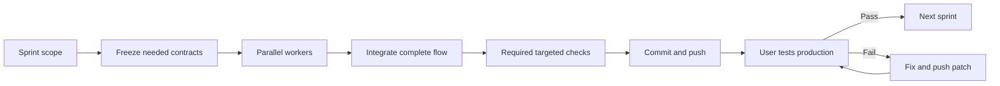

# Breadcast parallel implementation plan

**Updated:** 2026-10-09

Implement [PRD 22](22-live-stack-integration-prd.md) with one integration coordinator
and independent work packages. Freeze shared contracts before adapters start.
Merge through one branch. Every package must deliver code, targeted tests, and a
clear handoff. A package marked complete does not establish full product readiness.

This plan assigns implementation work. It does not start agents, deploy resources,
upload footage, or publish a broadcast by itself.

## 1 Start here

Every agent reads these sources in order:

1. Root `AGENTS.md` and `README.md`.
2. [PRD 22](22-live-stack-integration-prd.md).
3. [Contract authority](05-context-and-contracts.md), including the workshop addendum.
4. Its package below and [provider verification](24-provider-verification.md).
5. Relevant Breadcast skill and the matching `.cursor/skills/*/SKILL.md` before provider calls.
6. The existing implementation files it will change and their current tests.

Do not replay historical setup commands or evidence as current proof. Do not edit
the workshop skills merely to hide a mismatch. Report a verified mismatch and
adapt our integration contract through the coordinator.

## 2 Scheduling and dependencies

Use [the sprint delivery plan](26-sprint-delivery-plan.md) as the release order.
W00–W07 below define responsibility, not release-sized batches. Implement only
what the active sprint needs. Complete its user flow, push its checked candidate,
and give the user its production test checklist before the next dependent slice.

With four available agent slots, run one coordinator and at most three workers.
The coordinator publishes only the shared contracts needed for the current sprint
before workers edit adapters. Queue remaining specialists as slots become free.



| Sprint | Release outcome | Packages used |
|---|---|---|
| S01 | Clean checkout and one-camera broadcast | W00, W01, W06, W07 |
| S02 | Manual five-camera studio | W00, W06, W07 |
| S03 | VAST, Cosmos and YOLO evidence | W00, W01, W02, W03, W06, W07 |
| S04 | Search and model-edited manual replay | W00, W01, W04, W05, W06, W07 |
| S05 | Real live director and takeover | W00, W01, W03, W05, W06, W07 |
| S06 | Grounded spoken commentary | W00, W01, W05, W06, W07 |
| S07 | Automatic replay and complete event | W00, W05, W06, W07 |

Investigate later gates while the user tests, but keep unaccepted dependent work
off the delivery branch. Verify external request contracts before implementing
transports. Missing production proof stays pending until the user's production
session; a candidate is not an accepted slice.

Package test lists below describe relevant risks, not a requirement to create
one new test per listed case. Write and run only required tests for the changed
behavior. Reuse existing coverage. Follow document 26's minimum test policy;
it supersedes earlier blanket full-suite requirements.

## 3 Branches and file ownership

Use isolated worktrees rooted outside another agent's worktree. Base each worker
on the coordinator's published seam commit. Branch names use
`work/sNN/wNN-<topic>`; the cumulative release branch is `delivery/live-stack`. Do not change branches in another agent's checkout.
Do not force-push, reset, or overwrite user changes. Each worktree uses its own
runtime directory and test port allocation; only one owner runs a shared venue
camera session at a time.

Project documents are tracked in Git, per the user's latest instruction to
remove `/docs/` from `.gitignore`. New worktrees receive the committed PRD,
contracts, examples, and sprint plan. Record their bundle hash in the handoff and
refresh it after a contract change. Do not commit private recordings or secrets.

The coordinator publishes a shared-file owner table before work starts. The
following is the initial assignment. A file absent from a package's allowlist
requires a requested coordinator change, not a concurrent edit.

| Owner | Exclusive files |
|---|---|
| W00 coordinator | `app/provider_contracts.py`, `app/providers/__init__.py`, `app/providers/runtime.py`, `app/foundation_records.py`, `app/foundation_providers.py`, `app/foundation.py`, `app/foundation_worker.py`, `app/foundation_cli.py`, `app/studio.py`, `app/control.py`, `app/direction.py`, `app/replay_work.py`, `app/replay_inputs.py`, `app/replay.py`, `app/foundation_storage.py`, `app/live_timing.py`, `app/media_provenance.py`, `app/media.py`, `app/direction_media.py`, `app/graphics.py`, `config/*.json`, `requirements.lock`, `docs/05-context-and-contracts.md`, current PRD and plan |
| W01 access owner | Sanitized discovery output under its private runtime directory; proposed updates to document 24 delivered to coordinator; no app mutation |
| W02 ingestion owner | `app/providers/vss_ingest.py`, `tests/unit/test_vss_ingest.py`, `tests/fixtures/providers/ingest/*` |
| W03 perception owner | `app/providers/perception.py`, `app/providers/tracking.py`, `tests/unit/test_provider_perception.py`, `tests/fixtures/providers/perception/*` |
| W04 search owner | `app/providers/vss_search.py`, `tests/unit/test_vss_search.py`, `tests/fixtures/providers/search/*` |
| W05 reasoning owner | `app/providers/wandb_roles.py`, `app/providers/speech.py`, `tests/unit/test_provider_roles.py`, `tests/unit/test_provider_speech.py`, `tests/fixtures/providers/roles/*`, `tests/fixtures/providers/speech/*` |
| W06 deployment owner | `Dockerfile`, `compose.yaml`, `.env.example`, `docker/*`, `app/http_api.py`, `app/web/*` excluding vendor/fonts/brand assets, `tests/browser/provider-ui-check.cjs`, `tests/unit/test_deployment_access.py`, `deploy/workshop/*`, `docs/25-live-deployment-runbook.md` |
| W07 validation owner | `tests/media/live_stack_check.py`, `tests/media/provider_contract_check.py`, `tests/browser/live-stack-check.cjs`, `tests/unit/test_live_stack_report.py`, `tests/fixtures/providers/acceptance/*`, local `docs/evidence/live-stack-<run-id>.json` |
| Coordinator after handoff | `scripts/studio`, root README, shared test runners and existing tests not listed above, documentation index, verification record |

New provider modules are an internal Python package. They are not new services.
W00 creates only the shared runtime needed by verified adapters: HTTP bounds,
session refresh, error types and cancellation. Avoid a general plugin framework.

An adapter agent sends dependency requirements and exact verified versions to
W00. W00 updates the lockfile once, resolves compatibility with Python 3.13 and
the pinned container, and runs the affected tests. Agents do not each regenerate
the dependency lock or add their own HTTP/LLM framework.

## 4 W00 Shared contracts and integration

**Outcome:** every worker can implement an independent adapter against a stable
boundary, and real results enter the existing control system safely.

Required work:

1. Inspect current dirty state and record the starting commit. Verify restored
   examples and Docker COPY sources. Do not treat restoration as a passing build.
2. Implement the document 05 `workshop-1` models, ports, configuration, error
   codes, and JSON Schema export. Preserve existing fixture tests and data shapes.
3. Add the shared runtime client and bounded VSS login/token refresh. Publish
   explicit keys for public path prefix and operator access to W06. Credentials
   remain outside serialized public config and role context.
4. Add injectable adapters to the existing registry. Unimplemented live ports
   must return `capability_unverified`, not fixture output.
5. Publish seam commit, schema hash, minimal valid fixture per new record, and
   a targeted import check for the ports added in this sprint without network access. Give workers the same
   input/output examples and safe failure codes.
6. Add coordinator-owned remote submission/binding records and durable cursors
   using existing transactions. Make upload and result import independent of the
   frame loop. Add explicit archive-only import for late provider evidence.
7. Wire provider origin through analysis ingestion. Remove the unconditional
   fixture origin only through a trusted selected-adapter path. The response
   cannot choose its origin.
8. Replace rank-only search wiring with provider reference resolution and
   coordinator import. Preserve public search and selected-hit behavior.
9. Integrate real role/speech adapters through existing direction and replay
   validation. Preserve original snapshots and actor ownership.
10. Add fair source scheduling and shared limit accounting. Test newest-window
    replacement, cancellation, duplicate delivery, crash recovery and no lock held
    during provider I/O.
11. Merge worker changes in dependency order. Update docs/configuration and run
    targeted regressions after each integration. Use the current sprint production checklist;
    repeat earlier cases only when changes or failures require it.

**Exit:** versioned schemas are frozen; W02–W07 can use the published seam; legacy
affected fixture checks still pass; provider results cannot bypass controller/evidence checks;
the integrated report passes A01/A07/A08/A11/A18/A21 as applicable. W00 owns final
R01–R10 status and cannot mark another package's missing live proof complete.

## 5 W01 Access and capability discovery

**Outcome:** document 24 contains real tenant facts sufficient for adapters.

Read `.cursor/skills/retrieval/login`, `deployment/health`, `retrieval/list-metadata`,
`gpu/model-health`, and the matching inference/upload skills. Resolve the assigned
team environment; never request secret values in chat. If this session lacks the
workshop environment, record the blocked probes and the minimum connection step.

Run read-only health/identity/metadata probes first. For each authorized smoke
test, record one real request/result, returned model identity, exact format,
permissions, request limits, observed latency, and a sanitized response fixture.
Treat organizer confirmation as an access statement; actual request success is
still required. Verify G01–G09 with their assigned specialists where needed.

For uploads, use one selected private test clip and the agreed analysis prompt.
Record its checksum and visibility. Do not re-ingest the entire shared corpus.
For W&B, verify actual role model availability and image support separately.
For TTS and hosting, collect the concrete service/host and proof, not a guessed
product name or deployment diagram.

**Exit:** each gate has `verified`, `blocked`, or `failed` with evidence and exact
remaining facts. No required gate stays vague. Deliver sanitized fixtures to the
appropriate owner; the coordinator saves the authoritative local record. A blocked
gate is a valid discovery result but not live acceptance.

## 6 W02 VAST ingestion adapter

**Depends on:** seam commit; G01 and G02 verified before real transport code.

Implement `VssIngest.submit` and `reconcile`. Use verified upload fields and limits.
Preserve returned object identity. Verify original bytes and normalize indexed
segment references. Follow the existing VSS pipeline; do not deploy functions.

The adapter returns state proposals/receipts. W00 owns their durable commit and
queue scheduling. Support cancellation, response limits, one-file requests,
safe token refresh, ambiguous submission recovery, and bounded polling. Do not
implement a second evidence ledger or call controller methods.

**Tests:** real encoded local MP4 against an injectable HTTP server; rejected
format/size; 401/403; 429; upload timeout after acceptance; duplicate completion;
out-of-order segment arrival; wrong hash; expired playback URL; missing original;
newly indexed parent; unsupported new upload. No success means searchable until
the indexed media can actually be read.

**Exit:** targeted tests pass; A06/A07 have real tenant evidence where access is
available; returned receipts conform to frozen schemas. Record actual closure,
upload, pipeline, and import latency separately. R02 stays blocked without a
physical-camera chunk proof.

## 7 W03 Perception and tracking adapter

**Depends on:** seam commit; G03; G09; G05 for direct live mode.

Implement deterministic conversion of verified VSS descriptions/detections to
`AnalysisBundle`. Preserve source/time transforms and both model identities. Add
direct supplied-model inference only if the default pipeline fails the live
budget and the alternate path is verified. Publish the exact clip/frame map.

Determine tracker ownership from actual responses. If detections are stateless,
use the verified local tracking component under the same worker and source state.
Send its pinned dependency requirements to W00. Do not use one tracker for all
cameras or carry tracks across a reset. Full-frame output remains the fallback
when subject tracking or geometry is weak.

**Tests:** timestamp zeroing per chunk; nonzero original PTS; variable frame rate;
rotation/padding; detection outside interval; conflicting captions; no calibrated
confidence; unknown view quality; prompt injection in visible text; track reset;
five interleaved streams; delayed results. Include labeled real-media examples,
but keep their labels separate from real model responses.

**Exit:** W00 can ingest returned bundles without special-case bypasses; A08/A09
pass; G03 identifies actual timestamp semantics; G05 records live cadence and
deadline pass rates. Generic people detection cannot be reported as reliable
goal, ball, or participant identification.

## 8 W04 VSS semantic search adapter

**Depends on:** seam commit; G01/G04; W02 receipt/binding format.

Implement verified search/metadata retrieval with private scope and bounded
results. Return provider references and scores, not fabricated local scene IDs.
The coordinator handles event/run mapping and media resolution. Disable optional
backend synthesis when the verified API supports that option and it saves the
five-second search budget; do not assume undocumented flags.

Keep query/index identities compatible. Preserve nullable or unsupported metadata
without inventing filters. Return distinct empty-result, deadline, auth, version,
and unavailable-media outcomes. Do not introduce a separate embedding model or
search database.

**Tests:** foreign team/event/run results; mixed original/segment URIs; missing
timing; wrong index version; private/public scope; negative/non-finite scores;
duplicate hits; pagination cap; no matching local binding; stale retained media;
source slot reuse; zero results; 401 refresh and timeout.

**Exit:** targeted tests pass; A14/A15 pass with the integrated coordinator; top-3
quality uses ten labeled event queries, not the labels as ranking logic. Search,
preview and preparation must never submit an on-air action.

## 9 W05 W&B reasoning and speech adapters

**Depends on:** seam commit; G06 for W&B; G07 for speech; existing typed roles.

Implement both adapters in separate files so they can be split between workers
later without changing their interfaces. Reuse Pydantic AI and the shared retry
budget. Attach trusted metadata after parsing role intents. Validate segmentor
image support with real inspected images. Render plans remain application-owned.

Speech uses the selected verified service. Preserve exact request text, voice,
language, pronunciations, decoded audio format and measured duration. Return a
scratch artifact for registry publication. Do not call the media mixer directly.

**Tests:** malformed JSON; unknown operations/fields; missing evidence; injected
instructions; changed snapshot; token/output limits; one repair and exhausted
budget; cancellation during inference; image rejection; partial/invalid audio;
text mismatch; oversized/long audio; voice/language mismatch; late completion.

**Exit:** real W&B output and generated audio pass A10–A13/A16 with integrated
validation. Include the ten-utterance listening review. If no voice service is
available, W&B work may finish independently, but R05 and this package's speech
portion remain blocked.

## 10 W06 Hosting and UI integration

**Depends on:** W00 public config seam; G08 before deployment-specific work.

Keep current layouts and controls. Add path-prefix support and accurate provider
status. Implement trusted operator access if the selected deployment requires it.
Correct anonymous lease release and test own-lease tokens versus operator rights.
Coordinate any `studio.py` changes through W00.

Prepare the actual permitted package/container plan, configuration injection,
runtime storage, readiness/liveness checks, and start/stop procedures. Use the
team `/app` entry when that is the selected workshop path. Verify gateway/session
rewrites and media reachability independently of page loading. Do not deploy the
VSS stack or create a new hostname without the selected host plan authorizing it.

**Tests:** root and `/app`; every page asset/fetch/navigation; QR prefix and code;
WHIP/WHEP `Location`; API errors under prefix; unavailable provider display;
fixture labeling; auth isolation; phone camera permissions; media reconnect;
viewer mute; operator takeover; program element remains mounted during search.

**Exit:** A03–A05/A19/A20 pass on the actual host and devices; runbook 25 contains
exact verified commands and known constraints. Building manifests is not a
deployment pass. Deploying and publishing follow the user's authorization scope.

## 11 W07 Acceptance runner and release evidence

**Depends on:** seam commit for harness work; all packages for final run.

Add a new `live-stack-check` command through coordinator wiring in `scripts/studio`.
It is a planned command, not available in the baseline. Define these modes:

- `--local`: explicitly selected required fixture/media and provider checks;
  no external route; cannot set live/device flags. Implement case selection before
  using it for sprint checks; do not default to the full regression chain.
- `--probe`: bounded read-only tenant health, identity and config checks; no
  upload, inference, broadcast start or deployment.
- `--live --verification <record>`: run authorized test cases against verified
  services with fixtures prohibited. Require selected input/visibility/prompt
  in the verification record before any upload.
- `--report-only <run-directory>`: validate the evidence bundle and compute status
  without rerunning side effects.

Automate only what the runner can observe. Physical camera setup and editorial
listening results enter as named manual cases with their recordings and reviewer
results. A checkbox alone is not a device test. Missing physical evidence stays
`blocked` or `not_run`.

Existing runners to preserve:

| Existing command | Evidence it can supply |
|---|---|
| `./scripts/studio check` | Encoded sample media, admission/control regressions; not physical phones |
| `./scripts/studio foundation-check` | E01–E17 contracts and isolated media/browser checks |
| `./scripts/studio direction-check` | D-series direction, speech/mixing and inherited regressions |
| `./scripts/studio replay-check` | R-series preparation/search, sustained synthetic media and inherited direction checks |
| `./scripts/studio foundation-capabilities --config /opt/breadcast/config/replay.live.json` | Capability inspection; baseline failure expected until adapters/config are verified |

Diagnostic-duration flags intentionally do not establish complete acceptance.
The inherited commands are available tools, not a mandatory per-push checklist.
Some run nested full regression chains. Use their targeted cases where possible;
add case selection only when needed for required checks. Do not run the full chain
by default. New changes or an unresolved failure justify broader checks.

**Exit:** the report rejects missing required cases/artifacts, mixed fixture/live
claims, mismatched commit/config, incorrect p95, and secret-bearing payloads.
A22 requires the final production demonstration and required outcome coverage.
Earlier evidence retains its tested revision and needs an impact review before reuse.
The summary links evidence once and lists all remaining limits.

## 12 Handoff and merge rules

Each worker returns this exact handoff structure:

```text
Sprint and bounded package scope:
Package:
Base seam commit and schema hash:
Local documentation bundle hash:
Commits and owned files changed:
Behavior implemented:
External gates used and proof references:
Tests run with outcomes and artifact paths:
Tests not run and exact blockers:
Shared-file changes requested from coordinator:
Dependency/SDK versions requested:
Failure and cancellation behavior:
Next package that can consume this result:
```

The coordinator reviews the diff against the allowlist and contracts, applies
shared changes, then merges. A worker does not resolve a shared-file conflict by
discarding another package's change. Cross-package changes get a short contract
decision and targeted test before dependent work resumes.

Within each sprint, merge its shared contracts first, then the required adapters,
then coordinator wiring and UI, then the required checks. Hosting and one-phone
proof ship in S01; they do not wait for all providers. Include needed migrations,
example config and schema changes in the same runnable candidate. Follow document
26 for immutable tags, verified pushes, user handoffs, and production acceptance.

## 13 Agent task template

Use this prompt to start each implementation worker after the seam is ready:

```text
Implement only the assigned SNN portion of package WNN from document 23.
Read docs/26-sprint-delivery-plan.md for delivery and minimum test rules.
Read AGENTS.md, README.md, PRD 22, contract document 05, and verification record 24.
Use the assigned worktree and base seam commit supplied by the coordinator.
Edit only the package allowlist. Request shared-file changes from the coordinator.
Use the existing application contracts and matching skills before provider calls.
Do not guess external APIs or enable an unverified capability.
Write only required tests. Reuse existing checks for unchanged contracts.
Run checks affected by this diff and return the required handoff structure.
Keep fixture, live-service, and physical-device evidence distinct.
Do not deploy, start a public broadcast, or send messages to organizers without
the session's authorization. Continue independent local work when access is blocked.
```

The coordinator supplies actual values for sprint, bounded scope, package, worktree, seam commit, and
schema hash. A literal placeholder in a launch request is an error, not permission
for a worker to choose a conflicting assignment.
