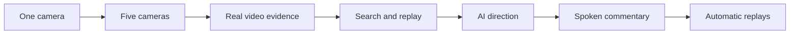

# Breadcast runnable sprint plan

**Updated:** 2026-10-09

Deliver seven cumulative sprints. Each sprint ends with a complete user flow,
a checked commit pushed to GitHub, and exact instructions for the user to test it
in production. Write only the tests required for that change.
The existing work packages are worker assignments within a sprint. They are not
separate releases. Do not wait until all adapters are built to deliver an app.

This is the delivery authority for [PRD 22](22-live-stack-integration-prd.md).
[Document 23](23-parallel-implementation-plan.md) controls worker file ownership.
[Document 05](05-context-and-contracts.md) controls contracts. [Document 24](24-provider-verification.md)
records external gates. Sprint planning does not close any acceptance gate.

## Current delivery priority

S01 and S02 are pushed to main. The user has deferred further camera work.
Continue the stack around the uploaded repository video, then add the second
VM/S3 video when available. The input paths are configurable. The current complete
slice is the red Start video / Stop video button and its backend playback path.
Finish each runnable change and push promptly. The latest user instruction is to
connect all S01–S07 stack paths first, skip checks, and defer added failsafe work.
Existing controller contracts still apply. Never report skipped checks as passed.
The user tests the full flow on the VM. Do not wait for production acceptance to
start the next change. S03–S07 keep their integration goals, using this registered
video instead of requiring a phone. Physical-phone gates remain deferred.

## 1 Delivery rules

“Production ready” means ready for the feature scope of that sprint on the tested
host. It requires real media, correct access controls, failure handling, bounded
resources, reproducible setup, and recorded acceptance. Later features remain
unavailable until their sprint passes. A fixture cannot stand in for a live service.
Only S07 acceptance completes the full PRD.

Every sprint has two explicit states after implementation:

- **Test candidate:** the required targeted checks pass on a clean checkout and the commit is pushed.
  If local container tools are unavailable, label the image build pending for
  production; it must pass before acceptance. Do not claim a verified build.
  Provider and physical checks that need production are listed as pending. This state
  is runnable but is not a claim of production readiness.
- **Accepted slice:** all sprint checks, including the named production and physical checks, pass
  on that exact revision. Failures produce a new patch commit and release revision.
  Never move an existing release tag or reuse results from a different revision.

The user tests every pushed candidate manually in production while implementation
continues. Do not wait for production acceptance before starting the next sprint.
Keep passed, failed, and pending evidence separate. Fix reported failures promptly.
A pending device/provider check cannot become a readiness claim. Stop only work
that actually depends on missing access or an unresolved unsafe contract.

The release path is sequential. Parallel workers operate inside each sprint.



Sprints are bounded by acceptance, not calendar dates. Do not promise durations
before the host, credentials, service limits, and devices are verified.

## 2 Sprint overview

| Sprint | Complete flow delivered | External gates needed | Worker focus |
|---|---|---|---|
| S01 | Fresh checkout → setup → QR → one phone → viewer → stop | G08 for the selected host | W00 packaging/control; W06 access/UI; W07 media checks; W01 host discovery |
| S02 | Five phones → manual switching and graphics → three viewers → safe reconnect | G08 | W00 admission/media; W06 controls; W07 device/load checks |
| S03 | Closed camera clip → VAST → Cosmos/YOLO → inspect bound evidence | G01, G02, G03; G09 for tracking | W02 ingestion; W03 perception; W06 evidence status; W07 failure tests |
| S04 | Search → select retained moment → model edit → preview → manual replay → live | G04; G06 segmentor vision and structured output | W04 search; W05 segmentor; W06 replay UI; W07 replay checks |
| S05 | Current video evidence → W&B director → validated camera change → human takeover | G05; G06 director | W03 live cadence; W05 director; W06 crew controls; W07 stale-work tests |
| S06 | Current video evidence → W&B commentary → real speech → mixed program audio | G06 commentator; G07 | W05 commentary/speech; W06 voice status; W07 audio checks |
| S07 | Observed moment → automatic preparation → ready replay → director playback → return live | G01–G09 verified | W00 end-to-end integration; W05 role fixes; W06 operations; W07 final rehearsal |

Gates listed here are added to earlier sprint gates. W01 verifies each provider
request shape before its adapter implementation. One coordinator and at most
three workers run at once. Where a row lists more workers, queue them within the
sprint. Do not expand the team or runtime service count to bypass a dependency.

## 3 S01 — A clean checkout can broadcast one phone

**User result:** the user pulls the release, follows the tracked README, prepares
an event, scans its QR, starts one camera, and watches continuous video and audio.

Required work:

1. Track the project docs, including the five required JSON examples in
   `docs/examples/`. Keep Docker COPY and executable readers on these canonical
   examples. Remove `/docs/` from `.gitignore`, as the user now requires.
2. Remove `scripts/studio`'s required hash read of `docs/21-timely-replays.md`. Use tested commit, diff, and runtime schema/fixture
   hashes for reproducible test provenance. Update report validation to check the
   actual hashes. Do not replace the check with an always-true value.
3. Prove the build and tests in a clean checkout with only tracked files and no local secrets, runtime recordings, or developer
   virtual environment. Project docs must arrive through Git without force-add.
4. Make the selected host support trusted HTTPS, reachable WebRTC, configuration,
   persistent bounded runtime storage, and the required public prefix. Test root
   and `/app` routing. A loaded page alone does not prove live media.
5. Enforce operator access and own-lease authorization. Anonymous users cannot
   start/stop, change facts, take control, or release another phone's lease.
6. Keep setup off air until human Start. Show unimplemented AI services as
   unavailable. Expose actual media faults and retain manual stop/recovery.
7. Put exact build, setup, start, logs, check, and stop commands in tracked README.
   Supply non-secret example configuration. Keep credentials out of Git.

**Acceptance:** A01, A03, A20, and the media/control part of A21. One physical phone
must play for five minutes with source audio. Measure actual delay. No unexpected
black output or encoder restart is allowed. Prove restart starts in holding and
requires a new human Start. Preserve existing automated five-camera protections
even though their full device proof is S02.

**User test:** check out the release tag; complete its setup commands; scan QR;
permit camera/microphone; start; watch for five minutes; stop; restart and confirm
holding. Supply the named recording and observations using the release checklist.

**Recovery:** stop the test session using the documented command. Keep the prior
working revision available. No AI is enabled in the live configuration.

## 4 S02 — A complete manual five-camera studio

**User result:** five phones feed one program. The operator switches views, keeps
the selected microphone, uses prepared graphics, and serves three viewer devices.

Required work:

1. Enforce five occupied leases across reserved, active, and reconnecting states.
   Prove the last-slot race and rejection of a sixth direct publisher.
2. Make disconnect, expiry, removal, and reuse visible. New source epochs cannot
   inherit an old phone's authority or evidence.
3. Complete setup graphics, preview, camera controls, microphone controls, viewer
   mute, QR rotation, and human takeover. Unknown official facts remain hidden.
4. Make queues, recordings, and disk limits observable. Source loss uses valid
   holding or a permitted healthy view; it cannot hang the control path.

**Acceptance:** A04, A05, A19, and regression of S01. Run five physical phones and
three separate viewer devices for 15 minutes. Each viewer must advance without
an unexplained stall over one second. Record deliberate fault intervals separately.
Check bounded memory, disk, and queues. Prove that camera cuts retain microphone
selection and that one viewer's mute does not affect another viewer.

**User test:** join five phones, switch each onto program, test microphone and
graphics, try a sixth publisher, disconnect/rejoin one phone, and run the three
viewers for the full interval.

**Recovery:** use manual controls or holding. End the event to release all leases
and workers. AI functions remain unavailable.

## 5 S03 — Real camera footage produces real evidence

**User result:** the user records an action, then inspects its Cosmos description
and YOLO detections linked to the exact camera clip. Live playback continues.

Required work:

1. Implement only the shared contracts needed for this slice. Freeze their schema
   and fixtures before W02/W03 start. Avoid a whole-platform prerequisite sprint.
2. Upload finalized physical-camera media to verified VAST/VSS ingestion. Record
   remote receipt, original-byte checksum, DataEngine completion, and binding.
3. Normalize actual Cosmos and YOLO output with verified time and geometry maps.
   Implement verified tracking and reset it on gaps, reconnect, or epoch change.
4. Extend the existing Studio evidence/status area with source identity, local
   interval, provider identity, processing state, and failure reason. Keep
   observations, inferred events, and supplied official facts distinct.
5. Bound upload/poll work. Handle duplicate delivery, ambiguous submission,
   restart reconciliation, missing originals, stale results, and provider failure.
   Late evidence can enter the archive but cannot become fresh live evidence.

**Acceptance:** A02 for VAST/perception, A06–A09, and A07/A18/A21 for the implemented
paths. Use a real newly captured chunk, not the organizer's existing corpus.
Recorded timing and visual markers must establish source mapping. Real tracking
must survive consecutive valid intervals and reset across a source discontinuity.
The live-deadline gate G05 remains separate until S05.

**User test:** film a known action; find its clip and analysis; compare both with
the recorded video; disconnect/rejoin; confirm distinct source identity; make the
provider unavailable and confirm live/manual operation still works.

**Recovery:** disable provider work and keep manual media running. Preserve valid
archive receipts for diagnosis. Do not resubmit ambiguous uploads blindly.

## 6 S04 — Search and play a real retained moment

**User result:** a natural-language query finds event footage. The user selects a
hit, gets a real model-edited replay, previews it, and chooses when it goes on air.

Required work:

1. Connect verified semantic search to event/run-filtered retained media. Resolve
   each remote hit through its registered source binding before it is playable.
2. Integrate the W&B segmentor with inspected images and the strict edit schema.
   Reuse the existing deterministic renderer and validation. Abstention or bad
   output must produce a clear result; do not substitute a fixture edit.
3. Complete search, selection, preparation status, preview, Play, Cancel, and
   Return to live. Search and preparation cannot alter airtime.
4. Preserve exact retained source media after disconnection or slot reuse.
   Reject deleted or retracted material. Pin required media only within limits.
5. Validate timing, permitted speeds, static crops, and calibrated alternate
   views. Unknown synchronization permits source-local edits only.

**Acceptance:** A02 for search/W&B, A14–A16, and A08/A11/A18/A21 for this flow.
At least eight of ten independently labeled queries must find the right available
moment in the top three. No foreign-event hit is allowed. Search has the existing
five-second deadline. A real model must supply at least one accepted nonempty
plan. Decode and inspect the resulting replay. Human return must be applied by
the controller within one second; report viewer delay separately.

**User test:** film labeled actions; search; prepare and preview; confirm live
video continues; play; return; disconnect the source, reuse its slot, and repeat
the search to prove that the original footage remains bound correctly.

**Recovery:** cancel preparation or return to live. Search/model/render failure
leaves manual broadcasting available. Automatic replay scheduling waits for S07.

## 7 S05 — The real director controls live views

**User result:** after human Start and crew release, the W&B director makes valid
camera choices from current evidence. Human takeover cancels pending crew work.

Required work:

1. Verify five-source live throughput. Use VSS results if they meet the deadline.
   Add the documented direct Cosmos/YOLO route only after separate verification.
   Never switch routes silently or refresh an expired evidence deadline.
2. Feed real W&B director proposals into existing typed action validation. Only
   the controller can change camera, audio, framing, or prepared graphics.
3. Bind decisions to source epochs, evidence versions, original snapshots, and
   deadlines. Reject stale, retracted, fabricated-authority, or injected output.
4. Complete crew release/takeover status and rejected-action reasons. Weak
   tracking falls back to a valid full view. Unknown facts remain unknown.

**Acceptance:** G05, A10, A11, plus A18/A21 for direction and prior-slice regressions.
For each of five sources, test at least 20 eligible issued windows; at least 90%
must become validated evidence inside their original eight-second deadlines.
Record skipped/superseded windows and achieved cadence. Decode real output to
prove at least one W&B camera change; contract tests cover all other operations
and abstention. Model provider failure must not restart media.

**User test:** release crew on five active cameras; observe and inspect a real
automatic cut; take control while a model call is pending; confirm the old
proposal does not apply; release again and require a new decision.

**Recovery:** take human control. Cancel crew actions and retain live playback.
Spoken commentary and automatic replay scheduling remain unavailable.

## 8 S06 — Grounded commentary reaches the viewer as speech

**User result:** the commentator describes eligible on-screen action with actual
generated speech. It stays silent when it lacks evidence or misses its deadline.

Required work:

1. Verify a real TTS service and exact voice/audio contract before its adapter.
   Integrate the real W&B commentator and existing cue/mixer path.
2. Bind exact text, voice, language, evidence, intended interval, and decoded
   audio. Enforce the existing eight-second maximum utterance length.
3. Verify pronunciation for supplied names, mixing, pending-text suppression,
   delivery receipts, and grounded callbacks. Never invent an official fact.
4. Cancel audio on takeover, retraction, replacement, replay interruption, or
   missed deadline. Eligible captions or silence handle voice failure; neither
   counts as successful generated speech.

**Acceptance:** A12, A13, plus A11/A18/A21 for speech. Review ten real utterances
against recorded program video/audio. All factual and timing checks must pass;
at least eight must be clear and appropriate. Alignment must be within 500 ms of
the intended program interval. Record actual samples, not just accepted cues.

**User test:** enable the verified voice; record and review ten utterances;
interrupt one with takeover; play a manual replay and return; inject voice delay
and confirm no late or duplicate speech leaks into the program.

**Recovery:** disable commentary and preserve microphone audio and direction.
If G07 is blocked, keep S05 as the accepted release; do not call S06 complete.

## 9 S07 — Complete autonomous replay and event operation

**User result:** the crew finds a useful moment, prepares a valid replay, chooses
a safe time to show it, and returns to live. The whole supplied stack works in
one complete event session.

Required work:

1. Connect real replay candidates to the S04 segmentor and renderer. The director
   schedules only ready assets with fresh positive opportunity evidence.
2. Implement wait/abstain, expiry, deduplication, cancellation, urgent return,
   replay graphics, and commentary transitions through the existing controller.
3. Complete end/restart cleanup, retention checks, configuration guidance, fault
   diagnosis, and rollback. Put user run commands in tracked README; detailed
   host evidence stays in local document 25 and the evidence bundle.
4. Check coverage of A01–A22 using the sprint evidence. Run the complete product
   flow in production on the final revision. Repeat only cases affected by later
   changes or missing evidence. Do not add or run the whole historical test chain
   as a blanket release requirement.

**Acceptance:** A17 and A22, with all R01–R10 complete and G01–G09 verified.
Prove at least 20 distinct successful automatic preparations. Replay-readiness
p95 must be at most 15 seconds using all eligible admitted candidates, counting
failed/timed-out admitted candidates as infinite latency. Keep pre-admission
skips separate. Prove a real W&B director schedules a ready replay and both
urgent and human return cancel replay narration. Apply all other PRD thresholds.

**User test:** run the complete event with five phones and three viewers; film
known actions; observe automatic direction, commentary, and replay; search an
earlier disconnected view; inject provider failure; recover; end and restart.

**Recovery:** one manual takeover disables new crew proposals and cancels affected
pending work. Preserve continuous media. An application rollback must follow the
tested stop/start procedure and cannot silently revive an old run.

## 10 Commit, push, and user handoff

Release every runnable slice through `main` on `origin`. The user's production
system deploys `main` automatically. Complete required targeted checks before
pushing `main`; the user then runs the production checklist on the deployed SHA.
Use a local integration branch/worktree when useful, then merge the complete
checked candidate into `main`. Do not leave runnable releases only on a delivery
branch. Fetch before merging and preserve unrelated changes. Never force-push.

Workers use `work/sNN/wNN-<topic>` branches in isolated worktrees. Integrate only
the current sprint's working feature and required tests. Development commits may
exist inside worker branches; `main` advances only to an integrated, checked candidate. Each candidate gets a release commit and immutable tag such as
`breadcast-s01-r01`. A correction uses `breadcast-s01-r02`. No date in release IDs
or test-run names. Keep Git's actual commit timestamps unchanged.

For every candidate the coordinator must:

1. Review the diff and explicit file list. Preserve unrelated user changes. Keep
   secrets, generated media, and live private evidence out of the commit.
2. Finish the tracked README test checklist and all required fixtures/config.
   Exact URLs depend on verified host configuration; resolve them in the handoff.
   Do not ship placeholder commands or dependencies on untracked local files.
3. Commit the integrated slice. Check the build and required targeted tests on that exact commit in a clean
   worktree with an empty runtime directory. Failures require a corrective commit and rerun of
   affected checks. Record tests not run and their exact reason.
4. Merge the complete tested slice into `main`. Tag that exact commit, then push
   `main` and the tag to `origin`. This push triggers the user's production deployment. Check the remote refs match
   the local SHA. A local commit or failed push does not complete delivery. Never
   force-push or overwrite tags. The user has requested these per-slice pushes;
   do not ask for the same permission again. Repository restrictions still apply.
5. Give the user the release handoff below. Do not start a public broadcast as a
   side effect of pushing a branch or opening the app.
6. Attach user production and physical results to the same revision. Continue
   implementation while these are pending. If they fail, fix and push a
   patch revision before dependent release work. Record acceptance locally; do
   not alter the already-tested commit just to add an acceptance label.

User checkout for the first candidate, after its verified push:

```sh
git fetch origin main --tags
git switch --detach breadcast-s01-r01
```

These commands are a future release template. No sprint tag exists merely because
it appears here. Never discard local changes to make checkout succeed. The release
handoff supplies the actual tag plus the tested start/check/stop commands. Detached
checkout fixes the test to one revision while `main` can advance.

Required handoff, filled with actual values:

```text
Sprint and release tag:
Status: test candidate | accepted slice
GitHub commit link and full SHA:
Remote main/tag verification and deployed production SHA:
Feature now available:
Prerequisites and non-secret configuration:
Exact checkout, build, start, check, logs, and stop commands:
Operator, Join, and viewer URLs:
User test steps and expected visible results:
Automated and real-service results:
Production and physical checks passed / pending / failed:
Known limits and features still unavailable:
Previous working tag and tested rollback procedure:
Evidence location and checksums:
```

Implementation follows this plan. S01 is **implemented as candidate `breadcast-s01-r01` for production testing on main**. S02 is **implemented as candidate `breadcast-s02-r01` for manual production testing**.
S03 is **in progress: tenant probe and registered-video VAST archive slice implemented**.
The archive slice connects private upload, stored-byte verification, DataEngine
completion, summary, and YOLO sidecar display. It does not close live timing or
tracking gates. The current-window slice also connects actual Cosmos and YOLO
requests to the existing evidence ledger. S04 has connected VSS/Embed1 search and
the W&B visual segmentor to the existing replay renderer. S05 connects the W&B
director to existing release/takeover controls. S06 connects the W&B commentator
and ElevenLabs speech to the mixer. S07 connects current observations, automatic
candidate preparation, model planning, ready assets, director scheduling and
controller playback/return. All real provider runs remain pending; checks were
skipped. These are implementation connections, not accepted production sprints.
Release commits and production acceptance are recorded in the sprint handoff.

## 11 Evidence and cumulative regression

Use PRD 22's evidence schema. Each case includes sprint/release ID, commit and
config fingerprints, expected/observed behavior, outcome, elapsed durations, and
artifact hashes. Test reports and run IDs have no calendar-date labels. Preserve
media clocks needed to prove deadlines and synchronization.

Keep full reports under `.runtime/live-stack-checks/<opaque-run-id>/` and sanitized summaries under `docs/evidence/`. Send the user the results and exact artifact
location in the release handoff; large runtime artifacts do not arrive through Git; sanitized project reports do.
Never put private footage or credentials in a public release. Small sanitized
test fixtures and the commands to reproduce results belong in tracked test paths.

Production testing is the acceptance step for every pushed candidate. A push is
not a test pass. Record the deployed SHA before testing; if production runs a
different SHA, the result cannot accept that candidate. The user runs the supplied
production checklist. The user explicitly states that pushing `main` deploys production. This
authorizes that deployment path. It does not start an on-air program; that still
requires human Start.

Use this minimum test policy for every change:

1. Name the behavior changed and its plausible failure. Reuse an existing test
   when it already proves that behavior. Add a test only for a missing, required
   guarantee. Avoid duplicate tests and tests that repeat the implementation.
2. Check the clean build. Run only the affected contract/unit checks before push.
   Add a local media smoke check when the media path or packaging changes. UI copy,
   document, and other low-impact edits do not need new automated tests.
3. Give the user a short production checklist for the new flow, its critical
   failure path, and any earlier behavior affected by this change. The sprint
   acceptance sections define the required outcomes, not a requirement to build
   a separate automated test for each item.
4. Keep focused automated protection for changes to authorization, five-camera
   admission races, source identity, stale-action rejection, media continuity,
   and replay/speech cancellation. Run only the protections affected by the diff.
5. Diagnose a failure and test its fix. Broaden testing only for evidence of wider
   impact. Do not run every historical runner on every push or at final release.

Required product outcomes remain mandatory. Reuse production evidence for
unchanged behavior only with its original tested SHA and an explicit impact review
of later changes. Do not relabel older output as a fresh final-revision pass. S07
requires a fresh end-to-end production demonstration plus closure of outstanding
required outcomes. Every partial A-case names its completed and pending subcases.

Keep provider-failure exercises within the agreed production test session and
application-level fault controls. Do not interrupt shared provider infrastructure
or unrelated broadcasts to test a failure. If a required case cannot be exercised,
record the blocker instead of inventing a pass.

## 12 Sprint status

| Sprint | Implementation | Production acceptance |
|---|---|---|
| S01 | Implemented; candidate `breadcast-s01-r01` releases through main | Pending Docker image build, trusted HTTPS/WebRTC, one physical phone for five minutes, host restart and root/prefix checks |
| S02 | Implemented; candidate `breadcast-s02-r01` releases through main | Pending five physical phones, three browser viewers, 15-minute run and actual host proof |
| S03 | Tenant probe and registered-video archive slice implemented; timing/tracking remain | Pending real VAST run; archive-slice checks skipped by user instruction |
| S04 | VSS/Embed1 search and W&B visual planning connected to retained replay | Pending actual query, accepted model plan, rendered preview and playback |
| S05 | W&B director connected to existing release/takeover controls | Pending eligible current evidence and a real accepted crew action |
| S06 | W&B commentator and ElevenLabs speech connected to mixer; NVIDIA NIM optional | Pending actual account/model/voice use and viewer audio proof |
| S07 | Automatic preparation, ready-asset scheduling, controller playback/return and operator status connected | Pending real end-to-end VM demonstration and remaining perception/timing/tracking gates |

S01 local checks: 13 focused access, configuration, provenance, and existing
example tests pass. A local synthetic one-camera run decoded 75 video frames and
240,000 audio samples with no encoder restart and complete cleanup. This is
local real-media proof, not a physical phone or production host pass. The release
handoff records exact revision and artifact fingerprints.

S02 local checks: 16 focused unit checks pass. The real local five-source media
check passes 13 scenarios, including admission race, direct-publisher rejection,
five decoded camera cuts, microphone retention, three independent RTSP readers,
slot reuse, old-token rejection, restart, and cleanup. Reader startup is measured
separately from sustained playback. Browser, physical-device, and production
acceptance remain pending. See [S02 evidence](evidence/sprint-two.json).

### Automatic video startup correction

Candidate `breadcast-video-startup-r01` fixes the VM report's paused crew after
Start video. The default mode is automatic. Live selection, source audio, and
crew release use one controller bundle. Later Take control remains authoritative.
Configured provider metadata loads through a shared worker before a short clip
needs it. Production proof remains pending. Checks were skipped by instruction.

On the VM, recreate the service, prepare the event, and press Start video. Confirm
Automatic mode without pressing Release control. Press Take control while playing
and confirm Human control. Confirm missing provider configuration remains visible.
Actual commentary still requires mapped evidence and accessible role models.
