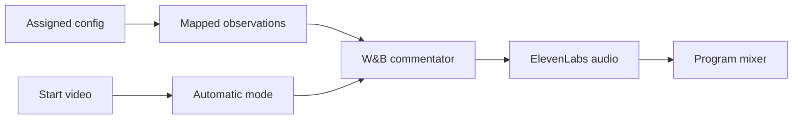

# VM integration problems and corrections

**Updated:** 2026-10-09

The teammate uses `lukas-wip` to report VM problems. This is the main-branch
record for those observations and fixes. Its source is
[PROBLEM.dco at efe3248](https://github.com/joeldsouzax/vast-hackathon/blob/efe3248fef8894e096fb83e9a67b544dfb8e0673/PROBLEM.dco).
This session has not accessed the VM. No fix below has a production pass yet.

## Reported behavior

The VM plays the NYC bike S3 chunk through the red Start / Stop button. The
encoder advances frames and returns to holding at the end. ElevenLabs has a key
inside Compose and reports a configured speech transport. There is no spoken
commentary or crew direction.

| Reported problem | Correction or remaining requirement |
|---|---|
| `crew_paused: true` after Start | `breadcast-video-startup-r01`, commit `75ec42a`, makes Start release the crew by default through the controller |
| VAST analysis unavailable; `INGRESS_URL`, `USERNAME`, `PASSWORD`, `S3_CHUNKS_BUCKET` missing | `breadcast-vm-config-r01` mounts the assigned host config read-only; nonempty environment values override it |
| Cosmos, YOLO, and Embed1 endpoints missing | The same mount exposes assigned GPU values; no host or token is invented |
| W&B roles need model selection | Startup reads the actual catalog. Set the three role model IDs from that catalog when multiple models are returned; segmentor needs image and tool support |
| 21 failed foundation jobs | Symptom of missing provider access. Fresh playback after configuration creates fresh work; do not relabel old failed jobs as successful |
| ElevenLabs configured but no program commentary | Speech needs eligible mapped evidence and a valid W&B commentator result first. Configured TTS is not synthesized audio proof |
| Docker permission issue | The studio helper supports password-free sudo and preserves exported workshop variable names |
| S3 VIP certificate issue | `BREADCAST_S3_VERIFY=false` is available for that assigned route. The default remains `true` |

The branch also changes the selected input to
`s3://team-36-vss-chunks/team-36/20261008_073129_GOPR0130_chunk_0018.mp4`.
That is the teammate's reported VM input. It does not replace the repository
clip on main. Keep the VM's selected video config, or select it in a separate
host JSON with `BREADCAST_SERVER_VIDEOS_CONFIG_SOURCE`. The object key is an
exact source identifier, not a test-run date label.

## Config and restart

Keep the VM's ignored `.env`, token, TLS files, and selected video config.
`BREADCAST_TEAM_CONFIG_SOURCE` defaults to `/config`. The container reads one
`*.config` from that folder. An empty or ambiguous folder does not select a team.
Use `.env` for values that are absent from the file, including ElevenLabs and
any W&B values exported only in the VM environment.

Leave `BREADCAST_FOUNDATION_CONFIG` empty to use this assigned live stack.
`BREADCAST_STACK_ENABLED=auto` enables it when VAST, GPU, W&B, or ElevenLabs
configuration is present. `BREADCAST_CREW_MODE=automatic` is the default.
An existing explicit foundation JSON or `BREADCAST_STACK_ENABLED=0` still
overrides automatic workshop setup.

After the deployed checkout has these changes:

```sh
./scripts/studio restart
./scripts/studio logs --tail=100
```

The restart rebuilds the image and recreates Studio. It retains the runtime
volume. The helper does not print provider values. Docker itself needs a
reachable daemon and suitable permissions on that VM.

## Next VM observations

Prepare the event and press Start video. Studio must show **Automatic mode**
without a separate Release control step. Take control must show **Human control**
and pause new crew actions while the picture continues.

Inspect protected `/api/status`, especially `providers`, `direction`,
`video_analysis`, `control.crew_paused`, and `program.commentary`. Provider
status now names missing settings. Metadata discovery shows connecting,
discovered, unavailable, or needs configuration. Model IDs appear in
`providers.llm.available_model_ids`; selected IDs appear in `providers.llm.models`.
Metadata discovery is not a successful role call.

Record actual Cosmos/YOLO results, measured source timing, W&B role results,
synthesized speech, and audible Viewer output. A ready archive summary alone
does not authorize live commentary. Slow inference on a short clip can finish
as archive work after playback has ended.

The cause chain is:



Playback runs independently of this chain. The controller still validates
evidence and grants airtime. All implementation checks for these slices were
skipped by user instruction. The VM must verify the full flow.
