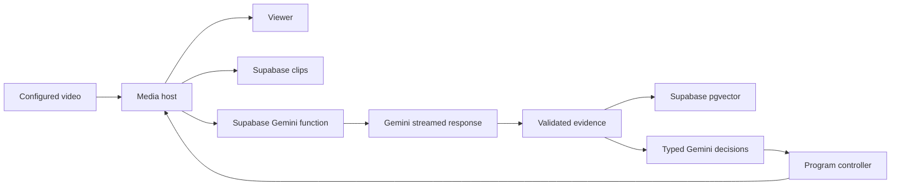

# Gemini and Supabase migration

The user replaced the workshop providers with Gemini and Supabase. The default
is `BREADCAST_PROVIDER_STACK=gemini-supabase`. Existing clip playback remains the
input. Gemini responses stream through a Supabase Edge Function. This is SSE
(a streamed HTTP response), not a Gemini Live camera session.

## Ownership and current implementation

Supabase stores original videos, recorded chunks, rendered clips and clip records.
Postgres with `pgvector` stores 768-dimension Gemini caption embeddings. The
existing FFmpeg worker creates clips on the media host. Supabase Edge Functions
do not execute FFmpeg or run MediaMTX. The new host candidate is one Fly Machine. No media host has been created.
The reason for separate media hosting is recorded below.
The same machine serves the Studio and Viewer pages.



The media host keeps the existing local ledger, source epochs, media clocks,
admission limit, bounded buffers, rendering and controller. Supabase is durable
storage and the vector database. It does not become a second program controller.
Search results must match the current local scene record before playback.

The existing internal `cosmos` boundary now names Gemini video analysis. It is
retained for schema compatibility. The `yolo` boundary now uses Gemini object
reasoning on at most three sampled frames from each recorded window. Results
retain the inspected JPEG hash, dimensions, exact native interval and normalized
boxes. These are frame observations, not calibrated detector confidence or
cross-frame tracks. Automatic crops remain unavailable.

## Model selection

The local `AI_STUDIO_KEY` authenticated `models.list` on 2026-10-10. The account
returned every selected ID below with the required generation or embedding
method. The sanitized record is [Gemini access](evidence/gemini-access.json).
This proves catalog access only. No inference or latency pass is claimed.

| Task | Selected model | Why it fits |
|---|---|---|
| Current video, director, commentator | `gemini-3.8-flash` | Its [model card](https://deepmind.google/models/model-cards/gemini-3-8-flash/) supports video, images and text. Its [API capabilities](https://ai.google.dev/gemini-api/docs/models/gemini-3.8-flash) support structured output. Use low thinking to limit response time. |
| Visual replay editing | `gemini-3.8-flash` | The same multimodal model can inspect timestamped replay frames. Use medium thinking for this less urgent planning task. |
| Frame object boxes | `gemini-robotics-er-2-preview` | Its [model card](https://deepmind.google/models/model-cards/gemini-robotics-er-2/) describes spatial and temporal reasoning. The [standard API variant](https://ai.google.dev/gemini-api/docs/models/gemini-robotics-er-2-preview) supports structured output. Its Live streaming variant does not; the standard model fits this clip/SSE flow. |
| Short live commentary speech | `gemini-3.8-flash-lite-tts` | The [model guide](https://ai.google.dev/gemini-api/docs/models/gemini-3.8-flash-lite-tts) favors low latency and single-speaker speech. The optional Flash TTS variant favors acting nuance and voice fidelity. |
| Search | `gemini-embedding-2` | The [model guide](https://ai.google.dev/gemini-api/docs/models/gemini-embedding-2) supports semantic search and recommends 768 among its vector sizes. This implementation embeds validated captions. |

These are model-card choices, not an application benchmark ranking. Production
measurements can justify a later change. `BREADCAST_GEMINI_MODEL` selects video
reasoning and the default crew model. Existing role settings can override each
crew role. Object detection and TTS have separate Gemini model settings. Runtime
requires returned IDs with the correct method. `gemini-embedding-001` remains an
explicit text-only option with the same 768-dimension database contract.

The transport removes sampling and candidate-count parameters that Gemini 3 no
longer supports. The [migration guide](https://ai.google.dev/gemini-api/docs/latest-model)
also states that Gemini 3.8 Flash does not support minimal thinking.
TTS text stays verbatim; delivery directions use structured speech metadata.
The runtime requests 24 kHz raw PCM, then produces the existing 48 kHz WAV cue.

## Credentials and stream handling

The Gemini API key stays in Supabase function secrets in hosted mode. Only the
media runtime holds the shared function credential and Supabase server key.
No publishable key, browser token, retrieved text or provider response can grant
these permissions. Clip tables and vector search have no browser access policy.

The function relays SSE without waiting for the full response.
`EdgeRuntime.waitUntil` keeps the relay active until completion or cancellation.
The upstream request is still bounded to 120 seconds. The media runtime
retains bounded partial output, requires a successful final response, then
validates its typed result. Partial JSON and partial speech never go on air.
Diagnostics record chunk count, time to first chunk, completion time and actual
returned model version. These fields are measurements from an actual request,
not predicted latency.

Live evidence keeps its original eight-second deadline. Gemini mode uses model
proposals for cuts and replays; code-only camera rotation and replay playback
are disabled in this mode. Existing prepared-graphics rules remain. Search keeps its
five-second total budget. Late analysis can enter the archive. Gemini segmentor
failure does not produce a substitute code-selected edit. A ready automatic
replay needs a fresh Gemini director proposal with replay-opportunity evidence.
The controller remains the only owner of airtime. Explicit operator replay
controls remain available.

Clip objects use content hashes and a private bucket. The runtime reads back
stored bytes and checks SHA-256 before saving the clip record. Ambiguous uploads
reconcile that same object path; they do not create a new logical clip.
Supabase scene records retain exact local evidence, source/native intervals,
scene revision, index version and embedding model version. Database search is
filtered by event, run, index, embedding model and model version. Local evidence
validation rejects missing, changed, retracted or unavailable footage.

Archive summaries inspect only the first 60 seconds at most. Studio reports that
interval. This summary is separate from current-window evidence and cannot
authorize live direction. Rendered replay readiness includes a private Supabase
clip receipt. A failed upload leaves the replay unavailable.

## Current cloud state and credentials

The user supplied an existing Supabase project in local `.env` through
`SUPABASE_PROJECT_ID`, `SUPABASE_SECRET_KEY` and `SUPABASE_ACCESS_TOKEN`.
The runtime derives its HTTPS URL from the 20-letter project reference.
`SUPABASE_PUBLISHABLE_KEY` is not used for the private backend.
The management token is deployment-only; it is not passed into the app.

The private `breadcast-clips` bucket is created, with a 50 MiB file limit and
`video/mp4` restriction. The first 512 MiB configuration was rejected; 50 MiB
was accepted. The migration is applied and recorded in Supabase history as
`20261010151851`. The source migration filename matches this version.
Gemini function secrets are saved. The function is ACTIVE at version 2.
Its authenticated `models` relay returned HTTP 200 and the four selected models.
See the sanitized [Supabase access/deployment record](evidence/supabase-access.json).
This metadata request does not verify SSE inference.

Ignored `.env.supabase` and `.env.media` files are prepared with private
credentials. The Gemini key belongs only in `.env.supabase` for hosted inference.
The media file still needs its host origin and reachable media address. Preserve
its operator and runtime credentials when completing or repeating deployment.

Inference, actual object output, vectors, speech, container build, media-host
deployment and acceptance remain pending. Checks stay skipped under the standing
user instruction. No full-flow or latency pass is claimed.

For a new project, obtain its server key and deployment account access first.
Apply the supplied migration and deploy the Gemini function using the commands
below. Existing runtime keys are required for function updates.

The shared runtime key must contain 32–128 URL-safe characters. For example, use
Python's `secrets.token_hex(32)` and write its result straight into the ignored
file. Preserve the operator credential on later deployments.

## Repeat Supabase deployment with the CLI

The current project was deployed through the official Management API. The CLI
is an alternative for later updates. From the repository root, set
`BREADCAST_SUPABASE_PROJECT_REF` to the actual project reference. This is an
identifier, not a credential. `supabase link` may require its database password.
Do not reapply the migration under a different version.

```sh
supabase login
supabase link --project-ref "$BREADCAST_SUPABASE_PROJECT_REF"
supabase db push
supabase secrets set --project-ref "$BREADCAST_SUPABASE_PROJECT_REF" --env-file .env.supabase
supabase functions deploy gemini --project-ref "$BREADCAST_SUPABASE_PROJECT_REF"
```

The migration creates the private `breadcast-clips` bucket, clip and scene
tables, the pgvector index and the server-only search function. Function JWT
verification is disabled because the function validates its own runtime secret.
Missing/incorrect credentials fail before a Gemini request. No browser CORS
route is exposed.

## Why the media runtime needs a separate host

Supabase already hosts the database, private clips and Gemini function.
[Hosted Edge Functions](https://supabase.com/docs/guides/functions/limits) have
256 MiB memory, two seconds of CPU per request and finite worker lifetimes.
The current Python/FFmpeg/MediaMTX engine is continuous and needs persistent
state plus incoming TCP/UDP media ports. It cannot run as this Deno function.
Supabase's [project compute](https://supabase.com/docs/guides/platform/compute-and-disk)
is its Postgres instance, not a general application container host.

A browser-only media engine would need a separate architecture change. It would
move rendering and program ownership to a running browser. This migration keeps
the existing controller and media contracts. Fly is prepared as the new media
host candidate; deployment access and host selection remain pending. The user
has $25 Supabase credit. Use it for eligible backend charges; it does not change
the Edge Function execution limits. [Pro pricing](https://supabase.com/pricing)
starts at $25/month. No billing plan was changed.

## Deploy the new media host

Set `BREADCAST_FLY_APP` to a unique app name in the selected organization. Change
the region in `fly.toml` if needed. The following commands create billable host
resources; run them only in the selected account.

```sh
fly auth login
fly apps create "$BREADCAST_FLY_APP"
fly volumes create breadcast_runtime --app "$BREADCAST_FLY_APP" --region iad --size 20
fly ips allocate-v4 --app "$BREADCAST_FLY_APP"
fly ips allocate-v6 --app "$BREADCAST_FLY_APP"
```

Put `https://<actual-app>.fly.dev` in `.env.media` as `BREADCAST_PUBLIC_URL`.
Put the allocated dedicated IPv4 address there as `BREADCAST_ICE_HOSTS`.
Fill in the Supabase URL, Supabase server key, operator token and shared runtime
key. The Gemini key belongs only in `.env.supabase`.

```sh
fly secrets import --app "$BREADCAST_FLY_APP" < .env.media
fly deploy --app "$BREADCAST_FLY_APP" --config fly.toml --ha=false
fly scale count 1 --app "$BREADCAST_FLY_APP"
fly status --app "$BREADCAST_FLY_APP"
fly logs --app "$BREADCAST_FLY_APP"
```

Use one machine and one volume. Multiple machines would create separate
controllers and camera leases; this implementation does not support them.
Fly supplies HTTPS. The config exposes TCP and UDP 8189. UDP binds to
`fly-global-services`, as Fly requires, and needs the dedicated IPv4 address.
The cloud entrypoint initializes volume ownership and operator auth, then drops
root before starting the existing application. Every restart begins in holding.
Do not treat a successful HTTP check as a WebRTC test.

The existing Compose deployment is still available through `./scripts/studio
restart`. Fill the new variables in ignored `.env`. Existing credentials alone
do not enable the new providers. `BREADCAST_STACK_ENABLED=0` disables AI.
`BREADCAST_PROVIDER_STACK=workshop` explicitly restores old workshop transports;
it is not an automatic fallback after Gemini failure.

## Production acceptance for this candidate

Use the exact deployed SHA. Store sanitized outcomes in the provider verification
record and retain full evidence in a date-free runtime report.

1. Open Studio with the operator credential. Prepare event graphics. Start the
   bundled video. Confirm advancing video/source audio and Automatic mode. Stop
   must return to holding; Start can run the clip again.
2. Confirm model discovery shows actual Gemini IDs. During inference, confirm
   `Gemini streaming` in Crew status and completed stream metrics in diagnostics.
   Do not accept an incomplete or blocked response as a valid result.
3. Confirm private original/chunk records in Supabase and compare SHA-256 with
   retained local files. Studio's archive summary must identify its inspected
   interval. The public/anonymous client cannot read clips or vectors.
4. Wait for scene indexing, then search a visible action. Confirm the hit's
   event/run/source interval, prepare it with Gemini, preview it, and verify the
   rendered replay exists in the private bucket before Play becomes available.
5. Confirm automatic playback comes from a cited Gemini director proposal.
   Ready state alone must not start a replay. Take control must stop crew
   proposals; Return live must interrupt a replay through the controller.
6. Confirm actual Gemini speech in the separate Viewer, with local playback
   audio enabled. `Caption only` is not a spoken-commentary pass.
7. With application credentials intentionally unavailable, confirm clear
   provider failures and continuing manual video playback. Restore configuration
   before continuing. Do not disrupt shared provider infrastructure.

Sampled-frame object output, five-camera timing, physical devices, detector tracking and all prior production
gates remain open until tested. The provider substitution does not satisfy them.

## API references

- [Gemini streaming generation](https://ai.google.dev/api/generate-content)
- [Gemini structured output](https://ai.google.dev/gemini-api/docs/generate-content/structured-output)
- [Gemini video input](https://ai.google.dev/gemini-api/docs/generate-content/video-understanding)
- [Gemini embeddings](https://ai.google.dev/gemini-api/docs/embeddings)
- [Gemini streamed speech](https://ai.google.dev/gemini-api/docs/generate-content/speech-generation)
- [Supabase storage access](https://supabase.com/docs/guides/storage/security/access-control)
- [Supabase pgvector](https://supabase.com/docs/guides/database/extensions/pgvector)
- [Supabase function limits](https://supabase.com/docs/guides/functions/limits)
- [Fly UDP/TCP requirements](https://docs.fly.io/networking/udp-and-tcp)
