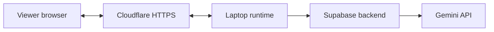

# Laptop media host

The current event setup, speech/replay repair evidence and five-camera demo steps
are in the [Forever 22 demo record](30-forever22-demo.md). The initial startup
observations below describe the first release.

The laptop runs the persistent media runtime. Supabase hosts the Gemini function,
private clips and vector database. The public pages are available through a
temporary Cloudflare Quick Tunnel. Studio and Viewer also receive program video
through this tunnel, using HLS. HLS sends short video segments over HTTPS.



The tunnel carries pages and program video. Gemini streaming runs
between the laptop and Supabase, independently of browser playback.

## Current state

The ARM container built and started. Docker reports `healthy`. Local health,
public health and public Viewer requests returned HTTP 200. The initial startup
failed because a public origin had only a loopback ICE address. Clearing
`BREADCAST_ICE_HOSTS` corrected that failure. ICE addresses identify possible
media connection endpoints.

The first Viewer connection failed with HTTP 500. The configured free TURN
endpoint did not accept TCP connections on ports 80 or 443. MediaMTX waited for
connection candidates, and the application's ten-second proxy timeout escaped
as an unhandled error. The repair uses HLS for viewing and maps gateway timeouts
to HTTP 504. It also maps connection failures to HTTP 503.

The public URL now plays holding frames in local Chrome. The focused repair
observation recorded 48 decoded frames, no dropped frames and no failed media
requests. This does not prove playback from a second network. The program remains
in holding after restart; the agent did not start the bundled video. Gemini
inference, speech, clip receipts, vectors and end-to-end latency remain unverified.
Broad acceptance checks remain skipped under the user's standing instruction.
See the [startup record](evidence/laptop-media-host.json) and
[Viewer repair record](evidence/viewer-hls-repair.json).

The laptop has 24 GiB RAM. Its isolated `breadcast-local` Colima profile has
4 CPUs, 6 GiB RAM and a 30 GiB data disk. Its Docker context is
`colima-breadcast-local`. The existing `breadcast-experiment` profile remains
separate. HTTP binds to `127.0.0.1:9080`. WebRTC still uses TCP and UDP port 9189;
HLS viewing does not use those ports.

## Check status

Run these commands from the repository root:

```sh
docker --context colima-breadcast-local ps -a --filter name=breadcast-studio
curl --fail http://127.0.0.1:9080/healthz
DOCKER_CONTEXT=colima-breadcast-local ./scripts/studio logs --tail=50 studio
```

`Up ... (healthy)` means the container health probe passed. That probe checks
the media gateway and advancing program frames. A successful health response
does not prove playback on a public viewer's network or Gemini inference.

The current public origin is in ignored `.runtime/laptop-origin`. Append
`/operator` to open Studio or `/watch` to open Viewer. Use the existing credential
in ignored `.runtime/operator-token` for Studio. Keep it private. Viewer does
not need that credential.

## Restart the app

```sh
DOCKER_CONTEXT=colima-breadcast-local ./scripts/studio restart
```

Use this command after source, Compose or `.env` changes. It preserves the named
runtime volume. Each app restart begins in holding. If Colima is stopped, start
only the laptop profile:

```sh
colima start --profile breadcast-local --cpus 4 --memory 6 --disk 30 \
  --vm-type vz --activate=false --ssh-config=false --port-forwarder grpc
```

## Tunnel and media settings

The ignored `.env` selects these non-secret host settings:

```dotenv
BREADCAST_HTTP_BIND=127.0.0.1
BREADCAST_HTTP_PORT=9080
BREADCAST_PORT=8080
BREADCAST_WEBRTC_PORT=9189
BREADCAST_VIEWER_TRANSPORT=hls
BREADCAST_ICE_HOSTS=''
BREADCAST_ICE_SERVERS=''
BREADCAST_OPERATOR_TOKEN_SOURCE=.runtime/operator-token
BREADCAST_CPUS=4
```

`BREADCAST_PUBLIC_URL` must match the current tunnel origin. Supabase server
credentials and the shared function credential also remain in ignored `.env`.
The old TURN file remains in ignored `.runtime/tls/ice-servers.json`, but the
runtime no longer loads it. Public camera publishing still needs a verified
WebRTC route. This repair changes program viewing only. Physical camera and
five-camera validation remain deferred.

MediaMTX serves HLS on loopback port 8888 inside the container. The app proxies
only `/media/program/hls/` assets. No camera HLS route or upstream credential is
public. The player is hls.js v1.7.0, already bundled in the pinned MediaMTX v1.20.1
image; it requires no browser CDN request. The stream retains H.264 video and
Opus audio. Chrome playback was observed; other browser and audio acceptance
checks remain pending. HLS adds buffering; end-to-end delay was not measured.

Cloudflared is installed through Homebrew. The current tunnel runs in the
background. Its PID and log are in `.runtime/laptop-tunnel.pid` and
`.runtime/laptop-tunnel.log`. To create a new tunnel after it stops, run:

```sh
cloudflared tunnel --url http://127.0.0.1:9080 --protocol http2 --no-autoupdate
```

Keep that process running. Save its new HTTPS origin in `.runtime/laptop-origin`
and update `BREADCAST_PUBLIC_URL` in `.env`. Then restart the app with the command
above. Existing Viewer links become invalid when the origin changes.

[Quick Tunnels](https://developers.cloudflare.com/tunnel/get-started/quick-tunnels/)
are temporary development endpoints. They do not provide an uptime guarantee or
browser SSE support. This app uses browser polling; hosted Gemini SSE uses a
separate connection to Supabase.

The current `caffeinate` process prevents idle sleep while the tunnel runs. Its
PID is in `.runtime/laptop-caffeinate.pid`. Keep the laptop powered, connected to
the internet and awake. Closing the lid or stopping the tunnel can end access.

The current media route uses [MediaMTX HLS support](https://mediamtx.org/docs/read/hls)
and the pinned server's
[HLS proxy configuration](https://github.com/bluenviron/mediamtx/blob/v1.20.1/mediamtx.yml).
The previous TURN attempt used the provider's
[published static authentication settings](https://www.metered.ca/tools/openrelay/),
but those settings did not establish a connection from this laptop.

## Manual release check

1. Open Studio and enter the operator credential. Prepare event graphics.
2. Press **Start video** below the program video. Confirm Automatic mode.
3. Open Viewer on another network. Enable audio and confirm advancing video.
4. Confirm actual Gemini results, speech, private clip records and scene search.
   Follow the [full acceptance steps](28-gemini-supabase-migration.md#production-acceptance-for-this-candidate).
5. Press **Stop video**. Confirm the program returns to holding.

Record failures and measured latency against the source release. HTTP 200 and
container health are startup observations; they do not complete these checks.
