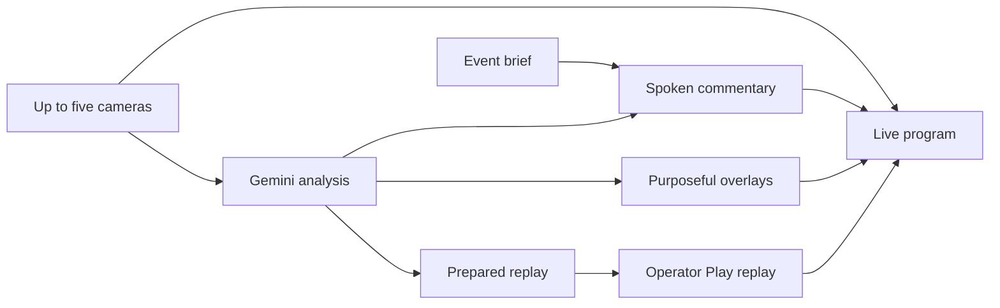

# Forever 22 demo

The laptop event is **The New Agentic Economy Hackathon**. The reviewed brief
comes from the [event page](https://luma.com/1ofx14ov). Forever 22 organizes the
event at Betaworks in New York City, with Google DeepMind support. The brief
includes the event's focus on real products using voice, transcription,
translation, multimodal interaction and agentic workflows. It does not name
unverified attendees or claim an event phase, result or connected camera count.

[config/events/forever22.json](../config/events/forever22.json) preserves the
reusable brief. The active laptop context is revision 6. Its custom voice ID is
stored in the local environment and persisted context. The template leaves that
account-specific voice unset. Importing it requires the current revision plus one.

The voice is an original fictional New York cabbie: gravelly, sarcastic and
comically angry, with short jokes and brief analysis. Gemini Voice Design created
it through the authenticated account. Gemini Flash Lite TTS then produced an
actual 5.04-second preview in 1.48 seconds through the Supabase function. These
are request measurements, not an end-to-end latency guarantee. The API required
omitting the model from voice creation; Flash Lite TTS can synthesize the result.
See Google's [voice design](https://ai.google.dev/gemini-api/docs/voice-design)
and [speech generation](https://ai.google.dev/gemini-api/docs/speech-generation).

Commentary and graphics run independently. Only replay playback needs operator
approval. Event talk fills gaps between fresh camera observations. It must not
pretend that sample football footage is the venue or invent activity.
The [source-audio update](31-source-audio.md) adds listening, heard quotes and
a more impatient cabbie delivery.

All 24 graphics templates and the replay label preload at setup. Gemini sees
their purpose and text rules. Scores require operator confirmation. Full-screen
cards require a suitable pause. Corner marks and upper banners may appear during
speech. Replay commands use a sliding entry and return transition by default,
with a progress bar tied to actual replay frames.

## Venue use

The active server-video list is empty. The football reference is not offered
in Studio and cannot start through the sample API. **Go live** below the program
uses a ready camera. **Hold broadcast** returns to holding. A new runtime session
clears the earlier sample replay cards and keeps prior test evidence out of current
camera reasoning and search. The reference file remains only for development checks.

1. Open Studio at the origin saved in `.runtime/laptop-origin`, followed by
   `/operator`. Use the existing private operator credential.
2. Put the laptop and phones on the same Wi-Fi. The local media address is
   configured in `BREADCAST_ICE_HOSTS`; update it if the laptop changes networks.
   The HTTPS join page stays on the public tunnel. Camera media uses port 9189.
3. Use Studio's event QR. On one phone, allow camera access, preview, then select
   **Start sharing**. Select **Go live** in Studio, or choose that camera's live control. Enable a microphone only on
   the intended audio phone. Check audible speech in the program monitor.
4. Add the other phones, up to five. Reservations also count toward the limit.
   Confirm each view and confirm that a sixth request is refused.
5. Check a prepared replay preview. Select **Play replay** to approve it. Confirm
   entry, progress, audio and return. **Take control** pauses the crew.

Same Wi-Fi does not prove peer access. Some venue networks isolate devices.
Actual one-phone and five-phone media checks remain manual. The public viewer
uses HLS over HTTPS and has its own buffering delay. No second-network pass or
frame-accurate commentary alignment is claimed.

## Repair evidence

The focused direction contract suite passed 27 checks. It covers event-talk
grounding, required action evidence, replay approval and original speech windows.
The existing camera admission suite passed 10 checks, including the last-slot
race and publisher ownership. Replay preparation passed 26 contract checks;
the two existing media transition checks also passed. The live replay reached
Ready 8.77 seconds after its model request started, or 15.18 seconds after the
last included frame receipt. Its one-second output passed decode and timestamp
continuity checks and received a private Supabase clip receipt. It was not played
on air. One sample run delivered seven complete spoken lines; another run lost
its selected source and produced no speech. Broad acceptance checks remain skipped under the
standing instruction. Real provider and media observations are recorded in
[the demo evidence](evidence/forever22-demo.json). Physical phones and perceptual
audio timing remain manual checks.
