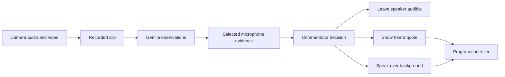

# Source audio and commentary

Gemini now receives original camera audio in the existing clip flow. The preview
previously removed all audio. The current model can understand and transcribe
audio in video, as described in Google's [audio documentation](https://ai.google.dev/gemini-api/docs/audio)
and [video documentation](https://ai.google.dev/gemini-api/docs/video-understanding).
The Supabase relay and provider models remain the same.

The selected microphone drives the voice decision, independently of the camera
on screen. Its words have their own source epoch and clock. The commentator
can leave a foreground speaker audible, show a useful exact quote, or add a
short line over background chatter. A quote appears as **Heard: …** and never
goes through text-to-speech. Spoken commentary uses the existing source-audio
ducking. Unknown words and speaker identities stay unknown.

The active event context is revision 6. The custom cabbie voice remains selected.
Its delivery is now more impatient: clipped phrases, exasperated pauses, dry
sarcasm and mock anger at delays. It avoids constant shouting and attendee insults.
The reusable [event template](../config/events/forever22.json) has the same style.

The controller checks exact quote text, microphone identity, epoch, mute state,
evidence availability and the original deadline. A quote lasts at most four
seconds. Microphone activity and foreground speech do not block narration.
Gemini keeps talking over ordinary room conversation. It can briefly yield when
the heard words contain a useful demo explanation, interview answer, announcement
or presentation. This uses
short recorded clips; it cannot stop an already playing line the instant a
person begins speaking. Quotes are recent excerpts, not word-aligned subtitles.

The focused direction suite passed 30 checks, including foreground versus
background decisions, forged quote rejection, microphone changes and captions
that never call TTS. A real retained phone clip included video and 16 kHz audio.
Two additional checks cover unclear transcripts and actual FFmpeg audio trims,
including multiple chunks and a missing audio track.
Gemini classified foreground speech and returned a 19-character transcript.
The proxy and provider work took 4.606 seconds. This diagnostic did not change
the program and does not prove transcription accuracy or viewer latency. See
[the measured result](evidence/source-audio.json).

After the runtime restart, reconnect a phone with the current QR and tap
**Join camera**. The first ready camera goes live automatically. Select its
microphone. Speak a clear short sentence, then pause.
Confirm that heard quotes match the words and cabbie commentary continues over
ordinary conversation, with brief pauses for useful speaker content. Change or mute the selected microphone and check
that an old quote cannot continue. These venue checks remain manual.
