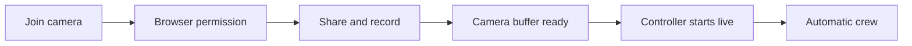

# One-tap camera start

One **Join camera** tap now requests permission and starts publishing. The
gateway records published camera media automatically. There is no second
Start sharing or recording button. The local preview fills the phone viewport
in portrait and landscape, with connection status and **Stop sharing** over it.
The preview can crop its edges to fill the screen; source recording is unchanged.

The server controller takes the first ready camera live once per run in
automatic camera mode. It checks the active lease, source epoch, recent frames
and delay buffer. The initial camera microphone is bound at its ready epoch
when available, unless the operator chose another microphone or muted it.
Sample-video mode and explicit human crew mode retain manual start.

Hold broadcast and Take control disable automatic startup. Later cameras do not
replace the live view or interrupt a replay. Replay playback still needs approval.
No operator browser needs to stay open for automatic startup to work.

The commentary pause also had a source-identity cause: the active decoder had
advanced to epoch 4, but the AI ledger only knew epochs 1–3. Both crew roles
reported `Reviewed source is unavailable` while camera playback stayed live.
The monitor now registers current decoded source identities before recording
finalization. A clock reset can no longer depend solely on the next finalized
recording to become visible to the crew. Old evidence keeps its original epoch.

Focused checks: 35 controller checks passed with workshop behavior isolated from
the live Gemini environment. The three new startup and source-reset checks also
passed with Gemini configuration. A separate browser check used synthetic local
capture and a mocked publisher. It confirmed one Join starts one publisher,
portrait and landscape previews fill the viewport, and Stop ends capture.
It did not publish a test camera or prove physical-phone WebRTC. See
[the browser evidence](evidence/one-tap-camera.json).

After restart, refresh Studio and use its new QR on the phone. Tap **Join camera**
once and allow permission. Confirm the full-screen preview, automatic live view,
recorded clips and resumed commentary. Try Hold, then join another camera: Hold
must remain selected. These phone and venue checks remain manual.
