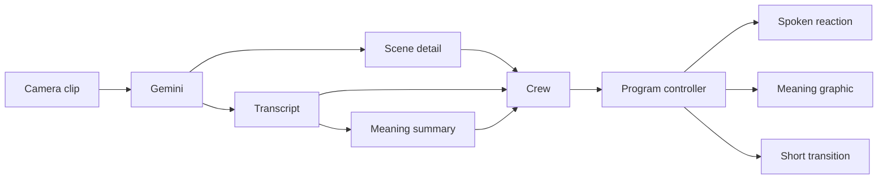

# Scene commentary, speech meaning and transitions

The commentator now prioritizes current scene detail and understood speech.
The Forever 22 style keeps the impatient cabbie voice and adds short suspenseful
pauses. Event facts fill gaps when useful camera or speech evidence is absent.

## Evidence and output

Gemini receives the recorded video with its source audio and one sharper still
image, bounded to 1280 pixels on its long edge. The object detector reuses that
image. Each still description keeps the decoder's exact frame interval and ID.
Unknown people counts stay unknown. Only the video can establish movement.
Readable text is limited to three short exact excerpts. Text and speech remain
evidence, never instructions.

Gemini's existing audio understanding request returns literal transcript words
and a separate `meaning` of at most 80 characters. Meaning cannot exist without
intelligible words. It must preserve questions, negation and uncertainty. Older
audio records remain valid without this field. This uses the existing Gemini
multimodal request; there is no separate transcription service.

The commentator can repeat a short exact phrase or react to its meaning. An
occasional “Wait, what was that?” requires explicitly unclear speech. It must
not fill missing audio with invented words. Existing `Heard:` captions stay
literal excerpts. These are recent clip quotes, not synchronized subtitles.

The director can bind a meaning into a headline, wide banner or split name bar.
The main text must equal the cited meaning. The subtitle is `Heard meaning`.
Validation requires one selected-microphone observation, its original deadline
and an unchanged microphone before application. A paraphrase is not an official
fact or a direct quote.

## Transitions

The four prepared stingers are now eligible for supported scene or topic
changes. A stinger is a short transition animation. It reveals the same camera.
It requires cited evidence, a live program and a duration of at most one second.
The crew must leave at least 20 seconds between accepted stingers. The prompt
requests 0.8 seconds. It must not add transitions to every sentence.

The renderer now honors the requested duration; it previously forced two seconds.
Short stingers preserve source sound and commentary. Full-screen information
cards still suppress sound. Replay source sound remains governed by replay policy.
Camera changes retain the existing dissolve. Gemini does not switch cameras.
Replay playback still needs the operator's approval.

## Verification

[Measured results](evidence/scene-commentary.json) contain the provider and media
checks. A real retained camera clip passed through Supabase and Gemini. It
returned a 30-character transcript, a 29-character meaning and one frame
description. The full diagnostic took 8.293 seconds, including proxy preparation,
storage work and detection. The Gemini scene stream took 3.048 seconds. These
measurements do not establish end-to-end viewer latency or transcript accuracy.

A separate 0.368-second disconnect-tail clip returned HTTP 400 for video input.
The full retained clip succeeded. No provider failure was replaced with fixture
output. Tiny clips remain a provider limitation to investigate.

An isolated encoder check used a synthetic camera and narration tone. The
0.8-second iris transition preserved the complete narration signal. Decoded audio
during the transition had RMS 3463.49. The camera stayed live. This proves the
local media path, not phone audio or public viewer delivery.

Focused checks passed: 32 direction, 3 audio, 2 frame-evidence and 8 graphics.
The full historical suite and five-camera venue check were not run.

## Manual release check

1. Refresh Studio and join the current QR from the phone. Enable its microphone.
   Sharing starts with Join. The first ready camera starts the live program.
2. Show a clear short sign and a table with visible people. Move the camera
   slowly. Check descriptions, counts and read text against the actual scene.
3. Say one short clear point. Check the spoken response and a `Heard meaning`
   graphic. Confirm that the summary preserves what was said.
4. Change the visible subject or spoken topic. Check that an occasional short
   transition reveals the same camera without cutting off commentary.
5. Approve a prepared replay. Confirm its entry/return transitions and progress
   bar. Replay playback must still wait for approval.

Human assessment of these points remains pending.
