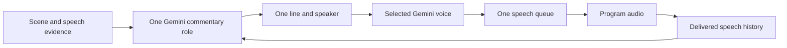

# Two commentators, one commentary flow

The lead now uses an original professional wrestling broadcast style: big
reactions, rising suspense and short energetic calls. The co-commentator adds
sharp analysis, dry wit and playful disagreement with completed lead remarks. Both use one Gemini role, one reviewed context and
one speech queue. No extra model worker or concurrent voice is introduced.

| Voice | Job | Style |
| --- | --- | --- |
| Lead | Call visible changes, locate people and objects, read clear text, react to action | Excited wrestling play-by-play; dynamic intensity and suspenseful pauses |
| Co-commentator | Explain a demonstrated feature, respond to understood speech, add context or challenge a completed lead remark | Witty, skeptical color commentary; measured delivery with brief excited reactions |

## What informed the roles

The broadcaster interviews in [Boxing News](https://boxingnewsonline.net/opinion/panel-whats-the-hardest-thing-about-being-a-commentator/)
stress preparation, accuracy, pacing, avoiding repetition and judging when to
leave description for analysis. The [Total Sports Media chapter](https://routledgetextbooks.com/textbooks/9781138391598/chapter-7.php)
stresses preparation and coordination between the play-by-play voice, analyst
and producer. We apply those principles to observed hackathon activity rather
than importing football language or scores.

The lead handles immediate changes. The second voice adds information instead
of describing the same motion again. Both keep the event brief and evidence in
view. They must not invent attendee responses, identities or outcomes.

## Voice and turn contracts

`EventContext.co_commentator` supplies a configurable voice ID and style.
The demo uses Gemini's `Charon` voice. The existing custom lead voice remains selected; the event supplies its new
speaking style. Charon is listed in Google's [voice options](https://ai.google.dev/gemini-api/docs/speech-generation#voice-options).
Actual access was checked through the deployed Supabase relay.

Each intent carries `speaker=lead` or `speaker=co_commentator`. The response
schema restricts the currently allowed speakers. At least two completed lead
lines must precede a co-commentator turn. Pending co-commentary prevents another
co-commentator proposal. After three completed lead lines, the next decision
reserves the co-commentator voice. Gemini must supply a useful grounded line or
abstain; it cannot keep selecting the lead indefinitely. A lead line already in
progress can finish first. The program does not alternate on a timer.

Speaker identity remains attached to the intent, prepared audio, captions and
delivery history. It cannot change during delivery. Older records default to
the lead. Only completed speech supports a conversational callback. Captions,
failed preparation and interrupted lines are not completed remarks.

The same controller queues one complete audio cue after the active cue. It
rejects overlap and preserves original evidence and speech deadlines. A graphics
revision no longer invalidates a queued voice when the pinned camera or replay
session remains valid. Microphone changes, source changes, takeover, context
changes and expiry still invalidate it. Captions identify the speaker when the
caption area is clear.

## Verification and manual check

[Measured evidence](evidence/commentary-pair.json) records actual Gemini speech
for both selected voices and a structured co-commentator response. The latter
used a private scripted conversation, not a live scene. Both speech files decoded
to nonzero PCM. Human assessment of voice contrast and delivery remains pending.

Open the public `/join` page, allow camera and microphone access, and keep the
phone sharing. Listen for excited lead calls followed by a useful, witty
response. Confirm that the voices never overlap and that graphics still appear.
Check that a reply refers to words actually delivered. Physical-phone and public
viewer acceptance remain manual.

## Follow-up: second voice was too rare

The first live run recorded a complete 6.12-second co-commentator line after four
completed lead lines. This proved delivery, but optional speaker choice allowed
the lead to dominate. Release `breadcast-forever22-r09` reserves the analyst turn
after three completed lead lines and requires an explicit speaker in Gemini's
response. It also limits cabbie style instructions to the lead.
See [follow-up evidence](evidence/commentary-turns.json). Voice contrast still
needs human listening; a completed audio receipt does not prove perception.

## Wrestling style update

Release `breadcast-forever22-r13` changes both event voice styles and removes
fixed cabbie instructions from the model prompt. The lead caption now says
`Lead:`. The existing voice IDs, shared queue, listening policy, camera choices
and replay settings remain in place. No named announcer is imitated. Energy
comes from visible details; the voices cannot invent fights, rivalries, outcomes
or crowd reactions. Big reactions should vary with the actual scene.

The running event is updated through a validated context revision and graphics
preload. See [the deployment record](evidence/wrestling-commentary.json). Listen
for dynamic emphasis and a distinct co-commentator after rejoining the phones.
Voice quality and the public viewer sound check remain manual.
