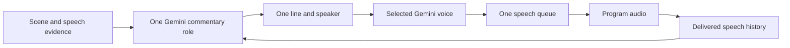

# Two commentators, one commentary flow

The cabbie remains the lead voice. A calm co-commentator adds a short explanation
or dry reaction when useful. Both use one Gemini role, one reviewed context and
one speech queue. No extra model worker or concurrent voice is introduced.

| Voice | Job | Style |
| --- | --- | --- |
| Lead | Call visible changes, locate people and objects, read clear text, react to action | Impatient New York cabbie; short calls and suspenseful pauses |
| Co-commentator | Explain a demonstrated feature, respond to understood speech, add context or challenge a completed lead remark | Calm, clear, dry wit; no repeated play-by-play |

## What informed the roles

The broadcaster interviews in [Boxing News](https://boxingnewsonline.net/opinion/panel-whats-the-hardest-thing-about-being-a-commentator/)
stress preparation, accuracy, pacing, avoiding repetition and judging when to
leave description for analysis. The [Total Sports Media chapter](https://routledgetextbooks.com/textbooks/9781138391598/chapter-7.php)
stresses preparation and coordination between the play-by-play voice, analyst
and producer. We apply those principles to observed hackathon activity rather
than importing football language or scores.

The lead handles immediate changes. The second voice adds information instead
of describing the same motion again. Both keep the event brief and evidence in
view. They must not invent attendee responses, identities or outcomes.

## Voice and turn contracts

`EventContext.co_commentator` supplies a configurable voice ID and style.
The demo uses Gemini's `Charon` voice. The existing custom cabbie voice stays
the lead. Charon is listed in Google's [voice options](https://ai.google.dev/gemini-api/docs/speech-generation#voice-options).
Actual access was checked through the deployed Supabase relay.

Each intent carries `speaker=lead` or `speaker=co_commentator`. The response
schema restricts the currently allowed speakers. At least two completed lead
lines must precede a co-commentator turn. Pending co-commentary prevents another
co-commentator proposal. Gemini still chooses whether the second voice adds
value; the program does not alternate on a timer.

Speaker identity remains attached to the intent, prepared audio, captions and
delivery history. It cannot change during delivery. Older records default to
the lead. Only completed speech supports a conversational callback. Captions,
failed preparation and interrupted lines are not completed remarks.

The same controller queues one complete audio cue after the active cue. It
rejects overlap and preserves original evidence and speech deadlines. A graphics
revision no longer invalidates a queued voice when the pinned camera or replay
session remains valid. Microphone changes, source changes, takeover, context
changes and expiry still invalidate it. Captions identify the speaker when the
caption area is clear.

## Verification and manual check

[Measured evidence](evidence/commentary-pair.json) records actual Gemini speech
for both selected voices and a structured co-commentator response. The latter
used a private scripted conversation, not a live scene. Both speech files decoded
to nonzero PCM. Human assessment of voice contrast and delivery remains pending.

Open the public `/join` page, allow camera and microphone access, and keep the
phone sharing. Listen for several cabbie calls followed by a useful calmer
response. Confirm that the voices never overlap and that graphics still appear.
Check that a reply refers to words actually delivered. Physical-phone and public
viewer acceptance remain manual.
