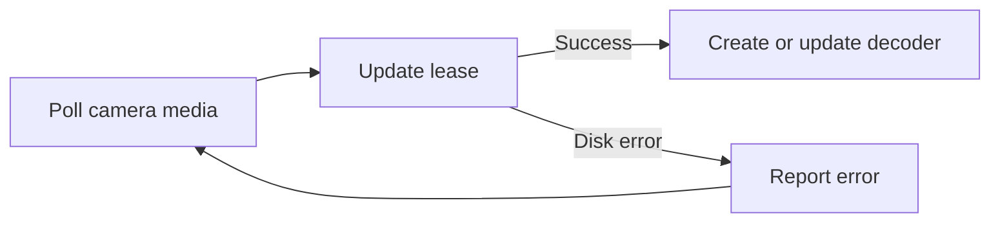

# Camera monitor recovery

The laptop host disk filled while the guest VM still reported free space.
SQLite returned `disk I/O error`. The camera monitor thread exited, so newly
joined camera leases could receive media without creating a decoder. The program
stayed in holding and still referenced the previous camera lease.

Unused build cache was removed only from `colima-breadcast-local`. Guest disk
trim returned free blocks to macOS. The host then reported about 1.7 GiB free.
Restarting the existing container restored the monitor. Its health check and
both SQLite quick checks passed. User files and the experiment VM were untouched.

Release `breadcast-forever22-r11` catches a temporary SQLite operational error
inside the existing monitor loop. The status retains the error until the next
successful poll. The monitor can then admit ready camera decoders without
requiring another restart. This does not fix a full disk; free space is still
required for recording and database writes.

The related commentary cutoff occurred at a source timestamp reset. Later
recorded frames were visibly black, while the user reported a normal phone
preview. The timing matcher rejected these ambiguous pictures, so Gemini received
no live scene evidence. The event-talk cooldown then left it quiet. The observed
silence was not the microphone listening gate. Fresh phone validation of that
separate media problem remains pending.

The 36 focused controller checks include an injected database I/O error followed
by a successful camera-monitor poll. [Measured recovery evidence](evidence/camera-monitor-recovery.json)
records the runtime checks. To check the release, rejoin a phone, keep its Join
page visible, and confirm that video appears automatically and the server preview
matches the phone. Then verify that grounded commentary resumes.

Remote cameras remain a separate setup task. The current laptop address is
private to the venue Wi-Fi. Cloudflare TURN is a possible relay; its SFU and TURN
services share a [1,000 GB monthly free allowance](https://developers.cloudflare.com/realtime/sfu/platform/pricing/).
An account and [generated TURN credentials](https://developers.cloudflare.com/realtime/turn/generate-credentials/)
are required. No relay was provisioned or verified in this recovery.
