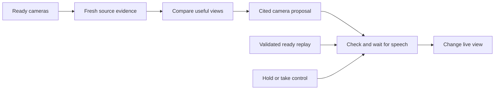

# Automatic hackathon direction

The Forever 22 event now enables automatic camera cuts and ready replay playback.
This replaces the earlier manual-only replay rule at the user's request.

The director compares fresh visual observations from up to five ready cameras.
Each view keeps its own source, epoch and native clock. A model cut must cite
visual evidence from its target camera and explain why that view helps. The
controller checks media health, source identity and original evidence expiry.
A camera cut preserves the selected microphone. Off-air observations cannot
supply graphics that describe the on-air view.

Camera shots last at least eight seconds. When no earlier cut applies, a
25-second rotation fallback provides variety between healthy cameras. This
fallback makes no claim about activity. Accepted model cuts and fallback cuts
have separate trace entries. Active speech delays both kinds of cut. Queued
view changes stop new speech preparation and showcase graphics until resolved.
An already prepared outgoing-camera line can expire or be canceled after a cut.

Automatic replays use the existing validated ready-candidate list. Each
candidate airs once. Replay starts are at least 60 seconds apart. Preparation,
retention, playback tickets, source maps, expiry, transitions and the replay
progress bar retain their existing checks. Hold and Take control block automatic
view changes. Play replay and Return live remain available manually.

Commentary still prioritizes visible changes, readable text and understood
speech. Event-only talk now allows one line per 25 seconds of delivered program
time. When fresh visuals are missing, either voice can ask for a closer demo
view or a slow look around. These are requests, not claims about unseen people
or defects. Recent history limits repetition. The cabbie remains the lead;
the co-commentator keeps the existing shared-queue turn policy.

Fresh scene commentary now admits evidence with at least seven seconds left,
down from ten. The original evidence deadline still applies to model work,
complete speech preparation and delivery. This is an eligibility change, not
a promise of latency. Clear foreground speech still gets a listening turn.

## Checks and production steps

Focused checks and deployment observations are recorded in
[evidence/automatic-direction.json](evidence/automatic-direction.json).
Broad stack checks were skipped under the existing user override.

1. Rejoin two phones after the restart. Keep both pages open.
2. Show a clear demo or readable screen on camera two. Keep camera one quiet.
3. Watch for a cut after the current line. Check a director `propose` trace for
   the target slot, evidence IDs and reason. A `fallback-cut` trace alone does
   not prove content-based selection.
4. Confirm the selected microphone stays audible after a cut.
5. Let one validated replay become ready. Confirm automatic entry, progress,
   return to live, and no repeat of that candidate.
6. Without fresh visuals, listen for a brief camera invitation in either voice.
7. Use Hold broadcast and Take control. Confirm automatic cuts stop.

Cross-network camera publishing still needs a working TURN relay. No TURN
account access has been supplied. Physical five-camera validation remains open.
