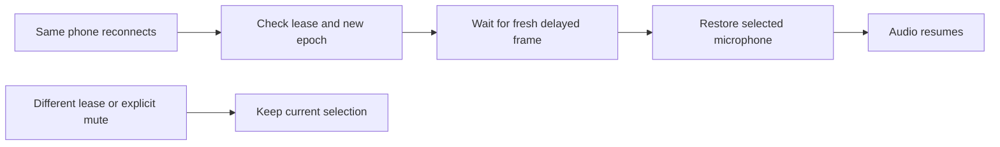

# Microphone recovery after reconnect

The selected microphone previously kept its old source epoch after a reconnect.
An epoch identifies one continuous source timeline. The program correctly
rejected audio from a different epoch, but never updated that selection. The
mute flag could therefore show false while the program stayed silent.

The controller now restores audio from a newer epoch of the same ACTIVE lease.
It checks that the microphone is still selected and unmuted, the source has an
audio track, its latest frame is at most one second old, and its delay buffer
contains a frame from the current epoch. It commits the existing audio command
under the controller and media locks. Lease reads stay outside the media lock.

The repair changes the microphone epoch only through the existing audio command.
It does not change the on-air camera, holding state, replay, or crew mode. It also
works during Take control because it repairs an existing selection. Repeated
polls make no further change. A different lease, old epoch, inactive source,
missing audio track, stale source or old buffered frame prevents recovery.
Old transcript and commentary dependencies remain invalid after recovery.
The server records a `microphone_recovered` event with both epochs.

## Verification

The focused controller suite passed 41 tests. A separate existing commentary
check confirmed that a changed microphone epoch invalidates queued old speech.
An isolated synthetic microphone passed through the real FFmpeg program encoder.
Decoded audio RMS, a measure of signal level, changed from 3463.73 before the
reconnect to 0.05 during the fault and 3464.20 after recovery. The camera stayed
live and unchanged. This proves the repair on encoded synthetic media, not a
physical phone reconnect or public viewer sound.

Run the media check with `PYTHONPATH=app python3 tests/media/microphone_recovery_check.py`
in the application image. It uses temporary files and sends no public broadcast.
See [the evidence record](evidence/microphone-recovery.json).

For the venue check, join one phone with its microphone enabled. Briefly interrupt
its connection, then restore it before the lease expires. Confirm that sound
returns without selecting the microphone again and that the camera view stays
unchanged. Check the `microphone_recovered` log entry. Repeat with an explicit
mute; it must stay muted. A released or expired lease requires a new selection.
