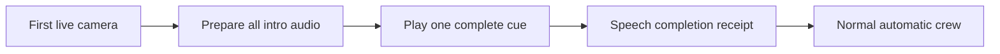

# Complete broadcast introduction

The first live camera starts one complete spoken introduction before normal crew
work. The script comes from event setup. It does not need a model observation or
an attendee transcript. The lead voice reads the event name, venue, organizer,
supporter, demo focus, and commentator roles.

`EventContext.opening_script` contains up to six sentences, each at most 160
characters. Each Gemini speech request keeps the existing eight-second audio
limit and provider timeout. All decoded parts are joined into one bounded PCM
cue before playback. There are no model calls between sentences on air. The
intro uses the existing lead voice and style. Its caption shows the event title.
Ordinary commentary retains its existing short duration limit.

Automatic graphics, cuts, replay playback, and regular commentary wait until the
encoder reports that all intro speech samples were written. Caption completion
does not release this gate. Camera video and source analysis continue during
preparation. The normal narration mix lowers room sound during the opening.

Completion applies to the current application run. Camera reconnects, new joins,
and microphone changes cannot replay a completed intro. Event-only opening audio
does not depend on a particular camera epoch or microphone. It still requires a
live camera. Hold, Take control, setup changes, or loss of live video can interrupt
it. A resumed incomplete intro retries from the beginning after five seconds.
After three attempts, normal crew work resumes and status reports `Unavailable`.
Speech disabled also reports `Unavailable`; it never counts captions as spoken
success. A server restart begins a new run and permits a new introduction.

The intro gate is opt-in through event setup. The Forever 22 template enables it.
An event with no script preserves its prior behavior. Manual controls keep their
authority during the intro.

Validation is recorded in [the evidence](evidence/broadcast-opening.json). The
focused unit checks cover full preparation, no partial-audio fallback, actual
speech receipt gating, retry limits, reconnects, and manual pause. The private
media check uses real Gemini speech with a synthetic camera and the actual
program encoder. It is not a public phone playback test.

Production check after deployment:

1. Join a camera on the fresh server run and open `/watch` with sound enabled.
2. Allow intro preparation, then hear the complete introduction.
3. Confirm that normal commentary and automatic graphics start afterward.
4. Reconnect the camera. Confirm that the intro does not repeat.

Browser sound permission and a real phone listening check remain manual.
